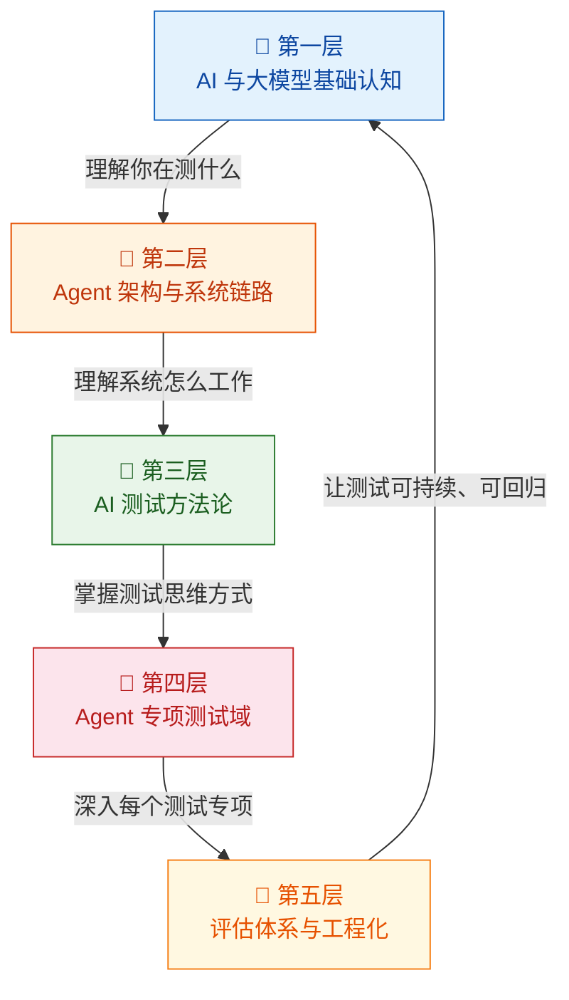
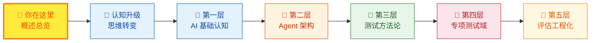

本文档是 **ArkClaw 智能体测试知识库**的入口页。它的作用很明确：帮你从全局视角看清这套知识体系长什么样、分为几层、每层解决什么问题、以及你应该按什么顺序阅读。如果你是一名正在从传统测试转型到 AI/Agent 测试的工程师，这里就是你出发的起点。

Sources: [readme.md](readme.md#L1-L2)

## 为什么需要这套知识框架

你要测的对象，已经不再是一个"输入固定 → 逻辑固定 → 输出可断言"的传统系统。它是一个由 **大模型 + Prompt + Tool 调用 + 记忆 + 规划 + 外部系统 + 安全机制** 组成的复杂系统。同样的输入，输出可能不同；正确性不再是唯一答案；缺陷常常出现在规划、工具调用、上下文理解、记忆污染、权限边界、异常恢复这些你以前从未关注的地方。这意味着你的测试思维需要升级——不是放弃已有能力，而是新增对 Agent 系统行为的理解和对"评估体系"的掌握。

Sources: [readme.md](readme.md#L6-L19)

## 知识框架总览：五层递进结构

本知识库按照**认知递进**的原则，将内容组织为五个层次。每一层都建立在前一层的基础之上，形成从"理解概念"到"动手评估"的完整学习路径。下图展示了这五层的整体架构及其核心关注点：

**阅读提示**：这五层之间存在严格的依赖关系——跳过第一层直接看第四层，你会发现自己缺少判断问题归属的基础知识。建议按顺序推进。

Sources: [readme.md](readme.md#L22-L37)

## 五层架构详解与对应章节

下表将每一层的目标、核心概念、对应的 Wiki 章节以及难度等级一一对应，方便你快速定位感兴趣的内容：

| 层次 | 目标 | 核心概念 | 对应章节 | 难度 |
|:---:|:---|:---|:---|:---:|
| **第一层** | 知道你在测什么——看懂缺陷属于模型、Prompt、工具、知识库还是业务逻辑 | Token、上下文窗口、采样参数、Prompt 边界、Tool Calling、RAG、Memory、幻觉与鲁棒性 | [LLM 核心概念](3-llm-he-xin-gai-nian-token-shang-xia-wen-chuang-kou-cai-yang-can-shu)、[Prompt 工程与边界](4-prompt-gong-cheng-yu-bian-jie-ren-zhi)、[Tool Calling 机制](5-gong-ju-diao-yong-tool-calling-function-calling-ji-zhi)、[RAG 原理](6-rag-jian-suo-zeng-qiang-yu-zhi-shi-ku-wen-da-yuan-li)、[记忆机制](7-ji-yi-ji-zhi-duan-qi-ji-yi-chang-qi-ji-yi-yu-shang-xia-wen-guan-li)、[模型常见缺陷](8-mo-xing-chang-jian-que-xian-huan-jue-bu-zhi-xing-yu-lu-bang-xing-wen-ti) | 🟢 Beginner |
| **第二层** | 理解 Agent 系统的完整链路——从用户请求到最终响应的每一步 | Agent Loop、Planner/Executor、会话管理、Skills/插件、日志与 Trace | [Agent Loop 核心工作流](9-agent-loop-he-xin-gong-zuo-liu-cong-yong-hu-qing-qiu-dao-zui-zhong-xiang-ying)、[产品架构与模块拆解](10-arkclaw-openclaw-chan-pin-jia-gou-yu-mo-kuai-chai-jie)、[会话管理与调度](11-hui-hua-guan-li-ren-wu-gui-hua-yu-diao-du-ji-zhi)、[Skills/插件体系](12-skills-cha-jian-ti-xi-yu-wai-bu-xi-tong-jie-ru)、[日志与可观测性](13-ri-zhi-trace-yu-zhi-xing-gui-ji-ke-guan-ce-xing) | 🟡 Intermediate |
| **第三层** | 建立和传统测试不同的测试思维——从"断言"走向"评估" | 能力测试、结果测试、过程测试、稳定性测试、安全性测试 | [能力测试](14-neng-li-ce-shi-yan-zheng-agent-hui-bu-hui-zuo)、[结果测试](15-jie-guo-ce-shi-yan-zheng-agent-zuo-de-dui-bu-dui)、[过程测试](16-guo-cheng-ce-shi-yan-zheng-agent-zhong-jian-bu-zou-de-he-li-xing)、[稳定性测试](17-wen-ding-xing-ce-shi-duo-ci-zhi-xing-de-ke-kao-xing-yu-zhi-xing)、[安全性测试](18-an-quan-xing-ce-shi-yue-quan-zhu-ru-yu-shu-ju-xie-lu-fang-hu) | 🟠 Advanced |
| **第四层** | 针对每个 Agent 模块建立专项测试体系——这是实战核心 | 对话理解、任务规划、Tool Calling、Memory、RAG、文件/浏览器、错误恢复、性能与成本 | [对话理解测试](19-dui-hua-li-jie-ce-shi-yi-tu-shi-bie-duo-lun-shang-xia-wen-yu-qi-yi-chu-li)、[任务规划测试](20-ren-wu-gui-hua-ce-shi-chai-jie-pai-xu-hui-tui-yu-dong-tai-diao-zheng)、[Tool Calling 测试](21-tool-calling-ce-shi-can-shu-ti-qu-duo-gong-ju-bian-pai-yu-yi-chang-chu-li)、[Memory 测试](22-memory-ce-shi-ji-yi-bao-cun-guo-qi-shi-xiao-yu-kua-hui-hua-ge-chi)、[RAG 测试](23-rag-ce-shi-jian-suo-zhao-hui-yin-yong-zhen-shi-xing-yu-wen-dang-chong-tu)、[文件与浏览器测试](24-wen-jian-chu-li-yu-liu-lan-qi-zi-dong-hua-ce-shi)、[错误恢复测试](25-cuo-wu-chu-li-yu-hui-fu-ce-shi-shi-bai-shi-bie-zi-dong-zhong-shi-yu-ti-dai-fang-an)、[性能与成本测试](26-xing-neng-yu-cheng-ben-ce-shi-yan-chi-token-xiao-hao-yu-bing-fa-ping-gu) | 🔴 Advanced |
| **第五层** | 让测试从"人工体验"升级为"可回归、可量化"的工程体系 | Golden Set、Rubric 评分、LLM-as-a-Judge、自动化评测、回归看板 | [评估体系搭建](27-ping-gu-ti-xi-da-jian-golden-set-rubric-ping-fen-yu-llm-as-a-judge)、[自动化评测工程](28-zi-dong-hua-ping-ce-gong-cheng-jiao-ben-shu-ju-ji-yu-hui-gui-kan-ban) | 🔴 Advanced |

Sources: [readme.md](readme.md#L22-L276), [wiki.json](.zread/wiki/drafts/wiki.json#L1-L253)

## 传统测试 vs AI/Agent 测试：核心差异速览

在进入详细学习之前，你需要先理解一个根本性的转变。下表提炼了两种测试范式的核心差异——这正是 [认知升级：从传统测试到 AI/Agent 测试的思维转变](2-ren-zhi-sheng-ji-cong-chuan-tong-ce-shi-dao-ai-agent-ce-shi-de-si-wei-zhuan-bian) 这篇文档要深入展开的主题，此处仅做概要对比：

| 维度 | 传统软件测试 | AI / Agent 测试 |
|:---|:---|:---|
| **输入输出关系** | 输入固定 → 输出确定 | 输入相同 → 输出可能不完全相同 |
| **正确性判定** | 精确断言（Pass / Fail） | 需要判断"是否足够好、是否稳定、是否安全" |
| **缺陷类型** | 功能缺陷、逻辑错误、UI 异常 | 幻觉、规划失败、工具调用错误、记忆污染、权限越界 |
| **测试方法** | 等价类、边界值、回归测试 | 能力测试、过程测试、稳定性测试、评估体系 |
| **核心能力要求** | 用例设计、自动化脚本 | Prompt 理解、数据集设计、评估指标、Trace 分析 |

Sources: [readme.md](readme.md#L6-L19)

## 你需要新增的核心能力

你已有的测试能力——功能测试设计、用例拆解、Bug 归因、自动化测试思维、接口验证——**不会失效**。你需要在此基础上，重点补齐以下五项能力：

| 能力 | 为什么需要 | 产出物示例 |
|:---|:---|:---|
| **Prompt / LLM 理解能力** | 不是为了写 Prompt，而是为了在发现缺陷时能定位问题属于模型、Prompt、工具还是业务逻辑 | AI 测试基础概念笔记 |
| **数据集设计能力** | 你需要自建测试问法集、风险问法集、对抗样本集、多轮会话集、工具调用样本集 | Golden Set、对抗测试集 |
| **评估指标设计能力** | 任务成功率、工具调用正确率、幻觉率、引用正确率、重试恢复率、Token 成本等都需要量化 | 评分标准文档 |
| **日志 / Trace 分析能力** | Agent 测试不看执行轨迹，基本测不深——你需要能看到规划步骤、工具调用明细和失败路径 | 缺陷归因报告 |
| **Python 自动化升级** | 从"接口/UI 自动化"升级为：调用模型跑 Case → 自动比对结果 → 自动评分 → 自动产出报告 | 自动评测脚本 |

Sources: [readme.md](readme.md#L336-L371)

## 推荐阅读路径

根据知识库的组织结构，我们建议按以下路径逐步阅读。**快速入门**两篇帮你完成认知切换，**深度解析**按五层递进帮你系统构建能力：

**第一步：完成认知切换**（快速入门）

1. ✅ [概述：AI 智能体测试知识框架总览](1-gai-shu-ai-zhi-neng-ti-ce-shi-zhi-shi-kuang-jia-zong-lan) — 当前页面，全局地图
2. ➡️ [认知升级：从传统测试到 AI/Agent 测试的思维转变](2-ren-zhi-sheng-ji-cong-chuan-tong-ce-shi-dao-ai-agent-ce-shi-de-si-wei-zhuan-bian) — 理解"测的东西变了"

**第二步：补 AI 基础**（第一层）

3. [LLM 核心概念：Token、上下文窗口、采样参数](3-llm-he-xin-gai-nian-token-shang-xia-wen-chuang-kou-cai-yang-can-shu)
4. [Prompt 工程与边界认知](4-prompt-gong-cheng-yu-bian-jie-ren-zhi)
5. [工具调用（Tool Calling / Function Calling）机制](5-gong-ju-diao-yong-tool-calling-function-calling-ji-zhi)
6. [RAG 检索增强与知识库问答原理](6-rag-jian-suo-zeng-qiang-yu-zhi-shi-ku-wen-da-yuan-li)
7. [记忆机制：短期记忆、长期记忆与上下文管理](7-ji-yi-ji-zhi-duan-qi-ji-yi-chang-qi-ji-yi-yu-shang-xia-wen-guan-li)
8. [模型常见缺陷：幻觉、不一致性与鲁棒性问题](8-mo-xing-chang-jian-que-xian-huan-jue-bu-zhi-xing-yu-lu-bang-xing-wen-ti)

**第三步：理解 Agent 系统**（第二层）

9. [Agent Loop 核心工作流：从用户请求到最终响应](9-agent-loop-he-xin-gong-zuo-liu-cong-yong-hu-qing-qiu-dao-zui-zhong-xiang-ying)
10. [ArkClaw / OpenClaw 产品架构与模块拆解](10-arkclaw-openclaw-chan-pin-jia-gou-yu-mo-kuai-chai-jie)
11. [会话管理、任务规划与调度机制](11-hui-hua-guan-li-ren-wu-gui-hua-yu-diao-du-ji-zhi)
12. [Skills / 插件体系与外部系统接入](12-skills-cha-jian-ti-xi-yu-wai-bu-xi-tong-jie-ru)
13. [日志、Trace 与执行轨迹可观测性](13-ri-zhi-trace-yu-zhi-xing-gui-ji-ke-guan-ce-xing)

**第四步：学测试方法**（第三层）

14. [能力测试：验证 Agent "会不会做"](14-neng-li-ce-shi-yan-zheng-agent-hui-bu-hui-zuo)
15. [结果测试：验证 Agent "做得对不对"](15-jie-guo-ce-shi-yan-zheng-agent-zuo-de-dui-bu-dui)
16. [过程测试：验证 Agent 中间步骤的合理性](16-guo-cheng-ce-shi-yan-zheng-agent-zhong-jian-bu-zou-de-he-li-xing)
17. [稳定性测试：多次执行的可靠性与一致性](17-wen-ding-xing-ce-shi-duo-ci-zhi-xing-de-ke-kao-xing-yu-zhi-xing)
18. [安全性测试：越权、注入与数据泄露防护](18-an-quan-xing-ce-shi-yue-quan-zhu-ru-yu-shu-ju-xie-lu-fang-hu)

**第五步：深入专项测试**（第四层）

19. [对话理解测试：意图识别、多轮上下文与歧义处理](19-dui-hua-li-jie-ce-shi-yi-tu-shi-bie-duo-lun-shang-xia-wen-yu-qi-yi-chu-li)
20. [任务规划测试：拆解、排序、回退与动态调整](20-ren-wu-gui-hua-ce-shi-chai-jie-pai-xu-hui-tui-yu-dong-tai-diao-zheng)
21. [Tool Calling 测试：参数提取、多工具编排与异常处理](21-tool-calling-ce-shi-can-shu-ti-qu-duo-gong-ju-bian-pai-yu-yi-chang-chu-li)
22. [Memory 测试：记忆保存、过期失效与跨会话隔离](22-memory-ce-shi-ji-yi-bao-cun-guo-qi-shi-xiao-yu-kua-hui-hua-ge-chi)
23. [RAG 测试：检索召回、引用真实性与文档冲突](23-rag-ce-shi-jian-suo-zhao-hui-yin-yong-zhen-shi-xing-yu-wen-dang-chong-tu)
24. [文件处理与浏览器自动化测试](24-wen-jian-chu-li-yu-liu-lan-qi-zi-dong-hua-ce-shi)
25. [错误处理与恢复测试：失败识别、自动重试与替代方案](25-cuo-wu-chu-li-yu-hui-fu-ce-shi-shi-bai-shi-bie-zi-dong-zhong-shi-yu-ti-dai-fang-an)
26. [性能与成本测试：延迟、Token 消耗与并发评估](26-xing-neng-yu-cheng-ben-ce-shi-yan-chi-token-xiao-hao-yu-bing-fa-ping-gu)

**第六步：搭评估体系**（第五层）

27. [评估体系搭建：Golden Set、Rubric 评分与 LLM-as-a-Judge](27-ping-gu-ti-xi-da-jian-golden-set-rubric-ping-fen-yu-llm-as-a-judge)
28. [自动化评测工程：脚本、数据集与回归看板](28-zi-dong-hua-ping-ce-gong-cheng-jiao-ben-shu-ju-ji-yu-hui-gui-kan-ban)

**补充：学习规划与能力建设**

29. [三个月学习路线图：基础→设计→评估](29-san-ge-yue-xue-xi-lu-xian-tu-ji-chu-she-ji-ping-gu)
30. [测试工程师能力差距分析与优先级排序](30-ce-shi-gong-cheng-shi-neng-li-chai-ju-fen-xi-yu-you-xian-ji-pai-xu)
31. [ArkClaw 测试知识树与内部汇报框架](31-arkclaw-ce-shi-zhi-shi-shu-yu-nei-bu-hui-bao-kuang-jia)

Sources: [readme.md](readme.md#L278-L491), [wiki.json](.zread/wiki/drafts/wiki.json#L1-L253)

## 优先级建议：不要平均用力

如果你的时间有限，建议按照以下优先级聚焦学习。ArkClaw / OpenClaw 这类产品的核心价值在于"会做事"——能调用工具、自主规划、执行多步骤任务——因此工具调用、任务规划、异常恢复和安全测试应成为你的第一优先级。

| 优先级 | 主题 | 原因 |
|:---:|:---|:---|
| 🔴 **第一优先级** | Agent 架构、Tool Calling 测试、任务规划测试、异常恢复测试、安全测试 | 这是 Agent 产品的核心价值所在，也是缺陷高发区 |
| 🟡 **第二优先级** | Memory 测试、RAG 测试、文件/浏览器测试、可观测性与日志分析 | 深入专项测试的支撑能力，影响测试深度 |
| 🟢 **第三优先级** | 自动评估、成本评估、A/B 测试体系 | 让测试从"人工"升级为"工程化"的关键能力 |

Sources: [readme.md](readme.md#L473-L491)

## 下一步

现在你已经看清了整个知识框架的全貌。建议你直接进入下一篇：[认知升级：从传统测试到 AI/Agent 测试的思维转变](2-ren-zhi-sheng-ji-cong-chuan-tong-ce-shi-dao-ai-agent-ce-shi-de-si-wei-zhuan-bian)，它将帮你完成从"功能测试思维"到"评估思维"的关键认知切换。