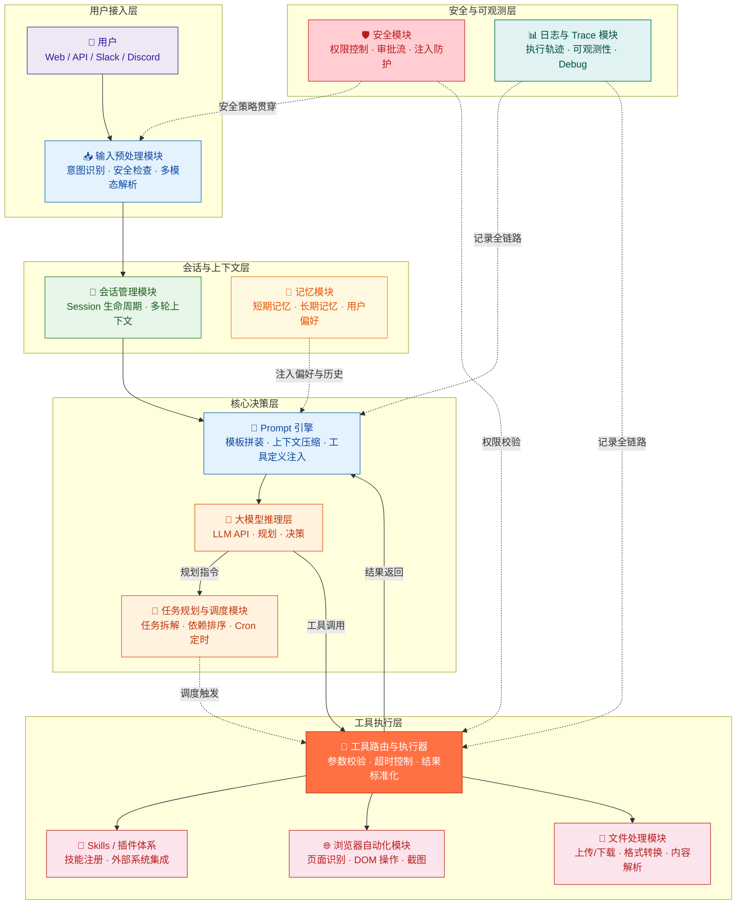
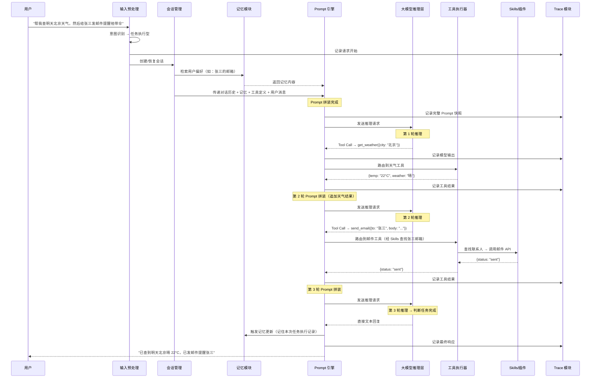
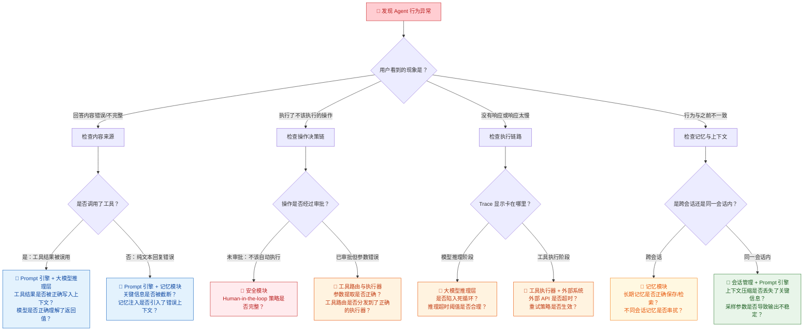

你正在阅读知识库**第二层：Agent 架构与系统链路**的第二篇文章。在上一篇 [Agent Loop 核心工作流](9-agent-loop-he-xin-gong-zuo-liu-cong-yong-hu-qing-qiu-dao-zui-zhong-xiang-ying) 中，你已经理解了 Agent 系统从用户请求到最终响应的抽象六阶段模型。本文的任务是将这个抽象模型**映射到一个具体的产品架构上**——ArkClaw / OpenClaw。读完本文，你将能画出 ArkClaw 的模块全景图，说出每个模块的职责边界，并理解一个用户请求在产品内部是如何被各个模块接力处理的。更重要的是，你将建立**"缺陷属于哪个模块"**的定位能力，这是后续所有专项测试设计的起点。

Sources: [readme.md](readme.md#L43-L63), [readme.md](readme.md#L386-L393)

## 产品定位：从"聊天机器人"到"任务执行系统"

理解产品架构的第一步是理解产品定位。ArkClaw / OpenClaw 的核心定位不是"一个能聊天的 AI"，而是一个**能够自主规划、调用工具、操作浏览器、读写文件、对接外部系统并最终完成复杂任务的 Agent 平台**。这两者的区别极为关键——聊天机器人测的是"回答质量"，Agent 平台测的是"任务完成能力"。公开资料显示，OpenClaw 本身就是围绕 browser、canvas、nodes、cron、sessions、Discord/Slack actions、skills 等能力来设计的，这意味着你的测试绝不能只停留在聊天窗口，而是要覆盖**任务执行的完整生命周期**。BytePlus 对 ArkClaw 的公开介绍中也强调了端到端安全框架，说明安全机制是贯穿整个架构的基础设施，而非可选附件。

Sources: [readme.md](readme.md#L43-L50), [readme.md](readme.md#L253-L262)

## 架构全景图：从 Agent Loop 到产品模块的映射

下面这张架构图是本文的核心参考。它将 [Agent Loop 核心工作流](9-agent-loop-he-xin-gong-zuo-liu-cong-yong-hu-qing-qiu-dao-zui-zhong-xiang-ying) 中抽象的六个阶段，映射到 ArkClaw / OpenClaw 的具体产品模块上。**每个彩色区块代表一个可独立测试、可独立定位问题的产品模块**：

这张图揭示了一个核心事实：**ArkClaw 不是"一个大模型 API 外面包了一层壳"，而是一个由多个独立模块协同工作的工程系统。** 每个模块有明确的输入输出边界、独立的失败模式、独立的测试重点。理解这些模块的边界，是你在发现缺陷时快速定位"问题出在哪里"的基础。

Sources: [readme.md](readme.md#L43-L50), [readme.md](readme.md#L386-L393)

## Agent Loop 六阶段与产品模块的对应关系

将架构全景图与 [Agent Loop 核心工作流](9-agent-loop-he-xin-gong-zuo-liu-cong-yong-hu-qing-qiu-dao-zui-zhong-xiang-ying) 中的六阶段模型对齐，可以建立如下映射关系。这张表是你做缺陷归因时的核心参考——发现问题时，先判断对应哪个 Agent Loop 阶段，再定位到具体的产品模块：

| Agent Loop 阶段 | 对应产品模块 | 模块核心职责 | 典型缺陷归属 |
|:---|:---|:---|:---|
| **阶段一：输入预处理** | 输入预处理模块 · 安全模块（输入层） | 意图识别、多模态解析、安全检查 | 意图误判 → 不触发工具链；安全遗漏 → 注入攻击通过 |
| **阶段二：Prompt 拼装** | Prompt 引擎 · 会话管理 · 记忆模块 | 上下文收集、记忆注入、工具定义注入、上下文压缩 | 关键信息被截断 → 任务偏离；记忆冲突 → 行为不一致 |
| **阶段三：模型推理** | 大模型推理层 · 任务规划与调度模块 | 规划决策、工具选择、判断是否继续循环 | 规划失败 → 遗漏步骤；过度规划 → 资源浪费；死循环 → 永不终止 |
| **阶段四：工具执行** | 工具路由与执行器 · Skills/插件 · 浏览器 · 文件处理 | 参数校验、工具分发、执行调用、结果标准化 | 参数错误 → 操作失误；超时 → 任务卡住；部分成功 → 遗漏执行 |
| **阶段五：结果观察** | Prompt 引擎（结果写入上下文） · 记忆模块（更新触发） | 结果解析、上下文追加、记忆更新、循环终止判断 | 错误结果被接受 → 级联错误；记忆未更新 → 重复查询 |
| **阶段六：响应生成** | 输入预处理模块（输出侧） · 安全模块（输出层） | 格式化输出、安全过滤、流式推送 | 幻觉式总结 → 虚假信息；隐瞒失败 → 用户误判 |

Sources: [readme.md](readme.md#L44-L63), [readme.md](readme.md#L140-L158)

## 核心模块逐一拆解

### 会话管理模块（Session Management）

会话管理是 Agent 系统的**状态载体**——它决定了"当前对话进行到哪里、之前说了什么、接下来可以做什么"。在 ArkClaw / OpenClaw 中，Session 不仅承载对话历史，还关联了当前用户的身份、权限、记忆偏好和活跃的工具上下文。公开资料显示，OpenClaw 的 sessions 能力是其核心架构组件之一，支持多渠道接入（Web、API、Slack、Discord 等），这意味着同一个用户在不同渠道的会话可能需要共享状态，也可能需要严格隔离——这直接决定了你的测试是否需要覆盖**跨渠道会话一致性**和**会话隔离性**两个维度。从测试视角看，会话管理的核心关注点是：会话创建与销毁的生命周期是否完整、多轮上下文是否正确累积、会话超时后恢复是否丢失关键状态、并发会话是否互不干扰。

Sources: [readme.md](readme.md#L43-L50), [readme.md](readme.md#L386-L388)

### 记忆模块（Memory）

记忆模块在 [记忆机制：短期记忆、长期记忆与上下文管理](7-ji-yi-ji-zhi-duan-qi-ji-yi-chang-qi-ji-yi-yu-shang-xia-wen-guan-li) 中已有基础概念介绍。在产品架构层面，它需要被理解为**一个独立的存储与检索服务**，而非简单的对话历史追加。短期记忆负责维持当前会话内的上下文连贯性（"我刚才说了什么"）；长期记忆负责跨会话的用户偏好、历史任务记录和知识积累（"这个用户喜欢什么格式的报告"）。当 Prompt 引擎拼装请求时，会从记忆模块检索相关内容注入上下文；当工具执行产生新信息时，会触发记忆更新。**记忆模块的测试难点在于**：它不是一个"有/没有"的二元判断，而是一个"该记的记住了吗、不该记的忘了吗、旧记忆是否污染了新推理"的连续谱——这正是 [Memory 测试](22-memory-ce-shi-ji-yi-bao-cun-guo-qi-shi-xiao-yu-kua-hui-hua-ge-chi) 的核心议题。

Sources: [readme.md](readme.md#L43-L50), [readme.md](readme.md#L386-L393)

### Prompt 引擎

Prompt 引擎是 Agent Loop 中**工程复杂度最高的模块**。它的职责是将来自多个来源的信息——System Prompt、历史对话、工具定义、记忆注入、RAG 检索结果、当前用户消息——整合为一个完整的、符合模型 API 格式要求的请求体。正如 [Agent Loop 核心工作流](9-agent-loop-he-xin-gong-zuo-liu-cong-yong-hu-qing-qiu-dao-zui-zhong-xiang-ying) 中所分析的，Prompt 拼装的核心挑战在于**上下文窗口的容量硬约束**——所有组成部分共享一个 Token 上限，当信息总量超过窗口时，引擎必须做出取舍：优先保留什么、压缩什么、截断什么。这个取舍策略直接决定了模型推理的质量。测试工程师需要关注的是：当上下文接近窗口上限时，系统是否按照预期的优先级策略进行压缩；被截断的信息是否导致了关键任务约束的丢失；不同模块注入的内容之间是否存在逻辑冲突。

Sources: [readme.md](readme.md#L27-L37), [readme.md](readme.md#L43-L50)

### 大模型推理层

大模型推理层是 Agent 的"大脑"，但它并不是一个黑箱——在产品架构中，它是一个**可配置的推理服务**。你可以把它理解为：模型选择（用哪个模型）、参数配置（Temperature、Top_P 等采样参数，在 [LLM 核心概念](3-llm-he-xin-gai-nian-token-shang-xia-wen-chuang-kou-cai-yang-can-shu) 中已详细介绍）、以及推理策略（是否支持多轮推理、是否启用思维链、如何处理长推理）的组合。在 ArkClaw / OpenClaw 的场景中，推理层可能同时对接多个模型——简单问答用轻量模型，复杂任务规划用重量模型——这种**多模型路由策略**本身就是一个需要测试的决策点。测试工程师不需要深入模型训练细节，但需要理解：采样参数如何影响输出的确定性和多样性、模型选择策略如何影响任务完成质量、以及推理超时或异常时系统的降级策略。

Sources: [readme.md](readme.md#L27-L37), [readme.md](readme.md#L44-L50)

### 任务规划与调度模块

当用户的请求涉及多个步骤时，模型推理层输出的"规划指令"会被传递给任务规划与调度模块。这个模块负责将抽象的任务意图**拆解为可执行的步骤序列**、判断步骤间的依赖关系和执行顺序、以及在执行过程中根据中间结果**动态调整计划**。OpenClaw 的 nodes 和 cron 能力表明，这个模块还支持**任务图的定义**（将复杂任务拆为可编排的节点流程）和**定时调度**（按时间规则自动触发任务）。测试关注点包括：规划是否完整（有没有遗漏关键步骤）、步骤顺序是否合理（有没有本末倒置）、失败后是否能回退和重试、定时任务是否准时触发且不重复执行。这个模块的详细机制将在 [会话管理、任务规划与调度机制](11-hui-hua-guan-li-ren-wu-gui-hua-yu-diao-du-ji-zhi) 中深入展开。

Sources: [readme.md](readme.md#L43-L50), [readme.md](readme.md#L386-L393)

### 工具路由与执行器

工具路由与执行器是连接"决策"和"行动"的桥梁。当模型推理层输出工具调用指令后，执行器负责**路由分发**（根据工具名找到对应的执行逻辑）、**参数校验**（检查必填参数是否齐全、类型是否正确、值是否合法）、**实际调用**（调用外部 API、执行数据库操作、操作浏览器等）、以及**结果标准化**（将不同工具的返回格式统一为模型可理解的文本结构）。这个模块是 [Tool Calling 测试](21-tool-calling-ce-shi-can-shu-ti-qu-duo-gong-ju-bian-pai-yu-yi-chang-chu-li) 的主要测试对象——你需要验证工具选择是否正确、参数提取是否准确、多工具编排是否合理、工具失败时的异常处理是否到位。

Sources: [readme.md](readme.md#L140-L158), [readme.md](readme.md#L216-L224)

### Skills / 插件体系

Skills 是 ArkClaw / OpenClaw 对"可扩展能力"的封装方式。如果说工具（Tools）是原子级的操作（发一封邮件、查一次天气），那么 Skills 更接近**一组相关工具和业务逻辑的组合**——例如"客户管理技能"可能包含查客户信息、发客户邮件、更新客户记录等多个工具，再加上判断何时使用哪个工具的业务规则。OpenClaw 的 skills 机制支持外部开发者注册新技能，这意味着 ArkClaw 的能力边界是**动态扩展的**——每当新技能上线，都意味着新的测试范围。这个模块还涉及**外部系统接入**（Discord actions、Slack actions 等），需要验证第三方系统集成的正确性和安全性。详细机制将在 [Skills / 插件体系与外部系统接入](12-skills-cha-jian-ti-xi-yu-wai-bu-xi-tong-jie-ru) 中深入展开。

Sources: [readme.md](readme.md#L43-L50), [readme.md](readme.md#L253-L262)

### 浏览器自动化模块

浏览器自动化是 ArkClaw / OpenClaw 区别于纯对话型 AI 的**核心差异化能力**之一。公开资料显示，browser 能力是 OpenClaw 的基础架构组件，而行业测评也把浏览器自动化作为独立的测试任务。这个模块允许 Agent 像人类用户一样操作网页——识别页面元素、点击按钮、填写表单、提取信息、截图保存。从架构上看，它本质上是一个**由大模型驱动的智能 RPA 引擎**：模型决定"点哪里、填什么"，浏览器模块负责"真正去点和填"。测试关注点极具特殊性：页面识别是否正确（有没有点错元素）、是否能处理动态加载和弹窗、DOM 变化后是否仍能定位元素、以及最关键的——**是否会误操作真实业务系统**（测试环境中操作的页面是否会影响到生产数据）。这部分内容将在 [文件处理与浏览器自动化测试](24-wen-jian-chu-li-yu-liu-lan-qi-zi-dong-hua-ce-shi) 中专项展开。

Sources: [readme.md](readme.md#L43-L50), [readme.md](readme.md#L253-L262)

### 文件处理模块

文件处理模块负责 Agent 与文件系统的所有交互——上传、下载、读取、写入、格式转换、内容解析（包括图片、PDF、表格等）。在 ArkClaw / OpenClaw 的任务执行场景中，文件操作极为常见：用户要求"帮我把这个 PDF 总结成要点"、"把这份 Excel 里的异常数据筛选出来"、"把这张图里的表格整理成新文件"。这个模块的架构挑战在于**文件格式的多样性**和**内容解析的准确性**——不同格式的文件需要不同的解析器，解析结果的质量直接影响后续推理。测试需要覆盖：格式兼容性（支持的文件类型是否完整）、内容准确性（解析结果是否忠实于原文）、大文件处理（超限文件是否有合理降级）、编码异常（乱码文件是否能优雅处理）、以及文件权限与隔离（不同用户/会话之间的文件是否互不可见）。

Sources: [readme.md](readme.md#L43-L50), [readme.md](readme.md#L253-L262)

### 安全模块

安全模块不是架构中一个独立的"节点"，而是一条**贯穿全链路的安全策略执行线**。它在输入预处理阶段检查恶意请求、在工具执行阶段校验操作权限、在响应生成阶段过滤敏感信息。BytePlus 对 ArkClaw 的公开介绍中强调了端到端安全框架，行业公开测评也把"安全防护"列为核心任务，说明安全是产品的基础设施级能力。安全模块的核心子能力包括：**权限控制**（不同角色能调用哪些工具、能访问哪些数据）、**审批流**（高风险操作需要人类确认，即 [Agent Loop 核心工作流](9-agent-loop-he-xin-gong-zuo-liu-cong-yong-hu-qing-qiu-dao-zui-zhong-xiang-ying) 中提到的 Human-in-the-loop 机制）、**注入防护**（检测和拦截 Prompt 注入、Tool 注入等攻击手段）、以及**数据泄露防护**（确保响应中不包含未授权的敏感信息）。安全测试将在 [安全性测试：越权、注入与数据泄露防护](18-an-quan-xing-ce-shi-yue-quan-zhu-ru-yu-shu-ju-xie-lu-fang-hu) 中专项展开。

Sources: [readme.md](readme.md#L253-L262), [readme.md](readme.md#L386-L393)

### 日志与 Trace 模块

日志与 Trace 模块是测试工程师最依赖的**可观测性基础设施**。Agent 测试如果不看 Trace，基本测不深——你需要能看到每一次循环中的完整信息：发送给模型的 Prompt 长什么样、模型返回了什么、工具调用了哪个接口、传了什么参数、返回了什么结果、最终为什么决定继续循环还是终止。Trace 模块的架构设计决定了你能"看到多深"——理想情况下，每一条 Trace 应该能通过会话 ID 关联到完整的执行轨迹，支持从用户请求到最终响应的全链路回溯。这个模块的详细内容将在 [日志、Trace 与执行轨迹可观测性](13-ri-zhi-trace-yu-zhi-xing-gui-ji-ke-guan-ce-xing) 中深入展开。

Sources: [readme.md](readme.md#L253-L262), [readme.md](readme.md#L386-L393)

## 模块间协作：一次完整请求的旅程

理解了每个模块的职责后，接下来看一个完整的用户请求是如何在这些模块之间流转的。以下流程图展示了一个典型的多步骤任务（"查天气 + 发邮件"）在产品内部的模块协作过程：

这个时序图的关键启示是：**一个看似简单的用户请求，在产品内部可能触发数十次模块间的交互。** 每一次交互都是一个潜在的故障点——记忆检索返回了错误偏好、Prompt 拼装截断了关键信息、工具路由选择了错误的执行器、Trace 记录遗漏了关键步骤——任何一个环节的异常，都可能导致最终用户看到的结果不正确。理解这条链路，是你在发现缺陷时进行**三层归因**（哪个阶段 → 哪个模块 → 什么原因）的基础。

Sources: [readme.md](readme.md#L44-L63), [readme.md](readme.md#L140-L158)

## 部署形态差异：云端 vs 本地

ArkClaw / OpenClaw 可能存在不同的部署形态，而部署形态的差异会直接影响测试策略。下表总结了两种典型部署形态在架构层面的关键差异：

| 维度 | 云端部署 | 本地/私有化部署 |
|:---|:---|:---|
| **模型访问** | 通过 API 调用云端模型，延迟受网络影响 | 可能部署本地模型或直连内网模型服务，延迟更低但模型能力可能受限 |
| **工具访问范围** | 可以访问公网服务（天气 API、邮件服务等） | 可能受防火墙限制，部分外部工具不可用 |
| **数据安全边界** | 数据需要经过云端传输，需关注传输安全和数据驻留 | 数据不出内网，安全边界更可控，但需要验证本地存储安全 |
| **浏览器自动化** | 通常运行在云端沙箱环境中，隔离性更好 | 可能操作本地浏览器，风险更高（可能影响本地文件和系统） |
| **文件处理** | 文件上传到云端存储，需关注存储隔离和清理 | 文件存储在本地，需关注路径安全和权限隔离 |
| **测试环境搭建** | 可通过 API 直接访问，环境搭建简单 | 需要本地部署完整环境，测试环境管理成本更高 |
| **性能基线** | 需要考虑网络波动对延迟的影响 | 延迟更稳定，但受本地硬件资源限制 |

**测试策略提示**：如果你的产品同时支持两种部署形态，**不要假设两种形态的行为完全一致**——模型版本可能不同、工具可用范围可能不同、安全策略的执行粒度可能不同。建议为每种部署形态维护独立的基线数据集和通过标准。

Sources: [readme.md](readme.md#L386-L393), [readme.md](readme.md#L253-L262)

## 模块-风险-测试点映射表

将前文所有模块的分析整合为一张可操作的映射表，这是你后续建立 [测试用例库](14-neng-li-ce-shi-yan-zheng-agent-hui-bu-hui-zuo) 时最核心的参考框架：

| 产品模块 | 主要风险 | 关键测试点 | 对应专项测试章节 |
|:---|:---|:---|:---|
| **会话管理** | 上下文丢失、会话串扰、超时恢复失败 | 多轮上下文一致性、并发会话隔离、会话超时后恢复、跨渠道状态同步 | [对话理解测试](19-dui-hua-li-jie-ce-shi-yi-tu-shi-bie-duo-lun-shang-xia-wen-yu-qi-yi-chu-li) |
| **记忆模块** | 记忆丢失、记忆污染、过期信息未失效 | 用户偏好保存、多轮设定覆盖、过期信息失效、长对话信息漂移、跨会话隔离 | [Memory 测试](22-memory-ce-shi-ji-yi-bao-cun-guo-qi-shi-xiao-yu-kua-hui-hua-ge-chi) |
| **Prompt 引擎** | 关键信息截断、注入冲突、压缩策略缺陷 | 长上下文压力测试、多模块注入冲突、压缩后信息完整性、工具定义覆盖性 | [过程测试](16-guo-cheng-ce-shi-yan-zheng-agent-zhong-jian-bu-zou-de-he-li-xing) |
| **大模型推理层** | 规划失败、过度规划、死循环、模型幻觉 | 多步骤任务规划完整性、简单任务效率、循环终止条件、采样参数影响 | [任务规划测试](20-ren-wu-gui-hua-ce-shi-chai-jie-pai-xu-hui-tui-yu-dong-tai-diao-zheng) |
| **任务规划与调度** | 规划不完整、步骤顺序错误、定时任务不准时 | 任务拆解完整性、依赖排序、失败回退、Cron 触发准确性 | [任务规划测试](20-ren-wu-gui-hua-ce-shi-chai-jie-pai-xu-hui-tui-yu-dong-tai-diao-zheng) |
| **工具路由与执行器** | 参数错误、工具选择错误、超时、部分成功 | 正常/异常参数、边界值、模糊参数、工具超时、空结果、部分成功 | [Tool Calling 测试](21-tool-calling-ce-shi-can-shu-ti-qu-duo-gong-ju-bian-pai-yu-yi-chang-chu-li) |
| **Skills / 插件** | 第三方集成异常、新技能引入回归 | 技能注册/注销、外部系统调用、技能间冲突、版本兼容性 | [Skills / 插件体系](12-skills-cha-jian-ti-xi-yu-wai-bu-xi-tong-jie-ru) |
| **浏览器自动化** | 页面识别错误、DOM 变化失效、误操作真实系统 | 元素定位准确性、动态页面处理、弹窗/验证码、操作隔离性 | [文件处理与浏览器自动化测试](24-wen-jian-chu-li-yu-liu-lan-qi-zi-dong-hua-ce-shi) |
| **文件处理** | 格式不兼容、解析错误、编码异常、权限泄漏 | 格式兼容性、内容解析准确性、大文件处理、文件隔离 | [文件处理与浏览器自动化测试](24-wen-jian-chu-li-yu-liu-lan-qi-zi-dong-hua-ce-shi) |
| **安全模块** | 越权操作、注入攻击、数据泄露、审批缺失 | Prompt 注入、越权调用、敏感信息过滤、审批流触发 | [安全性测试](18-an-quan-xing-ce-shi-yue-quan-zhu-ru-yu-shu-ju-xie-lu-fang-hu) |
| **日志与 Trace** | 信息缺失、关联断裂、无法复现 | Trace 完整性、会话 ID 关联、Prompt/工具/结果全覆盖 | [日志、Trace 与可观测性](13-ri-zhi-trace-yu-zhi-xing-gui-ji-ke-guan-ce-xing) |

Sources: [readme.md](readme.md#L43-L63), [readme.md](readme.md#L386-L393)

## 测试工程师的模块定位速查法

当你面对一个具体的 Agent 行为异常时，可以借助以下决策树快速定位问题所属的产品模块。这棵树的核心逻辑是：**先看用户可见的现象，再看 Trace 日志中的内部细节，逐层缩小定位范围。**

**使用方法**：当你在测试中发现一个异常行为时，先沿着这棵树的顶层分支确定用户可见的现象类型，然后查看 Trace 日志验证你的假设，最终定位到具体的产品模块。记住，一个表面上的"模型回答错误"，根因可能不在模型本身——可能是 Prompt 引擎截断了关键信息，可能是记忆模块注入了过期偏好，也可能是工具定义描述不清晰导致模型选错了工具。

Sources: [readme.md](readme.md#L253-L262), [readme.md](readme.md#L386-L393)

## 下一步

现在你已经建立了对 ArkClaw / OpenClaw 产品架构的全局认知——理解了每个模块的职责边界、模块间的协作关系、以及如何通过模块定位进行缺陷归因。在"第二层：Agent 架构与系统链路"的学习路径中，建议你按以下顺序继续深入：

1. [会话管理、任务规划与调度机制](11-hui-hua-guan-li-ren-wu-gui-hua-yu-diao-du-ji-zhi) — 深入理解本文中"会话管理模块"和"任务规划与调度模块"的内部机制，这是理解 Agent 如何管理多轮交互和复杂任务的关键
2. [Skills / 插件体系与外部系统接入](12-skills-cha-jian-ti-xi-yu-wai-bu-xi-tong-jie-ru) — 深入理解本文中"工具执行层"的扩展机制，掌握 Agent 如何通过插件对接外部世界
3. [日志、Trace 与执行轨迹可观测性](13-ri-zhi-trace-yu-zhi-xing-gui-ji-ke-guan-ce-xing) — 掌握本文中"模块定位速查法"所依赖的核心工具——没有可观测性，模块定位就无从谈起

当你完成第二层全部内容后，本文的"模块-风险-测试点映射表"将在以下页面中落地为具体的测试用例：从 [能力测试](14-neng-li-ce-shi-yan-zheng-agent-hui-bu-hui-zuo) 开始验证每个模块"能不能做"，到 [过程测试](16-guo-cheng-ce-shi-yan-zheng-agent-zhong-jian-bu-zou-de-he-li-xing) 验证模块间协作的合理性，再到各专项测试页面深入每个模块的具体测试方法。