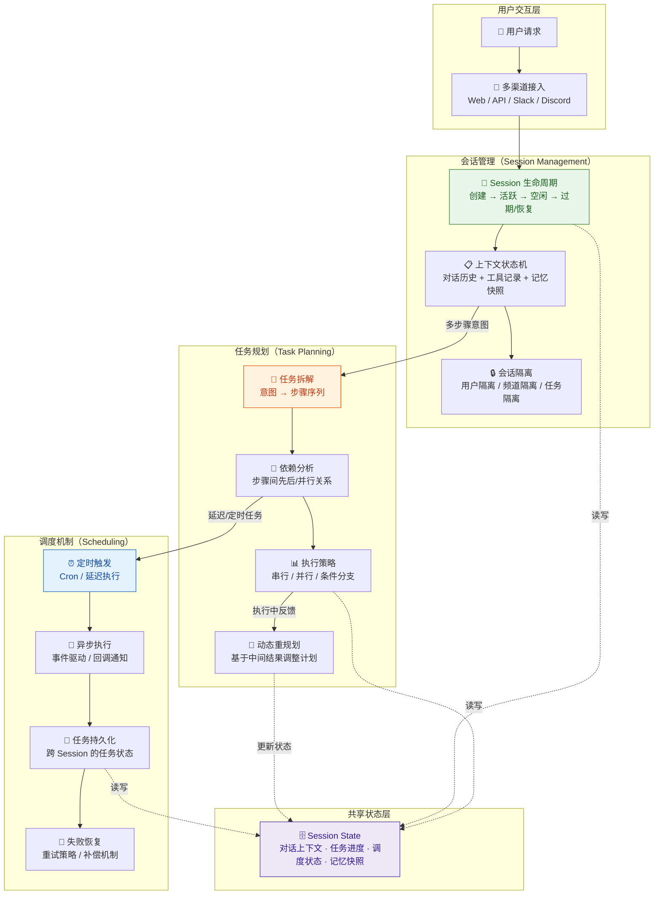
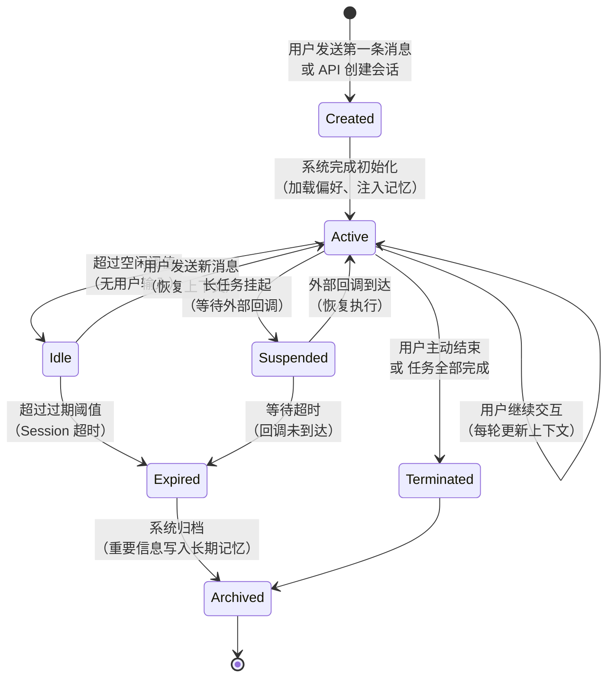
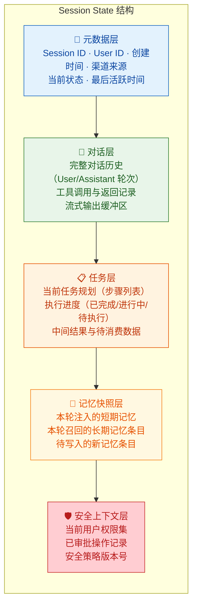
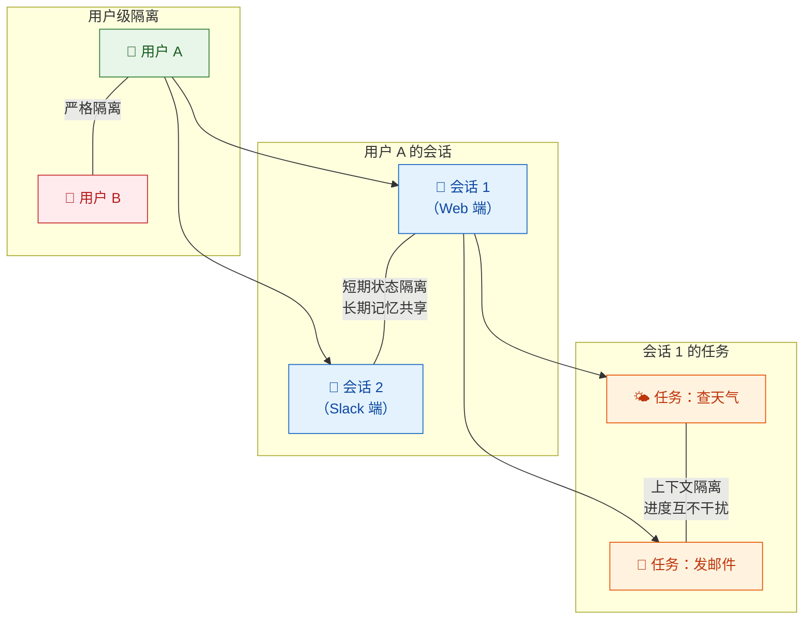
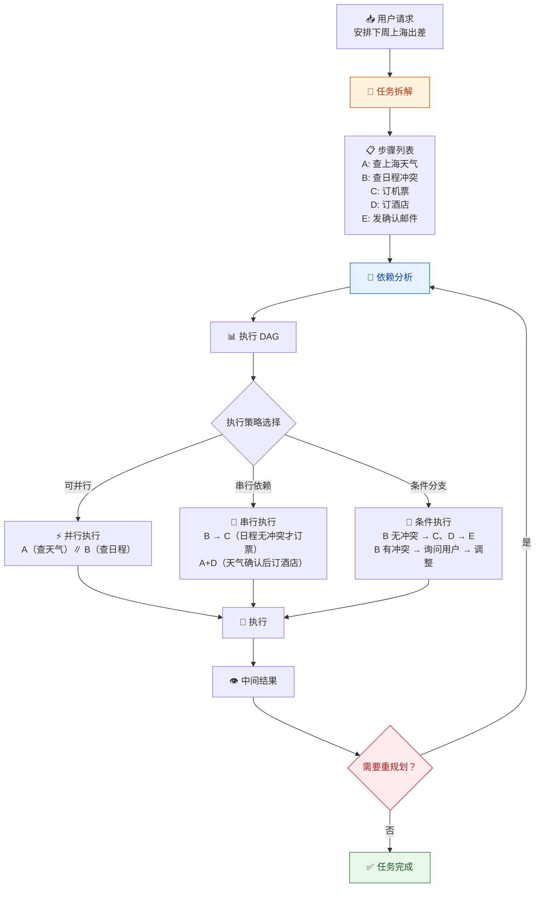
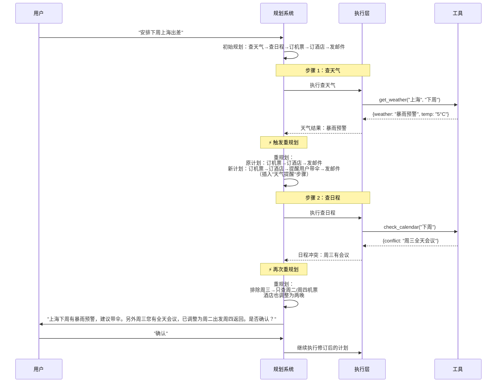
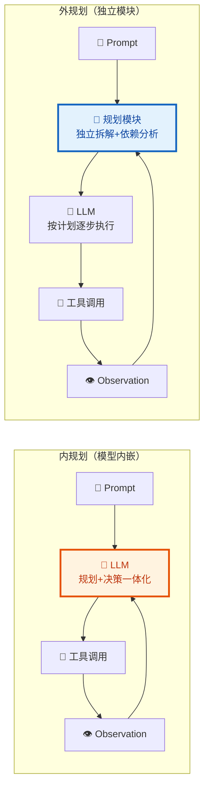
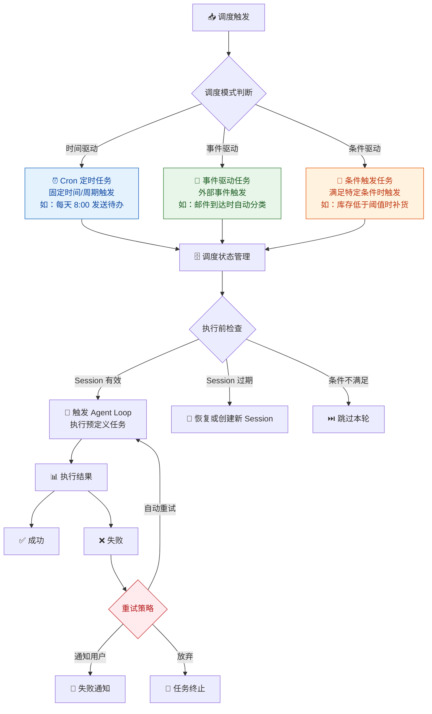
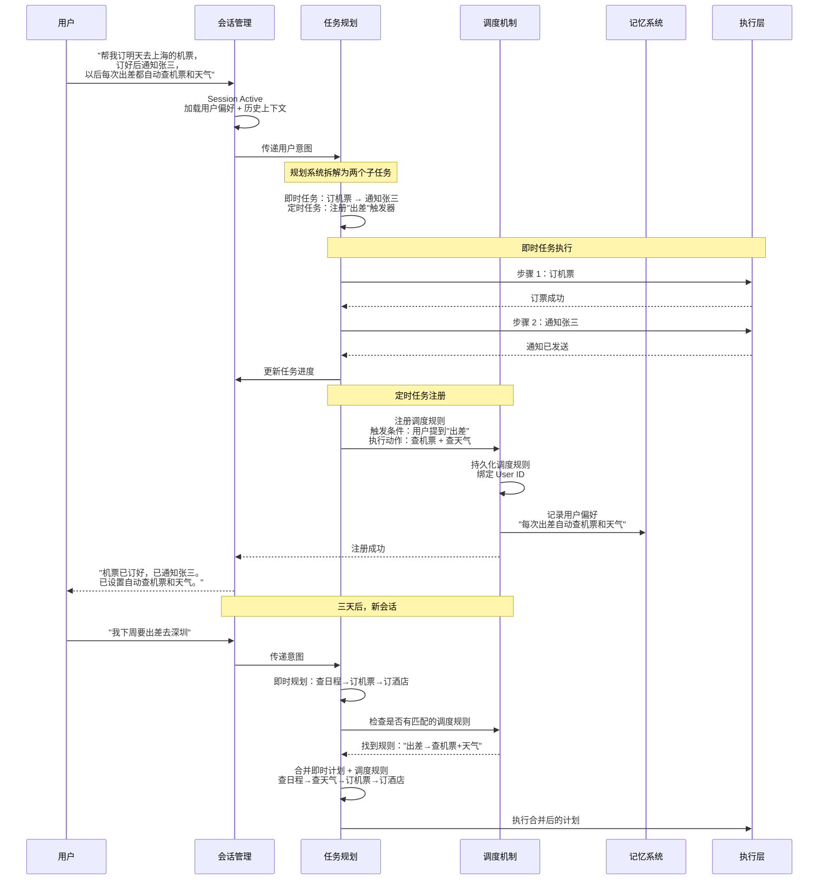

你正在阅读知识库**第二层：Agent 架构与系统链路**的第三篇文章。在前两篇中，你已经理解了 [Agent Loop 核心工作流](9-agent-loop-he-xin-gong-zuo-liu-cong-yong-hu-qing-qiu-dao-zui-zhong-xiang-ying) 中"思考→行动→观察→再思考"的抽象循环机制，也在 [ArkClaw / OpenClaw 产品架构与模块拆解](10-arkclaw-openclaw-chan-pin-jia-gou-yu-mo-kuai-chai-jie) 中看到了这个循环如何映射到具体的产品模块。本文将深入三个在产品架构图中紧密耦合、但在工程实现和测试逻辑上各自独立的子系统——**会话管理（Session Management）**、**任务规划（Task Planning）** 和 **调度机制（Scheduling）**。它们分别回答三个核心问题：Agent 如何维持与用户交互的状态连续性？Agent 如何将复杂意图拆解为可执行步骤？Agent 如何在时间维度上编排异步和定时任务？理解这三个子系统的内部机制与交互边界，是你后续设计 [任务规划测试](20-ren-wu-gui-hua-ce-shi-chai-jie-pai-xu-hui-tui-yu-dong-tai-diao-zheng)、[对话理解测试](19-dui-hua-li-jie-ce-shi-yi-tu-shi-bie-duo-lun-shang-xia-wen-yu-qi-yi-chu-li) 和 [Memory 测试](22-memory-ce-shi-ji-yi-bao-cun-guo-qi-shi-xiao-yu-kua-hui-hua-ge-chi) 的架构基础。

Sources: [readme.md](readme.md#L40-L63), [readme.md](readme.md#L386-L393)

## 三个子系统的定位与关系

在深入每个子系统之前，先用一张架构图建立全局视角。会话管理、任务规划和调度机制在 Agent 系统中构成了一条从"即时交互"到"延迟执行"的连续谱——会话管理处理当前正在发生的对话，任务规划处理对话中产生的多步意图，调度机制处理需要在未来某个时刻触发的任务。三者共享 Session 状态作为统一的上下文载体，但在触发时机、执行模式和状态管理策略上有本质区别：



上图中每个彩色区块代表一个可独立测试的子系统，虚线表示通过共享状态层的间接耦合。**一个核心认知**：这三者不是三个独立的功能模块，而是围绕 Session 状态构建的三个协作子系统——会话管理维护状态，任务规划消费状态并产出执行计划，调度机制将部分计划延后执行并管理其生命周期。

Sources: [readme.md](readme.md#L43-L63), [readme.md](readme.md#L386-L393)

## 会话管理（Session Management）

### 为什么 Agent 需要独立的会话管理

在传统的 Web 应用中，Session 通常只是一个"登录态"的载体——记录用户是谁、权限是什么、购物车里有什么。但 **Agent 系统的 Session 承载的远不止身份信息**。它需要在整个会话生命周期内维持：完整的对话历史（用户说了什么、Agent 回复了什么）、工具调用记录（调用了什么工具、传了什么参数、返回了什么结果）、当前任务的执行进度（任务拆解到了第几步、哪些步骤已完成）、与 [记忆机制](7-ji-yi-ji-zhi-duan-qi-ji-yi-chang-qi-ji-yi-yu-shang-xia-wen-guan-li) 的联动状态（短期记忆中的结构化信息、长期记忆的检索结果），以及安全和权限上下文（当前用户被允许执行哪些操作、哪些操作需要审批）。正如 readme 中所强调的，ArkClaw / OpenClaw 的测试"绝不能只停留在聊天窗口"，Session 是理解 Agent 行为的**状态基座**。

Sources: [readme.md](readme.md#L43-L63), [readme.md](readme.md#L386-L393)

### Session 生命周期：从创建到销毁

一个 Session 的完整生命周期可以用五阶段模型来描述。每个阶段都有明确的进入条件和退出条件，阶段之间的转换是测试工程师需要重点关注的**状态边界**：



| 生命周期阶段 | 核心状态 | 进入条件 | 关键测试关注点 |
|:---|:---|:---|:---|
| **Created** | 初始化 | 用户第一条消息或 API 调用 | 默认配置是否正确加载（System Prompt、权限、工具集） |
| **Active** | 活跃交互 | 初始化完成 | 多轮对话中上下文是否连贯、工具调用记录是否正确累积 |
| **Idle** | 空闲等待 | 超过空闲阈值（如 5 分钟无输入） | 空闲期间状态是否被意外清理、恢复后上下文是否完整 |
| **Suspended** | 挂起等待 | 长任务等待外部回调 | 挂起期间的资源占用、回调超时后的处理策略 |
| **Expired / Terminated** | 终结 | 超时或用户主动结束 | 重要信息是否成功写入 [长期记忆](7-ji-yi-ji-zhi-duan-qi-ji-yi-chang-qi-ji-yi-yu-shang-xia-wen-guan-li)、资源是否正确释放 |

**测试视角**：Session 生命周期的每一个状态转换都是一个潜在的故障点。最常见的缺陷不是"状态完全丢失"，而是"状态部分丢失"——例如，Session 从 Idle 恢复到 Active 时，对话历史保留了但工具调用记录被清空了，导致 Agent 不知道"之前做了什么"。另一个高频缺陷是"状态污染"——Session 恢复时错误地加载了其他用户的记忆或偏好。

Sources: [readme.md](readme.md#L43-L63), [readme.md](readme.md#L386-L393)

### 会话状态的核心组成

理解 Session 管理的第二个关键维度是"Session 里存了什么"。在 ArkClaw / OpenClaw 这类 Agent 平台中，Session 状态是一个多层次的结构体，每一层都有不同的读写频率、容量约束和过期策略：



| 状态层 | 存储位置 | 读写频率 | 容量约束 | 典型失效模式 |
|:---|:---|:---|:---|:---|
| **元数据层** | 内存 + 持久化 | 低频（状态转换时写） | 极小（固定字段） | User ID 绑定错误导致会话串扰 |
| **对话层** | 内存（活跃）/ 持久化（归档） | 高频（每轮读写） | 受 [上下文窗口](3-llm-he-xin-gai-nian-token-shang-xia-wen-chuang-kou-cai-yang-can-shu) 限制 | 历史过长触发截断，早期信息丢失 |
| **任务层** | 内存 + 持久化 | 中频（每步更新） | 取决于任务复杂度 | 部分步骤结果未记录，导致后续推理缺失依据 |
| **记忆快照层** | 内存 | 中频（每轮读取/写入） | 受注入条目数限制 | 旧快照未清除导致记忆版本冲突 |
| **安全上下文层** | 内存 + 持久化 | 低频（权限变更时写） | 极小 | 权限缓存未刷新，已撤销的操作仍可执行 |

Sources: [readme.md](readme.md#L43-L63), [readme.md](readme.md#L386-L393)

### 多渠道会话与状态同步

ArkClaw / OpenClaw 的公开信息强调了多种接入渠道——Web、API、Slack、Discord 等。同一个用户可能通过不同渠道与同一个 Agent 交互，这就引入了**跨渠道状态同步**的工程挑战。

| 同步模式 | 机制 | 优势 | 风险 | 测试关注点 |
|:---|:---|:---|:---|:---|
| **集中式状态** | 所有渠道共享同一 Session 状态（通过统一 Session ID） | 用户在任何渠道看到一致的上下文 | 并发写入冲突；单点故障 | 同时在两个渠道发送消息，状态是否一致 |
| **分渠道隔离** | 每个渠道维护独立 Session | 隔离性好，无并发冲突 | 用户需要在不同渠道重复提供信息 | 用户在 Web 端设定的偏好，Slack 端是否感知 |
| **主从同步** | 指定主渠道，其他渠道只读同步 | 兼顾一致性和并发安全 | 主渠道故障时同步中断 | 主渠道不可用时，从渠道行为是否符合预期 |

**核心测试原则**：无论采用哪种同步模式，**跨渠道的一致性是最高优先级的测试维度**。一个典型的缺陷场景是：用户在 Web 端说"帮我订明天去上海的机票"，然后切换到 Slack 端问"我的机票订好了吗？"——如果两个渠道的 Session 状态没有同步，Agent 要么不记得订机票的事，要么重新执行一遍。

Sources: [readme.md](readme.md#L43-L63), [readme.md](readme.md#L253-L262)

### 会话隔离：用户、会话与任务的边界

会话隔离是 Session 管理中**安全影响最高**的维度。它需要保证三个层级的隔离：**用户级隔离**（不同用户的 Session 完全独立，记忆、偏好、权限互不可见）、**会话级隔离**（同一用户的不同会话之间，短期状态互不干扰——一个会话中的任务进度不应"泄漏"到另一个会话）、**任务级隔离**（同一会话中，不同任务的上下文不应混淆——用户先问"帮我查天气"再问"帮我发邮件"，两个任务的工具调用记录不应互相干扰）。



**测试关键**：会话隔离的缺陷往往不是功能性的"完全无法工作"，而是**间歇性的数据泄漏**——在特定时序条件下（如两个会话同时写入记忆、并发请求导致状态竞争），一个用户的上下文片段"闪现"在另一个用户的回复中。这类缺陷在高并发场景下才会稳定复现，是 [稳定性测试](17-wen-ding-xing-ce-shi-duo-ci-zhi-xing-de-ke-kao-xing-yu-zhi-xing) 的重要内容。

Sources: [readme.md](readme.md#L43-L63), [readme.md](readme.md#L253-L262)

## 任务规划（Task Planning）

### 从意图到执行：规划在 Agent Loop 中的位置

在 [Agent Loop 核心工作流](9-agent-loop-he-xin-gong-zuo-liu-cong-yong-hu-qing-qiu-dao-zui-zhong-xiang-ying) 中，任务规划发生在模型推理阶段——当模型判断用户请求包含多个步骤时，它需要将抽象的意图拆解为具体的执行序列。但规划不是一次性的——它是一个贯穿整个执行过程的**动态决策循环**，在每一步执行后都可能根据中间结果进行调整。

任务规划可以进一步拆解为四个子能力：**任务拆解**（将复杂意图分解为原子步骤）、**依赖排序**（确定步骤间的先后和并行关系）、**执行策略选择**（串行、并行或条件分支）、**动态重规划**（基于中间结果调整后续计划）。readme 中明确将"任务规划测试"列为第一优先级的学习内容，关注"是否会拆任务、步骤顺序是否正确、是否存在漏步骤、是否会过度规划、是否能在中途根据结果调整计划"。

Sources: [readme.md](readme.md#L126-L138), [readme.md](readme.md#L44-L50)

### 任务拆解：从用户意图到步骤序列

任务拆解是规划能力的起点。当用户说"帮我安排下周去上海出差"时，Agent 需要将这个意图拆解为一系列可执行步骤——查天气、订机票、订酒店、查看日程冲突、发送行程确认邮件。拆解的质量直接决定了任务能否成功完成：

| 拆解维度 | 含义 | 好的拆解 | 差的拆解 |
|:---|:---|:---|:---|
| **完备性** | 是否覆盖了完成目标所需的所有步骤 | 天气→机票→酒店→日程→邮件 | 只订了机票和酒店，忘记查日程冲突 |
| **粒度** | 每个步骤是否足够原子化 | "查询上海 12 月 15 日机票价格" | "安排出差"（粒度过粗，无法直接执行） |
| **无冗余** | 是否包含不必要的步骤 | 5 个步骤刚好完成任务 | 10 个步骤，其中 5 个是重复或无意义操作 |
| **可执行性** | 每个步骤是否映射到具体的工具或操作 | "调用日历工具查看 12 月 15 日是否有冲突" | "确认时间是否合适"（无法映射到具体操作） |

**常见的拆解缺陷及触发场景**：

| 缺陷类型 | 具体表现 | 典型触发场景 | 严重程度 |
|:---|:---|:---|:---:|
| **遗漏步骤** | 拆解不完整，缺少关键环节 | 多依赖任务（如出差安排忘记查签证要求） | 🔴 高 |
| **过度拆解** | 简单任务被拆成过多无意义步骤 | 单一查询任务被拆为"先想一下→再查→再想一下→再查" | 🟢 低 |
| **粒度不均** | 部分步骤过粗、部分过细 | "订机票"（粗）和"打开浏览器→输入网址→搜索航班→选择航班"（过细） | 🟡 中 |
| **幻觉步骤** | 编造了不存在的工具或能力 | 拆解中包含"调用签证 API"但系统没有此工具 | 🔴 高 |

Sources: [readme.md](readme.md#L126-L138), [readme.md](readme.md#L44-L50)

### 依赖分析与执行策略

拆解出步骤后，规划系统需要分析步骤间的依赖关系，并据此确定执行策略。这是区分"好的规划"和"差的规划"的关键维度——正确的依赖分析能让任务高效完成，错误的依赖分析则导致不必要等待甚至执行失败：



上图中展示了一个关键设计：规划系统通常使用 **DAG（有向无环图）** 来表示步骤间的依赖关系。DAG 的拓扑排序确定了执行顺序——入度为 0 的步骤可以立即执行（或并行执行），有前置依赖的步骤必须等待前置步骤完成后才能开始。

| 执行策略 | 适用场景 | 优势 | 风险 | 测试关注点 |
|:---|:---|:---|:---|:---|
| **串行执行** | 步骤间存在严格数据依赖 | 逻辑简单，每步结果确定 | 总耗时 = 各步骤耗时之和，效率低 | 前置步骤失败后，后续步骤是否正确处理 |
| **并行执行** | 步骤间无依赖或弱依赖 | 总耗时接近最慢步骤的耗时 | 并发资源竞争、结果合并复杂 | 并行执行的部分失败场景，结果是否正确合并 |
| **条件分支** | 执行路径依赖中间结果 | 灵活适应实际情况 | 分支条件判断可能出错 | 分支条件是否正确触发、默认分支是否合理 |
| **混合策略** | 实际场景（部分串行 + 部分并行） | 兼顾效率和安全 | 实现复杂度最高 | 串行与并行的切换边界是否正确 |

Sources: [readme.md](readme.md#L44-L50), [readme.md](readme.md#L126-L138)

### 动态重规划：当现实偏离计划

静态的任务拆解和依赖分析只适用于"理想路径"——一切按计划进行的情况。但 Agent 面对的是真实的、充满不确定性的外部环境：工具可能返回意外结果、外部服务可能不可用、用户可能在中途修改需求。**动态重规划**是 Agent 系统区别于传统工作流引擎的核心能力——它允许 Agent 在执行过程中根据观察到的结果调整后续计划。



动态重规划的关键在于**触发条件的设计**——什么情况下应该触发重规划？以下是四种典型的重规划触发模式：

| 触发模式 | 触发条件 | 典型场景 | 重规划策略 | 测试关注点 |
|:---|:---|:---|:---|:---|
| **结果异常型** | 工具返回错误或意外结果 | 天气查询返回暴风预警 | 调整后续步骤（如插入提醒步骤） | 异常结果是否被正确识别和处理 |
| **依赖失败型** | 前置步骤执行失败 | 机票预订 API 返回"无余票" | 尝试替代方案（如改日期/航班） | 失败后的替代方案是否合理 |
| **需求变更型** | 用户在中途修改了要求 | 用户说"不要订酒店了，我住朋友家" | 从计划中移除相关步骤 | 已完成的步骤是否正确回滚/保留 |
| **资源约束型** | Token 或时间预算接近上限 | 长对话中累计消耗过大 | 压缩剩余步骤或提前总结 | 压缩后的计划是否仍能完成核心目标 |

**测试视角的关键认知**：动态重规划是 Agent 规划能力中**最难测试**的维度，因为它涉及的是"非理想路径"——你需要设计那些"故意让事情出错"的测试场景，迫使 Agent 进入重规划逻辑。readme 中明确列出了典型缺陷："计划不完整、失败后不会回退和重试"，这正是重规划测试要验证的核心能力。

Sources: [readme.md](readme.md#L126-L138), [readme.md](readme.md#L216-L224)

### 规划与 Agent Loop 的关系：内规划 vs 外规划

在工程实现层面，任务规划可以发生在两个位置——**内规划（模型内嵌规划）** 和 **外规划（独立规划模块）**。两种模式的选择深刻影响着系统的行为模式和测试策略：



| 对比维度 | 内规划（模型内嵌） | 外规划（独立模块） |
|:---|:---|:---|
| **规划能力来源** | 完全依赖 LLM 的推理能力 | 独立算法 + LLM 辅助决策 |
| **可观测性** | 规划过程隐含在模型推理中，难以分离观察 | 规划步骤可独立记录和检查 |
| **可控性** | 通过 Prompt 引导，但无法保证遵循 | 通过代码逻辑硬约束步骤顺序 |
| **灵活性** | 高——模型可根据上下文动态调整 | 受限于预设规则，但更稳定 |
| **测试难度** | 高——需要通过间接手段验证规划合理性 | 中——可直接验证规划输出 |
| **典型缺陷** | 规划幻觉（编造不存在的步骤）、规划漂移（执行中偏离计划） | 规划死板（无法适应异常情况）、规则遗漏（未覆盖边界场景） |

在 ArkClaw / OpenClaw 的实际实现中，两种模式通常是**混合使用**的——简单任务由模型内嵌规划直接处理，复杂任务或涉及多步骤依赖的任务则由独立的规划模块介入。这种混合策略的测试挑战在于：**你需要验证"什么时候该用内规划、什么时候该切换到外规划"的判断逻辑本身是否正确**。

Sources: [readme.md](readme.md#L44-L50), [readme.md](readme.md#L386-L393)

## 调度机制（Scheduling）

### 从即时执行到延迟执行：为什么需要调度

会话管理和任务规划处理的是"现在就要做"的事情——用户发了消息，Agent 立刻响应。但 Agent 系统还需要处理"以后再做"的场景：用户说"每天早上 8 点给我发送今日待办事项"、"等这个任务完成后通知我"、"下周三提醒我提交报告"。这些需求将 Agent 从**即时响应系统**扩展为**具有时间维度编排能力的任务执行平台**。

readme 中明确将"调度/定时任务"列为 ArkClaw / OpenClaw 的核心模块之一，并强调 OpenClaw 的公开信息中包含了 cron、sessions、actions 等能力。调度机制的本质是：**将"何时执行"与"执行什么"解耦**——在规划阶段确定"做什么"和"按什么顺序做"，在调度阶段确定"什么时候做"。

Sources: [readme.md](readme.md#L43-L63), [readme.md](readme.md#L386-L393)

### 调度的三种模式

调度机制在 Agent 系统中表现为三种核心模式，每种模式有不同的触发方式、状态管理和失败处理策略：



| 调度模式 | 触发机制 | 典型场景 | 状态管理挑战 | 核心测试点 |
|:---|:---|:---|:---|:---|
| **Cron 定时** | 系统时钟驱动（Cron 表达式） | 每日待办、定期报告、周期性检查 | 时区处理、夏令时、漏执行/重复执行 | 触发时间准确性、跨时区一致性、累积执行稳定性 |
| **事件驱动** | 外部事件回调（Webhook、消息队列） | 邮件到达通知、代码提交触发测试 | 事件去重、事件乱序、回调丢失 | 事件可靠性、并发事件处理、事件丢失恢复 |
| **条件触发** | 条件评估引擎（持续监控某指标） | 库存低于阈值、价格变动通知 | 条件评估的延迟、误触发、抖动 | 条件判断准确性、防抖/防重、长周期条件监控 |

Sources: [readme.md](readme.md#L43-L63), [readme.md](readme.md#L253-L262)

### 调度任务与 Session 的关系

调度机制引入了一个与即时交互不同的核心挑战——**调度任务执行时的 Session 上下文从哪里来**？在即时交互中，Session 是活跃的，所有状态都是"热的"；但在定时触发或事件驱动场景中，原始 Session 可能已经处于 Idle 甚至 Expired 状态：

| 场景 | Session 状态 | 处理策略 | 风险 |
|:---|:---|:---|:---|
| **Cron 触发时 Session 仍活跃** | Active | 直接复用当前 Session 上下文 | 与用户即时消息产生并发冲突 |
| **Cron 触发时 Session 已空闲** | Idle | 恢复 Session，加载最近的对话和记忆快照 | 恢复后上下文可能不完整（部分状态已过期） |
| **Cron 触发时 Session 已过期** | Expired | 创建新 Session，通过 [长期记忆](7-ji-yi-ji-zhi-duan-qi-ji-yi-chang-qi-ji-yi-yu-shang-xia-wen-guan-li) 恢复用户偏好 | 长期记忆未包含足够的上下文，导致任务执行偏离用户预期 |
| **跨 Session 的长周期任务** | 不断创建和销毁 | 每次执行使用独立的"调度 Session" | 多次执行之间的状态连续性无法保证 |

**测试关键**：调度任务的测试必须覆盖 Session 的各种状态组合——"在 Session 活跃时触发"、"在 Session 空闲后触发"、"在 Session 过期后触发"，以及"多个调度任务同时触发时的并发行为"。readme 中强调了 OpenClaw 的 sessions 和 cron 能力，这意味着这些组合场景在 ArkClaw / OpenClaw 的测试中不可忽略。

Sources: [readme.md](readme.md#L43-L63), [readme.md](readme.md#L386-L393)

### 调度任务的失败处理与补偿

调度任务比即时交互更脆弱——它可能在用户不在线时执行、可能依赖已变化的外部环境、可能在长时间间隔后触发。因此，调度机制必须具备**独立的失败处理和补偿能力**：

| 失败类型 | 典型原因 | 恢复策略 | 对用户的影响 |
|:---|:---|:---|:---|
| **执行失败** | 外部 API 不可用、工具参数过期 | 自动重试（指数退避）→ 失败通知用户 | 用户未收到预期的定时任务结果 |
| **Session 丢失** | Session 在等待期间被清理 | 重新创建 Session + 从长期记忆恢复 | 任务可能缺少部分上下文 |
| **触发遗漏** | 系统维护期间 Cron 未能触发 | 补偿执行（触发后立即执行遗漏的任务） | 任务延迟执行而非跳过 |
| **重复触发** | 系统故障导致重复 Cron 触发 | 幂等性检查（基于任务 ID 去重） | 用户收到重复通知或重复执行 |
| **数据过期** | 定时任务引用的数据已变化 | 执行前重新获取最新数据 | 任务基于过期数据做出错误决策 |

**幂等性**是调度任务测试中一个特别重要的概念——同一个定时任务被多次触发时，其结果应该与触发一次等价。例如"每天发送待办邮件"如果被重复触发，用户不应收到两封相同的邮件。这需要调度系统在任务执行前进行**去重检查**，或者在工具执行层实现**幂等性保障**。

Sources: [readme.md](readme.md#L216-L224), [readme.md](readme.md#L253-L262)

## 三个子系统的协同：一个完整的端到端场景

理解了会话管理、任务规划和调度机制各自的工作方式后，接下来通过一个完整的端到端场景来观察三者的协同。用户发送了一个包含即时执行和延迟调度的复合请求——"帮我订明天去上海的机票，订好后通知张三，然后以后每次出差都帮我自动查机票和天气"：



这个场景揭示了三个子系统协同的几个关键设计点：**调度规则需要持久化并跨 Session 生效**——用户在三天后的新会话中提到"出差"，系统需要从 [长期记忆](7-ji-yi-ji-zhi-duan-qi-ji-yi-chang-qi-ji-yi-yu-shang-xia-wen-guan-li) 中检索到之前注册的调度规则。**即时任务和定时任务需要合并规划**——用户当前的"出差去深圳"请求和之前注册的"出差自动查机票和天气"规则需要被规划系统合并为一个统一的执行计划。**调度规则的触发需要语义匹配**——"出差"这个词在新会话中的出现需要被意图识别模块捕获，并与已注册的调度规则进行匹配。

Sources: [readme.md](readme.md#L43-L63), [readme.md](readme.md#L386-L393)

## 三子系统的典型失败模式汇总

将前文各子系统的失败模式整合为一张综合表，这是你后续设计测试用例时的核心参考框架。按照"哪个子系统的问题、具体表现是什么、对用户的影响是什么"三个维度进行分类：

| 子系统 | 失败模式 | 具体表现 | 对用户的影响 | 严重程度 |
|:---|:---|:---|:---|:---:|
| **会话管理** | 上下文丢失 | Session 恢复后对话历史不完整 | Agent "忘记"用户之前说过的话 | 🔴 高 |
| **会话管理** | 会话串扰 | 不同用户的上下文片段出现在当前对话 | 隐私泄漏 + 行为异常 | 🔴 高 |
| **会话管理** | 跨渠道不一致 | Web 端和 Slack 端的 Session 状态不同步 | 同一用户在不同渠道获得矛盾的回复 | 🟡 中 |
| **会话管理** | 空闲恢复失败 | Session 从 Idle 恢复到 Active 后工具调用记录丢失 | Agent 重复执行已完成的工具调用 | 🟡 中 |
| **任务规划** | 拆解遗漏 | 复杂任务缺少关键步骤 | 任务部分完成或完全失败 | 🔴 高 |
| **任务规划** | 依赖排序错误 | 有前置依赖的步骤被提前执行 | 基于不存在的中间结果做决策 | 🔴 高 |
| **任务规划** | 过度规划 | 简单任务被拆成 10+ 无意义步骤 | 执行效率低，Token 消耗高，用户等待时间长 | 🟢 低 |
| **任务规划** | 重规划失败 | 执行失败后不会回退或调整，直接报错 | 用户收到"任务失败"而没有替代方案 | 🔴 高 |
| **任务规划** | 规划幻觉 | 编造了不存在的工具或步骤作为计划的一部分 | 计划无法执行，卡在不存在的步骤上 | 🔴 高 |
| **调度机制** | Cron 触发不准时 | 预期 8:00 触发但实际 8:15 才触发 | 用户未在预期时间收到信息 | 🟡 中 |
| **调度机制** | 触发遗漏 | 系统维护期间 Cron 未触发且未补偿 | 用户完全未收到预期的定时任务结果 | 🔴 高 |
| **调度机制** | 重复触发 | 同一任务被触发两次，执行了重复操作 | 用户收到重复通知或操作被执行两次 | 🟡 中 |
| **调度机制** | Session 过期后调度失败 | 定时任务触发时 Session 已过期，无法恢复上下文 | 任务缺少用户偏好等上下文，执行结果不准确 | 🔴 高 |
| **调度机制** | 调度规则未持久化 | 用户注册的定时规则在系统重启后丢失 | 用户预期的自动化操作不再执行 | 🔴 高 |

Sources: [readme.md](readme.md#L43-L63), [readme.md](readme.md#L126-L138), [readme.md](readme.md#L216-L237)

## 缺陷归因：三个子系统的排查路线图

当你发现一个涉及会话管理、任务规划或调度机制的 Agent 行为异常时，可以按照以下决策树快速定位问题所属的子系统。**核心原则**：先判断问题发生在"什么时候"（即时交互中还是延迟执行中），再判断"哪个环节"（状态管理还是决策逻辑）：

```mermaid
flowchart TD
    BUG["🔴 发现 Agent 行为异常"] --> TIMING{"问题发生在什么时候？"}

    TIMING -->|"即时交互中"| INTERACT["🔍 即时交互问题"]
    TIMING -->|"延迟/定时执行中"| DELAYED["🔍 延迟执行问题"]
    TIMING -->|"不确定"| CHECK_TRACE["📋 查看 Trace 日志<br/>确认问题发生的时间点"]

    INTERACT --> I1{"是"忘记"了什么<br/>还是"做错了"什么？"}
    I1 -->|"忘记了之前的对话/设定"| I2["📍 会话管理<br/>检查 Session 状态是否完整<br/>检查上下文是否被截断<br/>检查记忆注入是否正确"]
    I1 -->|"任务执行不完整或顺序错误"| I3["📍 任务规划<br/>检查 Trace 中的规划步骤<br/>验证依赖分析是否正确<br/>检查是否有动态重规划记录"]
    I1 -->|"执行了不该执行的操作"| I4["📍 任务规划 + 安全策略<br/>检查规划是否包含越权步骤<br/>检查 Human-in-the-loop 是否触发"]

    DELAYED --> D1{"定时任务是否准时触发？"}
    D1 -->|"未触发"| D2["📍 调度机制<br/>检查 Cron 配置<br/>检查调度规则是否持久化<br/>检查系统日志是否有触发记录"]
    D1 -->|"触发了但结果不对"| D3{"Session 状态是否完整？"}
    D3 -->|"Session 已过期/丢失"| D4["📍 调度 × 会话管理<br/>Session 恢复策略是否正确<br/>长期记忆是否提供足够上下文"]
    D3 -->|"Session 正常"| D5["📍 调度 × 任务规划<br/>定时任务的规划是否正确<br/>执行时外部环境是否已变化"]
    D1 -->|"重复触发"| D6["📍 调度机制<br/>检查幂等性逻辑<br/>检查去重机制"]

    style BUG fill:#FFCDD2,stroke:#C62828,color:#B71C1C
    style I2 fill:#E8F5E9,stroke:#2E7D32,color:#1B5E20
    style I3 fill:#FFF3E0,stroke:#E65100,color:#BF360C
    style I4 fill:#FFEBEE,stroke:#C62828,color:#B71C1C
    style D2 fill:#E3F2FD,stroke:#1565C0,color:#0D47A1
    style D4 fill:#EDE7F6,stroke:#4527A0,color:#311B92
    style D5 fill:#FFF3E0,stroke:#E65100,color:#BF360C
    style D6 fill:#E3F2FD,stroke:#1565C0,color:#0D47A1
```

**使用方法**：当你在 [Trace 日志](13-ri-zhi-trace-yu-zhi-xing-gui-ji-ke-guan-ce-xing) 中发现异常行为时，先沿着"即时 vs 延迟"的顶层分支定位问题类别，然后逐层深入到具体的子系统。特别注意图中标为"📍 子系统 A × 子系统 B"的节点——这些是**跨子系统缺陷**，往往需要多个模块的日志联合分析才能定位根因。

Sources: [readme.md](readme.md#L253-L262), [readme.md](readme.md#L386-L393)

## 下一步

现在你已经建立了对会话管理、任务规划与调度机制的完整认知——理解了 Session 的生命周期与状态组成、任务拆解与依赖分析的规划逻辑、以及三种调度模式的触发机制和失败处理策略。在"第二层：Agent 架构与系统链路"的学习路径中，建议你按以下顺序继续深入：

1. [Skills / 插件体系与外部系统接入](12-skills-cha-jian-ti-xi-yu-wai-bu-xi-tong-jie-ru) — 深入理解任务规划和调度机制中"执行层"的扩展能力——Agent 如何通过 Skills 对接外部工具和系统
2. [日志、Trace 与执行轨迹可观测性](13-ri-zhi-trace-yu-zhi-xing-gui-ji-ke-guan-ce-xing) — 掌握本文中"缺陷归因路线图"所依赖的核心工具——没有可观测性，Session 状态、规划步骤和调度记录都无从查起

当你完成第二层全部内容后，本文的三个子系统将在以下页面中落地为具体的测试用例：

- [对话理解测试](19-dui-hua-li-jie-ce-shi-yi-tu-shi-bie-duo-lun-shang-xia-wen-yu-qi-yi-chu-li) — 验证会话管理的多轮上下文一致性
- [任务规划测试](20-ren-wu-gui-hua-ce-shi-chai-jie-pai-xu-hui-tui-yu-dong-tai-diao-zheng) — 验证任务拆解、依赖排序和动态重规划的完整性
- [Memory 测试](22-memory-ce-shi-ji-yi-bao-cun-guo-qi-shi-xiao-yu-kua-hui-hua-ge-chi) — 验证会话恢复时的记忆召回准确性
- [稳定性测试](17-wen-ding-xing-ce-shi-duo-ci-zhi-xing-de-ke-kao-xing-yu-zhi-xing) — 验证调度任务的累积执行稳定性