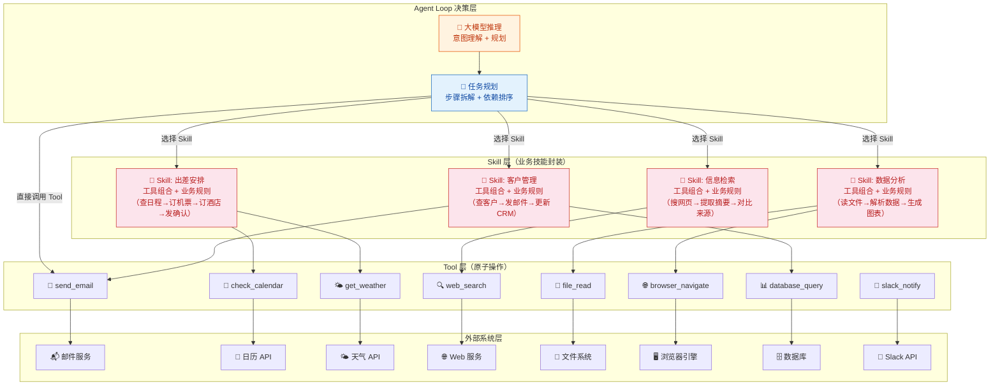
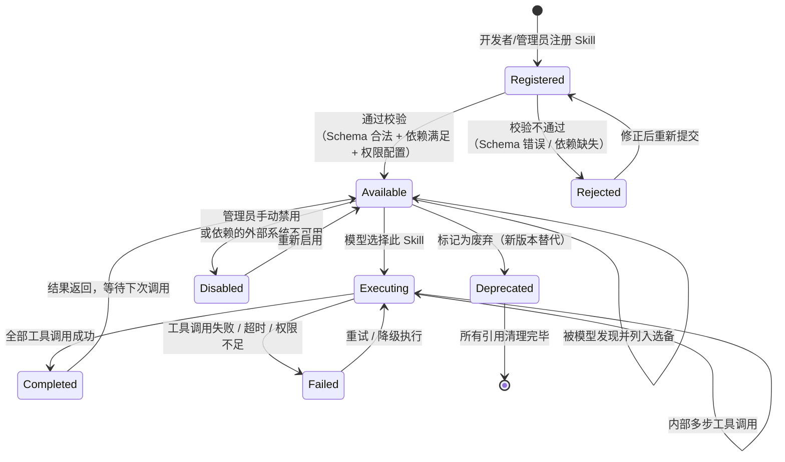
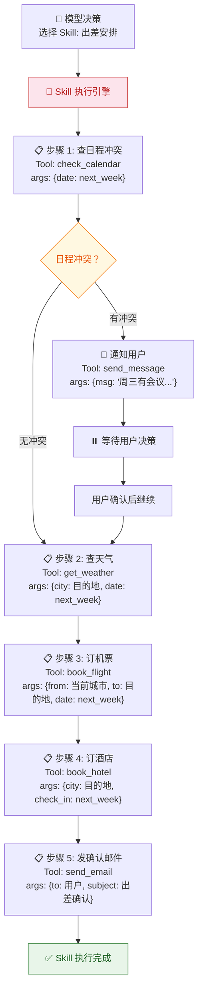
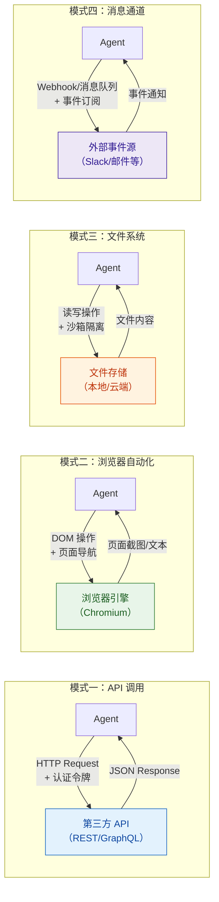
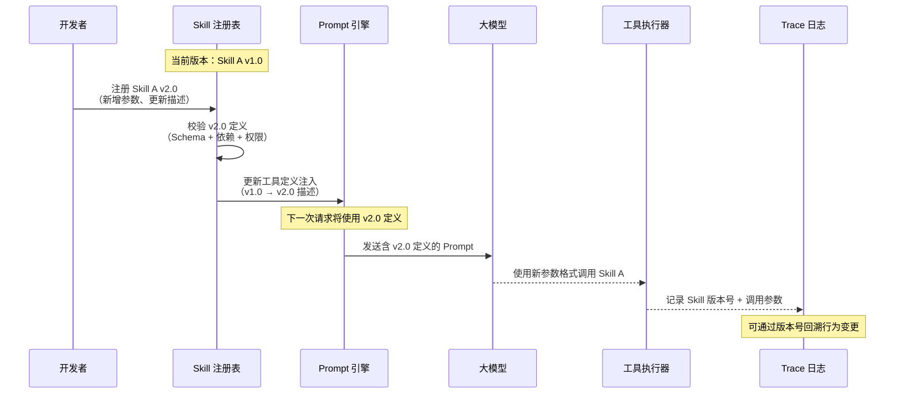
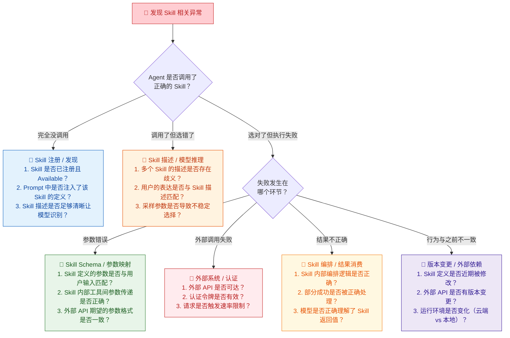

你正在阅读知识库**第二层：Agent 架构与系统链路**的第四篇文章。在前几篇中，你已经理解了 [Agent Loop 核心工作流](9-agent-loop-he-xin-gong-zuo-liu-cong-yong-hu-qing-qiu-dao-zui-zhong-xiang-ying) 中"思考→行动→观察→再思考"的循环机制，看到了 [ArkClaw / OpenClaw 产品架构](10-arkclaw-openclaw-chan-pin-jia-gou-yu-mo-kuai-chai-jie) 中"工具执行层"的模块边界，也掌握了 [会话管理、任务规划与调度机制](11-hui-hua-guan-li-ren-wu-gui-hua-yu-diao-du-ji-zhi) 中任务拆解如何驱动执行。本文聚焦于那个**被规划和调度"消费"的执行层核心**——Skills / 插件体系。你将理解 Agent 如何通过 Skills 封装能力、注册工具、对接外部系统，以及这些机制在工程实现中的关键设计决策和对应的测试关注点。

Sources: [readme.md](readme.md#L43-L63), [readme.md](readme.md#L386-L393)

## 从 Tool 到 Skill：两层抽象的关系

在 [工具调用（Tool Calling）机制](5-gong-ju-diao-yong-tool-calling-function-calling-ji-zhi) 中，你已经建立了对 Tool Calling 的完整认知——模型通过 JSON Schema 定义的工具描述，选择工具、提取参数、消费结果。Tool 是**原子级的操作**：发一封邮件、查一次天气、读一个文件。但在真实的 Agent 产品中，用户的需求往往不是"执行一个原子操作"，而是"完成一个业务目标"——"管理我的客户关系"、"安排一次出差"、"跟踪项目进度"。这些业务目标涉及**一组相关的原子操作和业务逻辑的组合**，这就是 **Skill** 的定位。

用一个类比来建立直觉：如果把 Agent 系统比作一个公司，**Tool 是员工可以使用的办公工具**（电话、打印机、邮件客户端），而 **Skill 是员工掌握的"业务技能"**——"客户管理技能"意味着员工知道如何使用电话 + 邮件 + 日历等一系列工具来完成客户管理这个业务目标。Skill 封装了"用什么工具、按什么顺序、遵循什么业务规则"的知识。

Sources: [readme.md](readme.md#L44-L50), [readme.md](readme.md#L386-L393)

### Tool 与 Skill 的分层模型

下面的架构图展示了 Tool 和 Skill 在 Agent 系统中的分层关系，以及它们如何与 Agent Loop 的其他模块协作：

**核心认知**：Agent 的能力边界不取决于"模型有多聪明"，而取决于 **Skills 和 Tools 覆盖了哪些能力**。模型再强，如果系统中没有注册"浏览器自动化"这个 Skill，Agent 就永远无法操作网页。这个事实对测试工程师极为关键——**当你发现 Agent "不会做某件事"时，第一件事就是确认系统中是否注册了对应的 Skill 或 Tool**，而不是怀疑模型能力不足。

Sources: [readme.md](readme.md#L44-L63), [readme.md](readme.md#L386-L393)

### Tool 与 Skill 的关键差异

虽然 Tool 和 Skill 都服务于"让 Agent 能做事"这个目标，但它们在抽象层级、管理方式和测试策略上有本质差异：

| 维度 | Tool（原子工具） | Skill（业务技能） |
|:---|:---|:---|
| **定义** | 单一的、原子级的操作，如"发送邮件"、"查询天气" | 一组相关工具 + 业务逻辑的组合，如"客户管理"、"出差安排" |
| **粒度** | 细粒度，一个操作对应一个外部 API 或系统调用 | 粗粒度，一个 Skill 可能编排多个 Tool 的调用序列 |
| **注册方式** | 通过 JSON Schema 定义（name + description + parameters） | 通过 Skill 注册表（包含工具映射、业务规则、权限要求） |
| **对模型可见性** | 模型直接"看到"每个 Tool 的定义，自主决定调用 | 模型可能只看到 Skill 的描述，内部工具编排由 Skill 逻辑决定 |
| **可观测性** | 每次调用独立可追踪 | 调用链路更长，需要追踪 Skill 内部的多步工具调用 |
| **失败影响** | 单一操作失败，影响范围有限 | Skill 内部一个工具失败可能影响整个业务流程 |
| **测试重点** | 参数提取准确性、返回值消费正确性 | 编排逻辑完整性、工具间依赖处理、业务规则遵循 |
| **安全边界** | 单一操作的权限控制 | 组合操作的权限累积风险（如 Skill 先查客户信息再发邮件，两步单独合法但组合可能越权） |

**测试视角的关键启示**：Skill 层引入了一种新的风险——**组合风险**。两个 Tool 各自合法、各自安全，但被 Skill 编排在一起时可能产生意外的安全问题。例如"查客户信息"（合法）+ "发邮件"（合法）组合在一起，如果 Skill 没有正确校验收件人权限，就可能导致将敏感客户信息发送给未授权的第三方。这种组合风险是 Skill 层测试区别于 Tool 层测试的核心维度。

Sources: [readme.md](readme.md#L140-L158), [readme.md](readme.md#L226-L237)

## Skill 的生命周期：注册、发现、执行与注销

Skill 不是静态的配置项，它有自己的生命周期——从注册到系统、被模型发现和选择、执行内部编排逻辑、到最终被注销或更新。理解这个生命周期，是你在测试中定位"Skill 层问题出在哪个环节"的基础。

| 生命周期阶段 | 触发条件 | 核心职责 | 关键测试关注点 |
|:---|:---|:---|:---|
| **Registered** | 开发者提交 Skill 定义 | 存储 Skill 元数据（名称、描述、工具映射、权限要求） | Schema 格式是否合法、必填字段是否齐全 |
| **Available** | 注册校验通过 | 将 Skill 的摘要信息注入 Prompt 的工具定义区，使模型可"看到" | 模型是否能正确发现并选择此 Skill |
| **Executing** | 模型选择此 Skill | 按 Skill 内部逻辑编排多个 Tool 的调用序列 | 编排逻辑是否正确、工具间参数传递是否准确 |
| **Completed / Failed** | 工具调用结束 | 标准化结果格式、触发记忆更新、记录执行轨迹 | 部分成功的处理策略、失败信息的准确传递 |
| **Disabled / Deprecated** | 管理操作或系统事件 | 从可用列表中移除、清理相关资源 | 已 Disabled 的 Skill 是否真的不再被调用 |

Sources: [readme.md](readme.md#L44-L50), [readme.md](readme.md#L386-L393)

### Skill 注册：从定义到可被发现

Skill 注册是整个生命周期的起点，也是**最容易在工程层面引入缺陷的环节**。一个 Skill 的注册定义通常包含以下核心要素：

| 注册要素 | 含义 | 写得好 vs 写得差 | 对模型行为的影响 |
|:---|:---|:---|:---|
| **Skill 名称** | 唯一标识符 | `customer_management`（语义明确） | 名称模糊 → 模型选错 Skill |
| **功能描述** | 告诉模型"这个 Skill 能做什么、什么时候该用" | "管理客户信息，包括查询、更新、发送通知"（具体明确） | 描述不完整 → 模型不知道何时该用 |
| **工具映射** | 该 Skill 包含哪些 Tool、每个 Tool 的调用顺序和参数映射 | 明确定义 Tool A 的输出如何作为 Tool B 的输入 | 映射错误 → 工具间参数传递断裂 |
| **权限声明** | 该 Skill 需要哪些权限（读取客户数据、发送邮件等） | 精确声明所需权限范围 | 权限声明不足 → 执行时被拒绝；声明过宽 → 安全风险 |
| **前置条件** | 执行此 Skill 前必须满足的条件 | "需要用户已授权邮件发送权限" | 未检查前置条件 → 执行中才发现无法完成 |
| **降级策略** | 当部分 Tool 不可用时的替代方案 | "邮件发送失败 → 改用 Slack 通知" | 无降级策略 → 一个 Tool 失败整个 Skill 失败 |

**关键洞察**：Skill 的功能描述和 [Tool Calling 机制](5-gong-ju-diao-yong-tool-calling-function-calling-ji-zhi) 中的工具描述遵循相同的原理——它是模型理解 Skill 用途的**唯一依据**。一个写得差的 Skill 描述，和写得差的 Tool 描述一样，会导致模型"该用的时候不用，不该用的时候乱用"。但 Skill 描述的影响范围更大——一个 Tool 选错了只影响单步操作，一个 Skill 选错了可能影响整个业务流程。

Sources: [readme.md](readme.md#L140-L158), [readme.md](readme.md#L386-L393)

### Skill 执行：从模型决策到多步工具编排

当模型选择了一个 Skill 后，执行层的职责是将模型的"业务意图"转化为一系列具体的 Tool 调用。这个过程的复杂度取决于 Skill 的内部编排模式：

上图中，"出差安排" Skill 的执行涉及五个步骤，其中包含条件分支（日程冲突时通知用户）和步骤间依赖（订机票依赖日程查询结果）。这种内部编排逻辑是 Skill 区别于单个 Tool 的核心特征。

**Skill 内部编排的四种模式**：

| 编排模式 | 机制 | 适用场景 | 测试重点 |
|:---|:---|:---|:---|
| **线性序列** | 步骤按固定顺序依次执行 | 流程固定的业务（如：读文件→解析→生成报告） | 每一步的输入是否正确依赖上一步的输出 |
| **条件分支** | 根据中间结果决定后续执行路径 | 需要灵活应对的业务（如：查库存→有货则下单/无货则通知） | 分支条件是否被正确触发、默认分支是否合理 |
| **并行执行** | 无依赖的步骤同时执行 | 效率优先的场景（如：同时查多家酒店价格） | 并行结果合并是否正确、部分失败的降级策略 |
| **循环/重试** | 某些步骤需要反复执行直到满足条件 | 不确定性场景（如：轮询任务状态直到完成） | 循环终止条件是否正确、最大重试次数是否合理 |

Sources: [readme.md](readme.md#L44-L63), [readme.md](readme.md#L140-L158)

## Skill 的分类体系

ArkClaw / OpenClaw 这类 Agent 平台中的 Skills 并非同质的——它们在来源、能力范围、安全等级和测试策略上有显著差异。readme 中明确列出了"工具注册与调用"、"Skills / 插件机制"、"浏览器自动化"、"文件读写"、"外部系统接入"等核心模块，而 OpenClaw 的公开信息也强调了 browser、canvas、nodes、cron、sessions、Discord/Slack actions、skills 等能力。基于这些信息，可以将 Skills 分为以下几类：

```mermaid
flowchart TB
    ALL["🔌 Agent Skill 体系"]

    ALL --> BUILTIN["📦 内置 Skill<br/>（平台原生能力）"]
    ALL --> EXT["🌐 外部集成 Skill<br/>（对接第三方系统）"]
    ALL --> CUSTOM["⚙️ 自定义 Skill<br/>（用户/开发者扩展）"]

    BUILTIN --> B1["🌐 浏览器自动化<br/>页面导航 · 表单填写 · 截图 · 数据提取"]
    BUILTIN --> B2["📂 文件处理<br/>上传/下载 · 格式转换 · 内容解析 · 生成文件"]
    BUILTIN --> B3["🔍 信息检索<br/>Web 搜索 · 知识库查询 · RAG 检索"]
    BUILTIN --> B4["💻 代码执行<br/>脚本运行 · 数据计算 · 环境管理"]

    EXT --> E1["📬 通信集成<br/>邮件 · Slack · Discord · 企业微信"]
    EXT --> E2["📊 数据服务<br/>CRM · ERP · 数据库 · Analytics"]
    EXT --> E3["📅 日程管理<br/>Google Calendar · Outlook · 飞书日历"]
    EXT --> E4["☁️ 云服务<br/>AWS · GCP · 阿里云 API"]

    CUSTOM --> C1["🏢 企业内部 Skill<br/>对接内部 API · 业务流程自动化"]
    CUSTOM --> C2["🔬 领域专用 Skill<br/>金融分析 · 法律检索 · 医疗知识库"]
    CUSTOM --> C3["🔗 跨平台 Skill<br/>多系统数据整合 · 工作流编排"]

    style ALL fill:#EDE7F6,stroke:#4527A0,color:#311B92
    style BUILTIN fill:#E8F5E9,stroke:#2E7D32,color:#1B5E20
    style EXT fill:#E3F2FD,stroke:#1565C0,color:#0D47A1
    style CUSTOM fill:#FFF3E0,stroke:#E65100,color:#BF360C
```

### 三类 Skill 的对比与测试策略差异

| 维度 | 内置 Skill | 外部集成 Skill | 自定义 Skill |
|:---|:---|:---|:---|
| **来源** | 平台原生开发，随产品发布 | 通过标准化接口对接第三方服务 | 由企业或开发者自行开发注册 |
| **稳定性** | 高——经过平台级测试 | 中——依赖第三方 SLA，可能因外部变更而失效 | 低——质量取决于开发者，缺乏统一质量保障 |
| **可控性** | 高——平台完全掌控逻辑和更新 | 低——外部 API 变更可能导致不可用 | 中——可控但需要维护成本 |
| **安全审查** | 平台统一安全审计 | 需要对外部服务进行安全评估 | 需要建立准入审查机制 |
| **典型缺陷** | 功能回归（新版本引入 bug） | 外部 API 变更不兼容、网络超时、认证过期 | 注册校验不通过、参数映射错误、权限配置遗漏 |
| **测试策略** | 纳入平台回归测试，每次发版验证 | 监控外部 API 可用性，建立 fallback 测试 | 建立准入测试门禁，上线前执行兼容性和安全检查 |

Sources: [readme.md](readme.md#L43-L63), [readme.md](readme.md#L253-L262)

## 外部系统接入：Agent 与真实世界的接口

Skills 的最终价值在于让 Agent 能够**操作真实世界**——发送邮件、查询数据库、浏览网页、读取文件。这些操作都涉及与外部系统的交互，而外部系统的不确定性（网络延迟、服务不可用、API 变更、数据格式差异）是 Agent 系统最脆弱的环节之一。

### 四种外部系统接入模式

| 接入模式 | 典型场景 | 核心工程挑战 | 对应 Skill 类型 | 关键测试维度 |
|:---|:---|:|---|:---|
| **API 调用** | 邮件发送、天气查询、CRM 操作 | 认证管理（Token 过期刷新）、速率限制、API 版本兼容 | 外部集成 Skill | 认证过期处理、限流恢复、API 版本变更兼容性 |
| **浏览器自动化** | 网页信息采集、在线表单填写 | DOM 结构变化、动态加载内容、反爬机制 | 内置 Skill | 页面结构变更适应性、动态元素等待策略、弹窗处理 |
| **文件系统** | 文件读写、格式转换、内容解析 | 文件格式兼容性、编码异常、大文件处理、路径安全 | 内置 Skill | 格式兼容矩阵、编码异常恢复、文件隔离性 |
| **消息通道** | Slack 通知、邮件到达触发、Webhook 回调 | 事件去重、消息乱序、回调可靠性 | 外部集成 + 自定义 Skill | 事件重复处理、消息丢失恢复、并发事件处理 |

Sources: [readme.md](readme.md#L43-L63), [readme.md](readme.md#L193-L212)

### 认证与授权：外部接入的安全边界

当 Agent 通过 Skill 对接外部系统时，**认证和授权**是最关键的安全控制点。Agent 代理用户操作外部系统，意味着 Agent 需要以用户的身份访问外部资源——这引入了几个核心安全问题：

| 安全维度 | 风险描述 | 防护机制 | 测试关注点 |
|:---|:---|:---|:---|
| **令牌泄露** | Agent 的认证令牌被 Skill 或 Tool 意外暴露在日志、回复或记忆中 | 令牌脱敏、访问审计、最小权限原则 | 日志中是否包含明文令牌、模型回复是否泄露敏感凭证 |
| **权限越界** | Skill 申请了"读取权限"但实际执行了"写入操作" | 权限声明与实际操作的严格匹配 | Skill 注册声明的权限与实际行为是否一致 |
| **令牌过期** | 外部系统的 OAuth Token 过期，Skill 调用失败但未正确处理 | 自动刷新机制、过期前预警 | Token 过期后 Skill 是否能自动刷新并重试、失败是否正确上报 |
| **上下文越权** | 同一 Skill 在不同会话中使用了错误的用户身份访问外部系统 | 会话隔离 + 用户身份绑定 | 跨会话场景下，Skill 是否使用了正确的用户身份 |

**测试工程师的关键责任**：[安全性测试](18-an-quan-xing-ce-shi-yue-quan-zhu-ru-yu-shu-ju-xie-lu-fang-hu) 中专门关注越权和注入攻击，但在 Skills / 插件层面，你需要额外关注**组合越权**——两个 Skill 各自合法，但一个 Skill 的输出（如用户邮箱地址）被另一个 Skill 使用时可能绕过了权限校验。这种跨 Skill 的数据流安全是插件体系测试的独特挑战。

Sources: [readme.md](readme.md#L226-L237), [readme.md](readme.md#L386-L393)

## 插件热更新与版本兼容：运行时变更的工程挑战

Skills / 插件体系的一个核心工程特征是**动态性**——新 Skill 可以随时注册，已有 Skill 可以更新版本，外部 API 可能随时变更。这种动态性对测试意味着：**你不能假设"昨天通过的用例今天一定还通过"**。

### 版本变更的四种影响模式

| 变更类型 | 具体表现 | 对模型行为的影响 | 对测试的影响 |
|:---|:---|:---|:---|
| **描述变更** | Skill 的 `description` 被修改 | 模型对该 Skill 的理解和选择概率可能改变 | 需要回归验证模型是否仍然正确选择此 Skill |
| **参数变更** | 新增必填参数、修改参数类型、删除旧参数 | 模型提取参数的方式和准确性可能受影响 | 需要回归验证参数提取的完整性和正确性 |
| **行为变更** | Skill 内部编排逻辑调整（如新增步骤、改变执行顺序） | 模型对该 Skill 执行结果的预期可能与实际不符 | 需要端到端回归验证完整执行路径 |
| **依赖变更** | Skill 依赖的外部 API 版本升级或接口变更 | Skill 的实际执行结果可能与之前不同 | 需要监控外部依赖的变更通知并触发回归 |

**测试策略建议**：建立 **Skill 变更触发的自动回归机制**——当注册表中任何 Skill 的定义发生变化时，自动运行与该 Skill 相关的测试用例集。readme 中明确将"工具调用"列为高优先级测试对象，而 Skill 层的变更回归是确保工具调用持续正确的基础。

Sources: [readme.md](readme.md#L253-L262), [readme.md](readme.md#L386-L393)

## Skills / 插件体系的核心失败模式

基于以上对 Skill 生命周期、分类体系和外部接入机制的拆解，下面系统化地归类 Skills / 插件层面最常见的失败模式。这张表是你后续在 [Tool Calling 测试](21-tool-calling-ce-shi-can-shu-ti-qu-duo-gong-ju-bian-pai-yu-yi-chang-chu-li) 中设计测试用例时的核心参考：

| 失败类别 | 失败模式 | 具体表现 | 对用户的影响 | 严重程度 |
|:---|:---|:---|:---|:---:|
| **Skill 注册** | 描述不清晰 | Skill 的 description 过于简略或模糊，模型无法判断何时该用 | 用户要求执行相关任务时，Agent 不调用该 Skill | 🔴 高 |
| **Skill 注册** | Schema 错误 | 工具参数定义与实际外部 API 不匹配 | 调用时参数格式错误，Skill 执行失败 | 🔴 高 |
| **Skill 注册** | 权限声明遗漏 | Skill 执行需要某权限但未在注册时声明 | 执行时才发现权限不足，任务中断 | 🔴 高 |
| **Skill 发现** | 模型不知道 Skill 存在 | Prompt 拼装时未注入该 Skill 的定义（如新注册未生效） | Agent 完全无法使用该能力 | 🔴 高 |
| **Skill 选择** | 选错 Skill | 用户要"查日历"，模型选择了"创建日程" Skill | 执行了错误的业务操作 | 🔴 高 |
| **Skill 选择** | Skill 间冲突 | 两个 Skill 功能重叠，模型不稳定地在两者间切换 | 同一请求多次执行结果不一致 | 🟡 中 |
| **Skill 执行** | 编排逻辑错误 | Skill 内部步骤顺序错误或条件分支判断失误 | 业务流程不完整或执行了错误操作 | 🔴 高 |
| **Skill 执行** | 工具间参数传递断裂 | 步骤 A 的输出未能正确映射为步骤 B 的输入 | 后续步骤基于缺失或错误的数据执行 | 🔴 高 |
| **Skill 执行** | 部分成功未处理 | Skill 包含 5 个步骤，3 个成功 2 个失败，未区分处理 | 用户以为全部完成，实际部分操作未执行 | 🔴 高 |
| **外部接入** | 外部 API 不可用 | 第三方服务宕机或网络超时 | Skill 执行卡住或失败 | 🟡 中 |
| **外部接入** | API 版本不兼容 | 外部系统更新了接口，Skill 未同步更新 | 之前可用的 Skill 突然开始报错 | 🔴 高 |
| **外部接入** | 认证过期 | OAuth Token 过期，Skill 调用被外部系统拒绝 | 执行失败，需要重新授权 | 🟡 中 |
| **插件安全** | 恶意 Skill 注入 | 未经验证的第三方 Skill 包含恶意逻辑 | 数据泄露、越权操作、注入攻击 | 🔴 高 |
| **插件安全** | 组合越权 | 两个 Skill 各自合法但组合使用时绕过权限控制 | 敏感数据被未授权访问 | 🔴 高 |

Sources: [readme.md](readme.md#L140-L158), [readme.md](readme.md#L226-L237)

## Skills 层的缺陷归因：从现象到根因

当你发现一个涉及 Skills / 插件的 Agent 行为异常时，缺陷的根因可能分布在整个链路中的多个环节。以下决策树帮助你在 [Trace 日志](13-ri-zhi-trace-yu-zhi-xing-gui-ji-ke-guan-ce-xing) 的辅助下快速定位问题：

**归因的核心原则**：Skills / 插件层面的问题往往不是单一环节的故障，而是**多个环节的连锁反应**。例如，"Skill 执行失败"的根因可能是：Skill 描述不够清晰导致模型提取了错误参数 → 错误参数通过了校验（因为校验只检查格式不检查语义）→ 外部 API 基于错误参数执行了错误操作 → 模型误读了错误操作的结果并生成了一条看似正常的回复。只有通过 [Trace 日志](13-ri-zhi-trace-yu-zhi-xing-gui-ji-ke-guan-ce-xing) 逐环节追踪，才能还原这条完整的错误链路。

Sources: [readme.md](readme.md#L253-L262), [readme.md](readme.md#L386-L393)

## Skills / 插件在 ArkClaw / OpenClaw 中的具体表现

将上述通用模型映射到 ArkClaw / OpenClaw 的产品架构中，readme 中明确提到了 OpenClaw 的 browser、canvas、nodes、cron、sessions、Discord/Slack actions、skills 等能力。这意味着 ArkClaw / OpenClaw 的 Skills 体系至少包含以下具体实现：

| 产品能力 | Skill 类型 | 对应外部系统 | 测试重点 |
|:---|:---|:---|:---|
| **Browser 自动化** | 内置 Skill | Chromium 浏览器引擎 | 页面识别准确性、DOM 变化适应性、弹窗处理 |
| **Canvas / 文件操作** | 内置 Skill | 文件系统 / 云存储 | 格式兼容性、编码异常恢复、文件隔离性 |
| **Discord / Slack Actions** | 外部集成 Skill | Discord API / Slack API | 消息格式兼容、事件回调可靠性、认证过期处理 |
| **Cron 定时任务** | 内置 Skill（与调度模块协同） | 系统调度器 | 触发时间准确性、跨时区一致性、幂等性 |
| **Nodes / 工作流编排** | 内置 Skill | 内部执行引擎 | 节点间数据传递、条件分支正确性、错误传播机制 |
| **Sessions 管理** | 内置 Skill | 会话存储 | 会话恢复完整性、跨渠道状态同步 |

**测试视角的关键认知**：ArkClaw / OpenClaw 的核心定位是**任务执行系统**而非聊天机器人。这意味着 Skills / 插件体系的测试优先级极高——一个聊天机器人"不会发邮件"只是功能缺失，一个任务执行系统"不会发邮件"则是核心能力失效。readme 中将"Tool Calling 测试"列为第一优先级，而 Skills 测试本质上是对 Tool Calling 的**业务级别封装测试**——不仅要验证单个工具调用是否正确，更要验证工具组合编排的完整性和业务逻辑的正确性。

Sources: [readme.md](readme.md#L43-L63), [readme.md](readme.md#L473-L491)

## 下一步

现在你已经建立了对 Skills / 插件体系与外部系统接入的完整认知——理解了 Tool 与 Skill 的分层关系、Skill 的生命周期管理、三类 Skill 的差异、四种外部系统接入模式，以及 Skills 层的核心失败模式和缺陷归因方法。在"第二层：Agent 架构与系统链路"的学习路径中，还剩最后一个模块：

1. [日志、Trace 与执行轨迹可观测性](13-ri-zhi-trace-yu-zhi-xing-gui-ji-ke-guan-ce-xing) — 掌握本文中"缺陷归因"所依赖的核心工具——没有 Trace 日志，Skill 内部的多步工具调用、参数传递链路和外部系统交互细节都无从查起

当你完成第二层全部内容后，本文的 Skills / 插件知识将在以下页面中落地为具体的测试用例：

- [Tool Calling 测试：参数提取、多工具编排与异常处理](21-tool-calling-ce-shi-can-shu-ti-qu-duo-gong-ju-bian-pai-yu-yi-chang-chu-li) — 验证 Skill 内部每个 Tool 的调用正确性
- [错误处理与恢复测试：失败识别、自动重试与替代方案](25-cuo-wu-chu-li-yu-hui-fu-ce-shi-shi-bai-shi-bie-zi-dong-zhong-shi-yu-ti-dai-fang-an) — 验证 Skill 执行失败时的降级和恢复策略
- [安全性测试：越权、注入与数据泄露防护](18-an-quan-xing-ce-shi-yue-quan-zhu-ru-yu-shu-ju-xie-lu-fang-hu) — 验证 Skill 的权限控制和插件安全审查
- [文件处理与浏览器自动化测试](24-wen-jian-chu-li-yu-liu-lan-qi-zi-dong-hua-ce-shi) — 验证内置 Skill 中最复杂的两种能力的测试方法