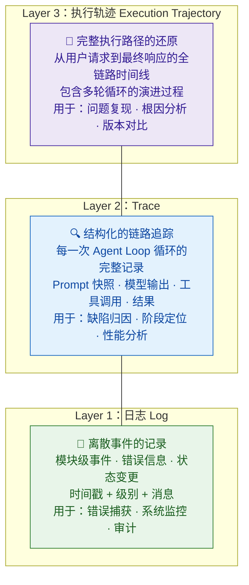
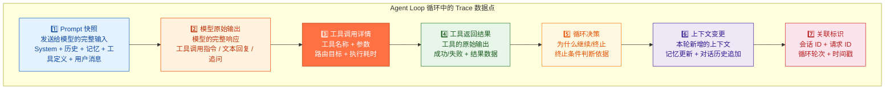
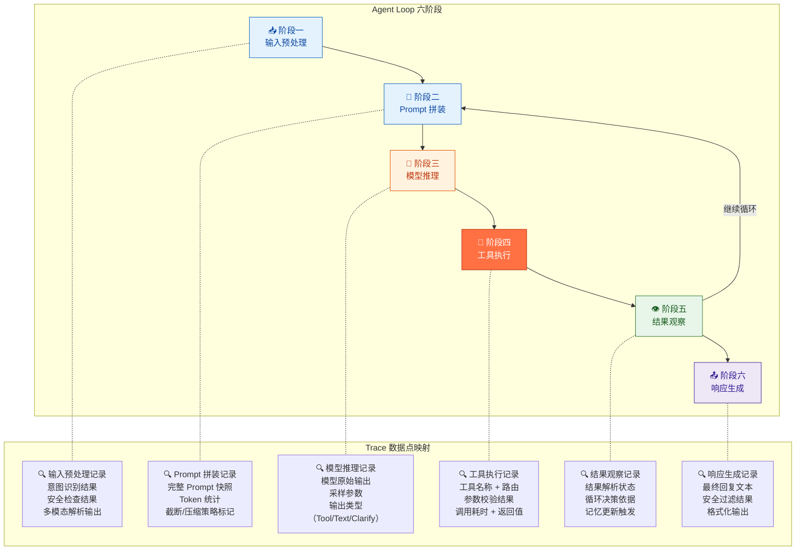
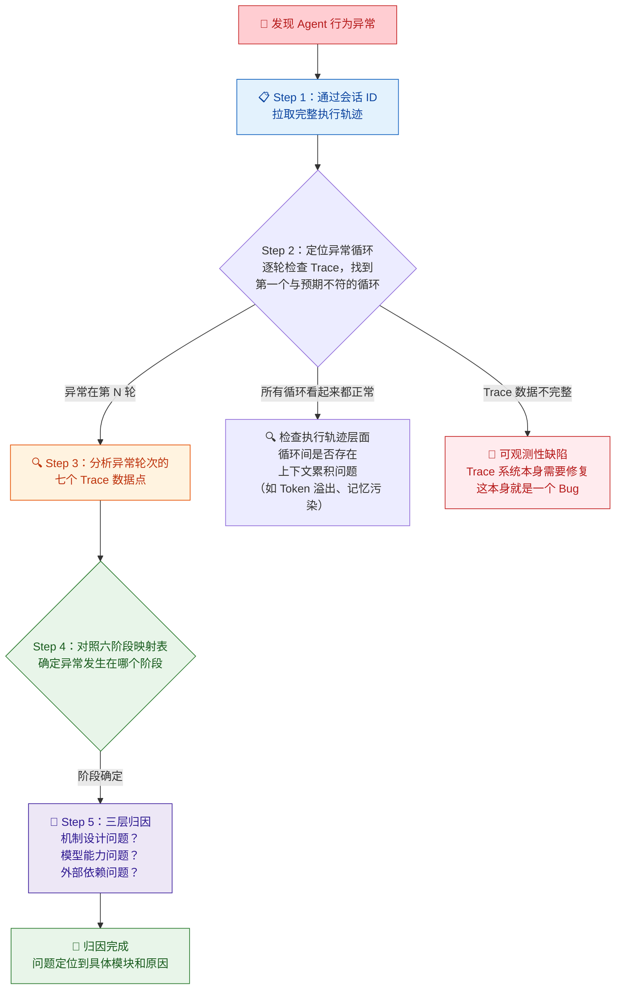

你正在阅读知识库**第二层：Agent 架构与系统链路**的最后一篇文章。在前四篇中，你已经理解了 [Agent Loop 核心工作流](9-agent-loop-he-xin-gong-zuo-liu-cong-yong-hu-qing-qiu-dao-zui-zhong-xiang-ying) 中"思考→行动→观察→再思考"的循环机制，看到了 [ArkClaw / OpenClaw 产品架构](10-arkclaw-openclaw-chan-pin-jia-gou-yu-mo-kuai-chai-jie) 中日志与 Trace 模块作为可观测性基础设施的定位，深入学习了 [会话管理、任务规划与调度机制](11-hui-hua-guan-li-ren-wu-gui-hua-yu-diao-du-ji-zhi) 的状态管理细节，以及 [Skills / 插件体系](12-skills-cha-jian-ti-xi-yu-wai-bu-xi-tong-jie-ru) 的生命周期与外部接入挑战。本文将聚焦于贯穿所有这些模块的**底层基础设施**——日志、Trace 与执行轨迹可观测性。这不是一个独立的功能模块，而是你在后续所有测试工作中最依赖的"眼睛"：没有它，你无法深入任何一个模块的内部行为。

Sources: [readme.md](readme.md#L40-L63), [readme.md](readme.md#L253-L262)

## 为什么 Agent 测试离不开可观测性

在传统软件测试中，输入是确定的、逻辑是固定的、输出是可以精确断言的。你看到 Bug 的表面现象，往往就能直接定位根因。但 **Agent 系统完全不同**——用户发出同一条请求，Agent 内部可能经历完全不同的执行路径：第一轮模型推理选择调用工具 A，第二轮又改主意换成工具 B；同一个 Prompt 在不同采样参数下产生截然不同的规划；工具执行失败后触发了意料之外的重试路径。如果你只能看到最终返回给用户的那句"已帮你查到天气，22°C，晴"，你对中间发生了什么一无所知。

这就是为什么源材料中有一句极为直接的判断：**"Agent 测试不看 Trace，基本测不深。"** 没有可观测性的 Agent 测试，就像在黑暗中调试一个你从未见过的分布式系统——你能观察到"灯没亮"，但永远不知道是开关坏了、电线断了还是停电了。

可观测性对 Agent 测试工程师的价值可以用三层递进关系来概括：**第一层是"看到问题"**——通过 Trace 日志发现 Agent 的中间步骤与预期不符；**第二层是"定位问题"**——通过执行轨迹追踪问题发生在 Agent Loop 的哪个阶段、哪个模块；**第三层是"复现问题"**——通过会话 ID 关联的完整记录，重新还原失败路径。在 [ArkClaw / OpenClaw 产品架构](10-arkclaw-openclaw-chan-pin-jia-gou-yu-mo-kuai-chai-jie) 的模块定位速查法中，每一条归因路径的第一步都是"查看 Trace 日志"——没有可观测性，模块定位就无从谈起。

Sources: [readme.md](readme.md#L253-L262), [readme.md](readme.md#L364-L365)

## 三层可观测体系：日志、Trace 与执行轨迹

在深入 Trace 的具体内容之前，先建立概念清晰度。日志（Log）、Trace 和执行轨迹（Execution Trajectory）在 Agent 系统中构成三个层次递进的可观测体系，它们不是同义词，而是关注不同粒度的观察维度：



| 层次 | 关注粒度 | 核心问题 | 数据结构 | 测试工程师的使用场景 |
|:---|:---|:---|:---|:---|
| **日志（Log）** | 单个事件 | "这个模块在 T 时刻发生了什么事？" | 时间戳 + 级别（INFO/WARN/ERROR）+ 消息 + 模块标识 | 捕获错误堆栈、监控告警触发、审计安全事件 |
| **Trace** | 单次 Agent Loop 循环 | "这一轮循环中，Prompt 是什么、模型输出了什么、工具返回了什么？" | 循环轮次 + Prompt 快照 + 模型原始输出 + 工具调用详情 + 结果 | 缺陷归因的核心依据：精确定位问题发生在六阶段中的哪一步 |
| **执行轨迹** | 完整请求的生命周期 | "从用户发消息到最终响应，Agent 经历了哪些循环？为什么走了这条路？" | 会话 ID + 请求 ID + 有序的 Trace 序列 + 全局上下文快照 | 问题复现（通过会话 ID 还原完整链路）、版本对比（同请求跨版本轨迹差异） |

**一个关键区分**：日志告诉你"发生了什么事件"，Trace 告诉你"这一步做了什么决策"，执行轨迹告诉你"整个故事是怎么展开的"。在 Agent 测试中，你需要**三者联动**——从执行轨迹中发现异常模式，从 Trace 中定位具体的失败步骤，从日志中获取底层的错误细节。

Sources: [readme.md](readme.md#L253-L262), [readme.md](readme.md#L386-L393)

## Trace 的理想模型：一条完整记录应包含什么

理解了三层可观测体系后，接下来聚焦测试工程师使用频率最高的层次——**Trace**。在 [ArkClaw / OpenClaw 产品架构](10-arkclaw-openclaw-chan-pin-jia-gou-yu-mo-kuai-chai-jie) 中，日志与 Trace 模块的描述是："你需要能看到每一次循环中的完整信息：发送给模型的 Prompt 长什么样、模型返回了什么、工具调用了哪个接口、传了什么参数、返回了什么结果、最终为什么决定继续循环还是终止。" 这段描述定义了 Trace 的理想模型。

将这个理想模型映射到 [Agent Loop 六阶段](9-agent-loop-he-xin-gong-zuo-liu-cong-yong-hu-qing-qiu-dao-zui-zhong-xiang-ying)，一条完整的 Trace 记录应该包含以下七个核心数据点：



| 数据点 | 对应 Agent Loop 阶段 | 你用来看什么 | 缺失时的影响 |
|:---|:---|:---|:---|
| **Prompt 快照** | 阶段二：Prompt 拼装 | 验证 System Prompt 是否正确注入、历史对话是否完整、工具定义是否齐全、记忆注入是否冲突、RAG 检索结果是否被包含 | 无法判断模型收到的输入是否正确——可能是模型推理出错，也可能是输入本身就有问题 |
| **模型原始输出** | 阶段三：模型推理 | 验证模型的规划是否合理、工具选择是否正确、参数提取是否完整、是否存在幻觉输出 | 无法区分"模型决策错误"和"后处理逻辑错误" |
| **工具调用详情** | 阶段四：工具执行 | 验证工具路由是否正确、参数是否完整、是否有超时、调用了哪个版本的工具 | 无法判断"工具执行失败"是参数错误还是外部系统问题 |
| **工具返回结果** | 阶段四→阶段五 | 验证工具返回的数据是否被模型正确理解和使用 | 无法判断"Agent 给出了错误结论"是因为工具返回了错误数据，还是模型误读了正确数据 |
| **循环决策** | 阶段五：结果观察 | 理解 Agent 为什么选择继续循环而非终止——是因为还有未完成的步骤，还是陷入了死循环 | 无法诊断"任务执行时间过长"是正常的多步骤处理还是循环控制出了问题 |
| **上下文变更** | 全阶段 | 追踪每轮循环后上下文的增长情况——Token 消耗、对话历史膨胀、记忆更新 | 无法预测和诊断"长对话后性能退化"或"上下文溢出"的问题 |
| **关联标识** | 元数据 | 通过会话 ID 和请求 ID 将多条 Trace 关联为完整的执行轨迹 | 无法将多轮循环的 Trace 串联起来，每轮循环变成孤立的记录，无法还原完整链路 |

Sources: [readme.md](readme.md#L253-L262), [readme.md](readme.md#L386-L393)

### 一个具体例子：一条 Trace 的理想形态

用一个具体的场景来说明。假设用户请求："帮我查明天北京天气，如果下雨就给张三发邮件提醒他带伞。"一个理想的 Trace 系统应该为这条请求记录如下结构化信息（简化示意）：

```
请求 ID: req_abc123
会话 ID: sess_xyz789
用户 ID: user_001
时间戳: 2025-06-15T10:30:00Z

=== 第 1 轮循环 ===
[Prompt 快照] System: "你是助手..." + 历史: (空) + 工具定义: [get_weather, send_email] + 用户: "查明天北京天气..."
[模型输出] Tool Call: get_weather({city: "北京", date: "明天"})
[工具调用] 工具: get_weather, 参数: {city: "北京", date: "2025-06-16"}, 耗时: 1.2s
[工具结果] {temp: "22°C", weather: "晴", rain_prob: "10%"}
[循环决策] 继续循环 — 用户要求"如果下雨则发邮件"，模型需判断是否满足条件
[上下文变更] 追加工具结果到对话历史, 新增 Token: ~150

=== 第 2 轮循环 ===
[Prompt 快照] System + 历史(含第1轮工具结果) + 用户原始消息
[模型输出] Text Response: "明天北京天气晴，22°C，不需要提醒张三带伞。"
[循环决策] 终止 — 模型返回文本回复，不调用工具
[最终响应] "明天北京天气晴，22°C，不需要提醒张三带伞。"

=== 请求结束 ===
总循环次数: 2
总 Token 消耗: 2,450
总耗时: 4.8s
```

这条 Trace 让你能够回答以下任何问题：模型是否正确理解了条件逻辑（"如果下雨"）？天气查询的参数是否正确？模型为什么决定不发邮件？上下文中有多少 Token？如果用户反馈"我要求的是下雨才发邮件但 Agent 发了"，你可以立刻通过 Trace 定位是第 1 轮的工具结果被误读，还是第 2 轮的模型推理出了问题。

Sources: [readme.md](readme.md#L253-L262), [readme.md](readme.md#L44-L50)

## Trace 如何映射到 Agent Loop 六阶段

在 [Agent Loop 核心工作流](9-agent-loop-he-xin-gong-zuo-liu-cong-yong-hu-qing-qiu-dao-zui-zhong-xiang-ying) 中你学习了六阶段模型。现在来看 Trace 数据点如何与这六个阶段精确对齐，这是你做缺陷归因时的核心参考——当你在 Trace 中发现异常数据时，可以直接对应到具体的阶段和模块：



| 阶段 | 应记录的 Trace 数据 | 对应产品模块 | 可回答的核心测试问题 |
|:---|:---|:---|:---|
| **输入预处理** | 用户原始输入、意图识别结果、安全检查是否通过、多模态解析输出 | 输入预处理模块 + 安全模块 | "Agent 为什么没调用工具？"→ 意图被误判为闲聊；"为什么被拒绝？"→ 安全检查触发了拦截 |
| **Prompt 拼装** | 完整 Prompt 快照、各组件 Token 占比、截断/压缩标记、注入的工具定义列表 | Prompt 引擎 + 会话管理 + 记忆模块 | "Agent 为什么忽略了用户第 1 轮的要求？"→ Prompt 被截断导致早期约束丢失 |
| **模型推理** | 模型原始输出、采样参数（Temperature/Top_P）、输出类型、推理耗时 | 大模型推理层 | "Agent 为什么选错了工具？"→ 模型输出与预期不符，检查采样参数或 Prompt 是否引导正确 |
| **工具执行** | 工具名称、参数、路由目标、校验结果、调用耗时、返回值（含错误信息） | 工具路由与执行器 + Skills/插件 | "为什么执行失败了？"→ 参数校验不通过 or 外部 API 超时 or 工具路由错误 |
| **结果观察** | 工具结果的解析状态、循环决策（继续/终止及原因）、记忆更新内容 | Prompt 引擎（上下文写入）+ 记忆模块 | "Agent 为什么发了一封不该发的邮件？"→ 第 2 轮模型误读了第 1 轮工具结果 |
| **响应生成** | 最终回复文本、安全过滤标记、格式化输出 | 输入预处理模块（输出侧）+ 安全模块 | "Agent 总结的信息和工具返回的不一致"→ 响应阶段产生了幻觉 |

Sources: [readme.md](readme.md#L253-L262), [readme.md](readme.md#L386-L393)

## Trace 驱动的缺陷归因工作流

理解了 Trace 应该记录什么之后，接下来看如何在实际测试工作中使用 Trace 进行缺陷归因。以下工作流将 [ArkClaw / OpenClaw 产品架构](10-arkclaw-openclaw-chan-pin-jia-gou-yu-mo-kuai-chai-jie) 中的模块定位速查法、[Agent Loop 核心工作流](9-agent-loop-he-xin-gong-zuo-liu-cong-yong-hu-qing-qiu-dao-zui-zhong-xiang-ying) 中的六阶段归因路线图和本文的 Trace 数据点映射整合为一个系统化的五步归因流程：



### 五步归因的详细操作指南

**Step 1：通过会话 ID 拉取完整执行轨迹。** 源材料明确指出，一条理想的 Trace 应该"能通过会话 ID 关联到完整的执行轨迹"。拿到会话 ID 后，拉取从用户请求到最终响应的所有循环记录。如果系统不支持按会话 ID 检索完整轨迹——这本身就是 [可观测性的缺陷](#可观测性的常见缺陷与测试关注点)。

**Step 2：定位异常循环。** 逐轮阅读 Trace，找到第一个与预期行为不符的循环。关键判断依据：模型是否选择了正确的工具？参数是否正确？工具返回结果是否符合预期？循环决策是否合理？如果所有循环看起来都正常但最终结果仍然错误，问题可能出在循环间的上下文累积（如 [Prompt 截断](9-agent-loop-he-xin-gong-zuo-liu-cong-yong-hu-qing-qiu-dao-zui-zhong-xiang-ying) 或 [记忆污染](7-ji-yi-ji-zhi-duan-qi-ji-yi-chang-qi-ji-yi-yu-shang-xia-wen-guan-li)）。

**Step 3：分析异常轮次的七个 Trace 数据点。** 在定位到具体循环后，按照本文前面定义的七个核心数据点逐一检查：Prompt 快照是否完整？模型输出是否合理？工具调用参数是否正确？返回结果是否准确？循环决策依据是什么？

**Step 4：对照六阶段映射表确定阶段。** 将 Step 3 中发现的异常数据点对应到 Agent Loop 六阶段中的具体阶段，进而映射到 [ArkClaw / OpenClaw 的产品模块](10-arkclaw-openclaw-chan-pin-jia-gou-yu-mo-kuai-chai-jie)。例如：Prompt 快照中缺少工具定义 → 阶段二（Prompt 拼装）→ Prompt 引擎模块。

**Step 5：三层归因。** 确定了阶段和模块后，进一步区分根因的三个层次：**机制设计问题**（代码逻辑缺陷，如 Prompt 拼装时漏掉了某个组件）、**模型能力问题**（模型本身的推理或规划能力不足，如无法正确理解条件逻辑）、**外部依赖问题**（外部 API 返回错误、网络超时等）。这个三层归因的结果直接影响 Bug 应该分配给哪个团队。

| 归因层次 | 判断方法 | 典型结论 | 后续动作 |
|:---|:---|:---|:---|
| **机制设计问题** | Trace 中数据完整但逻辑有缺陷——例如 Prompt 中缺少了应该注入的组件 | "Prompt 引擎在多工具场景下没有注入最新注册的工具定义" | 提 Bug 给工程团队修复代码逻辑 |
| **模型能力问题** | Trace 中输入正确但模型输出不合理——例如 Prompt 中包含了正确工具定义，模型仍然选错了工具 | "模型在两个功能相似的工具之间不稳定地切换" | 调整 Prompt 描述 / 调优采样参数 / 升级模型版本 |
| **外部依赖问题** | Trace 中 Agent 的决策和参数都正确，但外部系统返回了错误或超时 | "天气 API 返回了错误的城市数据" | 联系外部系统提供方 / 增加 fallback 机制 / 加入异常检测 |

Sources: [readme.md](readme.md#L253-L262), [readme.md](readme.md#L386-L393)

## 可观测性的常见缺陷与测试关注点

可观测性本身也需要被测试。源材料在可观测性/Debug 测试部分明确列出了六个关注点：是否有执行轨迹、是否能看到规划步骤、是否能看到工具调用明细、是否能看到 Prompt/Observation/Final Answer、是否能关联日志/Trace/会话 ID、是否能复现失败路径。这些关注点可以被系统化为以下四类可观测性缺陷：

### 缺陷一：数据缺失——Trace 记录不完整

| 缺失类型 | 具体表现 | 对测试的影响 | 严重程度 |
|:---|:---|:---|:---:|
| **Prompt 快照缺失** | Trace 中只记录了"发送了请求"但没有记录发送了什么 | 无法判断模型收到的输入是否正确——缺陷归因的起点就断了 | 🔴 高 |
| **模型原始输出缺失** | 只记录了最终提取的工具名称和参数，没有模型的完整响应 | 无法判断模型是否产生了幻觉或选择了错误的输出格式 | 🔴 高 |
| **工具返回值缺失** | 只记录了"调用了工具"但没有记录返回了什么 | 无法区分"工具返回了错误数据"还是"模型误读了正确数据" | 🔴 高 |
| **循环决策缺失** | 多轮循环中未记录每轮的终止/继续判断依据 | 无法诊断"执行时间过长"是正常的多步处理还是循环控制异常 | 🟡 中 |
| **上下文变更缺失** | 未记录每轮循环后上下文的增长情况 | 无法追踪 Token 消耗、上下文膨胀、截断时机 | 🟡 中 |

### 缺陷二：关联断裂——无法串联完整链路

**关联断裂**是最隐蔽的可观测性缺陷。它不是单条 Trace 数据不完整，而是**多条 Trace 之间无法被正确串联**。具体表现为：同一请求的多轮循环记录散落在不同的日志流中，没有统一的请求 ID 将它们关联起来；会话 ID 在某些模块中没有正确传递，导致同一会话的 Trace 被割裂为多段无法关联的碎片。

| 关联维度 | 期望行为 | 断裂时的表现 | 对缺陷归因的影响 |
|:---|:---|:---|:---|
| **请求 ID 关联** | 同一用户请求的所有循环共享一个请求 ID | 第 1 轮和第 2 轮循环的 Trace 有不同的请求 ID | 无法还原一次完整请求的执行轨迹 |
| **会话 ID 关联** | 所有 Trace 记录都携带正确的会话 ID | 某些模块（如工具执行器）未在日志中写入会话 ID | 无法按会话聚合 Trace，跨会话问题无法追踪 |
| **模块间调用链** | 工具调用 → 工具结果的 Trace 有因果关联 | 工具调用记录和返回值记录在不同的日志流中，无调用 ID 关联 | 无法将"调用了什么"和"返回了什么"匹配起来 |
| **时间线对齐** | 所有模块的 Trace 使用统一时钟 | Prompt 引擎和工具执行器的时钟不同步 | 无法准确判断事件发生的先后顺序 |

### 缺陷三：信息过载——有用信息被淹没

与数据缺失相反的极端是**信息过载**——系统记录了海量的日志，但关键的 Trace 数据被淹没在无关信息中。常见场景：模块级别的 DEBUG 日志开启后产生了 TB 级别的数据，但 Trace 的核心数据点没有结构化索引，查询一次需要遍历整个日志库；Prompt 快照被记录但与普通日志混在一起，没有独立的存储和检索接口。

| 过载类型 | 具体表现 | 对测试效率的影响 | 建议的优化方向 |
|:---|:---|:---|:---|
| **日志级别未分层** | INFO 级别日志中包含了大量模块内部的调试信息 | 关键的 Trace 数据点被数千条无关日志淹没 | 为 Trace 数据点建立独立的存储和检索通道，与普通日志分离 |
| **缺乏结构化索引** | Trace 数据以纯文本形式记录在日志中 | 无法按"工具名称"、"循环轮次"、"终止原因"等维度快速筛选 | 对 Trace 的核心字段（工具名、参数、结果、耗时）建立结构化索引 |
| **Prompt 快照体积过大** | 完整 Prompt 包含数万 Token 的对话历史 | 存储成本高，查询慢，且不易快速定位关键信息 | 对 Prompt 快照做分层存储——摘要（包含各组件 Token 占比）+ 完整快照按需加载 |

### 缺陷四：无法复现——失败路径不可还原

**复现能力**是可观测性的终极价值——当你发现一个 Bug 时，能够通过 Trace 数据完整还原 Agent 的执行路径。但有些 Trace 系统虽然记录了足够的信息，却因为以下原因导致复现失败：

| 不可复现的原因 | 具体表现 | 根因 | 改进方向 |
|:---|:---|:---|:---|
| **采样参数未记录** | Trace 中没有记录本轮推理的 Temperature、Top_P 等参数 | 非确定性系统的输出依赖采样参数，参数缺失则无法还原决策条件 | 在模型推理记录中强制包含完整的采样参数 |
| **模型版本未标记** | Trace 中没有记录调用的模型版本 | 模型升级后行为可能改变，无版本标记则无法判断是 Bug 还是版本差异 | 每条 Trace 必须包含模型版本号 |
| **外部系统状态未快照** | 工具返回了错误结果但未记录当时的外部系统状态 | 工具依赖的外部数据可能随时间变化，无法判断"当时的返回是否合理" | 对关键外部调用的返回值做快照（如 API 响应的完整 JSON） |
| **记忆状态未记录** | Trace 中没有记录注入的记忆内容和版本 | Agent 的行为依赖记忆状态，但记忆在同一会话中可能已发生变化 | 在 Prompt 快照中明确标记"记忆注入"部分的内容和来源 |

Sources: [readme.md](readme.md#L253-L262), [readme.md](readme.md#L386-L393)

## 可观测性的质量评估维度

将上述四类缺陷整合为一张可操作的评估清单。在评估 ArkClaw / OpenClaw 的可观测性质量时，可以按以下六个维度逐项检查：

| 评估维度 | 评估标准 | 检查方法 | 不达标时的风险 |
|:---|:---|:---|:---|
| **Trace 完整性** | 每个 Agent Loop 循环的 Trace 都包含七个核心数据点 | 执行一次多循环任务，检查每轮 Trace 是否包含 Prompt 快照、模型输出、工具调用、工具结果、循环决策、上下文变更、关联标识 | 缺陷归因链条断裂——某些类型的 Bug 永远无法被定位 |
| **Trace 可关联性** | 所有 Trace 都能通过会话 ID + 请求 ID 串联为完整执行轨迹 | 按会话 ID 检索，验证是否能看到从第一条消息到最后一条消息的所有循环 | 无法还原完整链路——只能看到"某一轮出了问题"，但无法理解前后因果关系 |
| **Trace 可检索性** | 支持按工具名称、循环轮次、终止原因、模型版本等维度快速筛选 | 尝试按"工具调用失败"、"循环超过 5 轮"等条件查询 Trace | 测试效率极低——需要人工逐条阅读大量日志才能找到目标记录 |
| **Trace 可复现性** | Trace 中包含足够的上下文（采样参数、模型版本、外部系统快照）来还原执行路径 | 选择一条有 Bug 的 Trace，尝试仅凭 Trace 数据复现问题 | Bug 无法复现——开发无法修复，只能凭描述推测 |
| **日志与 Trace 的联动** | 普通日志中的错误（如异常堆栈）能通过关联 ID 与对应的 Trace 关联 | 在工具执行失败场景中，检查错误日志是否与对应的工具调用 Trace 关联 | 错误堆栈与 Trace 割裂——知道"这一轮出了错"但看不到底层的异常详情 |
| **性能数据的覆盖** | 每轮循环记录了模型推理耗时、工具调用耗时、Prompt 拼装耗时、Token 消耗 | 执行一次完整的任务，检查 Trace 中是否包含各阶段的耗时和 Token 统计 | 无法诊断性能问题——不知道"慢"是模型推理慢、工具执行慢还是网络延迟 |

Sources: [readme.md](readme.md#L253-L262), [readme.md](readme.md#L240-L250)

## 可观测性在不同测试场景中的应用

可观测性不是一种独立的测试类型，而是**贯穿所有测试场景的基础能力**。以下表格展示了 Trace 和执行轨迹在 [Agent 专项测试域](14-neng-li-ce-shi-yan-zheng-agent-hui-bu-hui-zuo) 中的具体应用方式：

| 测试场景 | Trace 的使用方式 | 关键 Trace 数据点 | 你在看什么 |
|:---|:---|:---|:---|
| **[过程测试](16-guo-cheng-ce-shi-yan-zheng-agent-zhong-jian-bu-zou-de-he-li-xing)** | 逐轮检查 Trace，验证每个中间步骤是否合理 | 模型输出 + 工具调用详情 + 循环决策 | Agent 是否走了最优路径？是否有无意义的冗余步骤？ |
| **[任务规划测试](20-ren-wu-gui-hua-ce-shi-chai-jie-pai-xu-hui-tui-yu-dong-tai-diao-zheng)** | 通过 Prompt 快照和模型输出追踪规划过程 | Prompt 快照 + 模型原始输出 + 工具调用序列 | 规划是否完整？步骤顺序是否正确？重规划是否被触发？ |
| **[Tool Calling 测试](21-tool-calling-ce-shi-can-shu-ti-qu-duo-gong-ju-bian-pai-yu-yi-chang-chu-li)** | 对比模型输出的工具调用与实际执行的差异 | 模型输出（工具名+参数）+ 工具调用详情（实际参数） | 参数提取是否完整？路由是否正确？失败后的重试路径是什么？ |
| **[Memory 测试](22-memory-ce-shi-ji-yi-bao-cun-guo-qi-shi-xiao-yu-kua-hui-hua-ge-chi)** | 对比不同循环和不同会话中的记忆注入内容 | Prompt 快照中的记忆注入部分 + 记忆更新记录 | 记忆是否被正确保存？是否有过期信息未清理？跨会话是否串扰？ |
| **[稳定性测试](17-wen-ding-xing-ce-shi-duo-ci-zhi-xing-de-ke-kao-xing-yu-zhi-xing)** | 对比同一请求多次执行的 Trace 差异 | 完整执行轨迹（用于多次执行的 Diff 对比） | 哪些步骤是稳定的？哪些步骤在多次执行中产生了不同的路径？ |
| **[错误处理测试](25-cuo-wu-chu-li-yu-hui-fu-ce-shi-shi-bai-shi-bie-zi-dong-zhong-shi-yu-ti-dai-fang-an)** | 追踪工具失败后的 Agent 行为 | 工具返回结果（含错误信息）+ 后续循环的模型输出 | Agent 是否识别了失败？是否尝试了重试或替代方案？是否隐瞒了失败？ |
| **[性能与成本测试](26-xing-neng-yu-cheng-ben-ce-shi-yan-chi-token-xiao-hao-yu-bing-fa-ping-gu)** | 统计各阶段的耗时和 Token 消耗 | 每轮的推理耗时 + 工具耗时 + Token 统计 | 哪个阶段是性能瓶颈？Token 主要消耗在哪个环节？ |

Sources: [readme.md](readme.md#L253-L262), [readme.md](readme.md#L240-L250)

## 下一步

现在你已经完成了"第二层：Agent 架构与系统链路"的全部学习。从 [Agent Loop 核心工作流](9-agent-loop-he-xin-gong-zuo-liu-cong-yong-hu-qing-qiu-dao-zui-zhong-xiang-ying) 的抽象六阶段模型，到 [ArkClaw / OpenClaw 产品架构](10-arkclaw-openclaw-chan-pin-jia-gou-yu-mo-kuai-chai-jie) 的具体模块拆解，到 [会话管理、任务规划与调度](11-hui-hua-guan-li-ren-wu-gui-hua-yu-diao-du-ji-zhi) 的子系统深入，再到 [Skills / 插件体系](12-skills-cha-jian-ti-xi-yu-wai-bu-xi-tong-jie-ru) 的扩展机制，最后到本文的可观测性基础设施——你已经建立了一套完整的 Agent 系统架构认知。建议你按以下路径继续学习：

1. **进入第三层：AI 测试方法论** — 从 [能力测试：验证 Agent "会不会做"](14-neng-li-ce-shi-yan-zheng-agent-hui-bu-hui-zuo) 开始，将你建立的架构认知转化为具体的测试策略。你将发现，每一类测试都深度依赖本文中的 Trace 数据点。

2. **重点关注 [过程测试：验证 Agent 中间步骤的合理性](16-guo-cheng-ce-shi-yan-zheng-agent-zhong-jian-bu-zou-de-he-li-xing)** — 这是最依赖 Trace 可观测性的测试类型。你将学习如何设计测试用例来验证 Agent Loop 每一步的合理性，而不仅仅是最终结果的正确性。

3. **回顾 [稳定性测试：多次执行的可靠性与一致性](17-wen-ding-xing-ce-shi-duo-ci-zhi-xing-de-ke-kao-xing-yu-zhi-xing)** — 稳定性测试的核心方法是比较同一请求多次执行的 Trace 差异——你在这里学到的执行轨迹 Diff 分析将成为那篇文章的基础工具。