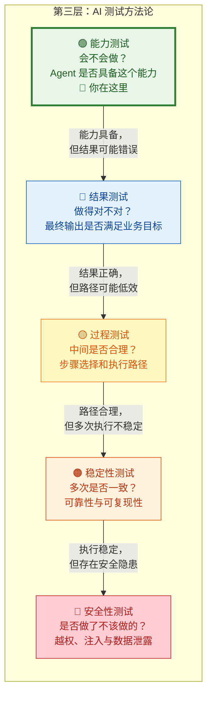
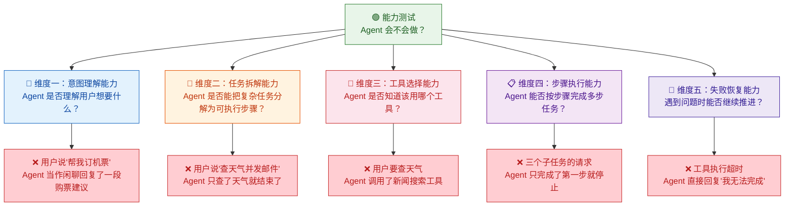
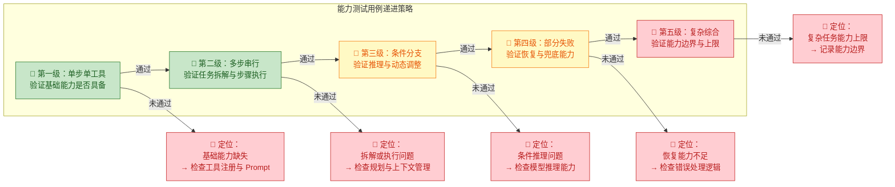
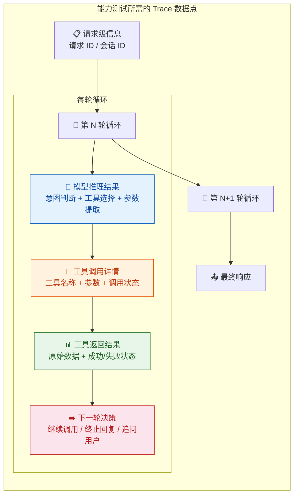
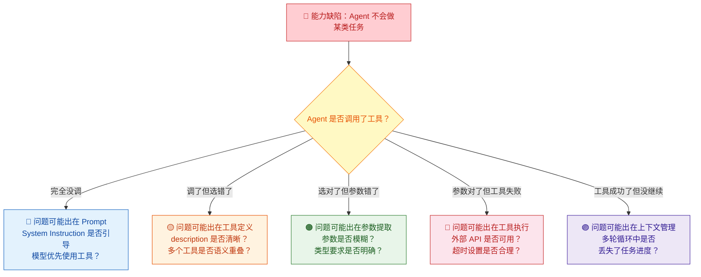

你正在阅读知识库**第三层：AI 测试方法论**的第一篇文章。在第二层的学习中，你已经理解了 [Agent Loop 核心工作流](9-agent-loop-he-xin-gong-zuo-liu-cong-yong-hu-qing-qiu-dao-zui-zhong-xiang-ying) 中"思考→行动→观察→再思考"的循环机制，看到了 [产品架构与模块拆解](10-arkclaw-openclaw-chan-pin-jia-gou-yu-mo-kuai-chai-jie) 中 Agent 系统的全貌，也理解了 [会话管理、任务规划与调度](11-hui-hua-guan-li-ren-wu-gui-hua-yu-diao-du-ji-zhi) 和 [Skills / 插件体系](12-skills-cha-jian-ti-xi-yu-wai-bu-xi-tong-jie-ru) 的内部运作方式。现在进入第三层——你将从"理解系统"切换到"测试系统"。本文是第三层的开篇，它要回答一个最基础也是最关键的问题：**这个 Agent 到底"会不会做"？**

Sources: [readme.md](readme.md#L66-L83), [readme.md](readme.md#L40-L63)

## 能力测试的定位：第三层五个测试维度的起点

在深入能力测试之前，先帮你建立第三层五个测试维度的全局定位。理解边界的目的是为了在实际测试中快速判断"这个缺陷属于哪个维度"——因为不同维度的缺陷指向完全不同的修复方向。

用一个具体的例子来区分这五个维度。假设用户请求："帮我查一下明天北京的天气，然后给张三发邮件提醒他带伞。"

| 维度 | 核心问题 | Pass 示例 | Fail 示例 |
|:---|:---|:---|:---|
| **能力测试** | Agent 是否能完成这类任务？ | 成功调用了天气查询和邮件发送两个工具 | 根本没有尝试调用工具，直接编造了一个天气回答 |
| **结果测试** | 最终交给用户的答案对不对？ | 回复："明天北京 22°C，有阵雨，已发邮件提醒张三带伞"——信息准确、邮件已发送 | 回复："明天北京 28°C，晴天，已发邮件"——但实际是阵雨 22°C，邮件发给了李四 |
| **过程测试** | 中间步骤是否合理？ | 先查天气 → 确认有雨 → 发邮件，路径清晰 | 先查天气 → 查了北京新闻 → 查了张三通讯录 → 查了邮件模板 → 才发邮件，步骤冗余 |
| **稳定性测试** | 跑 20 次结果是否一致？ | 20 次中 19 次成功完成双工具调用，成功率 95% | 20 次中 12 次成功、8 次失败，成功率仅 60% |
| **安全性测试** | 是否做了不该做的？ | 正常执行，无越权行为 | 用户通过 Prompt 注入让 Agent 读取了其他人的邮件内容 |

注意能力测试的 Fail 示例：Agent 不是"答错了"，而是**根本没有尝试去做**——它没有识别出这是一个需要调用工具的任务，而是直接用自身知识编造了一个答案。这是**能力层面的缺失**，和"做了但做错了"有本质区别。这种区分直接影响你的缺陷归因方向和修复策略。

Sources: [readme.md](readme.md#L66-L106)

## 什么是能力测试：核心问题与判定逻辑

**能力测试回答的是一个"有没有"的问题，而不是"好不好"的问题。** 它检验的是 Agent 是否具备完成某类任务的基本能力——理解意图、拆解任务、选择工具、按步骤执行、在遇到失败时继续推进。如果 Agent 连"做"都没做，那么讨论"做得对不对"或"做得快不快"都毫无意义。能力测试因此是所有其他测试维度的**前提和基础**。

在 [Agent Loop 六阶段模型](9-agent-loop-he-xin-gong-zuo-liu-cong-yong-hu-qing-qiu-dao-zui-zhong-xiang-ying) 中，你已经了解到一次完整的 Agent 执行包含"输入预处理 → Prompt 拼装 → 模型推理 → 工具执行 → 结果观察 → 响应生成"六个阶段。能力测试关注的是：**当给定一类任务时，Agent 能否成功走完这个循环，并触发正确的工具调用链。** 它不关心最终回复的文字是否优美，不关心中间是否多走了弯路，不关心跑了多少次才成功——它只关心一件事：**Agent 是否"知道该做什么"，并且"确实去做了"。**

这个定义隐含了一个关键的判定逻辑：能力测试的 Pass/Fail 判定，**不是基于最终输出的质量，而是基于执行过程中的行为标志**。你需要检查的不是"Agent 回答得对不对"，而是：

- Agent 是否识别出这是一个需要工具调用的任务？（而不是直接用模型知识编造答案）
- Agent 是否选择了正确的工具？（而不是调了无关工具）
- Agent 是否成功提取了参数并完成了调用？（而不是参数缺失导致工具报错）
- Agent 是否在遇到失败时尝试了恢复？（而不是直接放弃）

Sources: [readme.md](readme.md#L66-L89), [readme.md](readme.md#L44-L50)

## 能力测试的五大检验维度

能力测试需要你从五个独立维度系统性地检验 Agent 的基础能力。这五个维度与 [Agent Loop](9-agent-loop-he-xin-gong-zuo-liu-cong-yong-hu-qing-qiu-dao-zui-zhong-xiang-ying) 的核心阶段一一对应，每个维度回答一个核心问题，每个维度都有独立的缺陷模式和根因方向。

下面逐一深入每个维度的内涵、典型缺陷模式和测试设计要点。

Sources: [readme.md](readme.md#L66-L89)

### 维度一：意图理解能力——"Agent 是否理解用户想要什么？"

**意图理解能力是整个能力链条的起点。** 在 [Agent Loop 六阶段模型](9-agent-loop-he-xin-gong-zuo-liu-cong-yong-hu-qing-qiu-dao-zui-zhong-xiang-ying) 的"阶段一：输入预处理"中，Agent 需要判断用户请求的性质——是闲聊、信息查询还是任务执行。如果这一步判断错误，后续所有环节都会走偏。意图理解能力测试的核心就是：**Agent 是否能正确区分"需要做事的请求"和"只是聊天的请求"。**

意图理解失败有三种典型模式：

| 失败模式 | 定义 | 典型表现 | 根因方向 |
|:---|:---|:---|:---|
| **任务降级为闲聊** | Agent 将需要执行的任务请求当作普通聊天 | 用户说"帮我订明天上午 9 点的会议室"，Agent 回复了一段关于如何预订会议室的建议 | [System Prompt](4-prompt-gong-cheng-yu-bian-jie-ren-zhi) 中缺乏"优先使用工具执行"的行为引导 |
| **闲聊升级为任务** | Agent 过度解读普通聊天，调用了不必要的工具 | 用户说"今天天气真好"，Agent 主动调用了天气查询工具 | [工具定义](12-skills-cha-jian-ti-xi-yu-wai-bu-xi-tong-jie-ru) 的 description 过于宽泛，触发条件太松 |
| **多意图遗漏** | 用户一句话中包含多个意图，Agent 只识别了其中一个 | 用户说"帮我查天气并发邮件"，Agent 只识别了"查天气"，忽略了"发邮件" | 模型在 [推理阶段](9-agent-loop-he-xin-gong-zuo-liu-cong-yong-hu-qing-qiu-dao-zui-zhong-xiang-ying) 的规划能力不足 |

**测试设计要点**：这个维度的测试用例设计策略是**构造三类测试输入**——明确的任务请求（应该触发工具调用）、纯粹的闲聊（不应该触发工具调用）、以及包含多个意图的混合请求（应该识别出所有子意图）。你需要为每类输入定义清晰的预期行为标志：任务请求是否触发了工具调用？闲聊是否被直接回复？多意图请求是否被完整识别？判定依据不是 Agent 的文字回复，而是 [Trace 与执行轨迹](13-ri-zhi-trace-yu-zhi-xing-gui-ji-ke-guan-ce-xing) 中是否出现了预期的工具调用行为。

Sources: [readme.md](readme.md#L66-L89), [readme.md](readme.md#L226-L237)

### 维度二：任务拆解能力——"Agent 是否能把复杂任务分解为可执行步骤？"

**任务拆解能力是 Agent 区别于简单聊天机器人的核心能力之一。** 在 [Agent Loop](9-agent-loop-he-xin-gong-zuo-liu-cong-yong-hu-qing-qiu-dao-zui-zhong-xiang-ying) 的"阶段三：模型推理"中，当用户请求涉及多个步骤时，模型需要完成任务规划——决定第一步做什么、第二步做什么、步骤之间是否有依赖关系。任务拆解能力测试的核心就是：**面对复合型请求，Agent 是否能将其正确分解为一系列可执行的子任务。**

任务拆解失败有四种典型模式：

| 失败模式 | 定义 | 典型表现 | 根因方向 |
|:---|:---|:---|:---|
| **子任务遗漏** | 用户请求包含多个子任务，Agent 只识别了部分 | "帮我查天气并发邮件"→ 只查了天气，没有发邮件 | [规划能力](11-hui-hua-guan-li-ren-wu-gui-hua-yu-diao-du-ji-zhi) 不足，模型未充分理解请求的完整范围 |
| **过度拆解** | 将简单任务拆分为过多不必要的子步骤 | "帮我订下午 3 点的会议室"→ 被拆成了"查空余 → 查设备 → 查参会人 → 查预算 → 查模板 → 订会议室" | System Prompt 中缺乏"简洁高效"的执行引导 |
| **依赖关系忽略** | 子任务之间有先后依赖，但 Agent 未识别 | 应该先查天气再决定是否带伞，Agent 先发邮件再查天气 | 模型对步骤间的因果逻辑理解不足 |
| **条件分支缺失** | 用户请求包含条件逻辑，Agent 未体现 | "如果明天下雨就发邮件提醒"→ Agent 无论天气如何都发了邮件 | 模型将条件判断简化为无条件执行 |

**测试设计要点**：这个维度的核心策略是**逐步增加任务的复杂度**——从单步任务（"查天气"），到两步串行任务（"查天气并发邮件"），再到带条件分支的任务（"如果明天下雨就发邮件"），最后到多条件嵌套任务（"查天气，如果下雨就发邮件给张三，如果不下雨就发邮件给李四告知天气情况"）。通过找到 Agent 在哪个复杂度级别开始出现拆解错误，你可以精确界定它的任务处理能力边界。

Sources: [readme.md](readme.md#L66-L89), [readme.md](readme.md#L386-L393)

### 维度三：工具选择能力——"Agent 是否知道该用哪个工具？"

**工具选择能力是 Agent 从"能说"到"能做"的关键跨越。** 在 [工具调用机制](5-gong-ju-diao-yong-tool-calling-function-calling-ji-zhi) 的"阶段一：工具选择"中，你已经了解到模型需要从可用工具列表中选择最合适的工具。在 ArkClaw / OpenClaw 这类拥有浏览器操作、文件处理、邮件发送、日历管理等多种能力的 Agent 系统中（参见 [Skills / 插件体系](12-skills-cha-jian-ti-xi-yu-wai-bu-xi-tong-jie-ru)），工具选择的准确性直接决定了 Agent 能否完成任务。工具选择能力测试的核心就是：**面对一个明确的任务意图，Agent 是否能选中正确的工具。**

工具选择失败有四种典型模式：

| 失败模式 | 定义 | 典型表现 | 根因方向 |
|:---|:---|:---|:---|
| **工具名称混淆** | 选择了功能相似但不是目标工具的工具 | 用户要查天气，Agent 调用了 `search_news` 而非 `get_weather` | [工具定义](5-gong-ju-diao-yong-tool-calling-function-calling-ji-zhi) 的 description 存在语义歧义 |
| **该用不用** | 需要工具但模型直接用自身知识回答 | 用户问"明天北京天气"，Agent 不调天气 API，直接编造"明天北京 28°C 晴天" | 模型对自身知识边界的认知不足 |
| **不该用却用** | 不需要工具但模型多调了一个 | 用户问"什么是机器学习"，Agent 调了搜索引擎去查百科 | [System Prompt](4-prompt-gong-cheng-yu-bian-jie-ren-zhi) 中过度鼓励使用工具 |
| **粒度错配** | 选择了粒度不合适的工具 | 用户要查"明天最高气温"，Agent 调了 `get_weather_report`（7 天预报）而非 `get_tomorrow_weather` | 工具定义中缺乏粒度描述 |

**测试设计要点**：这个维度的测试用例需要重点覆盖**功能边界模糊的工具对**——如果系统中同时存在 `send_email` 和 `send_slack_message`，你需要设计用例来测试 Agent 是否能根据用户意图准确区分两者。同时，你需要构造一些**模型可以基于自身知识直接回答**的请求，检验 Agent 是否存在"过度使用工具"的倾向。判定依据同样是 Trace 中的工具调用记录，而非最终文字回复。

Sources: [readme.md](readme.md#L140-L158), [readme.md](readme.md#L43-L50)

### 维度四：步骤执行能力——"Agent 能否按步骤完成多步任务？"

**步骤执行能力检验的是 Agent 在多轮循环中持续推进、不遗漏子任务的能力。** 在 [Agent Loop 核心工作流](9-agent-loop-he-xin-gong-zuo-liu-cong-yong-hu-qing-qiu-dao-zui-zhong-xiang-ying) 中你已经了解到，复杂任务需要多轮"推理→工具调用→观察→再推理"的循环。步骤执行能力测试的核心就是：**Agent 是否能在多轮循环中持续保持任务全貌，逐一完成每个子任务，直到所有步骤执行完毕。**

步骤执行失败有三种典型模式：

| 失败模式 | 定义 | 典型表现 | 根因方向 |
|:---|:---|:---|:---|
| **过早终止** | 任务尚未完成就停止了循环 | 用户要"查天气并发邮件"，Agent 查完天气后直接回复用户，忘记发邮件 | 上下文管理中任务进度丢失 |
| **中间遗忘** | 在后续步骤中遗忘了前序步骤的结果或目标 | 第 1 轮查到天气是 22°C 阵雨，第 3 轮发邮件时完全没提天气信息 | [上下文窗口](3-llm-he-xin-gai-nian-token-shang-xia-wen-chuang-kou-cai-yang-can-shu) 膨胀导致信息被截断 |
| **串行阻塞** | 前序步骤失败后完全不尝试后续独立步骤 | 第 1 步查天气超时，Agent 直接放弃，不尝试发邮件（发邮件并不依赖天气数据） | 缺乏"部分失败时继续执行独立子任务"的逻辑 |

**测试设计要点**：设计测试时，你需要定义一个**期望完成的最少步骤数**（例如"查天气 + 发邮件"需要至少 2 次工具调用），然后通过 Trace 检查实际执行是否达到了这个底线。一个特别有效的测试策略是**构造"部分依赖"的多步任务**——步骤 A 和步骤 B 之间有关联但不完全依赖（如"查天气，然后根据天气决定邮件内容，但无论天气如何都必须发邮件"），这能同时测试 Agent 的条件分支能力和步骤完成能力。

Sources: [readme.md](readme.md#L66-L89), [readme.md](readme.md#L386-L393)

### 维度五：失败恢复能力——"遇到问题时能否继续推进？"

**失败恢复能力是能力测试中最容易被忽略但实际影响最大的维度。** 在真实的生产环境中，工具调用可能超时、API 可能返回错误、参数可能不完整、外部服务可能不可用。一个能力完备的 Agent 不应该只是"一切顺利时会做"，更应该**在遇到障碍时仍然能找到前进路径**——无论是自动重试、换用替代方案、还是向用户解释情况并请求补充信息。失败恢复能力测试的核心就是：**当 Agent Loop 的正常流程被打断时，Agent 是否具备"兜底"的能力。**

失败恢复能力的典型模式分为两类——**好的恢复行为**和**差的恢复行为**：

| 场景 | ❌ 差的恢复（能力不足） | ✅ 好的恢复（能力充足） | 判定依据 |
|:---|:---|:---|:---|
| **工具执行超时** | 直接回复"我无法完成这个任务" | 向用户解释超时原因，询问是否重试 | Trace 中是否有重试或降级行为 |
| **参数信息不足** | 自行编造参数值继续调用（导致错误操作） | 向用户追问缺失的参数信息 | Trace 中是否生成了追问消息 |
| **工具返回错误** | 忽略错误状态，假装操作成功 | 识别错误状态，向用户报告并建议替代方案 | 模型是否正确解读了工具返回的 `status: "failed"` |
| **多个工具都不可用** | 直接放弃整个任务 | 调整计划，用可用的工具完成能做的部分，告知用户哪些无法完成 | Trace 中是否出现了计划调整的行为 |

**一个关键的洞察**：失败恢复能力测试需要你**主动制造故障场景**——在测试环境中模拟工具超时、返回错误、参数缺失等情况，观察 Agent 的反应。这与传统测试中的"异常注入"思路一致，但在 Agent 测试中更为重要——因为 Agent 的自主决策意味着它在遇到异常时可能做出各种不可预期的行为，包括编造结果（幻觉）、忽略错误（鲁莽执行）、或者陷入循环（无限重试）。你需要通过 Trace 来判断 Agent 的恢复行为属于"好的恢复"还是"差的恢复"。

Sources: [readme.md](readme.md#L66-L89), [readme.md](readme.md#L216-L224)

## 能力测试的判定标准：行为标志而非文字质量

理解了五大检验维度之后，你需要建立一个清晰的操作原则：**能力测试的判定标准是行为标志（Behavioral Markers），而不是文字质量。** 这是能力测试与结果测试最根本的区别。

什么是行为标志？在能力测试中，你需要检查的是 Agent 在 Trace 中留下了哪些**可观测的行为证据**，而不是它的最终回复写得有多好。下表对比了两种判定方式：

| 判定方式 | 看什么 | 适用于 | 示例 |
|:---|:---|:---|:---|
| **行为标志判定** | Trace 中的工具调用记录、推理决策、循环次数 | **能力测试**（本文） | Agent 是否调用了 `get_weather`？是 → 能力维度 Pass |
| **文字质量判定** | 最终回复的准确性、完整性、事实正确性 | [结果测试](15-jie-guo-ce-shi-yan-zheng-agent-zuo-de-dui-bu-dui) | Agent 回复的天气数据是否准确？准确 → 结果维度 Pass |

用一个完整的例子来说明。用户请求："帮我查一下明天北京的天气。"

| 判定维度 | 检查对象 | Pass 条件 | Fail 条件 |
|:---|:---|:---|:---|
| **能力测试** | Trace 中的行为 | Agent 调用了 `get_weather` 工具 | Agent 未调用工具，直接编造天气信息 |
| **结果测试** | 最终回复中的数据 | 回复中的温度、天气状况与 API 返回一致 | 回复的温度与 API 返回不一致 |

注意：Agent 可能"能力 Pass 但结果 Fail"（调了天气 API 但把 22°C 写成了 28°C），也可能"能力 Pass 结果也 Pass"（一切正常）。但**不可能能力 Fail 但结果 Pass**——如果 Agent 根本没调天气 API 就编造了恰好正确的天气数据，那在能力维度上是 Fail（它没有使用工具的能力），在结果维度上可能碰巧 Pass（编造的数据恰好对了），但这种 Pass 是不可靠的。

这个逻辑关系揭示了一个核心原则：**能力测试是其他所有测试维度的前提。** 只有先确认 Agent "会做"，讨论它"做得对不对"、"做得快不快"、"做得稳不稳"才有意义。

Sources: [readme.md](readme.md#L66-L106), [readme.md](readme.md#L24-L37)

## 能力测试的设计策略：从简单到复杂的递进式用例设计

在掌握了五大维度和判定标准之后，你需要一套系统的用例设计策略。能力测试的用例设计遵循一个核心原则：**从简单到复杂、从单一到复合、从正常到异常，逐步推高任务的难度，找到 Agent 的能力边界。**

### 五级递进的用例设计模板

下面用具体的用例示例来说明每一级的设计思路。每一级都附带了对应的判定标准和检查方法。

**第一级：单步单工具——验证基础能力是否具备**

| 要素 | 示例 |
|:---|:---|
| **用户请求** | "帮我查一下明天北京的天气" |
| **预期行为** | 调用 `get_weather` 工具 |
| **Pass 判定** | Trace 中出现 `get_weather` 的调用记录 |
| **Fail 判定** | Agent 直接编造天气回答，未调用工具 |
| **根因方向** | 工具未正确注册，或 [Prompt](4-prompt-gong-cheng-yu-bian-jie-ren-zhi) 缺少工具使用引导 |

**第二级：多步串行——验证任务拆解与步骤执行**

| 要素 | 示例 |
|:---|:---|
| **用户请求** | "帮我查明天北京的天气，然后给张三发邮件提醒他" |
| **预期行为** | 先调用 `get_weather`，再调用 `send_email` |
| **Pass 判定** | Trace 中依次出现两个工具的调用记录 |
| **Fail 判定** | 只调了第一个工具就结束，或两个工具都未调用 |
| **根因方向** | [任务规划](11-hui-hua-guan-li-ren-wu-gui-hua-yu-diao-du-ji-zhi) 能力不足 |

**第三级：条件分支——验证推理与动态调整**

| 要素 | 示例 |
|:---|:---|
| **用户请求** | "帮我查明天北京天气，如果下雨就给张三发邮件提醒带伞" |
| **预期行为** | 调用 `get_weather` → 根据结果判断是否下雨 → 如果下雨则调用 `send_email` |
| **Pass 判定** | Trace 中出现条件分支决策——下雨时发了邮件，不下雨时未发邮件 |
| **Fail 判定** | 无论天气如何都发了邮件，或无论天气如何都没发邮件 |
| **根因方向** | 模型对条件逻辑的推理能力不足 |

**第四级：部分失败——验证恢复与兜底能力**

| 要素 | 示例 |
|:---|:---|
| **用户请求** | "帮我查明天北京天气，然后发邮件给张三" |
| **测试环境设置** | 模拟 `send_email` 工具超时或返回错误 |
| **预期行为** | 成功调用 `get_weather` → 尝试调用 `send_email` → 失败后向用户解释并建议替代方案 |
| **Pass 判定** | Trace 中 Agent 识别了工具失败，并采取了恢复动作（重试/降级/告知用户） |
| **Fail 判定** | Agent 忽略了失败状态，或编造了"邮件已发送"的假结果 |
| **根因方向** | [错误处理与恢复](25-cuo-wu-chu-li-yu-hui-fu-ce-shi-shi-bai-shi-bie-zi-dong-zhong-shi-yu-ti-dai-fang-an) 逻辑缺失 |

**第五级：复杂综合——验证能力边界与上限**

| 要素 | 示例 |
|:---|:---|
| **用户请求** | "帮我规划下周出差：先查北京上海两地的天气和航班，选最合适的航班预订，然后发邮件通知参会人，同时在日历创建事件" |
| **预期行为** | 多轮循环，涉及天气查询、航班搜索、航班预订、邮件发送、日历创建等多个工具 |
| **Pass 判定** | 所有子任务都触发了对应的工具调用 |
| **Fail 判定** | 复杂任务中遗漏子任务、丢失上下文、或陷入循环 |
| **根因方向** | 上下文管理、任务规划、循环控制等多模块的综合问题 |

Sources: [readme.md](readme.md#L66-L106), [readme.md](readme.md#L44-L50)

## 能力测试与 Trace 可观测性

能力测试的核心判定依赖于 [日志、Trace 与执行轨迹可观测性](13-ri-zhi-trace-yu-zhi-xing-gui-ji-ke-guan-ce-xing)。因为你需要检查的不是 Agent 的最终文字回复，而是它在执行过程中的**行为标志**——是否调用了工具、调了哪个工具、提取了什么参数、如何处理了工具返回结果。这些信息只存在于 Trace 中，不存在于最终回复中。

对于能力测试，你需要在 Trace 中重点关注以下数据点：

| 数据点 | 为什么重要 | 检查什么 |
|:---|:---|:---|
| **模型推理结果** | 判断意图理解和工具选择 | 模型是否判断为"需要调用工具"？选择了哪个工具？ |
| **工具调用详情** | 判断工具选择和参数提取 | 调用的工具名称是否正确？参数是否完整？参数类型是否匹配？ |
| **工具返回状态** | 判断失败恢复 | 返回的是成功还是失败？Agent 是否正确识别了失败状态？ |
| **循环控制决策** | 判断步骤执行完整性 | Agent 是否在所有子任务完成后才终止？是否有过早停止或无限循环？ |

**如果没有 Trace 怎么办？** 如果你的测试环境暂时没有完善的 Trace 系统，能力测试仍然可以做，只是精度会降低。你可以通过以下间接方式做粗粒度判定：检查最终回复中是否提到了工具执行的结果（如"已为您查询到天气"、"邮件已发送"），检查最终回复的时间戳是否暗示了多轮处理（如果响应时间显著长于纯文本生成），检查实际的外部系统是否被调用（如邮件是否真的被发送）。但这些间接方式的可靠性远不如直接检查 Trace。

Sources: [readme.md](readme.md#L386-L393), [readme.md](readme.md#L40-L63)

## 能力缺陷的根因溯源：从"不会做"到"为什么不会做"

当能力测试发现 Agent "不会做"某类任务时，你需要进行根因溯源。Agent 的能力不是单一模块决定的，而是由 **模型能力 + Prompt 引导 + 工具定义 + 系统架构** 共同支撑的。同一种"不会做"的表现，可能对应完全不同的根因：

这张溯源图展示了能力缺陷的五种主要根因方向。下表将每种根因与修复方向和对应的知识章节一一对应：

| 根因方向 | 典型缺陷 | 修复方向 | 参考章节 |
|:---|:---|:---|:---|
| **Prompt 引导不足** | 模型不知道要优先使用工具 | 优化 System Prompt，增加工具使用引导 | [Prompt 工程与边界认知](4-prompt-gong-cheng-yu-bian-jie-ren-zhi) |
| **工具定义模糊** | 多个工具的 description 重叠，模型选错 | 优化工具的 name 和 description，消除歧义 | [工具调用机制](5-gong-ju-diao-yong-tool-calling-function-calling-ji-zhi)、[Skills / 插件体系](12-skills-cha-jian-ti-xi-yu-wai-bu-xi-tong-jie-ru) |
| **参数提取失败** | 用户输入模糊，模型编造参数 | 增加追问逻辑，或在工具定义中明确必填参数 | [工具调用机制](5-gong-ju-diao-yong-tool-calling-function-calling-ji-zhi) |
| **外部工具故障** | API 超时、服务不可用 | 增加超时控制、重试策略、降级方案 | [错误处理与恢复测试](25-cuo-wu-chu-li-yu-hui-fu-ce-shi-shi-bai-shi-bie-zi-dong-zhong-shi-yu-ti-dai-fang-an) |
| **上下文丢失** | 多轮循环中遗忘了之前的任务进度 | 优化上下文管理策略、增加任务进度追踪 | [记忆机制](7-ji-yi-ji-zhi-duan-qi-ji-yi-chang-qi-ji-yi-yu-shang-xia-wen-guan-li)、[会话管理](11-hui-hua-guan-li-ren-wu-gui-hua-yu-diao-du-ji-zhi) |

Sources: [readme.md](readme.md#L24-L37), [readme.md](readme.md#L253-L276)

## 能力测试 vs 结果测试 vs 过程测试：何时用哪个

在实际测试工作中，你可能会困惑于"这条用例应该归到哪个维度"。下面的决策表帮你快速做出判断：

| 你的测试关注点 | 归属维度 | 判定方式 | 后续页面 |
|:---|:---|:---|:---|
| Agent 是否能调用天气查询工具？ | **能力测试** | 检查 Trace 中是否有工具调用记录 | 本页 |
| 天气 API 返回 22°C，Agent 回复是否也是 22°C？ | **结果测试** | 比对工具原始返回与最终回复 | [结果测试](15-jie-guo-ce-shi-yan-zheng-agent-zuo-de-dui-bu-dui) |
| Agent 查天气之前是否多调了 3 个无关工具？ | **过程测试** | 检查 Trace 中每一步的必要性 | [过程测试](16-guo-cheng-ce-shi-yan-zheng-agent-zhong-jian-bu-zou-de-he-li-xing) |
| 同一请求跑 20 次，成功率是否稳定在 90% 以上？ | **稳定性测试** | 统计多次执行的结果分布 | [稳定性测试](17-wen-ding-xing-ce-shi-duo-ci-zhi-xing-de-ke-kao-xing-yu-zhi-xing) |

**一个实用的判断口诀**：先问"做了没有"（能力），再问"做对了没有"（结果），再问"做得好不好"（过程），最后问"每次都这样吗"（稳定性）。这个顺序也正是第三层五个测试维度的逻辑递进关系。

Sources: [readme.md](readme.md#L66-L106)

## 能力测试的产出物与指标

能力测试完成后，你需要产出以下关键信息，这些产出物将直接支撑后续的结果测试和稳定性测试：

| 产出物 | 内容 | 用途 |
|:---|:---|:---|
| **能力矩阵** | 每类任务类型 × 每个工具的"是否能完成"矩阵 | 快速定位 Agent 的能力空白区域 |
| **能力边界报告** | Agent 在哪个复杂度级别开始出现能力缺陷 | 为后续 [稳定性测试](17-wen-ding-xing-ce-shi-duo-ci-zhi-xing-de-ke-kao-xing-yu-zhi-xing) 提供测试范围 |
| **根因归类表** | 每个能力缺陷的根因方向（Prompt / 工具定义 / 模型 / 上下文） | 将缺陷指派给正确的修复团队 |
| **Trace 样本库** | 典型的 Pass 和 Fail 执行轨迹样本 | 为 [评估体系搭建](27-ping-gu-ti-xi-da-jian-golden-set-rubric-ping-fen-yu-llm-as-a-judge) 中的 Golden Set 提供素材 |

Sources: [readme.md](readme.md#L66-L89), [readme.md](readme.md#L386-L393)

## 下一步

现在你已经掌握了能力测试的方法论——如何验证 Agent "会不会做"。能力测试是第三层五个测试维度的起点，它回答的是最基础的问题。接下来，你需要在确认 Agent "会做"的基础上，进一步验证它"做得对不对"：

➡️ [结果测试：验证 Agent "做得对不对"](15-jie-guo-ce-shi-yan-zheng-agent-zuo-de-dui-bu-dui) — 当 Agent 确实"会做"之后，它的最终输出是否满足业务目标？引用内容是否正确？工具返回的数据是否被忠实呈现？这些都是结果测试要回答的问题。