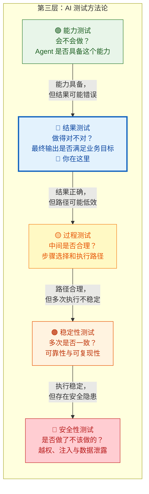
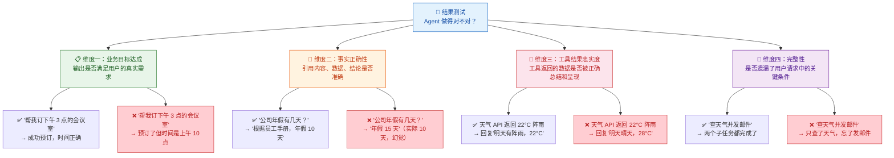
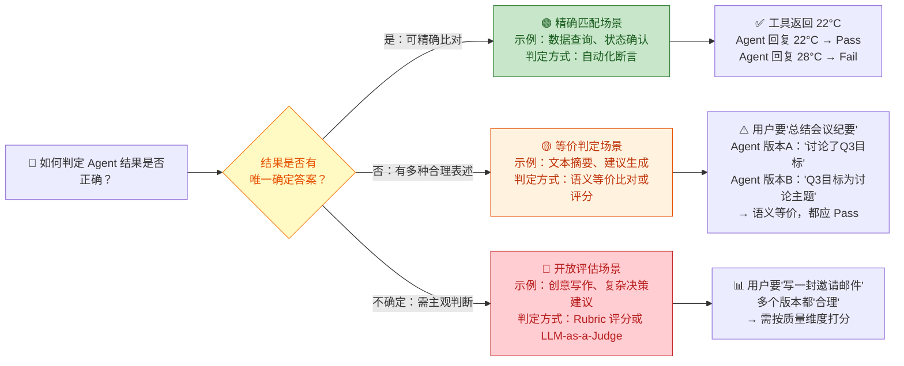
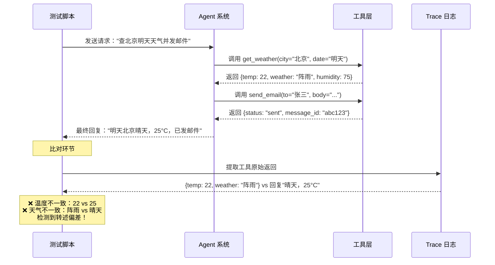
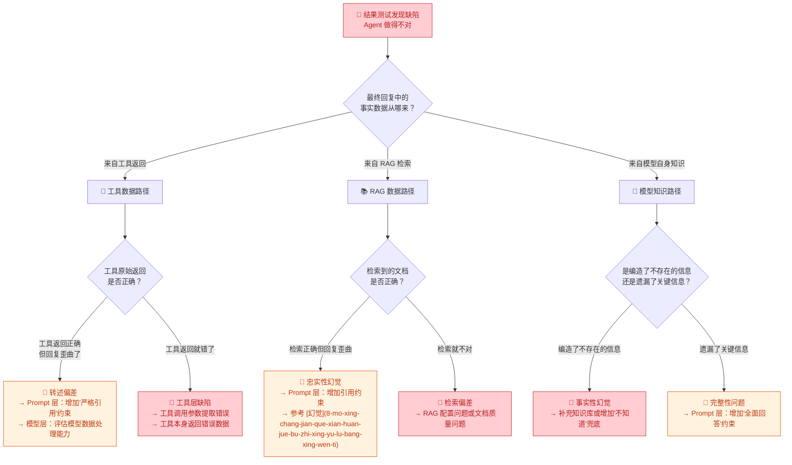

你正在阅读知识库**第三层：AI 测试方法论**的第二篇文章。在上一篇 [能力测试：验证 Agent "会不会做"](14-neng-li-ce-shi-yan-zheng-agent-hui-bu-hui-zuo) 中，你学会了验证 Agent 是否具备完成某类任务的能力——它能不能理解意图、能不能选择正确的工具、能不能按步骤推进。但"会做"和"做得对"是两个截然不同的判断维度。**结果测试关注的是：Agent 确实完成了任务，但最终交给用户的那个结果，是否真正满足了业务目标？** 它回答的是一个看似简单实则极难的问题——"Agent 做完了，但做得对吗？"

Sources: [readme.md](readme.md#L66-L83)

## 能力测试 vs 结果测试 vs 过程测试：三个维度的分界

在深入结果测试之前，先用一张图帮你厘清第三层五个测试维度之间的边界。很多测试工程师在刚接触 AI 测试时，会混淆"能力不足"和"结果错误"——实际上它们的根因和修复方向完全不同：

用一个具体的例子来区分这三个维度。假设用户请求："帮我查一下明天北京的天气，然后给张三发邮件提醒他带伞。" 在 [Agent Loop 核心工作流](9-agent-loop-he-xin-gong-zuo-liu-cong-yong-hu-qing-qiu-dao-zui-zhong-xiang-ying) 中你已经了解了这类多步骤任务的执行链路。现在看三个维度如何分别评判：

| 维度 | 核心问题 | Pass 示例 | Fail 示例 |
|:---|:---|:---|:---|
| **能力测试** | Agent 是否能完成这类任务？ | 成功调用了天气查询和邮件发送两个工具 | 根本没有尝试调用工具，直接编造了一个天气回答 |
| **结果测试** | 最终交给用户的答案对不对？ | 回复："明天北京 22°C，有阵雨，已发邮件提醒张三带伞"——信息准确、邮件已发送 | 回复："明天北京 28°C，晴天，已发邮件"——但实际是阵雨 22°C，邮件发给了李四 |
| **过程测试** | 中间步骤是否合理？ | 先查天气 → 确认有雨 → 发邮件，路径清晰 | 先查天气 → 查了北京新闻 → 查了张三的通讯录 → 查了邮件模板 → 才发邮件，步骤冗余 |

注意结果测试的 Fail 示例：Agent 确实"做了"（能力通过），但最终结果中天气数据错误、收件人错误——这是**结果层面的缺陷**，不是能力问题。这个区分直接影响你的缺陷归因方向：能力缺陷指向 [Prompt 工程](4-prompt-gong-cheng-yu-bian-jie-ren-zhi) 或模型选型，而结果缺陷可能指向 [工具调用](5-gong-ju-diao-yong-tool-calling-function-calling-ji-zhi) 的参数提取环节、[RAG](6-rag-jian-suo-zeng-qiang-yu-zhi-shi-ku-wen-da-yuan-li) 的检索质量、或者 [记忆机制](7-ji-yi-ji-zhi-duan-qi-ji-yi-chang-qi-ji-yi-yu-shang-xia-wen-guan-li) 中的信息偏差。

Sources: [readme.md](readme.md#L66-L106)

## 结果测试的四大检验维度

结果测试不是简单地问"答案对不对"。在 Agent 系统中，"最终结果"是一个复合概念——它可能包含文本回答、工具执行副作用（如发了邮件、改了文件）、引用的信息来源等多个组成部分。你需要从四个维度逐一检验：

下面逐一深入每个维度的内涵、典型缺陷模式和测试设计要点。

Sources: [readme.md](readme.md#L78-L83)

### 维度一：业务目标达成——"用户要的到底是什么？"

**业务目标达成是结果测试的顶层判断标准。** 它要求你回到用户的原始意图，判断 Agent 的最终输出是否真正满足了用户的业务需求，而不仅仅是"看起来合理"。这个维度之所以放在第一位，是因为它最容易在测试中被忽略——测试者往往被 Agent 流畅的表达所吸引，而忽略了"用户要解决的问题到底解决了吗"。

业务目标达成的检验需要区分三个层次：

| 检验层次 | 含义 | 典型失败 | 测试关注点 |
|:---|:---|:---|:---|
| **核心诉求满足** | 用户最根本的需求是否被满足 | 用户要"订机票"，Agent 给了一段机票比价建议但没有实际预订 | 判断 Agent 是否区分了"提供建议"和"执行操作" |
| **约束条件遵守** | 用户附带的限制条件是否被遵守 | 用户说"预算 2000 以内"，Agent 推荐了 3500 的航班 | 检查输出是否遗漏或违反了用户明确给出的限制 |
| **隐含期望符合** | 合理的隐性期望是否被满足 | 用户说"帮我发个会议邀请"，Agent 发了邀请但没写明会议主题和时间 | 评估 Agent 是否补全了用户未明确说出但业务场景必需的信息 |

**测试设计要点**：设计用例时，在用户请求中嵌入多层约束（如时间、预算、范围、优先级），然后检查 Agent 的最终结果是否逐一遵守了这些约束。当约束之间存在冲突时（如"最便宜的航班"同时要求"最快的到达"），Agent 是否做了合理的权衡并向用户说明了取舍？这类测试用例是发现 Agent "看似完成实则偏题"问题的利器。

Sources: [readme.md](readme.md#L78-L83), [readme.md](readme.md#L126-L138)

### 维度二：事实正确性——"说出来的话是真的吗？"

**事实正确性检验 Agent 输出中所有声称的事实是否与真实情况一致。** 这是结果测试中与 [模型常见缺陷：幻觉、不一致性与鲁棒性问题](8-mo-xing-chang-jian-que-xian-huan-jue-bu-zhi-xing-yu-lu-bang-xing-wen-ti) 中介绍的幻觉问题关联最紧密的维度。但请注意——结果测试关注的不是"为什么会幻觉"（那属于第一层的认知范畴），而是"如何系统地检测输出中的事实错误"。

事实正确性需要区分三种情况：

| 场景 | 信息来源 | 正确性判定方式 | 示例 |
|:---|:---|:---|:---|
| **知识库问答** | [RAG 系统](6-rag-jian-suo-zeng-qiang-yu-zhi-shi-ku-wen-da-yuan-li) 检索到的文档 | 核对回答是否严格基于检索到的文档内容，没有添加文档外的信息 | 文档写"年假 10 天"，Agent 回答"年假 10 天"→ 正确；回答"年假 15 天"→ 事实错误 |
| **工具返回数据** | [工具调用](5-gong-ju-diao-yong-tool-calling-function-calling-ji-zhi) 返回的结构化数据 | 核对 Agent 的最终回复中引用的数据是否与工具实际返回的数据一致 | 天气 API 返回 22°C，Agent 回复 22°C → 正确；回复 28°C → 数据歪曲 |
| **模型自身知识** | 大模型的训练数据 | 对于无外部参照的事实，需通过已知事实核对或 LLM-as-a-Judge 判定 | 用户问"中国最大的城市"，模型回答"上海" → 可通过公开数据验证 |

**一个重要的测试洞察**：当信息来源是 RAG 检索结果或工具返回数据时，你可以实现**自动化的事实核对**——将 Agent 的最终回答与检索到的原文或工具返回的原始数据进行逐项比对。这种比对在 [评估体系搭建](27-ping-gu-ti-xi-da-jian-golden-set-rubric-ping-fen-yu-llm-as-a-judge) 中会详细介绍。而当信息来源是模型自身知识时，事实正确性的判定往往需要借助人工评审或另一个大模型来辅助判断。

Sources: [readme.md](readme.md#L78-L83), [readme.md](readme.md#L176-L191)

### 维度三：工具结果忠实度——"工具说 A，Agent 说 B？"

**工具结果忠实度是一个容易被忽略但极其重要的检验维度。** 在 [Agent Loop 核心工作流](9-agent-loop-he-xin-gong-zuo-liu-cong-yong-hu-qing-qiu-dao-zui-zhong-xiang-ying) 中你已经了解到，工具执行后返回的结果会进入上下文，模型基于这些结果生成最终回复。问题在于：模型在"转述"工具结果的过程中，可能会**歪曲、遗漏或添加**信息。

这种"转述偏差"是 Agent 结果测试中一类独特的缺陷模式。它与纯粹的幻觉不同——工具确实返回了正确的数据，但模型在生成最终回复时改变了这些数据。下表展示了四种典型的转述偏差：

| 转述偏差类型 | 定义 | 典型表现 | 根因方向 |
|:---|:---|:---|:---|
| **数据歪曲** | 模型改变了工具返回的具体数值或事实 | 工具返回 `price: 1280`，Agent 回复"价格约为 1500 元" | [Prompt 工程](4-prompt-gong-cheng-yu-bian-jie-ren-zhi) 中缺少"严格引用工具数据"的约束 |
| **信息添加** | 模型在工具结果基础上添加了工具未返回的内容 | 工具只返回了航班号和时间，Agent 额外添加了"该航班准点率 95%"（编造的） | 模型在生成环节产生了 [幻觉](8-mo-xing-chang-jian-que-xian-huan-jue-bu-zhi-xing-yu-lu-bang-xing-wen-ti) |
| **信息遗漏** | 模型遗漏了工具返回中的重要信息 | 工具返回了航班的出发时间、到达时间、登机口、延误状态，Agent 只提到了出发时间 | 上下文压缩或模型对信息重要性判断失误 |
| **逻辑篡改** | 模型改变了工具结果之间的逻辑关系 | 工具返回"价格排序：A < B < C"，Agent 推荐"最便宜的是 C" | 模型在处理结构化数据时出现推理错误 |

**测试设计要点**：这个维度的测试需要你在 [日志、Trace 与执行轨迹可观测性](13-ri-zhi-trace-yu-zhi-xing-gui-ji-ke-guan-ce-xing) 的支持下，将工具的原始返回数据与 Agent 的最终回复进行**逐项比对**。具体操作是：对于每一条涉及工具调用的测试用例，在 Trace 中提取工具的原始输出，然后与最终回复中引用的数据逐一对照——数值是否一致、结论是否匹配、有无增删。这种"源数据 vs 最终输出"的比对，是发现转述偏差最有效的方法。

Sources: [readme.md](readme.md#L78-L83), [readme.md](readme.md#L140-L158)

### 维度四：完整性——"用户说的每件事都做了吗？"

**完整性检验 Agent 是否遗漏了用户请求中的任何子任务或条件。** 在 Agent 系统中，用户的请求往往包含多个子任务（如"查天气 + 发邮件"）或多个约束条件（如"最便宜 + 直飞 + 上午出发"）。完整性问题在 [任务规划](11-hui-hua-guan-li-ren-wu-gui-hua-yu-diao-du-ji-zhi) 和 [工具调用](5-gong-ju-diao-yong-tool-calling-function-calling-ji-zhi) 环节就可能产生——规划阶段漏掉了某个子任务，或者工具执行阶段只完成了一部分——但最终会在结果层面暴露出来。

完整性缺陷有三种典型模式：

| 完整性缺陷 | 定义 | 典型场景 | 影响程度 |
|:---|:---|:---|:---|
| **子任务遗漏** | 用户请求包含多个子任务，Agent 只完成了其中部分 | "帮我查天气并发邮件"→ 只查了天气，没发邮件 | 高——用户的核心需求未被满足 |
| **条件遗漏** | 用户给出了多个约束条件，Agent 在执行中忽略了部分条件 | "预算 2000 以内、直飞、上午出发"→ 推荐了转机航班 | 中——部分需求未被满足 |
| **响应不完整** | Agent 的最终回复没有涵盖它实际完成的所有工作 | Agent 实际执行了 3 个工具调用，但最终回复只提到了 2 个 | 中——用户可能重复操作 |

**测试设计要点**：完整性的测试设计有一个清晰的策略——**在单条用例中逐步增加子任务和约束条件的数量**，观察 Agent 在哪个复杂度下开始出现遗漏。这个"拐点"就是你评估 Agent 任务处理上限的关键指标。建议从 1 个子任务开始，逐步增加到 2、3、4 个子任务，记录每个复杂度级别的完成率。

Sources: [readme.md](readme.md#L78-L83), [readme.md](readme.md#L126-L138)

## 结果测试的核心难题：当"正确答案"不唯一

理解了四大检验维度之后，你需要面对结果测试中最核心的方法论难题：**在很多场景下，Agent 的正确输出不是唯一的。** 传统测试中，你可以精确断言 `expected == actual`；但在 Agent 测试中，"正确"是一个光谱——有些输出明显错误，有些输出部分正确，有些输出虽然措辞不同但语义等价。

### 三类结果判定场景

### 场景一：精确匹配——可以自动化断言

当用户的请求涉及**可量化的数据查询、状态确认或结构化操作**时，Agent 的输出中包含可以精确比对的信息。这类场景你可以直接使用传统测试的断言思维：

| 场景 | 可断言的内容 | 断言方式 |
|:---|:---|:---|
| 数据查询 | Agent 引用的数值、日期、名称 | 正则提取 + 精确比对 |
| 状态确认 | 操作是否成功执行（如邮件是否发送、文件是否创建） | 检查工具执行结果中的 status 字段 |
| 格式化输出 | 表格、JSON、列表等结构化格式是否正确 | Schema 校验 + 关键字段比对 |

**但请注意**：即使在精确匹配场景中，你也不能只检查关键数值。一个完整的断言还需要覆盖——数值是否正确、归属是否正确（如"22°C"对应的是不是"北京"）、时间是否正确（如"明天"对应的是不是正确的日期）。Agent 可能正确引用了数值，但把它张冠李戴了。

Sources: [readme.md](readme.md#L264-L276)

### 场景二：等价判定——语义层面的"足够好"

当输出是文本内容（如摘要、建议、解释）时，不存在唯一正确答案。你需要判断的是**语义等价性**——Agent 的回答是否在语义上与期望答案一致，即使措辞完全不同。

等价判定的常用方法：

| 方法 | 适用场景 | 实现方式 | 优劣势 |
|:---|:---|:---|:---|
| **关键词覆盖检查** | 核心信息必须被提及 | 定义一组"必须包含的关键信息"，检查输出是否全部覆盖 | 简单易行，但无法判断信息是否被歪曲 |
| **语义相似度计算** | 需要判断语义层面的接近程度 | 使用 Embedding 模型计算输出与期望答案的向量相似度 | 能处理改写，但相似度阈值难以确定 |
| **LLM-as-a-Judge** | 需要判断语义等价的复杂场景 | 用另一个大模型作为评审，判断两个回答是否语义等价 | 最灵活，但引入了评审模型自身的不确定性 |

这三种方法在 [评估体系搭建](27-ping-gu-ti-xi-da-jian-golden-set-rubric-ping-fen-yu-llm-as-a-judge) 中会有更详细的工程化介绍。在结果测试的设计阶段，你需要做的是：**为每条测试用例标注它属于哪种判定场景，并选择对应的判定方法**。

Sources: [readme.md](readme.md#L264-L276), [readme.md](readme.md#L402-L410)

### 场景三：开放评估——需要多维度打分

当输出是创意内容（如文案撰写、方案设计）或复杂建议（如投资分析、技术选型）时，"对不对"本身就没有明确标准。你需要的不是 Pass/Fail 判定，而是**多维度质量评分**。

**Rubric 评分法**是处理这类场景的标准工具。一个典型的结果质量 Rubric 包含以下维度：

| 评分维度 | 含义 | 1 分（差） | 3 分（中等） | 5 分（优秀） |
|:---|:---|:---|:---|:---|
| **相关性** | 回答是否切中用户需求 | 完全偏题 | 部分相关但有偏移 | 精准回应用户需求 |
| **准确性** | 事实和数据是否正确 | 包含明显事实错误 | 大部分正确，有轻微偏差 | 所有事实均可验证 |
| **完整性** | 是否充分覆盖了需求的各个方面 | 严重遗漏关键信息 | 覆盖了主要方面，有细节遗漏 | 全面、完整、无遗漏 |
| **清晰度** | 表达是否清晰、有条理 | 逻辑混乱、难以理解 | 基本清晰，有改进空间 | 结构清晰、表达精准 |

这种多维度评分既可以用人工评审完成，也可以通过 LLM-as-a-Judge 自动化——在 [评估体系搭建](27-ping-gu-ti-xi-da-jian-golden-set-rubric-ping-fen-yu-llm-as-a-judge) 中会详细介绍如何搭建这套评分体系。

Sources: [readme.md](readme.md#L264-L276), [readme.md](readme.md#L402-L410)

## 结果测试用例设计方法论

理解了判定方式之后，接下来的核心问题是：**如何系统地设计结果测试用例？** 以下方法从简单到复杂，覆盖了从基础验证到深度评估的完整策略。

### 方法一：Golden Set 基准对照法

**Golden Set 是结果测试最基础的工程化工具。** 它是一组预先标注了"期望输出"的测试用例集合，每条用例包含三个要素：用户输入、期望输出（或期望输出的关键要素）、判定方式（精确匹配 / 等价判定 / 开放评估）。

| Golden Set 要素 | 说明 | 示例 |
|:---|:---|:---|
| **用户输入** | 发送给 Agent 的原始请求 | "帮我查一下北京明天的天气" |
| **期望输出的关键要素** | 不是完整答案，而是答案中**必须包含的关键信息** | `city: "北京"`, `date: "明天"`, `数据来源: 天气API` |
| **判定方式** | 该用例属于哪种判定场景 | 精确匹配（天气数值比对）+ 关键词覆盖（城市名、日期） |

**关键设计原则**：Golden Set 的期望输出不应是"一句话的标准答案"，而应是"关键信息检查清单"。因为 Agent 的措辞可能变化，但核心信息必须正确。例如，不是期望 Agent 回复"明天北京天气为晴，气温 22°C"，而是检查——回复中是否包含正确城市、正确日期、正确温度数值、正确天气状况。

Sources: [readme.md](readme.md#L264-L276)

### 方法二：条件矩阵组合法

**条件矩阵法用于系统性地覆盖多约束条件下的结果正确性。** 它的思路是：将用户请求中可能出现的约束条件拆解为独立变量，然后通过正交组合生成覆盖矩阵。

假设你在测试一个旅行预订 Agent 的结果正确性，用户的请求可能包含以下约束变量：

| 变量 | 可能取值 |
|:---|:---|
| 出发地 | 北京 / 上海 / 不指定 |
| 目的地 | 东京 / 纽约 / 不指定 |
| 时间范围 | 具体日期 / 本周内 / 不指定 |
| 预算限制 | 有明确预算 / 有大概范围 / 不限制 |
| 偏好 | 直飞 / 最便宜 / 最快 / 不指定 |
| 人数 | 1 人 / 多人 / 不指定 |

通过正交组合，你可以从这些变量中生成一组覆盖各种条件组合的测试用例。每条用例的判定标准是：Agent 的最终推荐是否符合该用例中所有指定的约束条件。这种方法能高效地发现 Agent 在"多约束同时生效"时出现的条件遗漏或矛盾处理错误。

Sources: [readme.md](readme.md#L78-L83)

### 方法三：源数据比对法

**源数据比对法专门用于检测工具结果忠实度问题。** 它的核心思路是：在测试执行过程中，通过 [Trace 与执行轨迹](13-ri-zhi-trace-yu-zhi-xing-gui-ji-ke-guan-ce-xing) 获取每个工具调用的原始返回数据，然后与 Agent 的最终回复进行自动比对。

这种方法的优势在于**完全自动化**——你可以编写脚本，从 Trace 中提取工具返回的原始数据，与最终回复中的数据进行自动比对。它不需要人工判断，也不需要 LLM-as-a-Judge，是结果测试中**可信度最高、成本最低**的检测手段。建议将所有涉及工具调用的结果测试用例都纳入这种比对机制。

Sources: [readme.md](readme.md#L78-L83), [readme.md](readme.md#L253-L262)

### 方法四：对抗性结果测试法

**对抗性结果测试法专门用于发现"看起来对但实际错"的隐蔽缺陷。** 它的设计思路是：构造一些"容易让 Agent 犯错但错误不明显"的特殊场景，检验 Agent 是否会在这些边界条件下产生看似合理但实际错误的结果。

| 对抗策略 | 设计思路 | 典型用例 |
|:---|:---|:---|
| **信息冲突** | 在上下文或 RAG 中放置互相矛盾的信息 | 知识库中有两份文档：旧版写"年假 10 天"，新版写"年假 15 天"，看 Agent 引用哪个 |
| **诱导性条件** | 设置容易让 Agent"走捷径"的条件 | 用户说"我记得好像是 15 天"，实际文档写 10 天，看 Agent 是否被用户错误记忆误导 |
| **多步骤累积偏差** | 多个步骤的微小偏差在最终结果中被放大 | 三步查询，每步偏差 2-3%，最终结果可能偏差超过 10% |
| **时间敏感性** | 使用随时间变化的信息 | 问"最近的假期是哪天"，Agent 可能用过时信息回答 |

这些对抗性用例不是为了"刁难"Agent，而是为了**发现在正常测试中不易暴露的隐蔽缺陷**。它们应该成为你 Golden Set 中优先级最高的一部分，因为这类缺陷一旦流入生产环境，对用户信任的破坏是最大的。

Sources: [readme.md](readme.md#L78-L83), [readme.md](readme.md#L176-L191)

## 结果测试与缺陷归因

当你通过结果测试发现了一个"做得不对"的问题，下一步是**缺陷归因**——判断这个错误来自系统的哪个环节。结果层面的缺陷可能源自多个不同层面，准确归因决定了问题能否被正确修复。

### 结果缺陷归因路径图

**归因操作要点**：每次做结果缺陷归因时，你都需要查看 [Trace 与执行轨迹](13-ri-zhi-trace-yu-zhi-xing-gui-ji-ke-guan-ce-xing) 中的完整执行链路——从用户输入、Prompt 拼装、模型推理、工具调用到最终回复。只有看到完整的链路，你才能判断错误发生在哪个环节。**结果测试发现的缺陷，归因往往不在结果本身，而在生成结果的链路中。**

Sources: [readme.md](readme.md#L78-L83), [readme.md](readme.md#L253-L262)

## 结果测试的工程化实践清单

将以上方法论落地为可执行的工程实践，以下是你应该建立的测试基础设施：

| 工程化要素 | 说明 | 优先级 |
|:---|:---|:---:|
| **Golden Set 基准集** | 按判定场景分类（精确匹配 / 等价判定 / 开放评估），每条标注期望输出关键要素和判定方式 | 🔴 必须 |
| **Trace 自动采集** | 每次测试执行自动采集完整的执行轨迹，包含工具原始返回数据 | 🔴 必须 |
| **源数据自动比对脚本** | 从 Trace 提取工具原始数据，与最终回复自动比对的脚本 | 🔴 必须 |
| **条件矩阵用例生成器** | 根据约束变量自动生成组合测试用例的工具 | 🟡 建议 |
| **Rubric 评分模板** | 为开放评估场景预定义的评分维度和标准 | 🟡 建议 |
| **LLM-as-a-Judge 评审流水线** | 自动化调用大模型进行语义等价判定和质量评分 | 🟢 进阶 |

**落地建议**：从 Golden Set + Trace 自动采集 + 源数据自动比对这三项开始。它们能覆盖结果测试中最高价值的检测场景（数据查询类任务），且全部可以实现自动化。随着测试体系成熟，再逐步加入条件矩阵、Rubric 评分和 LLM-as-a-Judge。

Sources: [readme.md](readme.md#L264-L276), [readme.md](readme.md#L402-L430)

## 下一步

结果测试帮你回答了"Agent 做得对不对"。但"做对了"并不等于"做得好"——Agent 可能最终结果正确，但中间绕了一大圈远路、调用了不该调用的工具、或者把错误的中间结果当成了真实数据。这些**过程层面的问题**需要通过过程测试来检验。建议你继续阅读：[过程测试：验证 Agent 中间步骤的合理性](16-guo-cheng-ce-shi-yan-zheng-agent-zhong-jian-bu-zou-de-he-li-xing)。

如果你对结果正确性的自动化判定方法感兴趣（特别是 Golden Set 设计和 LLM-as-a-Judge），可以直接跳到：[评估体系搭建：Golden Set、Rubric 评分与 LLM-as-a-Judge](27-ping-gu-ti-xi-da-jian-golden-set-rubric-ping-fen-yu-llm-as-a-judge)。