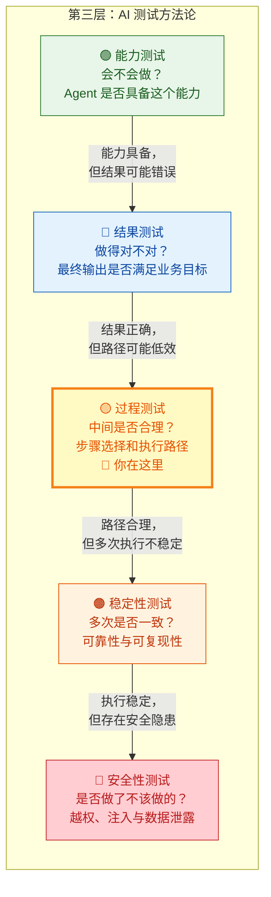
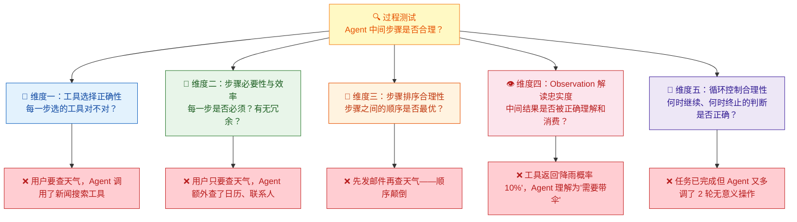
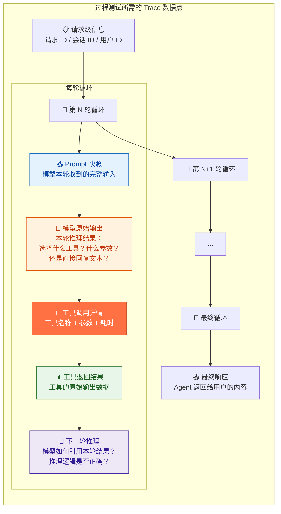
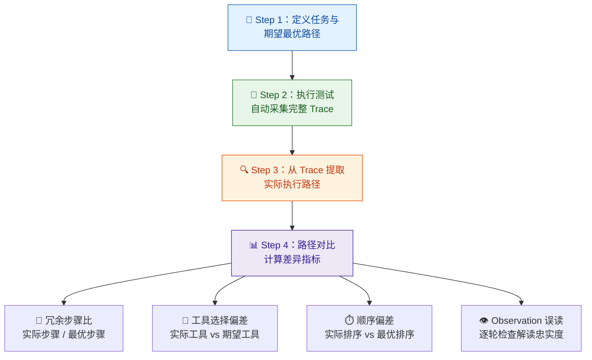
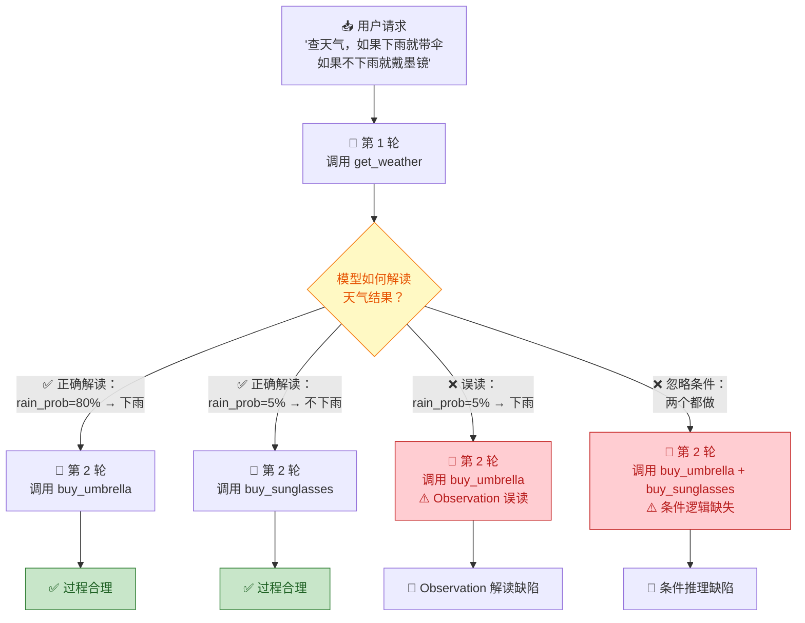
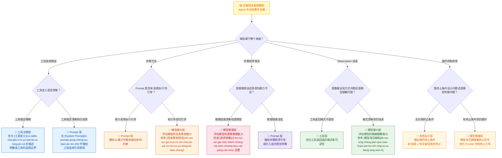

你正在阅读知识库**第三层：AI 测试方法论**的第三篇文章。在 [能力测试](14-neng-li-ce-shi-yan-zheng-agent-hui-bu-hui-zuo) 中你验证了 Agent "会不会做"，在 [结果测试](15-jie-guo-ce-shi-yan-zheng-agent-zuo-de-dui-bu-dui) 中你验证了它"做得对不对"。现在面临一个更深层的问题：**Agent 最终做对了，但它走的路对吗？** 一个正确的最终结果可能掩盖了中间的低效路径、冗余步骤、甚至对错误中间结果"误打误撞"的正确消费。过程测试的任务就是剥开结果的外壳，审视 Agent Loop 每一轮循环中的决策是否合理——工具选择是否正确、步骤排序是否最优、是否走了不该走的弯路、是否把错误的 Observation 当成了真实结果。这是五个测试维度中**对 Trace 依赖最重的维度**，因为你必须看到每一步才能评判每一步。

Sources: [readme.md](readme.md#L66-L106), [readme.md](readme.md#L84-L91)

## 能力测试 vs 结果测试 vs 过程测试：三个维度的分界

在深入过程测试之前，先帮你厘清第三层五个测试维度之间的边界。理解边界的目的不是学术上的精确，而是为了在实际测试中快速判断"这个缺陷该归到哪个维度"——因为不同维度的缺陷指向完全不同的修复方向：

用一个具体的例子来区分这三个维度。假设用户请求："帮我查一下明天北京的天气，然后给张三发邮件提醒他带伞。"在 [Agent Loop 核心工作流](9-agent-loop-he-xin-gong-zuo-liu-cong-yong-hu-qing-qiu-dao-zui-zhong-xiang-ying) 中你已经了解了这类多步骤任务的执行链路，现在来看三个维度各关注什么：

| 维度 | 核心问题 | Pass 示例 | Fail 示例 |
|:---|:---|:---|:---|
| **能力测试** | Agent 是否能完成这类任务？ | 成功调用了天气查询和邮件发送两个工具 | 根本没有尝试调用工具，直接编造了一个天气回答 |
| **结果测试** | 最终交给用户的答案对不对？ | 回复："明天北京 22°C，有阵雨，已发邮件提醒张三带伞"——信息准确、邮件已发送 | 回复："明天北京 28°C，晴天，已发邮件"——但实际是阵雨 22°C，邮件发给了李四 |
| **过程测试** | 中间步骤是否合理？ | 第 1 轮查天气 → 第 2 轮根据结果决定发邮件 → 完成，共 2 轮循环 | 第 1 轮查天气 → 第 2 轮查了北京新闻 → 第 3 轮查了张三的通讯录 → 第 4 轮查了邮件模板 → 第 5 轮才发邮件，步骤冗余 |

注意过程测试的 Fail 示例：Agent 最终确实查到了天气、也确实发了邮件——**能力通过了，结果也可能通过了**——但中间走了大量弯路。这种问题在只看最终结果的测试中完全不可见。这就是过程测试存在的根本理由：**它关注的是"怎么做的"，而不是"做没做"或"做得对不对"。**

Sources: [readme.md](readme.md#L66-L106), [readme.md](readme.md#L84-L91)

## 过程测试的核心价值：为什么"做对了"还不够

很多测试工程师在初接触 Agent 测试时会产生一个直觉："只要最终结果对了，中间怎么走的不重要。" 这个直觉在传统软件中成立——因为传统系统的执行路径是固定的，不存在"走弯路"的可能。但在 Agent 系统中，这个直觉是危险的，原因有三：

**第一，低效路径意味着高成本。** Agent 的每一步循环都消耗 Token、增加延迟。一个本可以 2 轮循环完成的任务，如果 Agent 用了 8 轮，Token 消耗和用户等待时间可能翻 4 倍。在大规模商用场景中，这种成本差异会直接转化为财务损失。

**第二，冗余步骤放大了出错概率。** 每多一步循环，就多一次模型推理、多一次工具调用的机会。在 [Agent Loop 核心工作流](9-agent-loop-he-xin-gong-zuo-liu-cong-yong-hu-qing-qiu-dao-zui-zhong-xiang-ying) 中你已经了解到，错误会在循环中逐级放大。第一步走了不必要的弯路，意味着后续步骤都建立在不必要膨胀的上下文之上，这增加了后续出错的风险。

**第三，错误中间结果被"修正"掩盖了真正的缺陷。** 这是过程测试最核心的价值点——Agent 可能在中间步骤获取了错误的工具返回结果，但模型在后续推理中"误打误撞"地给出了正确的最终回复。这种场景在只看结果的测试中会被判定为 Pass，但底层缺陷依然存在，只是被偶然的好运气掩盖了。下一次执行可能就没有这么幸运。

Sources: [readme.md](readme.md#L84-L91), [readme.md](readme.md#L253-L262)

## 过程测试的五大检验维度

过程测试需要你审视 Agent Loop 中每一轮循环的决策质量。基于 [Agent Loop 六阶段模型](9-agent-loop-he-xin-gong-zuo-liu-cong-yong-hu-qing-qiu-dao-zui-zhong-xiang-ying) 和源材料中对过程缺陷的归类，过程测试可以被拆解为五个独立的检验维度：

下面逐一深入每个维度的内涵、典型缺陷模式和测试设计要点。

Sources: [readme.md](readme.md#L84-L91), [readme.md](readme.md#L140-L158)

### 维度一：工具选择正确性——"每一步选的工具对不对？"

**工具选择正确性是过程测试最基础的检验维度。** 在 [工具调用机制](5-gong-ju-diao-yong-tool-calling-function-calling-ji-zhi) 中你已经了解到，模型在 Agent Loop 的推理阶段需要从可用工具列表中选择最合适的工具。工具选择错误意味着从起点就走错了方向——后续无论模型推理多精妙，都建立在错误的执行路径之上。

工具选择错误有三种典型模式：

| 错误模式 | 定义 | 典型场景 | 根因方向 |
|:---|:---|:---|:---|
| **工具名称混淆** | 选择了功能相似但不是目标工具的工具 | 用户要查天气，Agent 调用了 `search_news` 而非 `get_weather` | [工具定义](12-skills-cha-jian-ti-xi-yu-wai-bu-xi-tong-jie-ru) 的描述不够清晰，多个工具的语义边界模糊 |
| **工具粒度错配** | 选择了粒度不合适的工具（过粗或过细） | 用户要查"北京明天最高气温"，Agent 调用了 `get_weather_report`（返回 7 天预报），而非 `get_tomorrow_weather` | 模型未充分理解用户请求的精度要求 |
| **不该调用却调用了** | 模型可以基于已有信息直接回答，却多调了一个工具 | Agent 已经在第 1 轮获取了天气数据，第 2 轮又重复调用了 `get_weather` | 上下文管理问题：模型"忘记"了第 1 轮的结果 |

**测试设计要点**：这个维度的测试用例设计策略是**构造具有多个功能相近工具的场景**，以及**构造模型可以不经工具直接回答但仍可能误调工具的场景**。你需要通过 [Trace 与执行轨迹](13-ri-zhi-trace-yu-zhi-xing-gui-ji-ke-guan-ce-xing) 记录的模型原始输出来判断——模型的推理过程中是否正确区分了工具的适用边界。

Sources: [readme.md](readme.md#L84-L91), [readme.md](readme.md#L140-L158)

### 维度二：步骤必要性与效率——"每一步是否必须？"

**步骤必要性检验 Agent 是否在执行过程中走了不该走的弯路。** 在 [Agent Loop 核心工作流](9-agent-loop-he-xin-gong-zuo-liu-cong-yong-hu-qing-qiu-dao-zui-zhong-xiang-ying) 的"多循环模式"中你已经了解到，每一步循环都意味着完整的"Prompt 拼装 → 模型推理 → 工具执行 → 结果观察"流程。不必要的步骤不只是浪费资源，更是在不断膨胀上下文——增加后续步骤出错的概率。

步骤冗余有四种典型模式：

| 冗余模式 | 定义 | 典型表现 | 影响 |
|:---|:---|:---|:---|
| **信息过度收集** | Agent 收集了远超任务所需的信息 | 用户只问"明天天气"，Agent 查了天气、风向、空气质量、紫外线指数、穿衣建议 | 上下文膨胀 + 用户等待时间增加 |
| **无关工具调用** | 调用了与当前任务毫无关系的工具 | 用户要发邮件，Agent 先查了通讯录（已有张三邮箱）、又查了公司组织架构、又查了邮件模板 | Token 和时间浪费 |
| **重复工具调用** | 对同一工具进行了完全相同的调用 | 第 1 轮调用 `get_weather("北京")`，第 3 轮又调用 `get_weather("北京")` | 上下文中已有结果被重复注入 |
| **过度规划执行** | 把简单任务拆成了过多的子步骤 | 用户要"订明天上午的会议室"，Agent 先查空余 → 查设备 → 查参会人日程 → 查会议模板 → 查预算 → 才订会议室 | 效率低下，用户体验差 |

**测试设计要点**：对于每条测试用例，你需要在执行前定义一个**期望的最优执行路径**（最少需要几轮循环、调用哪些工具），然后通过 Trace 对比实际执行路径与最优路径的差异。差异可以用两个指标量化：**冗余步骤比** = 实际步骤数 / 最优步骤数；**冗余工具调用数** = 实际工具调用数 - 必要工具调用数。

Sources: [readme.md](readme.md#L84-L91), [readme.md](readme.md#L126-L138)

### 维度三：步骤排序合理性——"先做什么、后做什么的逻辑对不对？"

**步骤排序检验 Agent 是否在正确的时机执行正确的操作。** 即使 Agent 选择的所有工具都是正确的、步骤数量也是合理的，但如果顺序颠倒了，结果可能完全错误。这在多步骤依赖任务中尤为关键——步骤 B 依赖步骤 A 的结果，但 Agent 先执行了 B。

步骤排序错误有三种典型模式：

| 排序错误 | 定义 | 典型场景 | 后果 |
|:---|:---|:---|:---|
| **依赖倒置** | 后续步骤依赖前序结果，但顺序被颠倒 | 用户要"查天气，如果下雨就带伞"，Agent 先购买了雨伞再查天气 | 执行了不必要的操作（实际晴天） |
| **校验后置** | 应该先验证条件再执行操作，但先执行了 | 用户要"如果机票低于 2000 就订"，Agent 先订了机票再查价格 | 可能执行了违反约束条件的操作 |
| **无关步骤穿插** | 关键步骤之间插入了无关操作，打断了执行连贯性 | Agent 在查天气和发邮件之间插入了"搜索北京旅游景点" | 上下文中注入了无关信息，可能干扰后续推理 |

**一个深刻的测试洞察**：步骤排序问题在 [结果测试](15-jie-guo-ce-shi-yan-zheng-agent-zuo-de-dui-bu-dui) 中可能不可见——如果天气恰好是下雨的，先买伞再查天气的结果和先查天气再买伞的结果是一样的。但过程层面的排序缺陷依然存在，只是恰好被结果掩盖。这正是过程测试独立存在的价值：**它发现的是"碰巧做对了"但"方法不对"的问题。**

Sources: [readme.md](readme.md#L84-L91), [readme.md](readme.md#L126-L138)

### 维度四：Observation 解读忠实度——"中间结果被正确理解了吗？"

**Observation 解读忠实度是过程测试中最容易被忽略但影响最深的维度。** 在 [Agent Loop 六阶段](9-agent-loop-he-xin-gong-zuo-liu-cong-yong-hu-qing-qiu-dao-zui-zhong-xiang-ying) 的"阶段五：结果观察"中，工具返回的结果被写入上下文供下一轮推理使用。如果模型在这一步误读了工具结果——把"降雨概率 10%"理解为"很可能下雨"，或者把"库存不足"理解为"库存充足"——后续所有基于这个观察的决策都会建立在错误基础上。

这种问题与 [结果测试](15-jie-guo-ce-shi-yan-zheng-agent-zuo-de-dui-bu-dui) 中介绍的"转述偏差"有本质区别：转述偏差发生在最终回复生成环节，是模型对外输出时的歪曲；而 Observation 误读发生在中间推理环节，是模型**内部**对数据的错误理解，它会影响后续的决策路径——即使最终回复恰好正确，决策过程本身也是有缺陷的。

| 误读模式 | 定义 | 典型场景 | 风险等级 |
|:---|:---|:---|:---:|
| **数值误读** | 模型错误解读了数值型数据 | 工具返回 `price: 1280`，模型推理时认为是"1280 万" | 🔴 高 |
| **状态误判** | 模型将成功/失败状态判反 | 工具返回 `{status: "failed"}`，模型理解为"操作成功"并继续 | 🔴 高 |
| **条件逻辑错误** | 模型错误应用了条件判断 | 工具返回"降雨概率 10%"，模型判断为"需要带伞" | 🟡 中 |
| **关联关系混淆** | 模型混淆了返回数据之间的归属关系 | 工具返回多个城市的天气数据，模型把北京的温度对应到了上海 | 🔴 高 |

**测试设计要点**：这个维度需要在 Trace 的"模型原始输出"中逐轮检查——不是检查工具返回了什么（那是工具的问题），而是检查模型在下一轮推理时**如何引用和使用了上一轮的工具结果**。你需要特别关注模型是否逐字引用了关键数值，还是在引用时进行了"模糊化"处理（如"大约"、"接近"等修饰词）。

Sources: [readme.md](readme.md#L84-L91), [readme.md](readme.md#L253-L262)

### 维度五：循环控制合理性——"该停的时候停了吗？"

**循环控制检验 Agent Loop 的终止与继续决策是否正确。** 在 [Agent Loop 核心工作流](9-agent-loop-he-xin-gong-zuo-liu-cong-yong-hu-qing-qiu-dao-zui-zhong-xiang-ying) 中你已经了解到，循环终止条件包括模型主动结束、最大循环次数限制、Token 预算耗尽等。过程测试需要关注的不只是"有没有终止"，更核心的是"**什么时候终止的、为什么终止的**"。

循环控制问题有三种典型模式：

| 控制问题 | 定义 | 典型场景 | 后果 |
|:---|:---|:---|:---|
| **过早终止** | 任务尚未完成就停止了循环 | 用户要查天气并发邮件，Agent 查完天气后直接回复用户，忘记发邮件 | 子任务遗漏（看似过程问题，实则影响结果） |
| **延迟终止** | 任务已经完成但 Agent 继续循环 | Agent 已完成所有操作并生成了回复，但又多调了 2 轮无意义的额外查询 | 资源浪费，可能引入新错误 |
| **无效循环** | Agent 在多个工具之间来回切换，无法收敛 | 第 1 轮调 A 工具 → 第 2 轮调 B 工具 → 第 3 轮又调 A 工具（同样参数） → 第 4 轮又调 B 工具 | 陷入死循环，直到触发最大循环次数 |

**一个关键的量化指标**：你可以定义**循环效率比** = 必要循环次数 / 实际循环次数。理想值为 1.0（每轮循环都是必要的），低于 0.5 就意味着一半以上的循环是冗余的。这个指标可以帮助你快速筛选出需要深入分析的过程缺陷用例。

Sources: [readme.md](readme.md#L84-L91), [readme.md](readme.md#L44-L50)

## 过程测试的前提：如何"看到"中间步骤

过程测试与 [能力测试](14-neng-li-ce-shi-yan-zheng-agent-hui-bu-hui-zuo) 和 [结果测试](15-jie-guo-ce-shi-yan-zheng-agent-zuo-de-dui-bu-dui) 的一个根本区别在于：**过程测试完全依赖于 Trace 的可观测性。** 能力测试可以只看最终输出，结果测试可以只看最终回复——但过程测试必须看到每一步。

在 [日志、Trace 与执行轨迹可观测性](13-ri-zhi-trace-yu-zhi-xing-gui-ji-ke-guan-ce-xing) 中你已经详细学习了三层可观测体系。对于过程测试，你需要重点关注以下 Trace 数据点：

| 过程测试维度 | 依赖的 Trace 数据 | 检查方式 |
|:---|:---|:---|
| **工具选择正确性** | 每轮的模型原始输出（工具调用指令） | 对比模型选择的工具与期望的最优工具是否一致 |
| **步骤必要性与效率** | 完整执行轨迹（所有轮次的工具调用序列） | 对比实际步骤序列与期望的最优路径 |
| **步骤排序合理性** | 工具调用序列的时间顺序 + 模型每轮的推理逻辑 | 检查是否存在依赖倒置、校验后置等排序问题 |
| **Observation 解读忠实度** | 工具返回结果 + 下一轮模型的推理输出 | 逐轮比对：模型在下一轮推理中对工具结果的引用是否忠实 |
| **循环控制合理性** | 循环轮次 + 每轮的循环决策记录 | 检查是否存在过早终止、延迟终止或无效循环 |

**一个重要的操作原则**：如果被测 Agent 系统的 Trace 不包含上述数据点中的任何一个，你需要首先推动补齐可观测性。正如源材料中明确指出的：**"Agent 测试不看 Trace，基本测不深。"** 过程测试尤其如此——没有 Trace，过程测试无从谈起。

Sources: [readme.md](readme.md#L253-L262), [readme.md](readme.md#L364-L365)

## 过程测试用例设计方法论

理解了五大检验维度之后，接下来的核心问题是：**如何系统地设计过程测试用例？** 以下四种方法从不同角度覆盖过程测试的核心场景。

### 方法一：最优路径对比法

**最优路径对比法是过程测试最核心的用例设计方法。** 它的思路是：对于每条测试用例，预先定义一条"期望的最优执行路径"，然后通过 Trace 对比 Agent 的实际执行路径与最优路径的差异。

具体操作分为四步：

| 步骤 | 操作内容 | 产出物 |
|:---|:---|:---|
| **Step 1** | 为测试用例定义：用户请求、期望的工具调用序列（工具名 + 参数）、期望的循环轮次、每轮 Observation 的预期解读方式 | 最优路径定义文件 |
| **Step 2** | 执行 Agent 测试，自动采集完整 Trace（包含每轮的 Prompt 快照、模型输出、工具调用和返回） | 完整执行轨迹数据 |
| **Step 3** | 从 Trace 中提取实际执行路径：工具调用序列、参数、循环轮次、每轮的推理逻辑 | 实际执行路径结构化数据 |
| **Step 4** | 将实际路径与最优路径对比，计算差异指标 | 过程质量报告 |

**用例设计要点**：最优路径不应只有一条。对于复杂的任务，你可以定义"最优路径"、"可接受路径"和"不可接受路径"三个等级。只要实际路径落在"可接受路径"范围内（如步骤数在最优 ±1 范围内），就判定为 Pass。

Sources: [readme.md](readme.md#L84-L91), [readme.md](readme.md#L253-L262)

### 方法二：干扰项注入法

**干扰项注入法专门用于检测步骤必要性和工具选择正确性。** 它的设计思路是：在 Agent 可用的工具列表中添加一些"看起来相关但实际不需要"的工具，观察 Agent 是否会在执行过程中被这些干扰项吸引，从而走弯路。

| 干扰策略 | 设计思路 | 典型用例 |
|:---|:---|:---|
| **相似工具干扰** | 添加功能相似的工具，测试模型能否区分 | 用户要查天气，工具列表中有 `get_weather` 和 `search_weather_news`，看 Agent 是否选错 |
| **过度能力干扰** | 添加能"顺便"完成某些操作但不是当前任务需要的工具 | 用户只要查天气，但工具列表中有 `get_weather_and_book_umbrella`，看 Agent 是否过度使用 |
| **信息诱惑干扰** | 添加能提供"额外信息"的工具，测试 Agent 是否抵挡不住好奇心 | 用户要发邮件，但工具列表中有 `get_email_analytics`（查看邮件分析数据），看 Agent 是否会被诱惑 |

**测试设计要点**：这个方法的精髓在于——你不只是在测试 Agent 的"正确性"，更在测试它的"判断力"。一个优秀的 Agent 应该能用最少的步骤完成任务，即使有大量干扰工具可用。

Sources: [readme.md](readme.md#L84-L91), [readme.md](readme.md#L140-L158)

### 方法三：条件分支压力法

**条件分支压力法专门用于检测步骤排序合理性和 Observation 解读忠实度。** 它的核心思路是：设计包含条件逻辑的任务，使得 Agent 必须基于中间结果做出正确的条件判断，才能选择正确的后续步骤。

**用例设计策略**：通过控制工具返回的中间结果来构造不同分支。例如，你可以 mock `get_weather` 的返回值——一次返回 `rain_prob: 80%`（应触发"带伞"分支），一次返回 `rain_prob: 5%`（应触发"墨镜"分支），一次返回 `rain_prob: 50%`（边界值，应触发追问或保守选择）。通过控制中间变量，你可以精确测试 Agent 在每个分支点的推理是否正确。

Sources: [readme.md](readme.md#L84-L91), [readme.md](readme.md#L126-L138)

### 方法四：循环上限触发法

**循环上限触发法专门用于检测循环控制问题。** 它的设计思路是：构造一些"容易让 Agent 陷入无效循环"的场景，观察 Agent 是否能及时终止。

| 场景设计 | 预期行为 | 典型触发条件 |
|:---|:---|:---|
| **工具返回空结果** | Agent 应识别"无数据"并终止或告知用户，而非反复重试 | `get_weather` 返回 `{data: null}`，看 Agent 是否反复调用 |
| **工具返回错误** | Agent 应识别错误并报告，而非忽略后重试 | `send_email` 返回 `{error: "rate_limit"}`，看 Agent 是否重试同一参数 |
| **依赖未满足** | Agent 应识别前置条件不满足并终止或调整 | 查询张三邮箱但通讯录无张三，看 Agent 是否反复查通讯录 |
| **信息已经充分** | Agent 应识别上下文中已有足够信息并终止 | 第 1 轮已经返回完整结果，看 Agent 是否"忘了"而重复调用 |

**一个关键指标**：对于每条用例，记录 Agent 在触发前述场景后的**额外循环轮次**。理想值为 0（立即识别并处理），超过 2 轮就需要标记为过程缺陷。

Sources: [readme.md](readme.md#L84-L91), [readme.md](readme.md#L44-L50)

## 过程测试与缺陷归因

当过程测试发现了一个"步骤不合理"的问题，下一步是**缺陷归因**——判断这个不合理来自 Agent 系统的哪个环节。过程层面的缺陷可能源自不同层面，准确归因决定了修复方向。

**归因操作要点**：过程缺陷的归因比结果缺陷更复杂，因为你需要区分"模型能力不足"和"系统设计不当"——同一个表现（如工具选择错误），可能是因为模型能力不足以区分相似工具，也可能是因为工具定义本身就不清晰。判断的依据是：**如果人工阅读工具定义后能正确选择，那问题偏向模型能力；如果人工也觉得两个工具描述很像，那问题偏向工具定义。**

Sources: [readme.md](readme.md#L84-L91), [readme.md](readme.md#L253-L262)

## 过程测试的工程化实践清单

将以上方法论落地为可执行的工程实践，以下是你应该建立的测试基础设施：

| 工程化要素 | 说明 | 优先级 |
|:---|:---|:---:|
| **最优路径定义集** | 为每条过程测试用例定义期望的最优执行路径，包含工具序列、参数、循环轮次 | 🔴 必须 |
| **Trace 自动采集与解析** | 每次测试执行自动采集完整 Trace，并解析为结构化的执行路径数据 | 🔴 必须 |
| **路径对比自动化脚本** | 将实际执行路径与最优路径自动对比，计算差异指标（冗余比、工具偏差、顺序偏差） | 🔴 必须 |
| **循环效率监控** | 在每次测试后自动计算循环效率比，低于阈值的用例自动标记 | 🟡 建议 |
| **干扰项工具 Mock** | 一组可配置的干扰工具，用于干扰项注入测试 | 🟡 建议 |
| **条件分支 Mock 工具** | 可控制返回值的 Mock 工具，用于条件分支压力测试 | 🟡 建议 |
| **过程缺陷归因模板** | 标准化的归因记录模板，包含维度、Trace 证据、归因结论和修复方向 | 🟢 进阶 |

**落地建议**：从"最优路径定义集 + Trace 自动采集 + 路径对比脚本"这三项开始。它们能覆盖过程测试中最高价值的检测场景（多步骤任务中的路径偏差），且全部可以实现自动化。随着测试体系成熟，再逐步加入干扰项测试、条件分支测试和归因模板。

Sources: [readme.md](readme.md#L264-L276), [readme.md](readme.md#L402-L430)

## 过程测试与相邻测试维度的协作

过程测试不是孤立的。它与其他测试维度之间存在紧密的协作关系，理解这些关系能帮助你设计更高效的测试策略：

| 协作关系 | 说明 | 实践建议 |
|:---|:---|:---|
| **过程测试 → 结果测试** | 过程缺陷可能是结果缺陷的**根因**。很多"结果做错了"的问题，根因在过程——中间步骤误读了工具结果，导致后续推理全错 | 当结果测试发现缺陷时，追溯 Trace 检查过程层面是否存在误读 |
| **过程测试 → 稳定性测试** | 过程测试发现的冗余路径，在 [稳定性测试](17-wen-ding-xing-ce-shi-duo-ci-zhi-xing-de-ke-kao-xing-yu-zhi-xing) 中可能表现为"不同次执行走不同路径"——一次走最优路径，一次走弯路 | 将过程测试的最优路径作为稳定性测试的基线 |
| **过程测试 → [任务规划测试](20-ren-wu-gui-hua-ce-shi-chai-jie-pai-xu-hui-tui-yu-dong-tai-diao-zheng)** | 过程测试的"步骤排序"维度与任务规划测试有交叉，但关注点不同——过程测试关注单次执行的实际路径，规划测试关注规划能力的系统评估 | 用过程测试的实际路径数据作为规划测试的输入 |
| **过程测试 → [Tool Calling 测试](21-tool-calling-ce-shi-can-shu-ti-qu-duo-gong-ju-bian-pai-yu-yi-chang-chu-li)** | 过程测试的"工具选择"维度与 Tool Calling 测试有交叉，但视角不同——过程测试关注"在多步骤任务中每步选什么"，Tool Calling 测试关注"单次调用的参数正确性" | 两者共享用例设计，但判定标准不同 |

**核心原则**：过程测试是连接"结果层"和"能力层"的桥梁——它解释了"为什么结果错了"（过程缺陷导致的结果错误）和"为什么能力够但结果不稳定"（同一能力水平下，不同执行路径的质量差异）。

Sources: [readme.md](readme.md#L66-L106), [readme.md](readme.md#L84-L91)

## 下一步

过程测试帮你回答了"Agent 中间步骤是否合理"。但即使是能力够、结果对、过程合理的 Agent，也可能在**多次执行中表现不一致**——同一个请求跑 10 次，可能 7 次走了最优路径、3 次绕了弯路。这种**稳定性问题**将在下一篇深入讨论：[稳定性测试：多次执行的可靠性与一致性](17-wen-ding-xing-ce-shi-duo-ci-zhi-xing-de-ke-kao-xing-yu-zhi-xing)。

如果你想直接进入过程测试中发现的缺陷的评估工程化，可以跳到：[评估体系搭建：Golden Set、Rubric 评分与 LLM-as-a-Judge](27-ping-gu-ti-xi-da-jian-golden-set-rubric-ping-fen-yu-llm-as-a-judge)。