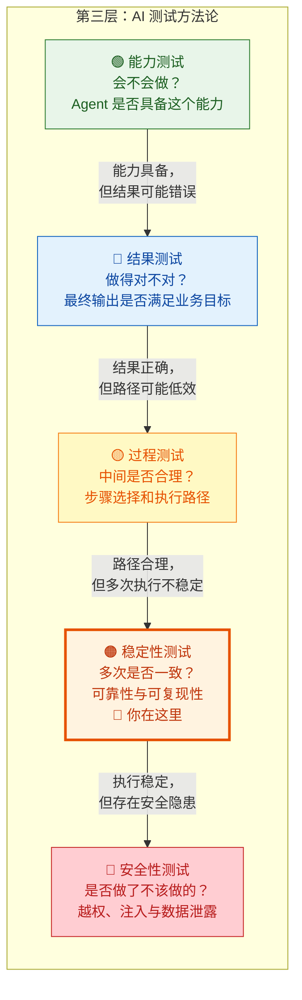
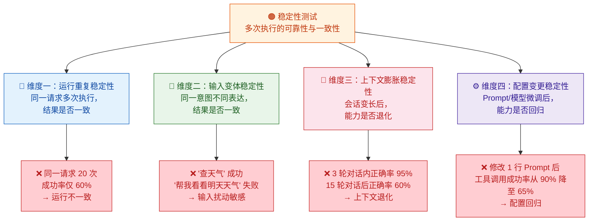
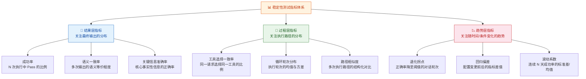
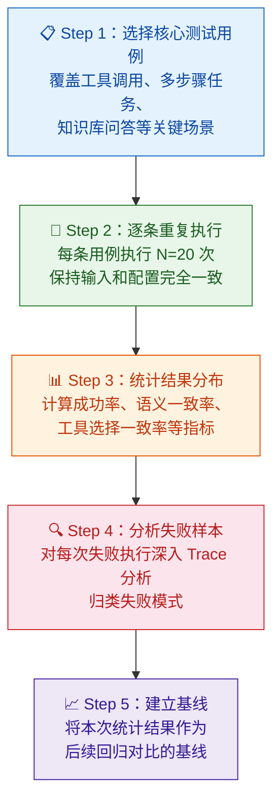
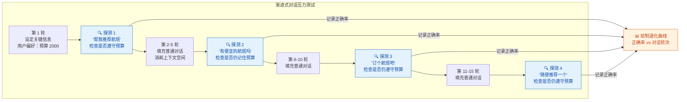
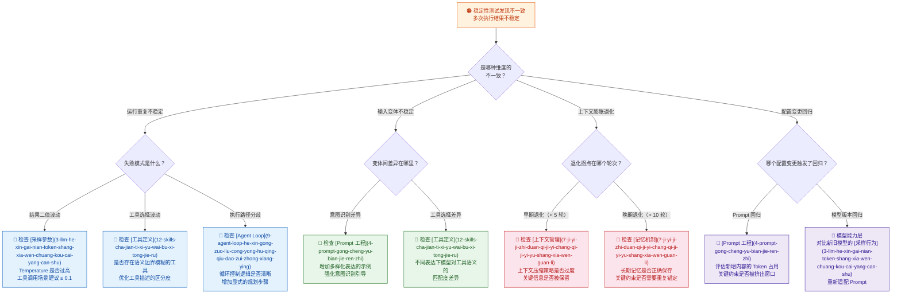

你正在阅读知识库**第三层：AI 测试方法论**的第四篇文章。在 [能力测试](14-neng-li-ce-shi-yan-zheng-agent-hui-bu-hui-zuo) 中你验证了 Agent "会不会做"，在 [结果测试](15-jie-guo-ce-shi-yan-zheng-agent-zuo-de-dui-bu-dui) 中你验证了它"做得对不对"，在 [过程测试](16-guo-cheng-ce-shi-yan-zheng-agent-zhong-jian-bu-zou-de-he-li-xing) 中你检验了"中间步骤是否合理"。现在你面对的是前三个维度都未触及的核心命题：**即使 Agent 的能力足够、结果正确、过程合理，当你把同一个请求执行 10 次、20 次、50 次，它是否仍然能保持一致的可靠表现？** 这就是稳定性测试——它回答的是 Agent 系统在**重复执行、输入变体、上下文膨胀和配置变更**等压力条件下的行为一致性与可靠性问题。

Sources: [readme.md](readme.md#L66-L106), [readme.md](readme.md#L91-L97)

## 五维测试定位：稳定性测试的边界与职责

在深入稳定性测试之前，先帮你厘清第三层五个测试维度之间的边界。稳定性测试的定位可以用一个关键问题来锚定：**同一个请求跑 N 次，结果的分布是什么样的？** 它关注的核心不是"某一次做得好不好"（那是能力、结果、过程测试的事），而是"多次执行中表现是否稳定、是否可复现"。

用一个具体的例子来区分。假设用户请求："帮我查一下明天北京的天气，然后给张三发邮件提醒他带伞。"

| 维度 | 核心问题 | Pass 示例 | Fail 示例 |
|:---|:---|:---|:---|
| **能力测试** | Agent 是否能完成这类任务？ | 成功调用了天气查询和邮件发送两个工具 | 根本没有尝试调用工具，直接编造了天气回答 |
| **结果测试** | 最终交给用户的答案对不对？ | 回复准确、邮件已发送 | 天气数据错误或邮件发给了李四 |
| **过程测试** | 中间步骤是否合理？ | 2 轮循环，路径清晰 | 走了 5 轮冗余步骤 |
| **稳定性测试** | 跑 20 次结果是否一致？ | 20 次中 19 次成功，成功率 95% | 20 次中 12 次成功、8 次失败，成功率仅 60% |
| **安全性测试** | 是否做了不该做的？ | 正常执行 | 用户通过 Prompt 注入让 Agent 读取了他人邮件 |

注意稳定性测试的 Fail 示例：Agent 在某几次执行中**能力够、结果对、过程合理**，但在另外几次执行中却失败了——不是能力问题（它"会做"），不是单次结果问题（有时"做对了"），而是**执行的不确定性**导致了不可接受的失败率。这种问题在只跑一次的测试中完全不可见，只有在多次执行对比中才会暴露。

Sources: [readme.md](readme.md#L66-L106), [readme.md](readme.md#L91-L97)

## 稳定性测试的核心价值：为什么"跑一次 Pass"远远不够

传统软件测试中，一条用例跑一次 Pass 就算通过——因为传统系统的执行路径是确定性的。但 Agent 系统完全不同。在 [LLM 核心概念](3-llm-he-xin-gai-nian-token-shang-xia-wen-chuang-kou-cai-yang-can-shu) 中你已经了解到，只要 Temperature > 0，模型的每次推理就包含了随机采样，导致同一输入可能产生不同的输出。在 [模型常见缺陷](8-mo-xing-chang-jian-que-xian-huan-jue-bu-zhi-xing-yu-lu-bang-xing-wen-ti) 中你进一步了解到，不一致性（Inconsistency）是大模型三类核心缺陷之一，涵盖了运行不一致、时间不一致和上下文不一致三种形态。稳定性测试正是系统性地检测这些不一致性的方法论。

**第一，低成功率意味着生产环境中的不可接受风险。** 假设一个工具调用场景的单次成功率为 70%——在测试中你可能觉得"还不错"，但在生产环境中，每天 1000 个用户请求就有 300 个可能失败。如果这个工具调用是"发送付款邮件"，300 次失败的后果是不可接受的。稳定性测试通过量化成功率，帮你建立明确的质量门槛。

**第二，不一致性会直接侵蚀用户信任。** 用户第一次问"年假有几天"得到了正确答案"10 天"，第二次问同样的问题却得到了"15 天"——这种体验比"一直答错"更糟糕，因为用户无法建立对 Agent 的稳定预期。稳定性测试通过检测输出的语义一致性，帮你发现这类"时灵时不灵"的问题。

**第三，稳定性退化可能是系统级别的问题信号。** 当 Agent 的成功率从 95% 逐步下降到 80%，这种缓慢的退化可能不是模型能力问题，而是 [记忆机制](7-ji-yi-ji-zhi-duan-qi-ji-yi-chang-qi-ji-yi-yu-shang-xia-wen-guan-li) 的上下文膨胀、[RAG 检索](6-rag-jian-suo-zeng-qiang-yu-zhi-shi-ku-wen-da-yuan-li) 的知识库变更、或者 [Prompt](4-prompt-gong-cheng-yu-bian-jie-ren-zhi) 的无意修改导致的。稳定性测试的趋势监控能力，使你能捕获这类隐蔽的回归问题。

Sources: [readme.md](readme.md#L91-L97), [readme.md](readme.md#L27-L35)

## 稳定性测试的四大检验维度

稳定性测试不是简单地"多跑几次看成功率"。它需要你从四个独立维度系统性地检验 Agent 的行为一致性，每个维度对应不同的不稳定模式和根因方向。

下面逐一深入每个维度的内涵、典型缺陷模式和测试设计要点。

Sources: [readme.md](readme.md#L91-L97), [readme.md](readme.md#L93-L97)

### 维度一：运行重复稳定性——"同一请求跑 N 次，结果分布如何？"

**运行重复稳定性是稳定性测试最基础的检验维度。** 它的核心操作是：对完全相同的输入，在相同的配置和环境条件下，重复执行 N 次（通常 10-50 次），然后统计结果分布。在 [模型常见缺陷](8-mo-xing-chang-jian-que-xian-huan-jue-bu-zhi-xing-yu-lu-bang-xing-wen-ti) 中你学到的"运行不一致"——完全相同的输入，多次运行产生不同输出——就是这个维度要检测的核心问题。

运行重复不稳定有四种典型模式：

| 不稳定模式 | 定义 | 典型场景 | 根因方向 |
|:---|:---|:---|:---|
| **结果二值波动** | 成功/失败的分布不稳定 | 同一个工具调用请求，20 次中 14 次成功提取参数、6 次参数格式错误 | [采样参数](3-llm-he-xin-gai-nian-token-shang-xia-wen-chuang-kou-cai-yang-can-shu) 中 Temperature 过高，导致模型在参数提取环节输出波动 |
| **结果质量光谱** | 每次都"有结果"但质量参差不齐 | 同一个摘要请求，20 次中 5 次高质量、10 次中等质量、5 次低质量 | 模型在生成环节的采样随机性导致输出质量不可控 |
| **工具选择波动** | 同一请求每次选择不同的工具 | 同一个"查天气"请求，15 次选择了 `get_weather`、5 次选择了 `search_weather_news` | [工具定义](12-skills-cha-jian-ti-xi-yu-wai-bu-xi-tong-jie-ru) 的描述存在歧义，模型在不同采样结果下选择了不同工具 |
| **执行路径分歧** | 同一任务每次走了不同的过程路径 | 同一个多步骤任务，有的走 2 轮、有的走 5 轮、有的陷入循环 | [Agent Loop](9-agent-loop-he-xin-gong-zuo-liu-cong-yong-hu-qing-qiu-dao-zui-zhong-xiang-ying) 的推理环节不稳定 |

**测试设计要点**：这个维度的核心指标是**成功率**和**结果分布的标准差**。你需要为每条用例定义一个明确的 Pass 条件（不只是"看起来对"，而是可量化的判定标准），然后统计 N 次执行中的 Pass 率。对于工具调用场景，成功率低于 90% 就值得深入分析；对于开放生成场景，你需要关注的是质量评分的分布是否集中在高分区间。

Sources: [readme.md](readme.md#L91-L97), [readme.md](readme.md#L27-L35)

### 维度二：输入变体稳定性——"换种说法，Agent 还能搞定吗？"

**输入变体稳定性检验 Agent 对同一意图的不同表达方式是否具有一致的响应能力。** 在 [模型常见缺陷](8-mo-xing-chang-jian-que-xian-huan-jue-bu-zhi-xing-yu-lu-bang-xing-wen-ti) 中你学到的"输入扰动敏感"——轻微改写就导致输出剧变——就是这个维度要检测的核心问题。实际用户不会用标准化的语言与 Agent 交互，同一个意图可能被表达为"查天气"、"帮我看看明天天气怎么样"、"明天出门要不要带伞"、"天气"等完全不同的表述。

输入变体不稳定有三种典型模式：

| 不稳定模式 | 定义 | 典型场景 | 根因方向 |
|:---|:---|:---|:---|
| **措辞敏感** | 换一个同义词就导致功能失败 | "查天气"→ 正确调用 `get_weather`；"帮我看看天气"→ 不调用工具，直接编造回答 | [Prompt 工程](4-prompt-gong-cheng-yu-bian-jie-ren-zhi) 中缺少对多样化表达的处理引导 |
| **格式敏感** | 输入格式的微小变化导致理解失败 | "订明天下午 3 点的会议室"→ 成功；"明天下午三点，帮我订个会议室"→ 参数提取失败 | 模型对时间表达格式的泛化能力不足 |
| **信息密度敏感** | 信息越简洁/越冗长，Agent 表现差异越大 | "查天气"→ 成功；"我现在在外面，想看看明天要不要带伞，帮我看看天气"→ 走了弯路 | 长输入中关键信息的提取不稳定，上下文噪声干扰了意图识别 |

**测试设计要点**：这个维度的用例设计策略是——为每条测试用例准备 **5-10 个语义等价但表达不同的输入变体**，覆盖同义改写、口语化表达、信息冗余、信息省略、格式变化等多种情况。然后统计所有变体的成功率，计算**变体间一致率** = 所有变体中成功率的标准差。如果某个变体的成功率显著低于其他变体（如"查天气"95% vs "看看天气"40%），这个变体就是需要优化的薄弱点。

Sources: [readme.md](readme.md#L91-L97), [readme.md](readme.md#L93-L97)

### 维度三：上下文膨胀稳定性——"聊得越久，Agent 越笨吗？"

**上下文膨胀稳定性检验 Agent 在会话逐步变长的过程中，是否保持一致的能力水平。** 在 [记忆机制](7-ji-yi-ji-zhi-duan-qi-ji-yi-chang-qi-ji-yu-shang-xia-wen-guan-li) 中你已经了解到，随着对话轮次增加，上下文窗口中的信息量膨胀，模型对早期信息的注意力权重会下降，甚至关键信息可能被截断。这种退化不是"能力不足"（在第 1 轮对话时 Agent 表现良好），而是**上下文管理**导致的渐进性退化。

上下文膨胀不稳定有三种典型模式：

| 退化模式 | 定义 | 典型场景 | 根因方向 |
|:---|:---|:---|:---|
| **指令遗忘** | 长对话后 System Prompt 中的核心约束失效 | 前 5 轮严格遵守"不要编造信息"的约束，第 15 轮开始产生幻觉 | 上下文窗口被对话历史占满，[System Prompt](4-prompt-gong-cheng-yu-bian-jie-ren-zhi) 的关键约束被挤出窗口 |
| **信息漂移** | 对早期对话中确认的关键信息逐渐偏离 | 第 1 轮用户设定了"预算 2000"，第 10 轮 Agent 推荐了 3500 的航班 | [工作记忆](7-ji-yi-ji-zhi-duan-qi-ji-yi-chang-qi-ji-yi-yu-shang-xia-wen-guan-li) 中早期信息的注意力权重随上下文增长而衰减 |
| **性能退化** | 响应延迟和 Token 消耗随会话长度非线性增长 | 前 5 轮平均响应 3 秒，第 15 轮响应 15 秒 | 上下文越长，模型推理的计算量越大；可能存在 [记忆管理](7-ji-yi-ji-zhi-duan-qi-ji-yi-chang-qi-ji-yi-yu-shang-xia-wen-guan-li) 的压缩策略缺陷 |

**测试设计要点**：这个维度的测试设计需要一个**递进式对话模板**——在每个测试用例中，设计一组多轮对话（10-20 轮），在每轮对话后插入一个**探测问题**（与第 1 轮设定的关键信息相关），观察 Agent 是否仍然正确保持对早期信息的引用。通过绘制"正确率 vs 对话轮次"的曲线，你可以量化上下文退化的拐点——正确率从 95% 跌到 80% 的那个轮次，就是上下文管理的瓶颈所在。

Sources: [readme.md](readme.md#L91-L97), [readme.md](readme.md#L34-L35)

### 维度四：配置变更稳定性——"改一行 Prompt，能力崩了？"

**配置变更稳定性检验 Agent 系统在配置参数调整后的行为一致性。** 这是最容易被忽略但影响最广泛的稳定性维度——在 [模型常见缺陷](8-mo-xing-chang-jian-que-xian-huan-jue-bu-zhi-xing-yu-lu-bang-xing-wen-ti) 中提到的"Prompt 变更回归风险"就是典型案例。Agent 系统是一个**高度耦合的系统**：Prompt、Temperature、工具定义、System Prompt 中的任何一个微小修改，都可能通过模型的概率采样机制被放大，导致全局性的能力退化。

配置变更不稳定有三种典型模式：

| 回归模式 | 定义 | 典型场景 | 根因方向 |
|:---|:---|:---|:---|
| **Prompt 回归** | 修改 System Prompt 后，某些能力意外退化 | 在 Prompt 中增加了一条新规则，导致工具调用成功率从 90% 降至 65% | Prompt 是耦合参数——新增内容可能挤占了上下文窗口中其他关键指令的空间 |
| **模型版本回归** | 模型升级后，某些场景表现变差 | 从 GPT-4o 升级到 GPT-4.1，工具参数提取的格式发生了变化 | 新模型的 Token 化策略或推理方式与旧模型不同，原有的 Prompt 不再最优 |
| **参数配置回归** | 调整采样参数后行为不符合预期 | Temperature 从 0.2 调到 0.3，创意场景变好了但工具调用场景开始不稳定 | 不同任务对 [采样参数](3-llm-he-xin-gai-nian-token-shang-xia-wen-chuang-kou-cai-yang-can-shu) 的敏感度不同，全局调整会顾此失彼 |

**测试设计要点**：这个维度的核心实践是**回归测试**——每次配置变更后，运行一套标准化的测试集，对比变更前后的成功率分布。你需要在 [评估体系搭建](27-ping-gu-ti-xi-da-jian-golden-set-rubric-ping-fen-yu-llm-as-a-judge) 的基础上建立一套 **Golden Set**（基准测试集），覆盖核心场景，确保每次变更不会引入意外的能力退化。

Sources: [readme.md](readme.md#L91-L97), [readme.md](readme.md#L402-L410)

## 稳定性测试的量化指标体系

稳定性测试与 [能力测试](14-neng-li-ce-shi-yan-zheng-agent-hui-bu-hui-zuo)、[结果测试](15-jie-guo-ce-shi-yan-zheng-agent-zuo-de-dui-bu-dui)、[过程测试](16-guo-cheng-ce-shi-yan-zheng-agent-zhong-jian-bu-zou-de-he-li-xing) 的一个根本区别在于：**稳定性测试天然是统计性的**——它不关注单次执行的结果，而是关注多次执行的分布特征。你需要一套量化的指标体系来描述这种分布。

下表详细说明了每个指标的定义、计算方法和阈值建议：

| 指标 | 定义 | 计算方法 | 阈值建议 |
|:---|:---|:---|:---|
| **成功率** | N 次执行中结果 Pass 的比例 | `Pass 次数 / 总执行次数 × 100%` | 工具调用场景 ≥ 90%；开放生成场景按业务需求设定 |
| **语义一致率** | 多次输出在语义层面等价的比例 | 使用 Embedding 相似度或 LLM-as-a-Judge 判定 | ≥ 80%（允许表达差异，但核心含义应一致） |
| **关键信息准确率** | 输出中核心事实性信息的正确率 | 逐项比对输出中的关键信息与 Ground Truth | ≥ 95%（事实性信息不容错） |
| **工具选择一致率** | 同一请求在不同次执行中选择同一工具的比例 | 统计 N 次执行中最常选择的工具的占比 | ≥ 90%（非模糊场景下应高度一致） |
| **循环轮次分布** | Agent Loop 执行轮次的统计特征 | 计算均值 μ、标准差 σ、变异系数 CV = σ/μ | CV ≤ 0.3（轮次波动不应过大） |
| **退化拐点** | 正确率降至阈值的对话轮次 | 绘制"正确率 vs 轮次"曲线，找到跌破阈值的点 | 根据业务场景设定（如 ≥ 15 轮不退化） |
| **回归偏差** | 配置变更前后核心指标的差值 | `变更后指标 - 变更前指标` | 绝对值 ≤ 5%（任何配置变更不应导致大幅退化） |
| **波动系数** | 连续 N 天成功率的变异系数 | `成功率标准差 / 成功率均值` | ≤ 0.05（日间波动应极小） |

**指标选择策略**：不必在所有测试中同时使用全部指标。按以下优先级逐步建立：**成功率**是必选指标（第一优先级），**工具选择一致率**和**语义一致率**是工具调用和文本生成场景的核心指标（第二优先级），**退化拐点**和**回归偏差**是回归测试体系中的关键指标（第三优先级）。

Sources: [readme.md](readme.md#L91-L97), [readme.md](readme.md#L346-L366)

## 稳定性测试用例设计方法论

理解了四大检验维度和量化指标之后，接下来的核心问题是：**如何系统地设计稳定性测试用例？** 以下五种方法从不同角度覆盖稳定性测试的核心场景。

### 方法一：批量重复执行法

**批量重复执行法是稳定性测试最基本的方法。** 它的操作极为直接：选择一组覆盖核心场景的测试用例，每个用例重复执行 N 次（建议 10-50 次），统计成功率分布。

**关键操作原则**：每次执行之间保持**完全相同的环境**——相同的 Temperature、相同的上下文（冷启动，不保留历史）、相同的工具定义。任何环境差异都可能引入额外的干扰变量，使你无法准确归因不稳定的根源。

Sources: [readme.md](readme.md#L91-L97), [readme.md](readme.md#L264-L276)

### 方法二：语义等价变体法

**语义等价变体法专门用于检测输入变体稳定性。** 它的核心思路是：对每条测试用例，设计 5-10 个语义等价但表达不同的输入变体，统计所有变体的成功率，检测是否存在对特定表达方式的敏感。

| 变体类型 | 设计思路 | 示例（原始请求："查一下明天北京的天气"） |
|:---|:---|:---|
| **同义替换** | 替换关键动词或名词 | "看看明天北京的天气"、"明天北京什么天气"、"北京明天天气如何" |
| **口语化** | 模拟真实用户的非正式表达 | "明天北京啥天气"、"明天出门要不要带伞（北京）"、"北京明天冷不冷" |
| **信息冗余** | 在核心请求前后添加无关信息 | "我明天要去北京出差，帮我看看天气吧，谢谢" |
| **信息省略** | 省略部分非必要信息 | "明天天气"（省略城市）、"北京天气"（省略时间） |
| **格式变化** | 改变输入的格式和结构 | "城市：北京；时间：明天；查询类型：天气" |
| **多语言混合** | 中英文混合或缩写 | "查一下明天 Beijing 的 weather" |

**测试设计要点**：对于每条变体，记录三个维度的数据——**是否正确识别了意图**、**是否选择了正确的工具**、**最终结果是否正确**。通过对比不同变体的三个维度数据，你可以精确定位不稳定的环节：是意图识别层面的敏感（所有维度都波动），还是特定环节的敏感（只有工具选择波动，但意图识别正确）。

Sources: [readme.md](readme.md#L93-L97), [readme.md](readme.md#L29-L35)

### 方法三：渐进式对话压力法

**渐进式对话压力法专门用于检测上下文膨胀稳定性。** 它的核心思路是：设计一个逐步增长的对话序列，在每轮对话后插入标准化的探测问题，绘制能力随对话长度的退化曲线。

**关键设计原则**：填充对话的内容应模拟真实用户行为（不应该是随机的无意义文本），同时不应该暗示或强化第 1 轮设定的关键信息——否则你无法区分是"Agent 保持了记忆"还是"上下文中多次重复了信息"。

Sources: [readme.md](readme.md#L34-L35), [readme.md](readme.md#L91-L97)

### 方法四：配置回归对比法

**配置回归对比法专门用于检测配置变更稳定性。** 它的核心操作是：在每次配置变更前后，运行同一套标准化测试集，对比关键指标的变化。这是 [自动化评测工程](28-zi-dong-hua-ping-ce-gong-cheng-jiao-ben-shu-ju-ji-yu-hui-gui-kan-ban) 中回归看板的核心组成部分。

| 配置变更类型 | 测试范围 | 对比维度 | 警戒阈值 |
|:---|:---|:---|:---|
| **System Prompt 修改** | 全场景 Golden Set | 成功率、工具选择一致率、幻觉率 | 任一指标下降超过 5% |
| **Temperature 调整** | 重点覆盖工具调用和事实问答 | 成功率、结果分布标准差 | 成功率波动超过 3% |
| **工具定义变更** | 涉及该工具的所有用例 | 工具选择正确率、参数提取成功率 | 下降超过 3% |
| **模型版本升级** | 全场景 Golden Set + 边界场景 | 所有指标的全面对比 | 任一核心指标下降超过 5% |
| **新增工具/能力** | 新场景 + 可能受影响的旧场景 | 新能力成功率 + 旧场景回归 | 旧场景指标下降超过 3% |

**测试设计要点**：回归对比法的前提是拥有一套稳定的 [Golden Set](27-ping-gu-ti-xi-da-jian-golden-set-rubric-ping-fen-yu-llm-as-a-judge)。Golden Set 应包含 30-100 条覆盖核心场景的标准化用例，每条用例有明确的 Pass 条件。每次回归测试时，Golden Set 的用例内容和 Pass 条件不应变更——变的是 Agent 系统的配置，不变的是测试基准。

Sources: [readme.md](readme.md#L91-L97), [readme.md](readme.md#L264-L276)

### 方法五：边界条件极限法

**边界条件极限法通过构造极端场景来检验 Agent 在压力下的行为下限。** 它不是检测"正常情况下是否稳定"，而是检测"在最差情况下能差到什么程度"——这个下限决定了你在生产环境中可能遇到的极端风险。

| 极限场景 | 设计思路 | 关注指标 | 风险等级 |
|:---|:---|:---|:---:|
| **极简输入** | 只给 1-2 个字的输入（如"天气"、"订"） | 意图识别成功率 | 🟡 中 |
| **超长输入** | 接近上下文窗口上限的输入 | 信息截断率、关键信息遗漏率 | 🔴 高 |
| **多意图混合** | 一条请求中包含 3+ 个不同意图 | 子任务完成率 | 🔴 高 |
| **模糊参数** | 缺少关键参数（如"订个航班"但不说目的地） | Agent 是否主动追问而非盲目执行 | 🟡 中 |
| **高并发** | 同时发起大量相同请求 | 成功率的并发衰减率 | 🔴 高 |

Sources: [readme.md](readme.md#L91-L97), [readme.md](readme.md#L243-L250)

## 稳定性测试与缺陷归因

当稳定性测试发现了不一致性问题，下一步是**缺陷归因**——判断不稳定来自系统的哪个环节。稳定性缺陷的归因比其他维度更复杂，因为同一个"成功率 60%"的表面现象，可能对应完全不同的根因。

**归因操作要点**：稳定性缺陷的归因需要你充分利用 [日志、Trace 与执行轨迹可观测性](13-ri-zhi-trace-yu-zhi-xing-gui-ji-ke-guan-ce-xing)。对于每次失败执行，你需要提取完整的 Trace（包括 Prompt 快照、模型原始输出、工具调用和返回结果），与成功执行的 Trace 进行对比——找到两条 Trace 产生分歧的那一轮循环，分歧点就是不稳定性的根源。

Sources: [readme.md](readme.md#L91-L97), [readme.md](readme.md#L253-L262)

## 不一致性的可接受边界：何时需要优化，何时可以接受

稳定性测试的一个核心难题是：**并非所有的不一致都需要修复。** 在 [模型常见缺陷](8-mo-xing-chang-jian-que-xian-huan-jue-bu-zhi-xing-yu-lu-bang-xing-wen-ti) 中提到了两类不一致——可接受的（表达方式差异，不影响核心含义）和不可接受的（事实信息矛盾、工具选择翻转）。你需要建立明确的判定标准。

| 不一致类型 | 可接受性 | 判定标准 | 典型表现 |
|:---|:---|:---|:---|
| **表达多样性** | ✅ 可接受 | 不同措辞表达同一含义，核心信息准确无误 | 一次回复"明天北京 22°C，有阵雨"，另一次回复"北京明天预计阵雨，气温约 22 度" |
| **步骤顺序差异** | ⚠️ 需评估 | 不同顺序不影响最终结果 | 一次先查天气再查温度，另一次先查温度再查天气——结果一致 |
| **信息详略差异** | ⚠️ 需评估 | 核心信息完整，非核心信息有取舍差异 | 一次详细列出了所有航班信息，另一次只推荐了最优航班 |
| **工具选择差异** | ⚠️ 需评估 | 不同工具达到了同样的正确结果 | 一次用 `get_weather` 查天气，另一次用 `search("北京明天天气")`——结果都准确 |
| **事实信息矛盾** | ❌ 不可接受 | 核心事实性信息在不同次执行中互相矛盾 | 一次回复"年假 10 天"，另一次回复"年假 15 天" |
| **成功/失败翻转** | ❌ 不可接受 | 同一请求有时成功有时完全失败 | 20 次执行中 12 次成功完成、8 次直接报错 |
| **工具目标翻转** | ❌ 不可接受 | 同一请求选择了功能完全不同的工具 | 一次用 `get_weather`，另一次用 `send_email`——完全偏离意图 |

**判定原则**：如果不一致只存在于"形式"层面（表达方式、信息组织方式），且所有核心事实和业务目标都正确达成，则可以标记为可接受。如果不一致涉及"实质"层面（事实信息、任务完成与否、工具选择正确性），则必须标记为缺陷并推动修复。

Sources: [readme.md](readme.md#L27-L35), [readme.md](readme.md#L91-L97)

## 稳定性测试的工程化实践清单

将以上方法论落地为可执行的工程实践，以下是你应该建立的稳定性测试基础设施：

| 工程化要素 | 说明 | 优先级 |
|:---|:---|:---:|
| **Golden Set 基准测试集** | 30-100 条覆盖核心场景的标准化用例，每条有明确的 Pass 条件，用于回归对比 | 🔴 必须 |
| **批量执行脚本** | 支持每条用例自动重复执行 N 次（可配置 N=10~50），自动采集每次的执行结果 | 🔴 必须 |
| **输入变体生成器** | 为每条用例自动/半自动生成 5-10 个语义等价变体，支持同义替换、口语化等策略 | 🔴 必须 |
| **成功率统计与报告** | 自动计算成功率、语义一致率等指标，生成统计报告，标注低于阈值的用例 | 🔴 必须 |
| **失败样本 Trace 归档** | 对每次失败执行自动保存完整 Trace，支持与成功执行的 Trace 对比分析 | 🔴 必须 |
| **退化曲线监控** | 对渐进式对话测试自动绘制"正确率 vs 对话轮次"曲线，标注退化拐点 | 🟡 建议 |
| **回归对比看板** | 配置变更前后的指标自动对比，偏差超过阈值自动告警 | 🟡 建议 |
| **日间波动监控** | 每日自动运行 Golden Set，监控日间波动系数，发现缓慢退化趋势 | 🟡 建议 |
| **采样参数扫描** | 自动在多种 Temperature/Top-P 组合下运行测试，找到最优参数区间 | 🟢 进阶 |

**落地建议**：从"Golden Set + 批量执行脚本 + 成功率统计报告"三项开始。它们能覆盖稳定性测试中最高价值的检测场景——运行重复稳定性和配置变更稳定性。随着测试体系成熟，再逐步加入输入变体测试、退化曲线监控和日间波动监控。最终目标是建立一套**每次配置变更后自动触发的回归评测流水线**，这也是 [自动化评测工程](28-zi-dong-hua-ping-ce-gong-cheng-jiao-ben-shu-ju-ji-yu-hui-gui-kan-ban) 的核心议题。

Sources: [readme.md](readme.md#L264-L276), [readme.md](readme.md#L402-L430)

## 稳定性测试与相邻测试维度的协作

稳定性测试不是孤立的。它与其他测试维度之间存在紧密的协作关系，理解这些关系能帮助你设计更高效的测试策略：

| 协作关系 | 说明 | 实践建议 |
|:---|:---|:---|
| **稳定性测试 ← 过程测试** | [过程测试](16-guo-cheng-ce-shi-yan-zheng-agent-zhong-jian-bu-zou-de-he-li-xing) 发现的冗余路径，在稳定性测试中可能表现为"不同次执行走不同路径"——一次走最优路径，一次走弯路 | 将过程测试的"最优路径"作为稳定性测试的判定标准之一：多次执行中走了最优路径的比例 |
| **稳定性测试 → 结果测试** | 稳定性测试发现的成功率波动，可以用结果测试的四大维度来归因——是业务目标达成率的波动，还是事实正确性的波动？ | 对稳定性测试的失败样本，逐条用结果测试的维度分析失败类型 |
| **稳定性测试 ← [模型常见缺陷](8-mo-xing-chang-jian-que-xian-huan-jue-bu-zhi-xing-yu-lu-bang-xing-wen-ti)** | 模型层面的不一致性是稳定性缺陷的重要根因之一。采样参数、上下文长度影响、输入措辞敏感——这些都是模型层面的不稳定因素 | 当稳定性缺陷归因到模型层面时，参考模型缺陷的缓解策略（降低 Temperature、关键信息锚定等） |
| **稳定性测试 → [性能与成本测试](26-xing-neng-yu-cheng-ben-ce-shi-yan-chi-token-xiao-hao-yu-bing-fa-ping-gu)** | 稳定性测试中的"上下文膨胀退化"与性能测试中的"长会话性能退化"高度关联——退化不仅是正确率下降，也包含延迟和 Token 消耗的增加 | 在退化曲线中同时绘制正确率和响应时长两条曲线 |
| **稳定性测试 → [评估体系搭建](27-ping-gu-ti-xi-da-jian-golden-set-rubric-ping-fen-yu-llm-as-a-judge)** | 稳定性测试的量化指标（成功率、语义一致率等）是评估体系的核心输入——它们为 Golden Set 的评分提供了统计基础 | 将稳定性测试的指标纳入评估体系的 Rubric 评分维度 |

**核心原则**：稳定性测试是连接"单次执行评估"和"系统可靠性评估"的桥梁——它将 [能力测试](14-neng-li-ce-shi-yan-zheng-agent-hui-bu-hui-zuo)、[结果测试](15-jie-guo-ce-shi-yan-zheng-agent-zuo-de-dui-bu-dui) 和 [过程测试](16-guo-cheng-ce-shi-yan-zheng-agent-zhong-jian-bu-zou-de-he-li-xing) 的单次判定扩展为统计分布，帮助你回答一个更根本的问题：**这个 Agent 系统是否足够可靠，可以在生产环境中长期稳定运行？**

Sources: [readme.md](readme.md#L66-L106), [readme.md](readme.md#L91-L97)

## 下一步

稳定性测试帮你回答了"Agent 多次执行是否一致、是否可靠"。至此，**"第三层：AI 测试方法论"** 中的四种正面测试维度——能力、结果、过程、稳定性——已经全部覆盖。你掌握了从"会不会做"到"做得对不对"到"中间是否合理"再到"多次是否一致"的完整评估框架。接下来的方向取决于你的实际需求：

- **进入第三层最后一个维度**：[安全性测试：越权、注入与数据泄露防护](18-an-quan-xing-ce-shi-yue-quan-zhu-ru-yu-shu-ju-xie-lu-fang-hu) — 学习如何检测 Agent 是否"做了不该做的事"，这是第三层方法论层的最后一块拼图
- **进入专项测试域**：如果你想直接在具体模块上应用稳定性测试方法，建议从 [Tool Calling 测试](21-tool-calling-ce-shi-can-shu-ti-qu-duo-gong-ju-bian-pai-yu-yi-chang-chu-li) 开始——工具调用是 Agent 系统中稳定性问题最集中的环节
- **进入评估工程化**：如果你想将稳定性测试的量化指标落地为自动化评测系统，直接跳到 [评估体系搭建：Golden Set、Rubric 评分与 LLM-as-a-Judge](27-ping-gu-ti-xi-da-jian-golden-set-rubric-ping-fen-yu-llm-as-a-judge)