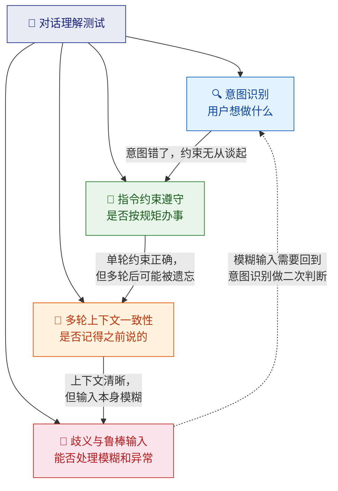
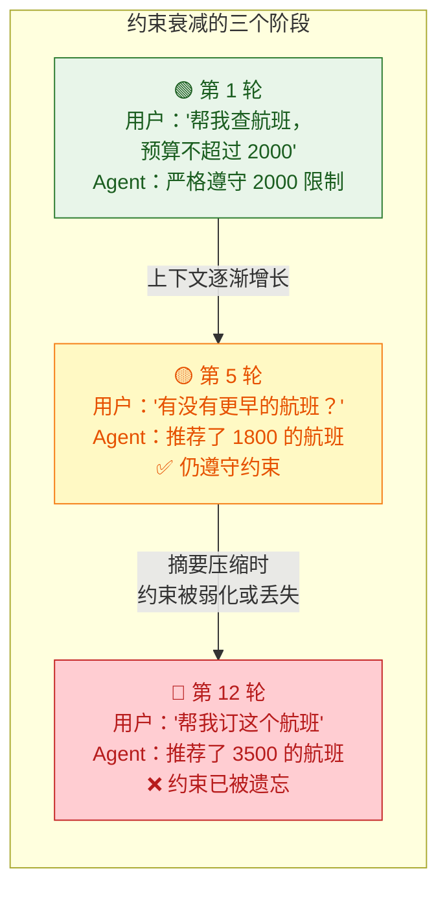
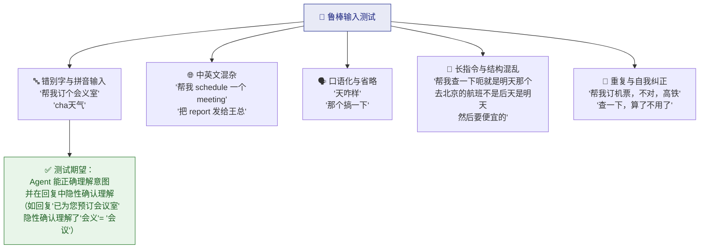
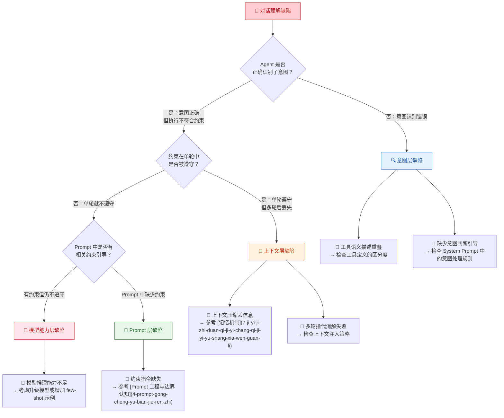

你正在阅读知识库**第四层：Agent 专项测试域**的第一篇文章。在第三层的方法论学习中，你已经掌握了五种测试思维——[能力测试](14-neng-li-ce-shi-yan-zheng-agent-hui-bu-hui-zuo)、[结果测试](15-jie-guo-ce-shi-yan-zheng-agent-zuo-de-dui-bu-dui)、[过程测试](16-guo-cheng-ce-shi-yan-zheng-agent-zhong-jian-bu-zou-de-he-li-xing)、[稳定性测试](17-wen-ding-xing-ce-shi-duo-ci-zhi-xing-de-ke-kao-xing-yu-zhi-xing)和[安全性测试](18-an-quan-xing-ce-shi-yue-quan-zhu-ru-yu-shu-ju-xie-lu-fang-hu)。从这一篇开始，你将进入专项测试域——针对 Agent 系统的每一个核心能力模块，做深、做透、做到可工程化落地。**对话理解测试**是所有专项测试的起点，因为 Agent 的一切行为都建立在"它是否真正听懂了用户在说什么"这个前提之上。意图识别错了，后续的工具选择、任务规划、记忆更新全部会偏；多轮上下文丢了，Agent 就像一个"每句话都失忆"的对话者；歧义没处理好，Agent 要么反复追问让用户烦躁，要么自作主张导致错误操作。这篇文章将系统性地拆解对话理解测试的四大测试域——**意图识别、指令约束遵守、多轮上下文一致性、歧义与鲁棒输入处理**，并为每个域提供缺陷模式、测试设计方法和工程化落地方案。

Sources: [readme.md](readme.md#L108-L124)

## 对话理解在 Agent Loop 中的位置

在 [Agent Loop 核心工作流](9-agent-loop-he-xin-gong-zuo-liu-cong-yong-hu-qing-qiu-dao-zui-zhong-xiang-ying) 中，对话理解发生在两个关键节点：**输入预处理阶段**（意图识别与安全性检查）和**Prompt 拼装阶段**（上下文组装与约束注入）。理解这两个节点，是你做对话理解测试的架构前提。

```mermaid
flowchart LR
    subgraph "Agent Loop 中与对话理解相关的阶段"
        direction TB
        INPUT["📥 用户输入<br/>'帮我查明天北京的天气<br/>然后提醒张三带伞'"]
        
        subgraph "阶段一：输入预处理（对话理解的核心战场）"
            direction TB
            I1["🔍 意图识别<br/>用户想做什么？<br/>查询天气 + 发提醒"]
            I2["📎 实体提取<br/>时间='明天' 城市='北京'<br/>联系人='张三' 动作='带伞'"]
            I3["🧩 约束解析<br/>先查天气，再发提醒<br/>顺序约束 + 因果约束"]
            I4["🛡️ 歧义检测<br/>是否存在模糊表达？<br/>是否需要追问？"]
        end
        
        subgraph "阶段二：Prompt 拼装（多轮上下文的载体）"
            direction TB
            P1["📜 注入历史对话<br/>之前的轮次说了什么"]
            P2["🧠 注入记忆<br/>用户偏好、长期约束"]
            P3["🔧 注入工具定义<br/>Agent 可用哪些工具"]
        end
        
        I1 --> I2 --> I3 --> I4
        I4 --> P1
        P1 --> P2 --> P3
    end
    
    INPUT --> I1
    P3 --> LLM["🤖 模型推理与决策"]
    
    style I1 fill:#E3F2FD,stroke:#1565C0,color:#0D47A1
    style I2 fill:#E8F5E9,stroke:#2E7D32,color:#1B5E20
    style I3 fill:#FFF3E0,stroke:#E65100,color:#BF360C
    style I4 fill:#FCE4EC,stroke:#C62828,color:#B71C1C
    style P1 fill:#F3E5F5,stroke:#6A1B9A,color:#4A148C
    style P2 fill:#EDE7F6,stroke:#4527A0,color:#311B92
    style P3 fill:#E0F7FA,stroke:#00695C,color:#004D40
```

这张图揭示了一个关键洞察：**对话理解不是一次性的动作，而是贯穿整个 Agent Loop 的持续过程。** 即使在模型推理阶段，Agent 仍然可能重新理解用户的意图——比如工具返回结果后，模型可能根据新信息重新判断用户真正想要什么。因此，对话理解测试的覆盖范围应该从输入预处理一直延伸到最终响应生成。

Sources: [readme.md](readme.md#L44-L50), [readme.md](readme.md#L111-L118)

## 四大测试域全景：对话理解测试的完整地图

对话理解测试不是一个单一的测试点，而是由四个相互关联但各有侧重的测试域组成。下表展示了这四个域的核心关注点和它们之间的关系：

| 测试域 | 核心问题 | 关注 Agent 的哪种能力 | 与其他测试域的关系 |
|:---|:---|:---|:---|
| **意图识别** | 用户到底想做什么？ | 从自然语言中准确提取任务意图 | 意图识别是后续所有行为的前提 |
| **指令约束遵守** | Agent 是否照着用户说的做？ | 识别并遵守用户给出的限制条件 | 约束遵守是[结果测试](15-jie-guo-ce-shi-yan-zheng-agent-zuo-de-dui-bu-dui)在对话层面的投影 |
| **多轮上下文一致性** | Agent 是否记得之前说了什么？ | 在多轮交互中保持信息的连续性和一致性 | 与[Memory 测试](22-memory-ce-shi-ji-yi-bao-cun-guo-qi-shi-xiao-yu-kua-hui-hua-ge-chi)高度重叠，但更关注"理解"而非"存储" |
| **歧义与鲁棒输入** | Agent 能否处理模糊、异常或复杂的输入？ | 在非理想输入条件下仍能正确理解 | 综合考验意图识别和上下文理解能力 |

下面逐一深入每个测试域。

Sources: [readme.md](readme.md#L111-L124)

## 测试域一：意图识别——"用户到底想做什么"

### 意图识别的核心挑战

**意图识别是 Agent 对话理解的基石。** 它决定了 Agent 接下来选择什么工具、如何规划任务、以什么方式回复用户。在传统 NLP 系统中，意图识别是一个分类问题——把用户输入映射到预定义的意图类别中。但在 Agent 系统中，意图识别远比分类复杂：用户的表达可能是**多意图混合**的（"帮我查天气并发邮件"）、**隐含意图**的（"明天去上海穿什么"隐含了"查天气"和"穿搭建议"）、甚至是**否定意图**的（"不要用邮件通知我"不是一个动作请求，而是一个约束设定）。

意图识别测试需要覆盖三个递进层次：

| 层次 | 定义 | 测试重点 | 典型缺陷 |
|:---|:---|:---|:---|
| **单一意图识别** | 用户表达了一个明确的任务请求 | Agent 是否正确识别了任务类型 | 用户说"订个会议室"，Agent 当成了"查询会议室" |
| **多意图拆解** | 用户在一次输入中表达了多个任务 | Agent 是否识别了所有意图，是否遗漏了某个子任务 | 用户说"查天气并发邮件"，Agent 只查了天气没发邮件 |
| **隐含意图推理** | 用户没有直接说，但语境中隐含了某个需求 | Agent 是否能从上下文中推断出隐含意图 | 用户说"明天去上海穿什么"，Agent 需要推理出先查天气再给建议 |

Sources: [readme.md](readme.md#L111-L124)

### 意图识别的五种典型缺陷模式

在实际测试中，意图识别的缺陷往往呈现出可复现的模式。理解这些模式，能帮你更快地定位问题根因：

| 缺陷模式 | 定义 | 典型案例 | 根因方向 |
|:---|:---|:---|:---|
| **意图混淆** | Agent 将用户的意图识别为另一个相似但不同的意图 | 用户说"取消明天的会议"，Agent 识别为"查询明天的会议" | [Prompt 工程](4-prompt-gong-cheng-yu-bian-jie-ren-zhi)中意图描述不够区分性，或可用工具的语义描述重叠 |
| **意图遗漏** | 用户表达了多个意图，Agent 只识别了其中部分 | 用户说"帮我查一下项目进度，顺便把报告发给王总"，Agent 只查了进度没发报告 | 模型在处理复合句时的拆解能力不足，或 System Prompt 中缺少"逐句分析"的引导 |
| **意图过度推理** | Agent 识别出了用户没有表达的意图 | 用户说"帮我看看明天的日程"，Agent 不仅查了日程，还自动重新安排了冲突的会议 | System Prompt 中过度鼓励主动行为，缺少"只做用户明确要求的事"的约束 |
| **否定意图误判** | 用户表达的是"不要做某事"，Agent 理解为"要做某事" | 用户说"不要再给我发邮件提醒了"，Agent 反而发送了一封确认邮件 | 否定句处理能力不足，在 [模型常见缺陷](8-mo-xing-chang-jian-que-xian-huan-jue-bu-zhi-xing-yu-lu-bang-xing-wen-ti) 中属于鲁棒性问题 |
| **反问句误判** | 用户用反问的方式表达否定，Agent 理解为正面请求 | 用户说"难道你不应该先确认一下吗？"，Agent 没有执行确认操作 | 修辞理解能力不足，模型对反问句的语用含义理解偏差 |

**测试设计要点**：意图识别测试的用例设计需要特别关注**边界模糊地带**——那些"既可以是 A 意图也可以是 B 意图"的表达。这些边界用例是意图识别模型最容易出错的地方，也是测试价值最高的区域。建议按照"清晰意图 → 相似意图 → 模糊意图 → 异常意图"的梯度设计用例集合。

Sources: [readme.md](readme.md#L111-L124), [readme.md](readme.md#L28-L37)

### 意图识别测试用例设计矩阵

以下矩阵提供了一个系统化的意图识别测试用例生成框架，你可以按此结构组织自己的测试集：

| 用例类型 | 设计思路 | 输入示例 | 期望行为 |
|:---|:---|:---|:---|
| **单一明确意图** | 验证基础意图识别准确率 | "帮我订明天下午 3 点的会议室" | 正确识别为 `book_room`，参数 `time: "明天 15:00"` |
| **复合并列意图** | 验证多意图同时识别 | "查一下北京明天的天气，然后把结果发给张三" | 识别为 `get_weather` + `send_message`，按顺序执行 |
| **条件触发意图** | 验证条件性意图推理 | "如果明天有雨，就提醒我带伞" | 识别为条件触发：先查天气，根据结果决定是否发提醒 |
| **否定意图** | 验证否定表达处理 | "不要给我推荐了，直接订最便宜的那个" | 识别为 `book` + 约束 `cheapest`，不进入推荐模式 |
| **反问意图** | 验证修辞手法理解 | "这价格也太贵了吧，没有更便宜的吗？" | 识别为 `search` + 约束 `cheaper`，而非确认当前价格 |
| **隐含意图** | 验证上下文推理能力 | "明天去上海穿什么？" | 推理出 `get_weather(上海, 明天)` + `suggest_clothing(weather)` |
| **意图修正** | 验证后续轮次的意图更新 | 第 1 轮："帮我订明天去上海的机票" → 第 2 轮："算了，改成高铁" | 第 2 轮识别为意图变更：`cancel_flight` + `book_train` |
| **零意图闲聊** | 验证非任务型输入处理 | "你今天心情怎么样？" | 识别为闲聊，不触发任何工具，直接回复 |

Sources: [readme.md](readme.md#L111-L124), [readme.md](readme.md#L78-L83)

## 测试域二：指令约束遵守——"Agent 是否照着用户说的做"

### 指令约束的定义与分类

**指令约束遵守测试验证的是：Agent 在理解了用户意图之后，是否严格执行了用户附加的所有约束条件。** 这个测试域和[结果测试](15-jie-guo-ce-shi-yan-zheng-agent-zuo-de-dui-bu-dui)中的"约束条件遵守"有重叠，但侧重点不同——结果测试关注的是"最终输出是否符合约束"，而指令约束遵守测试关注的是"Agent 在理解层面是否正确提取和保留了所有约束"。

用户在对话中可能施加的约束条件可以分为以下几类：

| 约束类型 | 定义 | 示例 | 典型遗漏方式 |
|:---|:---|:---|:---|
| **格式约束** | 用户对输出格式的要求 | "用表格展示"、"用英文回复"、"不要超过 100 字" | Agent 回复时忽略了格式要求，给了大段文字 |
| **范围约束** | 用户对操作范围的限定 | "只查最近一周的"、"不要包括已取消的订单" | Agent 查询了更大范围的数据 |
| **条件约束** | 用户设置的触发条件 | "只有在价格低于 2000 的时候才订" | Agent 不管价格直接预订 |
| **排除约束** | 用户明确要求排除的内容 | "不要用邮件，用短信通知"、"不要包含测试数据" | Agent 使用了用户排除的通知方式 |
| **优先级约束** | 用户对多个目标之间优先级的设定 | "优先选便宜的，其次选时间短的" | Agent 优先选了时间短但最贵的 |
| **角色/风格约束** | 用户对 Agent 角色或表达风格的设定 | "用产品经理的口吻解释"、"给小白解释" | Agent 使用了过于技术化的表达 |

Sources: [readme.md](readme.md#L111-L124), [readme.md](readme.md#L78-L83)

### 指令约束测试的关键发现：约束衰减现象

在实际测试中，一个经常被忽视的现象是**约束衰减**——用户在对话早期设定的约束，随着对话轮次的增加，Agent 逐渐"遗忘"或弱化这些约束。这个现象的根因在 [记忆机制：短期记忆、长期记忆与上下文管理](7-ji-yi-ji-zhi-duan-qi-ji-yi-chang-qi-ji-yi-yu-shang-xia-wen-guan-li) 中已经解释过：随着对话轮次增长，上下文窗口被压缩，早期约束可能被摘要压缩掉。

**测试设计要点**：约束衰减测试需要一个**跨轮次渐增式用例**设计策略。具体做法是——在第 1 轮设定约束，然后在后续轮次中逐步增加无关任务（如"帮我算一下 15 * 23"、"今天的日期是什么"），在第 N 轮突然回到与原始约束相关的任务，检查 Agent 是否仍然遵守第 1 轮的约束。通过控制 N 的值（5 轮、10 轮、15 轮……），你可以量化 Agent 的"约束记忆深度"——这是一个非常有价值的质量指标。

Sources: [readme.md](readme.md#L111-L124), [readme.md](readme.md#L33-L35)

### 指令约束测试用例设计

| 用例类型 | 设计思路 | 输入示例 | 检查要点 |
|:---|:---|:---|:---|
| **单约束遵守** | 验证单一约束是否被执行 | "查北京的天气，用英文回复" | 回复语言是否为英文 |
| **多约束同时遵守** | 验证多个约束同时生效 | "查最近一周的航班，直飞，预算 2000 以内，用表格展示" | 格式、范围、价格是否全部满足 |
| **冲突约束处理** | 验证约束冲突时的行为 | "要最便宜的，同时要最快的" | Agent 是否主动告知冲突并寻求用户决策 |
| **约束跨轮次保持** | 验证约束在多轮对话中的持续性 | 第 1 轮"用英文回复" → 第 5 轮"查天气" | 第 5 轮回复是否仍为英文 |
| **否定约束遵守** | 验证排除性约束是否生效 | "不要发邮件，只给我看结果" | Agent 是否只展示了结果，没有触发邮件发送 |
| **约束修改更新** | 验证用户修改约束后的行为 | 第 1 轮"预算 2000" → 第 3 轮"改成 3000 吧" | 后续推荐是否按 3000 预算执行 |

Sources: [readme.md](readme.md#L111-L124)

## 测试域三：多轮上下文一致性——"Agent 是否记得之前说了什么"

### 多轮上下文测试的独特性

**多轮上下文一致性测试是 Agent 对话理解测试中最复杂、也最容易出问题的域。** 它和 [Memory 测试](22-memory-ce-shi-ji-yi-bao-cun-guo-qi-shi-xiao-yu-kua-hui-hua-ge-chi) 有交叉但视角不同——Memory 测试关注的是记忆的存储、检索和过期机制是否正确；多轮上下文一致性测试关注的是，**在记忆系统正常工作的前提下，Agent 是否正确理解和使用这些上下文信息**。换句话说，即使记忆系统完美地保存了用户之前的所有设定，Agent 仍然可能"读了但没理解"或者"理解了但没用上"。

多轮上下文一致性的核心检验维度：

| 检验维度 | 定义 | 典型失败模式 | 影响程度 |
|:---|:---|:---|:---|
| **指代消解** | Agent 是否正确理解用户使用代词指代的对象 | 用户说"它太贵了"，Agent 不知道"它"指的是之前提到的哪个商品 | 高——直接影响任务执行准确性 |
| **信息累积** | Agent 是否随着对话累积用户提供的所有信息 | 用户分三轮说"我要去上海"、"下周五出发"、"要最便宜的"，Agent 在规划时遗漏了其中一条 | 高——导致执行结果不符合用户需求 |
| **状态跟踪** | Agent 是否跟踪对话中发生的状态变化 | 用户先问"有没有高铁"，Agent 回答有，然后用户说"那就订吧"，Agent 应该订高铁而非机票 | 高——需要 Agent 跟踪对话中已达成的中间结论 |
| **话题切换与恢复** | Agent 能否在话题切换后恢复之前的上下文 | 用户先讨论行程，中间插入讨论酒店，然后说"回到之前的行程"，Agent 是否能正确恢复 | 中——考验上下文管理的深度 |
| **隐含信息继承** | 前一轮的隐含信息是否被后续轮次继承 | 用户说"我要订去上海的票"（隐含"票"= 机票），后续说"改时间"，Agent 应该默认修改的是机票 | 中——考验语用推理能力 |

Sources: [readme.md](readme.md#L111-L124), [readme.md](readme.md#L33-L35)

### 指代消解测试：多轮对话中最容易出错的能力

指代消解（Coreference Resolution）是多轮上下文测试中的**高频缺陷区域**。当用户使用"它"、"这个"、"那个"、"他"等代词时，Agent 需要从历史上下文中找到正确的指代对象。这个过程在 [Agent Loop](9-agent-loop-he-xin-gong-zuo-liu-cong-yong-hu-qing-qiu-dao-zui-zhong-xiang-ying) 的 Prompt 拼装阶段完成——历史对话被注入上下文后，模型根据上下文推理代词的指代。

指代消解的测试需要覆盖三种递增难度：

| 难度层级 | 场景特征 | 输入示例 | 期望 Agent 行为 |
|:---|:---|:---|:---|
| **单指代，近距离** | 代词指向上一轮提到的唯一实体 | 第 1 轮："帮我查一下北京明天的天气" → 第 2 轮："那里后天呢？" | 正确推断"那里" = "北京" |
| **多指代，需消歧** | 上下文中有多个可能的指代对象 | 第 1 轮："帮我比较一下 MacBook 和 ThinkPad" → 第 2 轮："它的续航怎么样？" | 正确识别"它"有歧义，追问用户是指哪一个 |
| **跨指代链** | 指代关系形成链条，需要追溯多轮 | 第 1 轮："帮我查航班去上海" → 第 2 轮："最便宜的是哪个？" → 第 3 轮："帮我订那个" | 正确推断"那个" = "第 2 轮返回的最便宜航班" |

**测试设计要点**：指代消解测试用例需要精心构造"陷阱"——在上下文中放置多个相似实体，然后使用模糊代词，观察 Agent 是否能正确消歧或者主动追问。这种"陷阱式"用例是发现指代消解缺陷最有效的方式。

Sources: [readme.md](readme.md#L111-L124), [readme.md](readme.md#L44-L50)

### 多轮上下文一致性测试用例模板

以下是一个系统化的多轮测试用例设计模板，你可以按此结构生成覆盖不同场景的多轮对话测试集：

| 用例编号 | 对话轮次设计 | 测试目标 | 检查点 |
|:---|:---|:---|:---|
| **MC-01 信息累积** | 第 1 轮："我要订机票" → 第 2 轮："去上海" → 第 3 轮："下周五" → 第 4 轮："帮我订吧" | 信息在多轮中逐步补充，Agent 是否累积了所有信息 | 第 4 轮执行时是否包含所有三个条件：机票、上海、下周五 |
| **MC-02 指代消解** | 第 1 轮："帮我看看 MacBook Air 和 MacBook Pro 的价格" → 第 2 轮："贵的那个性价比怎么样？" | Agent 是否正确推断"贵的那个" = MacBook Pro | 第 2 轮的分析对象是否为 MacBook Pro |
| **MC-03 条件修改** | 第 1 轮："帮我查明天去上海的航班" → 第 2 轮："改成后天吧" → 第 3 轮："要最便宜的" | Agent 是否正确更新了条件而非叠加条件 | 查询条件是否为：后天 + 上海 + 最便宜（不是明天 + 后天） |
| **MC-04 话题切换** | 第 1 轮："帮我订机票去上海" → 第 2 轮："对了，帮我查一下上海的酒店" → 第 3 轮："机票订好了吗？" | Agent 是否在话题切换后仍保持之前的任务状态 | 第 3 轮 Agent 是否知道用户问的是机票而非酒店 |
| **MC-05 否定修正** | 第 1 轮："帮我订明天去北京的票" → 第 2 轮："不是北京，是上海" → 第 3 轮："帮我订" | Agent 是否用修正后的信息替换了原始信息 | 最终执行的目的地是上海而非北京 |

Sources: [readme.md](readme.md#L111-L124)

## 测试域四：歧义与鲁棒输入处理——"Agent 能否处理模糊和异常的输入"

### 歧义处理的三种策略与测试期望

**歧义处理测试验证的是：当用户的输入不足以让 Agent 确定唯一意图时，Agent 的应对策略是否合理。** 这是一个极其重要的测试域，因为真实用户的表达从来不像测试用例那样清晰——他们会使用模糊的时间（"最近"）、模糊的指代（"那个文件"）、不完整的条件（"帮我订个会议室"——多大？什么时间？哪栋楼？）。

Agent 面对歧义时有三种可能的策略，每种策略都有其适用场景和测试期望：

| 策略 | Agent 行为 | 适用场景 | 测试期望 | 过度使用的风险 |
|:---|:---|:---|:---|:---|
| **主动追问** | Agent 识别到歧义，向用户提问以获取更多信息 | 缺少关键执行参数（如时间、对象、地点） | 追问内容精准、不重复用户已提供的信息 | 过度追问导致用户体验差——"问个天气还要回答 3 个问题" |
| **合理假设** | Agent 基于上下文做出最合理的推断 | 非关键参数缺失，且有明确的默认值可推断 | 假设合理且 Agent 在回复中明确说明了所做的假设 | 错误假设导致执行结果与用户预期不符 |
| **多方案呈现** | Agent 给出多种可能的解读供用户选择 | 存在多种合理的解读且无法自动消歧 | 列出的选项完整、区分度高、不遗漏合理解读 | 选项过多让用户困惑 |

### 歧义处理测试用例设计

| 歧义类型 | 输入示例 | 期望的 Agent 行为 | 常见缺陷 |
|:---|:---|:---|:---|
| **时间歧义** | "最近有什么好看的？" | 追问或基于合理假设（如"最近"= 最近一周/一个月）给出范围 | Agent 用了"最近三个月"的超出预期范围 |
| **对象歧义** | "帮我发给他"（上下文中有多个"他"） | 追问："您说的'他'是指张三还是李四？" | Agent 随机选了一个，导致发错人 |
| **范围歧义** | "帮我订个会议室" | 追问关键参数：时间、人数、楼层偏好 | Agent 直接订了一个随机会议室 |
| **目标歧义** | "这个怎么样？"（没有指代对象） | 追问："您说的'这个'是指哪个？" | Agent 自行假设了一个对象并开始评价 |
| **否定歧义** | "我不太想去了"（"不太想"不等于"不去"） | 询问确认："您是要取消行程，还是需要考虑一下？" | Agent 直接取消了行程 |

Sources: [readme.md](readme.md#L111-L124), [readme.md](readme.md#L28-L37)

### 鲁棒输入测试：真实用户的表达不会那么"干净"

除了歧义处理之外，对话理解测试还需要覆盖 Agent 对**非标准输入**的处理能力。真实用户的输入可能包含错别字、中英文混杂、口语化表达、方言、语法不规范等情况。Agent 对这些鲁棒输入的处理能力直接影响产品的用户体验。

| 输入类型 | 输入示例 | 测试期望 | 判定方式 |
|:---|:---|:---|:---|
| **错别字** | "帮我订个会义室" | 正确理解为"会议室"，正常执行 | 检查执行结果是否为预订会议室 |
| **拼音混输** | "帮我 cha 一下 tianqi" | 正确理解为"查天气" | 检查是否调用了天气查询 |
| **口语化省略** | "那个报告搞一下" | 需结合上下文理解"那个报告"和"搞一下"的具体含义 | 检查是否正确推断对象和动作 |
| **长句冗余** | "就是那个什么来着，上次我们讨论的那个方案，对就是方案 A，帮我把它改成……改成 B 版本的那个需求" | 能从冗长表达中提取有效信息：修改方案 A 为 B 版本 | 检查是否过滤了冗余信息，只执行了有效指令 |
| **自我纠正** | "帮我订机票……不对我说错了，是高铁票，去上海的" | 以最终纠正为准，订去上海的高铁票 | 检查是否订了高铁而非机票 |
| **方言/网络用语** | "这东西蛮灵的额，帮我整一个" | 理解"整一个"= "买一个/订一个" | 检查是否执行了正确的操作 |

Sources: [readme.md](readme.md#L111-L118), [readme.md](readme.md#L28-L37)

## 对话理解缺陷归因：从症状到根因

当对话理解测试发现缺陷时，你需要做准确的**缺陷归因**——判断问题出在系统的哪个层面。对话理解缺陷可能来自多个不同层面，归因的准确性直接决定了修复方向。

**归因操作要点**：对话理解缺陷的归因依赖于 [Trace 与执行轨迹](13-ri-zhi-trace-yu-zhi-xing-gui-ji-ke-guan-ce-xing)。你需要查看：完整的 Prompt（包括 System Prompt、历史对话注入、工具定义），判断上下文信息是否完整；模型的原始输出（包括中间推理步骤），判断是理解错误还是执行错误；工具调用参数，判断意图是否被正确转化为操作参数。只有看到完整链路，你才能准确区分"它没听懂"和"它听懂了但做错了"。

Sources: [readme.md](readme.md#L78-L83), [readme.md](readme.md#L253-L262)

## 对话理解测试的工程化实践

### 测试数据集设计

对话理解测试的核心工程化产物是**测试数据集**。与单轮测试不同，对话理解测试的每条用例是一个多轮对话序列。以下是推荐的数据集结构：

| 数据集要素 | 说明 | 示例 |
|:---|:---|:---|
| **用例编号** | 唯一标识符 | `DU-INTENT-001`（对话理解-意图识别-001） |
| **对话轮次序列** | 完整的多轮对话输入 | `[{role: "user", content: "..."}, {role: "agent", content: "..."}, ...]` |
| **测试域标签** | 标注该用例属于哪个测试域 | `intent_recognition` / `constraint` / `context` / `ambiguity` |
| **每轮检查点** | 每一轮对话结束后需要验证的内容 | `[轮次1: 意图=查天气, 轮次2: 指代=北京, ...]` |
| **缺陷模式标签** | 该用例针对的缺陷模式 | `coreference_chain` / `constraint_decay` / `multi_intent` |
| **难度等级** | 1-5 级难度评估 | 1=清晰输入，5=高度模糊或复杂多轮 |
| **判定方式** | 结果判定的方式 | `exact_match` / `keyword_coverage` / `semantic_equivalence` / `manual_review` |

### 自动化判定策略

对话理解测试的自动化判定是一个挑战，因为 Agent 的回复措辞可能千变万化。以下是针对不同测试域推荐的自动化判定方式：

| 测试域 | 推荐判定方式 | 实现思路 |
|:---|:---|:---|
| **意图识别** | 工具调用行为检查 | 检查 Trace 中 Agent 是否调用了正确的工具（而非检查回复文本），这是最可靠的意图识别判定方式 |
| **约束遵守** | 关键信息覆盖检查 + 参数校验 | 检查工具调用参数是否符合用户约束（如 `budget <= 2000`），同时检查回复中是否包含约束相关表述 |
| **多轮上下文** | 跨轮次参数一致性检查 | 将第 N 轮的工具调用参数与第 1 轮的用户约束进行自动比对 |
| **歧义处理** | LLM-as-a-Judge 语义评估 | 用大模型评估 Agent 的回复是否合理处理了歧义——是追问了、假设了、还是忽略了 |

**一个关键的工程化洞察**：在对话理解测试中，**工具调用行为是最可靠的判定信号**。用户的意图是否被正确理解，直接体现在 Agent 选择了什么工具、传了什么参数。相比检查回复文本，检查工具调用行为更客观、更稳定、更容易自动化。这要求你在测试基础设施中必须有 [Trace 自动采集](13-ri-zhi-trace-yu-zhi-xing-gui-ji-ke-guan-ce-xing) 能力。

Sources: [readme.md](readme.md#L264-L276), [readme.md](readme.md#L253-L262)

## 对话理解测试工程化清单

将以上方法论落地为可执行的工程实践，以下是你应该建立的测试基础设施，按优先级排序：

| 工程化要素 | 说明 | 优先级 |
|:---|:---|:---:|
| **多轮对话测试集** | 按四大测试域分类的多轮对话用例集合，每条包含完整的轮次序列和逐轮检查点 | 🔴 必须 |
| **Trace 自动采集** | 每次测试执行自动采集完整的对话轨迹，包括每轮的 Prompt、模型输出和工具调用 | 🔴 必须 |
| **意图-工具映射校验脚本** | 自动检查每轮对话中 Agent 的工具选择是否与用户意图匹配 | 🔴 必须 |
| **约束参数自动比对脚本** | 自动将用户在对话中给出的约束与工具调用参数进行一致性比对 | 🔴 必须 |
| **多轮渐增式测试框架** | 支持按轮次自动注入对话、逐步增加干扰轮次、在指定轮次触发检查的测试框架 | 🟡 建议 |
| **歧义处理 LLM-as-a-Judge** | 用大模型自动评估 Agent 对歧义输入的处理质量（追问合理性、假设合理性等） | 🟡 建议 |
| **鲁棒输入变体生成器** | 对标准测试用例自动生成错别字、口语化、中英混杂等鲁棒性变体 | 🟢 进阶 |

**落地建议**：从多轮对话测试集 + Trace 自动采集 + 意图-工具映射校验这三项开始。这三项能覆盖对话理解测试中最核心、最高价值的检测场景，且全部可以实现自动化。鲁棒输入变体生成器是一个"锦上添花"的工具——当你需要评估 Agent 对真实用户表达的适应能力时，它会非常有价值。

Sources: [readme.md](readme.md#L264-L276), [readme.md](readme.md#L402-L430)

## 下一步

对话理解测试帮你验证了 Agent "是否听懂了用户在说什么"。但"听懂了"只是第一步——Agent 接下来需要**规划如何完成用户的任务**：把复杂请求拆解为有序的执行步骤，在执行过程中根据实际情况动态调整计划，遇到失败时回退和重试。这些**任务规划层面**的能力和缺陷，将在下一篇文章中深入拆解：[任务规划测试：拆解、排序、回退与动态调整](20-ren-wu-gui-hua-ce-shi-chai-jie-pai-xu-hui-tui-yu-dong-tai-diao-zheng)。

如果你对多轮上下文一致性测试中涉及的记忆机制细节感兴趣，可以直接跳到：[Memory 测试：记忆保存、过期失效与跨会话隔离](22-memory-ce-shi-ji-yi-bao-cun-guo-qi-shi-xiao-yu-kua-hui-hua-ge-chi)。如果你想把对话理解测试的自动化判定落地为完整的评估流水线，可以参考：[评估体系搭建：Golden Set、Rubric 评分与 LLM-as-a-Judge](27-ping-gu-ti-xi-da-jian-golden-set-rubric-ping-fen-yu-llm-as-a-judge)。