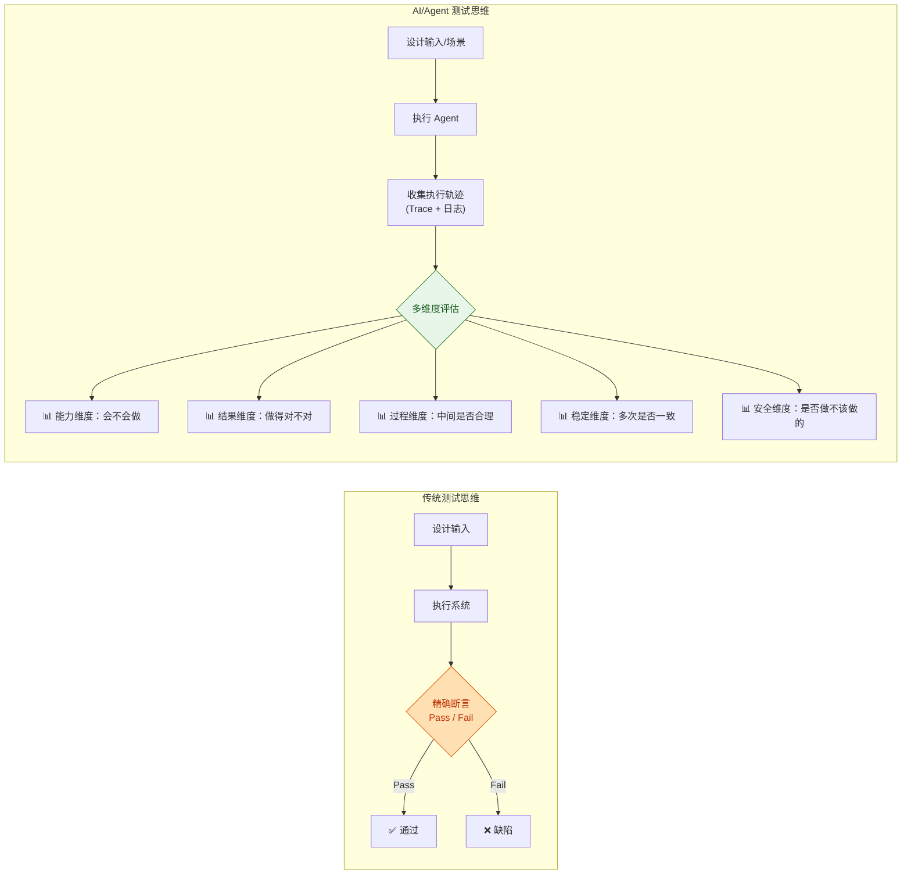
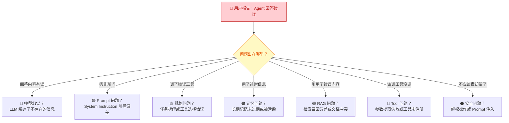
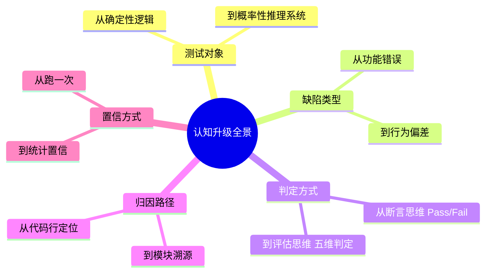

你正在从测试一个"确定性系统"转向测试一个"概率性系统"。这不是简单的技术栈更换，而是一次根本性的**思维范式转换**。本文的目标是帮你完成这次切换——让你清楚地理解：测试对象变了什么、你的哪些经验依然有效、哪些习惯需要修正、以及你应该用什么新的思维方式来审视 AI / Agent 产品。阅读完本文后，你将带着正确的认知框架进入后续的深度学习。

Sources: [readme.md](readme.md#L1-L19)

## 第一个认知转变：测试对象从"确定性逻辑"变成"概率性推理"

传统软件测试的核心假设可以概括为四个字：**输入固定 → 逻辑固定 → 输出可断言**。你设计的每一条用例，都建立在这个假设之上——相同的输入，经过确定性的代码路径，一定产生相同的结果。Assert 断言就是你的终极武器：Pass 或者 Fail，没有中间地带。

AI / Agent 测试打破了这个假设。你面对的系统由 **大模型 + Prompt + Tool 调用 + 记忆 + 规划 + 外部系统 + 安全机制** 组成，它的行为本质上是概率性的。同一个问题，同一个用户，在不同的时间、不同的上下文长度下，Agent 可能选择不同的工具、规划出不同的步骤、甚至给出不完全一致的最终答案。正确性不再是"唯一标准答案"，而变成了一个多维度的评估问题：**输出是否足够好？是否稳定？是否安全？是否可恢复？**

Sources: [readme.md](readme.md#L6-L19)

## 第二个认知转变：缺陷类型从"功能错误"变成"行为偏差"

下表对比了传统测试和 AI/Agent 测试在缺陷形态上的根本差异。理解这些差异，是你建立新测试直觉的第一步：

| 维度 | 传统软件测试 | AI / Agent 测试 |
|:---|:---|:---|
| **输入输出关系** | 输入固定 → 输出确定 | 输入相同 → 输出可能不完全相同 |
| **正确性判定** | 精确断言（Pass / Fail） | 多维评估（是否足够好、是否稳定、是否安全） |
| **典型缺陷** | 功能缺陷、逻辑错误、UI 异常 | 幻觉、规划失败、工具调用错误、记忆污染、权限越界 |
| **测试方法** | 等价类、边界值、回归测试 | 能力测试、过程测试、稳定性测试、评估体系 |
| **核心能力** | 用例设计、自动化脚本 | Prompt 理解、数据集设计、评估指标、Trace 分析 |
| **缺陷归因** | 代码行级别定位 | 需判断属于模型、Prompt、工具、知识库、记忆还是业务逻辑 |
| **可复现性** | 高——相同条件必现 | 低——需多次运行统计概率 |

注意最后一行——**可复现性**的变化。这是新手最容易困惑的地方：你发现了一个缺陷，但重新跑一遍却消失了。这不是你"看错了"，而是系统本身的概率特性在起作用。你需要接受"单次结果不能代表系统质量"这个事实，转而用**统计思维**替代**单次判定思维**。

Sources: [readme.md](readme.md#L6-L19), [readme.md](readme.md#L108-L160)

## 第三个认知转变：从"断言思维"到"评估思维"

这是最核心的一跳。下图展示了两种思维模式的本质区别：

传统测试中，你的工作流是"设计输入 → 执行 → 断言"。AI/Agent 测试中，你的工作流变成了"设计场景 → 执行 → 收集轨迹 → 多维度评估"。你不再问"对不对"，而是同时问五个问题：

1. **能力维度**：Agent 是否具备完成这个任务的能力？（会不会做）
2. **结果维度**：最终输出是否满足业务目标？（做得对不对）
3. **过程维度**：中间步骤是否合理高效？（有没有绕路）
4. **稳定维度**：多跑几次结果是否一致？（是否可靠）
5. **安全维度**：是否做了不该做的事？（是否安全）

这五个维度分别对应后续的五个测试方法论章节：[能力测试](14-neng-li-ce-shi-yan-zheng-agent-hui-bu-hui-zuo)、[结果测试](15-jie-guo-ce-shi-yan-zheng-agent-zuo-de-dui-bu-dui)、[过程测试](16-guo-cheng-ce-shi-yan-zheng-agent-zhong-jian-bu-zou-de-he-li-xing)、[稳定性测试](17-wen-ding-xing-ce-shi-duo-ci-zhi-xing-de-ke-kao-xing-yu-zhi-xing)、[安全性测试](18-an-quan-xing-ce-shi-yue-quan-zhu-ru-yu-shu-ju-xie-lu-fang-hu)。当前你只需要记住这个思维框架，具体方法后续章节会逐步展开。

Sources: [readme.md](readme.md#L66-L106)

## 第四个认知转变：缺陷归因从"代码定位"到"模块溯源"

在传统测试中，你发现一个 Bug，通常能通过调试精确定位到某一行代码。在 Agent 系统中，缺陷的归因路径变得复杂——同一个"回答错误"，可能的原因横跨多个模块。下图展示了 Agent 系统中缺陷溯源的典型路径：

这意味着你需要建立一种新的归因习惯：**看到缺陷时，首先判断它大概率属于模型、Prompt、工具、知识库、记忆还是安全层面的问题。** 你不需要亲自修 Bug，但你必须能准确地"把问题扔给对的人"。这就是为什么后续的 [LLM 核心概念](3-llm-he-xin-gai-nian-token-shang-xia-wen-chuang-kou-cai-yang-can-shu)、[Agent Loop 核心工作流](9-agent-loop-he-xin-gong-zuo-liu-cong-yong-hu-qing-qiu-dao-zui-zhong-xiang-ying) 和 [日志、Trace 与执行轨迹可观测性](13-ri-zhi-trace-yu-zhi-xing-gui-ji-ke-guan-ce-xing) 这些基础章节如此重要——它们是你做缺陷归因的知识底座。

Sources: [readme.md](readme.md#L24-L37), [readme.md](readme.md#L253-L276)

## 第五个认知转变：从"跑一次"到"统计置信"

传统测试中，一个用例跑一次 Pass 就算通过。Agent 测试中，**单次通过不能代表系统质量**。你需要建立"统计置信"的思维：

| 场景 | 传统做法 | Agent 测试做法 |
|:---|:---|:---|
| 功能验证 | 跑 1 次，Pass 即通过 | 跑 20 次，统计成功率和一致性 |
| 回归测试 | 确认不破坏已有功能 | 每个版本跑全量 Golden Set，对比版本间指标变化 |
| 边界测试 | 输入极端值看是否崩溃 | 变换问法、上下文长度、多语言等维度看鲁棒性 |
| 缺陷确认 | 复现 → 提 Bug | 多次复现 → 计算触发概率 → 评估影响范围 |

这种思维转变要求你在测试设计阶段就考虑"样本量"和"统计指标"，而不是仅仅设计"一条用例"。这也是为什么 [评估体系搭建](27-ping-gu-ti-xi-da-jian-golden-set-rubric-ping-fen-yu-llm-as-a-judge) 和 [自动化评测工程](28-zi-dong-hua-ping-ce-gong-cheng-jiao-ben-shu-ju-ji-yu-hui-gui-kan-ban) 是整个知识框架的顶层——它们让"统计置信"从手工操作升级为工程化的可持续实践。

Sources: [readme.md](readme.md#L93-L106), [readme.md](readme.md#L264-L276)

## 你已有的能力不会失效

在列举了这么多"变化"之后，必须强调一件重要的事：**你已有的测试能力不会失效**。下表清晰地展示了哪些能力可以继续用、哪些需要升级、哪些是全新需要学习的：

| 能力类型 | 具体能力 | 状态 | 说明 |
|:---|:---|:---:|:---|
| **保留** | 功能测试设计 | ✅ 沿用 | 用例拆解、场景覆盖的思维方式完全适用 |
| **保留** | Bug 归因思维 | ✅ 沿用 | 只是归因对象从代码行变成了系统模块 |
| **保留** | 自动化测试思维 | ✅ 沿用 | 只是自动化脚本从接口/UI 升级为模型调用+评估 |
| **保留** | 回归测试意识 | ✅ 沿用 | 每次模型更新、Prompt 修改都需要回归验证 |
| **升级** | 数据集设计 | 🔄 升级 | 从"测试数据"升级为"Golden Set + 对抗样本集 + 多轮会话集" |
| **升级** | Python 自动化 | 🔄 升级 | 从"接口/UI 自动化"升级为"调用模型→比对→评分→出报告"全链路 |
| **新增** | Prompt / LLM 理解 | 🆕 新增 | 不为写 Prompt，而为看到缺陷时能定位问题归属 |
| **新增** | 评估指标设计 | 🆕 新增 | 成功率、幻觉率、引用正确率、Token 成本等量化指标 |
| **新增** | Trace / 日志分析 | 🆕 新增 | Agent 测试不看执行轨迹，基本测不深 |

你的转型方向不是"放弃测试基础去学 AI"，而是**在已有基础上补齐五项新能力**：Prompt/LLM 理解、数据集设计、评估指标设计、Trace 分析、Python 自动化升级。

Sources: [readme.md](readme.md#L336-L371)

## 一张图总结：认知升级全景

将以上五个认知转变整合到一起，你可以用下面这张全景图来检视自己的思维是否已经完成了切换：

你可以用这张图做一次自我检测：**面对一个 Agent 测试任务时，你是否已经习惯性地用右边的思维方式在思考？** 如果还没有，也不用焦虑——认知升级本身就需要反复练习。后续章节会通过大量具体的案例和实操方法，帮你把这个新的思维模式真正内化。

Sources: [readme.md](readme.md#L6-L19)

## 下一步：从认知到行动

现在你已经完成了从"功能测试思维"到"AI/Agent 测试思维"的认知切换。你的下一步是进入**第一层：AI 与大模型基础认知**，开始补齐理解 Agent 系统所需的基础知识。建议按以下顺序阅读：

1. [LLM 核心概念：Token、上下文窗口、采样参数](3-llm-he-xin-gai-nian-token-shang-xia-wen-chuang-kou-cai-yang-can-shu) — 理解大模型的基本运作原理
2. [Prompt 工程与边界认知](4-prompt-gong-cheng-yu-bian-jie-ren-zhi) — 理解 Prompt 的能力边界，为缺陷归因打基础
3. [工具调用（Tool Calling / Function Calling）机制](5-gong-ju-diao-yong-tool-calling-function-calling-ji-zhi) — 理解 Agent 最核心的"做事"能力
4. [模型常见缺陷：幻觉、不一致性与鲁棒性问题](8-mo-xing-chang-jian-que-xian-huan-jue-bu-zhi-xing-yu-lu-bang-xing-wen-ti) — 建立对模型固有缺陷的直觉

这些章节将为你后续理解 Agent 架构、设计测试用例、搭建评估体系打下坚实的知识底座。