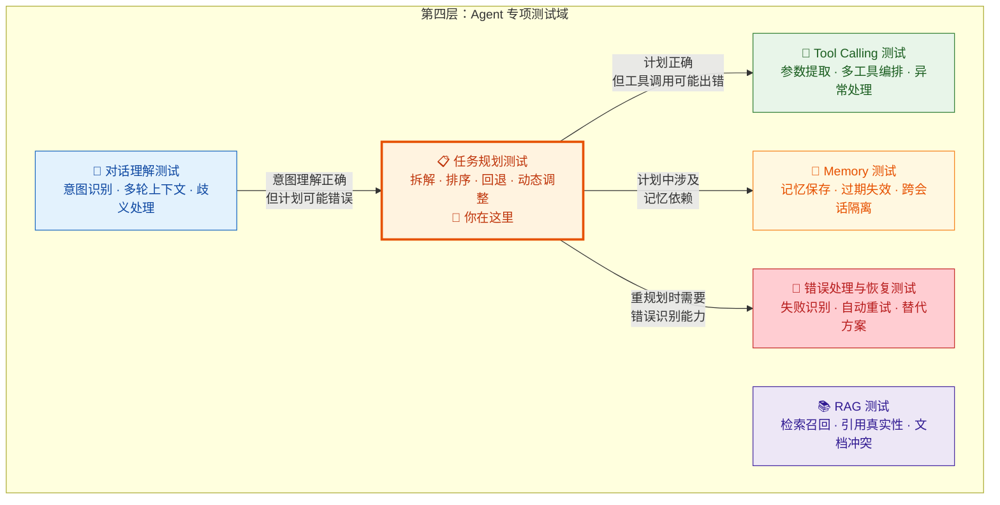
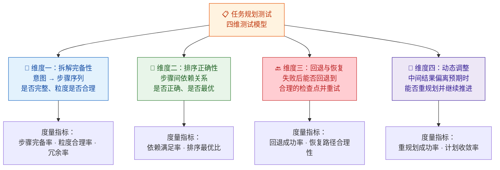
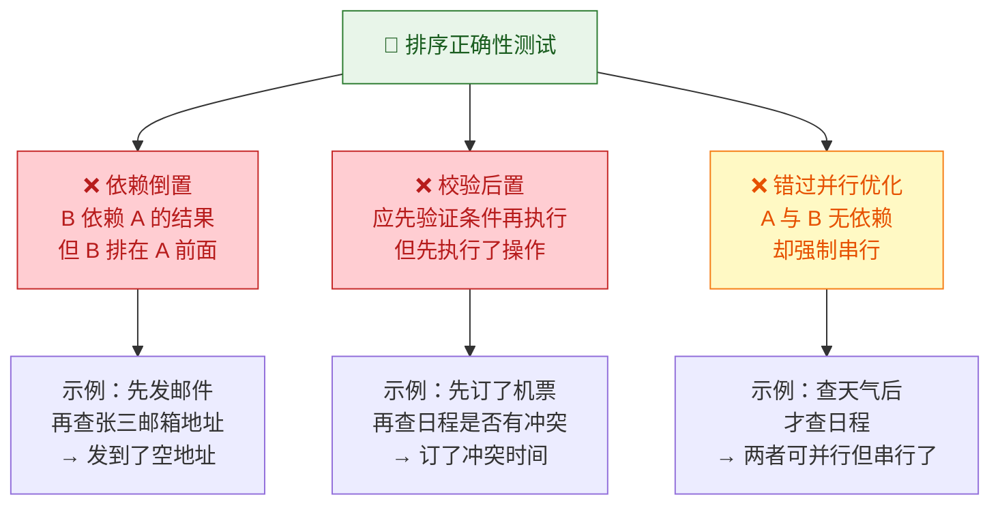
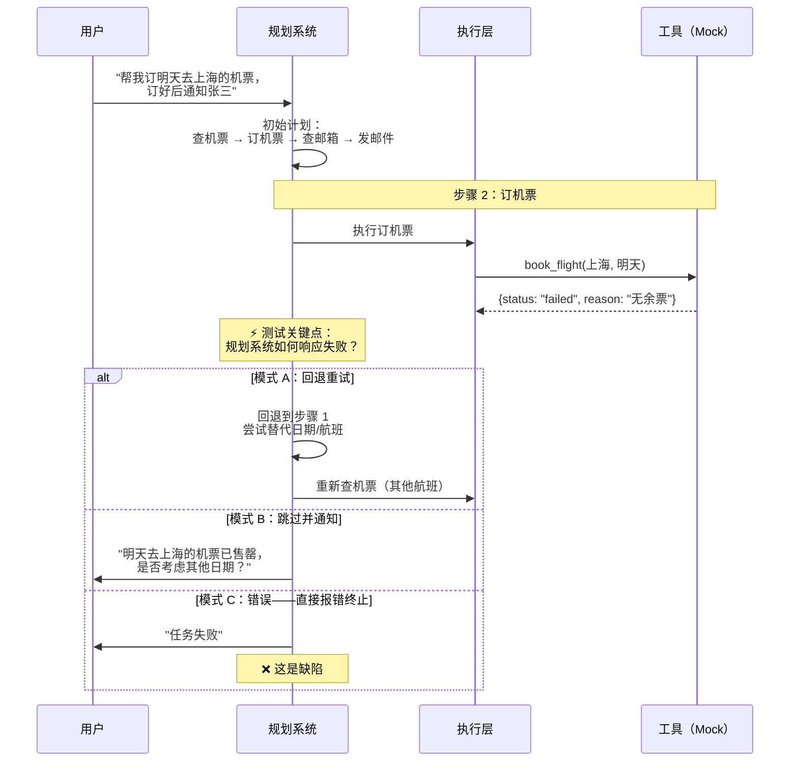
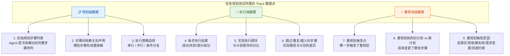
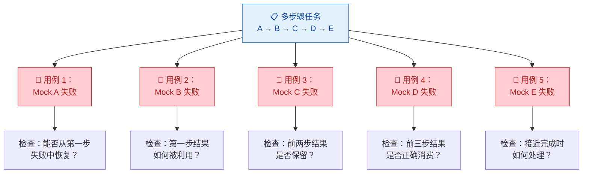
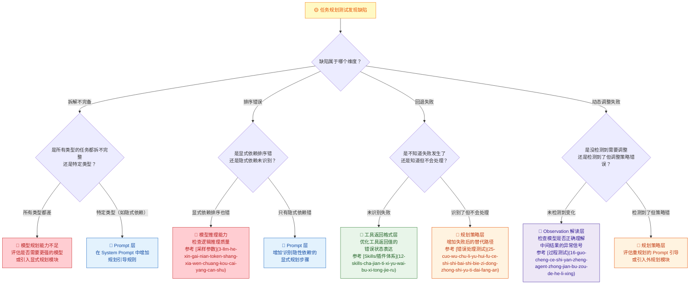
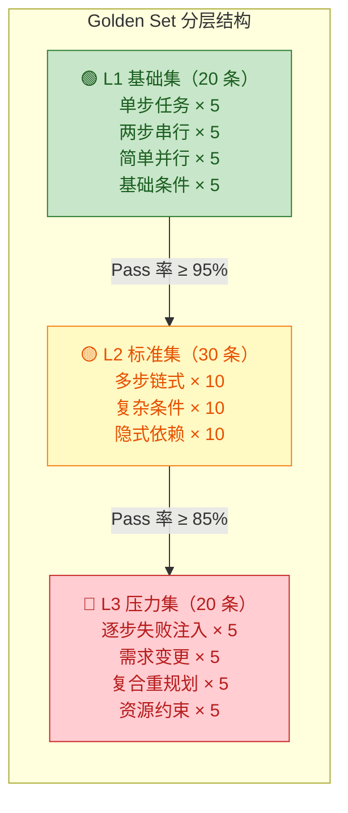

你正在阅读知识库**第四层：Agent 专项测试域**的第二篇文章。在前一篇 [对话理解测试](19-dui-hua-li-jie-ce-shi-yi-tu-shi-bie-duo-lun-shang-xia-wen-yu-qi-yi-chu-li) 中，你验证了 Agent 是否能准确理解用户意图并维持多轮上下文。现在你要回答一个更深层的问题：**当 Agent 正确理解了意图之后，它能否把意图转化为可执行、有序、可调整的任务计划？** 这就是任务规划测试的核心命题——它不关心 Agent "能不能做"（那是能力测试的范畴），也不只关心"最终做对了没有"（那是结果测试的范畴），它要验证的是**从意图到执行之间的"规划环节"质量如何**。

Sources: [readme.md](readme.md#L108-L138), [readme.md](readme.md#L476-L479)

## 任务规划测试在测试体系中的定位

在 [会话管理、任务规划与调度机制](11-hui-hua-guan-li-ren-wu-gui-hua-yu-diao-du-ji-zhi) 中你已经理解了任务规划的架构原理——任务拆解、依赖排序、执行策略选择、动态重规划这四个子能力如何协同工作。本文将把那些建筑知识转化为**可执行的测试策略**。先通过一张定位图厘清任务规划测试与其他专项测试域的边界关系：

**一个关键的区分原则**：任务规划测试与 [过程测试](16-guo-cheng-ce-shi-yan-zheng-agent-zhong-jian-bu-zou-de-he-li-xing) 之间存在交叉，但关注点不同——过程测试关注"单次执行中每一步是否合理"（微观视角），任务规划测试关注"规划能力本身是否健全"（宏观视角）。具体来说：过程测试发现"这一步不该查天气"，归因方向是"模型在上下文中做了错误决策"；任务规划测试发现"整个计划遗漏了查天气这一步"，归因方向是"规划模块的任务拆解能力不足"。两者协作才能完整覆盖从意图到执行的全链路质量。

Sources: [readme.md](readme.md#L108-L138), [readme.md](readme.md#L44-L50)

## 任务规划测试的四维测试模型

任务规划能力可以被拆解为四个独立的测试维度，每个维度对应规划链路中的不同环节，也有不同的缺陷模式和测试策略。下面这张图展示了四维模型的整体架构：

下面逐一展开每个维度的测试设计。

Sources: [readme.md](readme.md#L126-L138), [readme.md](readme.md#L44-L50)

### 维度一：拆解完备性——"计划够不够？"

**拆解完备性是任务规划测试的基础维度。** 在 [任务规划架构](11-hui-hua-guan-li-ren-wu-gui-hua-yu-diao-du-ji-zhi) 中你已经了解了任务拆解的四个质量维度（完备性、粒度、无冗余、可执行性），这里将其转化为可操作的测试策略。

拆解测试的核心逻辑是：给定一个明确的用户意图，Agent 的规划输出是否覆盖了完成该意图所需的所有原子步骤，且每个步骤粒度适当、无冗余操作。readme 中将任务规划测试列为"第一优先级"，并明确指出关注点："是否会拆任务"、"是否存在漏步骤"、"是否会过度规划"。

| 测试场景 | 用户请求示例 | 期望的最优拆解 | 常见拆解缺陷 | 严重程度 |
|:---|:---|:---|:---|:---:|
| **多依赖链式任务** | "帮我安排下周去上海出差" | 查日程 → 查天气 → 订机票 → 订酒店 → 发确认邮件 | 遗漏查日程步骤，直接订机票导致时间冲突 | 🔴 高 |
| **条件分支任务** | "查一下明天天气，下雨就订伞，不下就订墨镜" | 查天气 → 判断降雨概率 → 选一条分支执行 | 两个分支都执行了，或条件判断逻辑缺失 | 🔴 高 |
| **简单单步任务** | "帮我查一下北京明天天气" | 查天气（1 步） | 拆为"思考天气含义 → 查天气 → 整理天气信息"3 步 | 🟢 低 |
| **隐式依赖任务** | "给张三发邮件说会议改期了" | 查张三邮箱 → 查原会议信息 → 编写邮件 → 发送 | 直接发邮件但不知道张三的邮箱地址 | 🔴 高 |
| **并行可合并任务** | "帮我查北京和上海明天的天气" | 一次查询两个城市 或 并行查两次 | 查了北京天气后又查了一次北京天气（重复） | 🟡 中 |

**测试用例设计策略**——**层级递进法**：按照任务复杂度递增的顺序设计用例，从单步任务（验证基本能力）→ 两步串行任务（验证简单依赖）→ 多步链式任务（验证完备性）→ 含条件分支任务（验证推理能力）→ 含隐式依赖任务（验证深层推理）。每一层级的 Pass 率决定了你是否可以进入下一层级的测试。

**度量指标**：对于每条测试用例，定义期望步骤集合 `E` 和实际步骤集合 `A`，计算三个核心指标：

| 指标 | 计算公式 | 含义 | 合格阈值 |
|:---|:---|:---|:---:|
| **步骤完备率** | `\|E ∩ A\| / \|E\|` | 期望步骤中被实际覆盖的比例 | ≥ 95% |
| **冗余率** | `\|A - E\| / \|A\|` | 实际步骤中多余步骤的比例 | ≤ 20% |
| **粒度偏差率** | 粒度不合格步骤数 / 总步骤数 | 粒度过粗或过细的步骤占比 | ≤ 10% |

Sources: [readme.md](readme.md#L126-L138), [readme.md](readme.md#L476-L479)

### 维度二：排序正确性——"先做什么后做什么？"

**排序正确性检验 Agent 是否能正确分析步骤间的依赖关系并生成合理的执行顺序。** 即使拆解出的步骤都是正确的，如果排序错误（如先订机票再查日程），任务结果仍然可能错误。在 [任务规划架构](11-hui-hua-guan-li-ren-wu-gui-hua-yu-diao-du-ji-zhi) 中你已经了解到，规划系统通常使用 DAG（有向无环图）表示依赖关系——排序正确性的本质就是 DAG 的拓扑排序是否合理。

排序缺陷有三种典型模式，每种都有明确的触发场景和检测方法：

| 排序缺陷模式 | 定义 | 检测方法 | 典型测试用例 |
|:---|:---|:---|:---|
| **依赖倒置** | 后续步骤依赖前序结果，但执行顺序颠倒 | 在 Trace 中检查每个步骤的输入参数是否在前序步骤的输出中可获取 | "查天气后决定带什么"——如果 Agent 先执行了"买伞"再查天气 |
| **校验后置** | 应该先验证条件再执行，但先执行了不可逆操作 | 设计含"如果…就…"条件的任务，检查是否先验证了条件 | "如果机票低于 2000 就订"——如果 Agent 先订了票再查价格 |
| **错过并行优化** | 无依赖的步骤被强制串行，导致效率低下 | 对比实际执行路径与最优 DAG 拓扑排序 | "查北京天气和上海天气"——如果 Agent 先查北京、等结果、再查上海 |

**测试设计关键技巧**——**依赖注入法**：设计一些步骤之间的"隐性依赖"——这些依赖不是用户明确说出来的，而是任务逻辑本身隐含的。例如用户说"帮我给张三发邮件说会议改期了"，隐含的依赖是：发邮件需要张三的邮箱地址（需要先查通讯录），邮件内容需要原会议信息（需要先查日历）。**隐性依赖的识别能力是区分"好的规划"和"差的规划"的关键分水岭。**

**度量指标**：

| 指标 | 计算方法 | 含义 | 合格阈值 |
|:---|:---|:---|:---:|
| **依赖满足率** | 满足前置依赖的步骤数 / 总步骤数 | 每个步骤的输入是否在前序步骤中可获得 | 100% |
| **排序最优比** | 达到最优排序的用例数 / 总用例数 | 是否找到了并行优化的机会 | ≥ 80% |

Sources: [readme.md](readme.md#L126-L138), [readme.md](readme.md#L44-L50)

### 维度三：回退与恢复——"失败了怎么办？"

**回退与恢复是任务规划测试中"非理想路径"测试的核心维度。** 前两个维度测试的是"一切顺利时的规划质量"，但 Agent 面对的是真实的、充满不确定性的环境——工具可能失败、API 可能返回错误、外部数据可能不可用。readme 中明确将"失败后不会回退和重试"列为任务规划的典型缺陷。

回退与恢复测试的本质是：**当计划中的某个步骤失败时，Agent 的规划系统是否具备"回到安全检查点、尝试替代路径"的能力。** 在 [错误处理与恢复测试](25-cuo-wu-chu-li-yu-hui-fu-ce-shi-shi-bai-shi-bie-zi-dong-zhong-shi-yu-ti-dai-fang-an) 中你将从工具层面验证错误识别和重试机制，本维度则从规划层面验证——当错误发生后，规划系统的"全局策略"是否正确。

| 失败场景 | 触发方式（Mock） | 期望的规划行为 | 常见缺陷 |
|:---|:---|:---|:---|
| **工具调用失败** | 返回 `{status: "error"}` | 识别失败 → 尝试替代方案或通知用户 | 忽略错误继续执行后续步骤 |
| **空结果** | 返回 `{data: null}` | 判断为"无数据" → 调整查询条件或告知用户 | 编造虚假结果继续推进 |
| **部分成功** | 返回 `{booked: true, seat: "无"}` | 识别部分成功 → 继续可执行步骤，调整受阻步骤 | 将部分成功误判为完全成功 |
| **超时** | 工具执行超过阈值 | 触发超时策略 → 重试或切换路径 | 无限等待或直接放弃整个任务 |

**测试设计策略**——**逐步失败法**：对于一条多步骤测试用例，依次 Mock 每个步骤失败，验证规划系统的响应。例如一条 5 步的任务，分别 Mock 步骤 1 失败、步骤 2 失败……步骤 5 失败，共产生 5 条测试子用例。这种方法能系统性地覆盖"失败发生在计划中任意位置"的场景，避免遗漏"只在某一步失败时才会触发的缺陷"。

**度量指标**：

| 指标 | 计算方法 | 含义 | 合格阈值 |
|:---|:---|:---|:---:|
| **回退成功率** | 成功回退并继续的次数 / 总失败次数 | 失败后能否回到安全点继续 | ≥ 85% |
| **替代方案合理性** | 人工评判替代方案是否合理 | 回退后的新路径是否比直接报错更好 | LLM-as-a-Judge ≥ 4/5 |
| **任务恢复率** | 经过回退后最终成功完成任务的次数 / 总任务数 | 即使经历失败，任务最终完成的比例 | ≥ 70% |

Sources: [readme.md](readme.md#L126-L138), [readme.md](readme.md#L216-L224)

### 维度四：动态调整——"计划赶不上变化怎么办？"

**动态调整是任务规划测试中最高阶的维度，它验证的是规划的"进化能力"。** 在 [任务规划架构](11-hui-hua-guan-li-ren-wu-gui-hua-yu-diao-du-ji-zhi) 的"动态重规划"章节中，你已经了解了四种重规划触发模式（结果异常型、依赖失败型、需求变更型、资源约束型）。本维度将其转化为可执行的测试策略。

动态调整与维度三（回退与恢复）的关键区别在于：**回退是"原地修复"——回到上一个安全点重试或换路径；动态调整是"全局重规划"——基于新的中间结果，可能完全改变后续的执行计划。** 例如用户说"帮我订下周去上海的机票"，查到天气是暴风雨预警后，优秀的 Agent 不仅会提醒用户（回退），还可能主动建议"是否考虑改去其他城市"或"是否改为高铁出行"（动态调整）。

| 重规划触发类型 | 测试场景设计 | Mock 策略 | 期望的规划行为 |
|:---|:---|:---|:---|
| **结果异常型** | 查天气返回暴风预警 | `get_weather` 返回 `{warning: "暴风"}` | 插入"天气提醒"步骤 + 调整后续行程 |
| **依赖失败型** | 机票预订返回"无余票" | `book_flight` 返回 `{sold_out: true}` | 尝试替代日期/航班，或建议高铁 |
| **需求变更型** | 用户中途说"不要订酒店了" | 在执行到步骤 3 时注入用户新消息 | 移除酒店相关步骤，保留已完成步骤 |
| **资源约束型** | 长任务中 Token 接近上限 | Mock 超长工具返回结果，膨胀上下文 | 压缩后续步骤，优先完成核心子任务 |

**一个高级测试场景——复合重规划**：设计一个"多重意外叠加"的场景——第一步返回天气异常（触发结果异常型重规划），第二步在重规划后的新路径中又遇到工具失败（触发依赖失败型重规划），观察规划系统能否在**连续两次重规划**后仍然保持任务推进能力。这个场景能区分出"能处理单次异常"和"具备真正的动态适应能力"的 Agent。

**度量指标**：

| 指标 | 计算方法 | 含义 | 合格阈值 |
|:---|:---|:---|:---:|
| **重规划成功率** | 重规划后任务最终完成的比例 | 重规划是否真正帮助任务推进 | ≥ 75% |
| **计划收敛率** | 重规划后新计划被完整执行的比例 | 新计划是否"二次失败" | ≥ 80% |
| **重规划必要性** | 重规划确实改变了后续路径的比例 | 避免无效重规划（做了重规划但路径没变） | ≥ 90% |

Sources: [readme.md](readme.md#L126-L138), [readme.md](readme.md#L216-L224)

## 任务规划测试的前提：如何"看到"规划过程

任务规划测试与 [能力测试](14-neng-li-ce-shi-yan-zheng-agent-hui-bu-hui-zuo) 和 [结果测试](15-jie-guo-ce-shi-yan-zheng-agent-zuo-de-dui-bu-dui) 的一个根本区别在于：**你必须看到 Agent 的规划过程，而不仅仅是执行结果。** 在 [日志、Trace 与执行轨迹可观测性](13-ri-zhi-trace-yu-zhi-xing-gui-ji-ke-guan-ce-xing) 中你已经详细学习了三层可观测体系，对于任务规划测试，你需要重点关注以下 Trace 数据点：

| 规划测试维度 | 依赖的 Trace 数据点 | 不可观测时的替代方案 |
|:---|:---|:---|
| **拆解完备性** | 初始规划步骤列表（P1） | 通过执行 Trace 逆推 Agent 的隐含计划 |
| **排序正确性** | 依赖关系声明（P2）+ 实际执行顺序（E2） | 通过执行 Trace 分析步骤间的数据流依赖 |
| **回退与恢复** | 每步执行结果（E1）+ 跳过/重复/插入步骤（E3） | 通过执行 Trace 中的时间线断裂推断回退行为 |
| **动态调整** | 重规划触发点（R1）+ 新旧计划对比（R2） | 极难替代——如果 Trace 不记录重规划，此维度几乎无法测试 |

**操作建议**：如果你的被测系统采用了 [内规划模式](11-hui-hua-guan-li-ren-wu-gui-hua-yu-diao-du-ji-zhi)（规划过程隐含在模型推理中），你需要在 System Prompt 中增加"在调用工具前先输出当前计划"的引导，将隐含规划显式化。对于外规划模式（独立规划模块），你可以直接获取规划输出进行验证。正如 readme 中强调的：**"Agent 测试不看 Trace，基本测不深"**——任务规划测试尤其如此。

Sources: [readme.md](readme.md#L253-L262), [readme.md](readme.md#L364-L365)

## 测试用例设计方法论：规划质量三板斧

基于四维测试模型，以下三种用例设计方法能系统性地覆盖任务规划的核心场景。

### 方法一：基准计划对比法

**基准计划对比法是拆解完备性和排序正确性的核心测试方法。** 它在 [过程测试](16-guo-cheng-ce-shi-yan-zheng-agent-zhong-jian-bu-zou-de-he-li-xing) 的"最优路径对比法"基础上，增加了规划层级的专门设计。

| 步骤 | 操作内容 | 产出物 |
|:---|:---|:---|
| **Step 1** | 定义用户请求 + 期望的基准计划（步骤列表、步骤间依赖、执行策略） | 基准计划定义文件 |
| **Step 2** | 执行测试，采集包含规划输出的完整 Trace | 规划 Trace 数据 |
| **Step 3** | 从 Trace 中提取 Agent 的实际计划（步骤列表、依赖关系、执行顺序） | 实际计划结构化数据 |
| **Step 4** | 将实际计划与基准计划对比，计算四维指标 | 规划质量报告 |

**关键设计要点**：基准计划不应只有一条。对于每条用例，建议定义三个等级：

| 等级 | 定义 | 判定方式 |
|:---|:---|:---|
| **最优计划** | 步骤最少、并行度最高、排序最合理 | 步骤完备率 = 100%，冗余率 = 0%，排序最优 |
| **可接受计划** | 可能多 1-2 步或错过 1 个并行优化，但不影响结果 | 步骤完备率 ≥ 90%，冗余率 ≤ 20% |
| **不可接受计划** | 遗漏关键步骤、排序导致错误、或过度规划 | 不满足上述条件 |

Sources: [readme.md](readme.md#L84-L91), [readme.md](readme.md#L253-L262)

### 方法二：逐步失败注入法

**逐步失败注入法是回退与恢复维度和动态调整维度的核心测试方法。** 它的设计思路是：对一条多步骤任务，依次 Mock 每个步骤失败，系统性地覆盖"失败发生在计划中任意位置"的场景。

**进阶策略——复合失败注入**：在基本逐步失败注入的基础上，还可以设计"连续两步失败"、"交替成功与失败"等复合场景，验证规划系统在多次失败累积情况下的行为退化曲线。

| 注入模式 | 描述 | 覆盖的测试维度 | 预期发现 |
|:---|:---|:---|:---|
| **单步失败** | 只 Mock 一个步骤失败 | 回退策略、错误识别 | 单点恢复能力 |
| **连续失败** | 连续 Mock 两个步骤失败 | 累积失败的应对 | 规划系统是否"放弃" |
| **交替成功/失败** | 步骤 1 成功 → 步骤 2 失败 → 重试后步骤 2 成功 → 步骤 3 失败 | 多次重规划能力 | 规划系统是否出现状态混乱 |
| **部分结果失败** | 工具返回结果但部分字段为空 | 部分成功的处理 | 是否能利用有效部分继续推进 |

Sources: [readme.md](readme.md#L216-L224), [readme.md](readme.md#L126-L138)

### 方法三：需求变更干扰法

**需求变更干扰法是动态调整维度的高级测试方法。** 它模拟用户在任务执行过程中修改需求的场景——这是 Agent 在真实使用中最常遇到的挑战之一。readme 中明确指出关注"是否能在中途根据结果调整计划"。

| 干扰时机 | 设计思路 | 典型用例 |
|:---|:---|:---|
| **规划后、执行前** | 在 Agent 输出计划后、开始执行前，用户说"等等，改一下" | Agent 计划查天气+发邮件，用户说"改成查新闻+发邮件" |
| **执行中途** | 在某些步骤已完成时，用户修改后续要求 | 已查了天气，用户说"不要发邮件了，发 Slack 消息" |
| **临近完成时** | 在最后一步即将完成时，用户说"算了，全部取消" | 邮件即将发送，用户说"不发了"——已完成的步骤能否正确回滚？ |

**测试关注点**：需求变更后，规划系统是否正确处理了"已完成步骤的保留/回滚"问题。例如，用户已经查了天气并获取了结果，然后说"不要发邮件了"——已完成的天气查询结果应该被保留（因为不需要撤销），但邮件相关的步骤应该被移除。如果规划系统将所有已完成步骤都回滚了（包括无关的天气查询），这就是一个规划逻辑缺陷。

Sources: [readme.md](readme.md#L126-L138), [readme.md](readme.md#L216-L224)

## 缺陷归因：规划缺陷的根因定位

当任务规划测试发现缺陷时，下一步是**准确归因**——判断缺陷来自规划链路的哪个环节。不同的根因指向完全不同的修复方向，归因错误会导致"改了 Prompt 但问题是模型能力不足"的无效迭代。

**归因的核心判断标准**：区分"**模型能力问题**"和"**系统设计问题**"。具体方法是——在 Trace 中找到规划失败的那一轮模型推理，检查模型是否看到了足够的信息来做出正确的规划决策。如果模型看到了所有必要信息但仍然规划错误（如上下文中明明有"查日程"的工具定义，但模型没有在计划中包含查日程步骤），这指向模型能力不足；如果模型没有看到必要信息（如上下文被截断导致工具定义丢失），这指向系统设计问题（上下文管理或 Prompt 拼装缺陷）。

Sources: [readme.md](readme.md#L253-L262), [readme.md](readme.md#L386-L393)

## 内规划 vs 外规划：不同的测试策略

在 [任务规划架构](11-hui-hua-guan-li-ren-wu-gui-hua-yu-diao-du-ji-zhi) 中你已经了解到内规划（模型内嵌）和外规划（独立模块）两种架构模式。它们对测试策略有深刻影响：

| 测试维度 | 内规划的测试策略 | 外规划的测试策略 |
|:---|:---|:---|
| **拆解完备性** | 通过 Prompt 引导模型在调用工具前先输出计划文本，然后解析文本验证 | 直接获取规划模块的结构化输出进行断言 |
| **排序正确性** | 需要从执行 Trace 逆推隐含的依赖关系，间接验证 | 规划模块可能输出显式的依赖图，直接验证 |
| **回退与恢复** | 回退逻辑隐含在模型推理中，需要通过"注入失败→观察后续行为"间接测试 | 可以直接检查规划模块的回退策略输出 |
| **动态调整** | 重规划发生在模型推理中，难以区分"原始计划"和"调整后的计划" | 可以获取重规划前后的计划对比 |
| **可自动化程度** | 中等——需要解析模型输出来提取规划信息 | 高——规划输出是结构化的，可直接断言 |

**混合模式的测试建议**：ArkClaw / OpenClaw 这类产品通常采用混合模式——简单任务内规划，复杂任务外规划。测试时需要额外验证一个关键点：**规划模式的切换边界是否正确**——哪些任务被分配给了内规划、哪些分配给了外规划，以及切换逻辑本身是否存在缺陷。设计一些"刚好在边界复杂度"的测试用例（如 3 步任务，如果阈值是 2 步就外规划、否则内规划），验证切换行为。

Sources: [readme.md](readme.md#L44-L50), [readme.md](readme.md#L386-L393)

## 任务规划测试的 Golden Set 构建指南

将以上方法论落地为可持续使用的测试资产，你需要构建一套**任务规划 Golden Set**——一组覆盖不同复杂度的基准测试用例集，用于回归评估规划能力的变化趋势。

| Golden Set 要素 | 说明 | 示例 |
|:---|:---|:---|
| **用例编号** | 按层级和类型编号 | `PLAN-L2-CHAIN-007` |
| **用户请求** | 模拟的真实用户输入 | "帮我安排下周三去上海的出差，查一下天气，如果下雨带伞，订机票和酒店，最后发邮件通知张三" |
| **基准计划** | 人工定义的期望最优计划 | `[查日程冲突, 查上海天气, (条件分支:下雨→提醒带伞), 订机票, 订酒店, 查张三邮箱, 发邮件通知]` |
| **依赖关系图** | 步骤间的前后依赖 | `订机票 → 查日程冲突`（必须先查日程才能订票） |
| **可接受偏差** | 允许的规划偏差范围 | 步骤数 ±1，允许遗漏 1 个非关键步骤 |
| **失败 Mock 配置** | 对应逐步失败注入的 Mock 规则 | `book_flight → {status: "sold_out"}` |
| **评分 Rubric** | 规划质量的评分标准 | 参见 [评估体系搭建](27-ping-gu-ti-xi-da-jian-golden-set-rubric-ping-fen-yu-llm-as-a-judge) |

**回归评估策略**：每次模型更新、Prompt 调整或系统配置变更后，跑一遍 Golden Set，对比变更前后的四维指标变化。重点关注"之前 Pass 的用例现在 Fail 了"——这是规划能力退化的信号。关于自动化回归评测的工程实践，将在 [自动化评测工程](28-zi-dong-hua-ping-ce-gong-cheng-jiao-ben-shu-ju-ji-yu-hui-gui-kan-ban) 中详细展开。

Sources: [readme.md](readme.md#L264-L276), [readme.md](readme.md#L402-L430)

## 工程化实践清单

将以上方法论落地为可执行的工程实践，以下是你应该建立的测试基础设施，按优先级排列：

| 工程化要素 | 说明 | 覆盖的维度 | 优先级 |
|:---|:---|:---|:---:|
| **基准计划定义集** | 为每条测试用例定义期望的基准计划（步骤、依赖、策略） | 拆解、排序 | 🔴 必须 |
| **规划 Trace 自动采集** | 每次测试执行自动采集规划输出的结构化数据 | 全部四维 | 🔴 必须 |
| **计划对比自动化脚本** | 将实际计划与基准计划自动对比，计算四维指标 | 拆解、排序 | 🔴 必须 |
| **工具 Mock 框架** | 可配置的工具 Mock，支持失败/空结果/部分成功的返回 | 回退、动态调整 | 🔴 必须 |
| **逐步失败注入器** | 自动化地对多步骤任务逐步注入失败场景 | 回退、动态调整 | 🟡 建议 |
| **需求变更注入器** | 在任务执行中模拟用户中途修改需求 | 动态调整 | 🟡 建议 |
| **规划质量看板** | 按四维指标可视化展示规划能力的趋势变化 | 全部四维 | 🟡 建议 |
| **缺陷归因模板** | 标准化的规划缺陷归因记录模板 | 归因 | 🟢 进阶 |

**落地建议**：从"基准计划定义集 + 规划 Trace 自动采集 + 计划对比脚本 + 工具 Mock 框架"四项开始。这四项覆盖了拆解完备性和排序正确性的基础检测，并且都可以实现自动化。回退和动态调整维度的测试需要更复杂的 Mock 配置，建议在基础体系稳定后逐步建设。

Sources: [readme.md](readme.md#L264-L276), [readme.md](readme.md#L402-L430)

## 与相邻测试域的协作

任务规划测试不是孤立的。理解它与相邻测试域的边界和协作关系，能帮助你设计更高效的测试策略、避免重复劳动：

| 协作关系 | 边界说明 | 实践建议 |
|:---|:---|:---|
| **→ [过程测试](16-guo-cheng-ce-shi-yan-zheng-agent-zhong-jian-bu-zou-de-he-li-xing)** | 过程测试关注"每一步的执行质量"，规划测试关注"整体计划的质量"。过程测试发现"这一步选错了工具"，规划测试发现"计划里根本没有这一步" | 先跑规划测试确认计划正确，再跑过程测试确认执行质量 |
| **→ [Tool Calling 测试](21-tool-calling-ce-shi-can-shu-ti-qu-duo-gong-ju-bian-pai-yu-yi-chang-chu-li)** | 规划测试关注"计划中应该调用什么工具"，Tool Calling 测试关注"调用时参数对不对"。两者交叉点是"多工具编排" | 规划测试中使用 Mock 工具（不关心工具实际执行），Tool Calling 测试中使用真实工具 |
| **→ [错误处理与恢复测试](25-cuo-wu-chu-li-yu-hui-fu-ce-shi-shi-bai-shi-bie-zi-dong-zhong-shi-yu-ti-dai-fang-an)** | 规划测试关注"失败后规划层面的回退策略"，错误处理测试关注"工具层面的错误识别和重试机制" | 规划测试的回退维度与错误处理测试的自动重试维度是互补的 |
| **→ [稳定性测试](17-wen-ding-xing-ce-shi-duo-ci-zhi-xing-de-ke-kao-xing-yu-zhi-xing)** | 规划测试验证"单次执行的规划质量"，稳定性测试验证"多次执行的规划一致性" | 将规划测试的 Golden Set 作为稳定性测试的输入——同一请求跑 20 次，检查规划是否每次都正确 |

Sources: [readme.md](readme.md#L66-L106), [readme.md](readme.md#L476-L479)

## 下一步

任务规划测试帮你回答了"Agent 的计划能力够不够好"——它能不能把意图拆解为完整步骤、按正确顺序执行、在失败时回退恢复、在环境变化时动态调整。接下来的测试专项将深入 Agent 的另一个核心能力——**工具调用的质量**：

- [Tool Calling 测试：参数提取、多工具编排与异常处理](21-tool-calling-ce-shi-can-shu-ti-qu-duo-gong-ju-bian-pai-yu-yi-chang-chu-li) — 验证规划测试中"应该调用什么工具"的决策在落地为实际工具调用时，参数是否正确、编排是否有效、异常是否能被妥善处理
- [错误处理与恢复测试：失败识别、自动重试与替代方案](25-cuo-wu-chu-li-yu-hui-fu-ce-shi-shi-bai-shi-bie-zi-dong-zhong-shi-yu-ti-dai-fang-an) — 深入本文"回退与恢复"维度中工具层面的错误识别和重试机制
- [评估体系搭建：Golden Set、Rubric 评分与 LLM-as-a-Judge](27-ping-gu-ti-xi-da-jian-golden-set-rubric-ping-fen-yu-llm-as-a-judge) — 将本文的 Golden Set 构建指南落地为系统化的评估工程