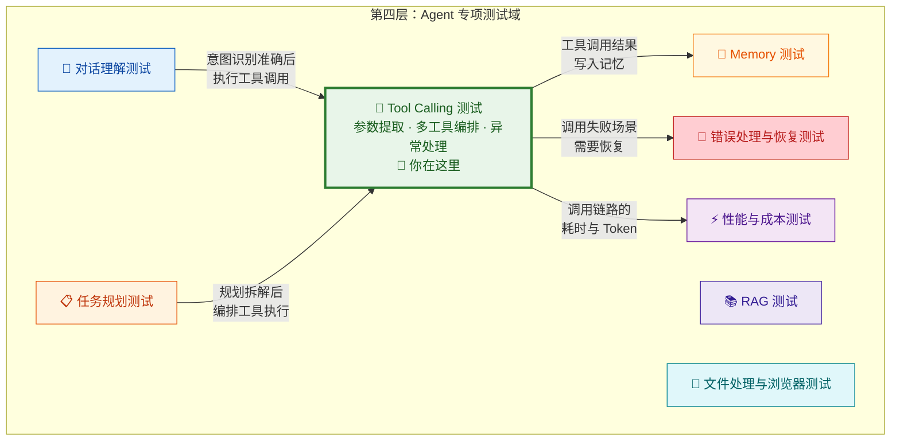
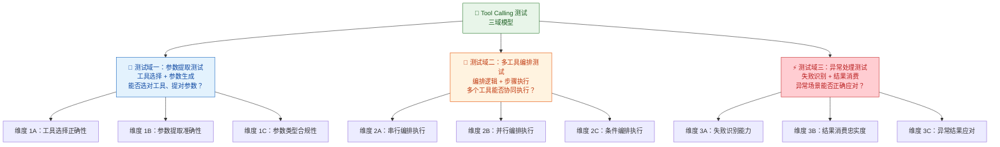
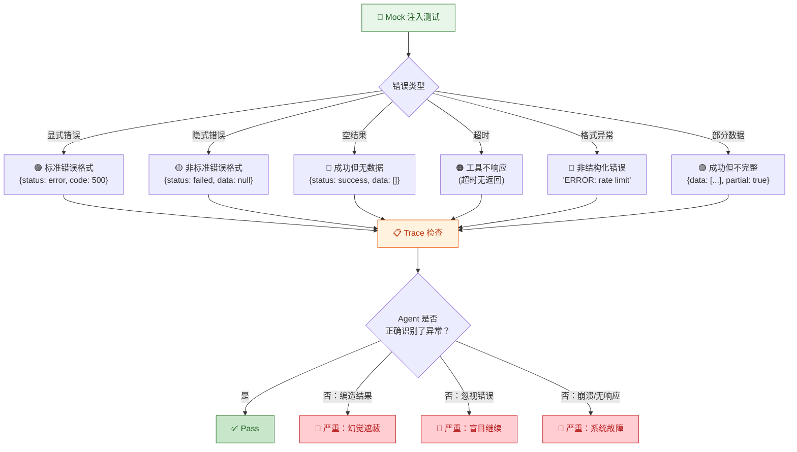
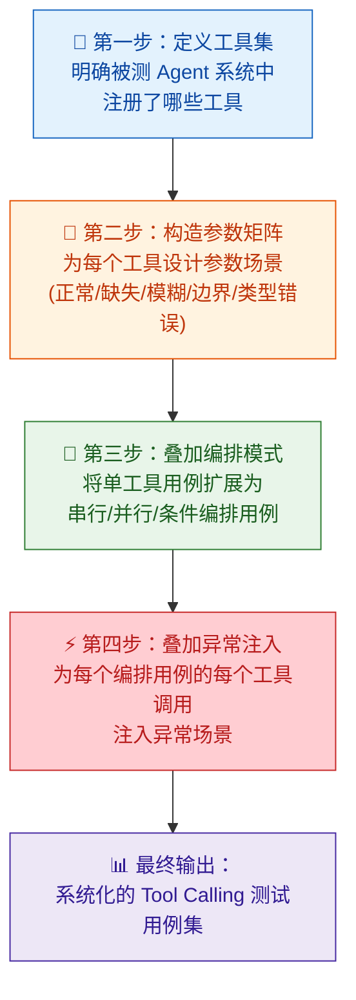

你正在阅读知识库**第四层：Agent 专项测试域**的第三篇文章。在前两篇中，你已经验证了 Agent 的 [对话理解能力](19-dui-hua-li-jie-ce-shi-yi-tu-shi-bie-duo-lun-shang-xia-wen-yu-qi-yi-chu-li) 和 [任务规划能力](20-ren-wu-gui-hua-ce-shi-chai-jie-pai-xu-hui-tui-yu-dong-tai-diao-zheng)。本文聚焦 Agent 专项测试中最核心的领域之一——**Tool Calling 测试**。在 [工具调用机制](5-gong-ju-diao-yong-tool-calling-function-calling-ji-zhi) 中你已经理解了 Tool Calling "工具选择 → 参数提取 → 结果消费"的三阶段工作流，也看到了每个阶段的典型失败模式。现在，你需要将这些认知转化为**系统化的测试设计**——明确测什么、怎么测、用什么数据测、如何判定 Pass/Fail。

Tool Calling 之所以是 Agent 专项测试的核心，原因在于它是 Agent 从"能说"到"能做"的桥梁。readme 中明确将 Tool Calling / Skills 测试列为 Agent 测试的核心之一，关注"工具选择是否正确、参数提取是否正确、参数类型是否正确、多工具编排是否正确、工具失败是否能识别、工具结果是否被正确消费"这六个维度。本文将这六个维度整合为三大测试域：**参数提取测试**（工具选择 + 参数提取）、**多工具编排测试**（编排逻辑 + 步骤执行）、**异常处理测试**（失败识别 + 结果消费），逐一展开测试设计方法论。

Sources: [readme.md](readme.md#L140-L158), [readme.md](readme.md#L44-L50)

## Tool Calling 测试在专项测试域中的定位

在第四层八个专项测试域中，Tool Calling 测试是一个**纵向深度测试域**——它沿着 [Tool Calling 三阶段模型](5-gong-ju-diao-yong-tool-calling-function-calling-ji-zhi) 的每个阶段深入验证，与 [任务规划测试](20-ren-wu-gui-hua-ce-shi-chai-jie-pai-xu-hui-tui-yu-dong-tai-diao-zheng) 形成上下游关系：规划测试验证"拆解和排序对不对"，Tool Calling 测试验证"每一步的工具调用执行对不对"。同时，它也是 [错误处理与恢复测试](25-cuo-wu-chu-li-yu-hui-fu-ce-shi-shi-bai-shi-bie-zi-dong-zhong-shi-yu-ti-dai-fang-an) 在工具调用场景下的具体落地。

**一个关键的区分原则**：Tool Calling 测试与 [任务规划测试](20-ren-wu-gui-hua-ce-shi-chai-jie-pai-xu-hui-tui-yu-dong-tai-diao-zheng) 存在交叉，但关注层面不同——规划测试关注"用哪些工具、按什么顺序"的**宏观编排决策**，Tool Calling 测试关注"参数提取是否精确、编排执行是否正确、异常是否被妥善处理"的**微观执行质量**。当发现 Agent 选错了工具，你需要先判断是规划层面的决策错误（归规划测试）还是工具定义导致的语义混淆（归 Tool Calling 测试），这种精准归因是专项测试域划分的核心价值。

Sources: [readme.md](readme.md#L140-L158), [readme.md](readme.md#L44-L50)

## Tool Calling 测试的三域模型：全景图

在 [工具调用机制](5-gong-ju-diao-yong-tool-calling-function-calling-ji-zhi) 的三阶段拆解（工具选择 → 参数提取 → 结果消费）基础上，结合 readme 中明确的六个测试关注点，Tool Calling 测试可以被系统化为**三大测试域**，每个域包含若干检验维度：

下面逐一深入每个测试域的检验维度、典型缺陷模式、测试用例设计策略和判定标准。

Sources: [readme.md](readme.md#L140-L158), [readme.md](readme.md#L44-L50)

## 测试域一：参数提取测试——工具选择与参数生成的精确性验证

参数提取测试是 Tool Calling 测试的**第一道防线**。在 [Agent Loop 核心工作流](9-agent-loop-he-xin-gong-zuo-liu-cong-yong-hu-qing-qiu-dao-zui-zhong-xiang-ying) 中，模型推理阶段的输出要么是纯文本回复，要么是工具调用指令（包含工具名称和参数）。参数提取测试验证的就是这个"决策输出"的精确性——**Agent 是否选对了工具、是否从用户输入中正确提取了参数、参数类型是否合规**。

### 维度 1A：工具选择正确性

**工具选择正确性验证 Agent 是否从可用工具列表中选择了最匹配用户意图的工具。** 在 [工具调用机制](5-gong-ju-diao-yong-tool-calling-function-calling-ji-zhi) 的"阶段一：工具选择"中你已经了解到，这个决策的依据来自工具定义中的 `name` 和 `description` 字段。工具选择错误意味着从源头就走错了方向，后续的参数提取和结果消费都变得无意义。

工具选择缺陷有四种典型模式，需要在测试中逐一覆盖：

| 缺陷模式 | 定义 | 典型场景 | 根因方向 | 严重程度 |
|:---|:---|:---|:---|:---:|
| **该用不用** | 用户请求需要工具，但模型直接用自身知识回答 | 用户问"明天北京天气"，Agent 不调天气 API，直接编造"明天北京 28°C 晴天" | 模型对自身知识边界认知不足，或 [System Prompt](4-prompt-gong-cheng-yu-bian-jie-ren-zhi) 缺乏"优先使用工具"的行为引导 | 🔴 高 |
| **不该用却用** | 用户请求不需要工具，但模型多调了一个工具 | 用户问"什么是机器学习"，Agent 调了搜索引擎去查百科 | 工具定义的 `description` 触发条件过于宽泛，或 Prompt 过度鼓励使用工具 | 🟡 中 |
| **工具名称混淆** | 选择了功能相似但不是目标工具的工具 | 用户要"查日历"，Agent 调用了 `create_event` 而非 `check_calendar` | 工具定义的 `description` 存在语义歧义，多个工具的功能描述有重叠 | 🔴 高 |
| **粒度错配** | 选择了粒度不合适的工具 | 用户要查"明天最高气温"，Agent 调了 `get_weather_report`（7 天预报）而非 `get_tomorrow_weather` | 工具定义中缺乏粒度描述，模型未充分理解用户请求的精度要求 | 🟡 中 |

**测试用例设计策略**：这个维度的测试需要覆盖三类场景——**正向选择**（应选 A 工具，确实选了 A）、**负向抑制**（不需要工具时确实不调工具）、**边界区分**（功能相近的工具对能否准确区分）。设计时重点构造以下测试输入矩阵：

| 测试场景 | 用户输入示例 | 期望工具选择 | 测试目的 |
|:---|:---|:---|:---|
| **明确工具触发** | "帮我查一下明天北京的天气" | `get_weather` | 正向选择 |
| **纯知识问答** | "什么是机器学习？" | 无工具调用 | 负向抑制 |
| **闲聊场景** | "今天天气真好啊" | 无工具调用 | 负向抑制（防止闲聊误触发） |
| **功能重叠区分** | "查一下张三的日历" vs "帮我创建一个明天下午3点的会议" | `check_calendar` vs `create_event` | 工具名称混淆测试 |
| **粒度区分** | "明天天气怎么样" vs "未来一周天气趋势" | `get_tomorrow_weather` vs `get_weather_report` | 粒度错配测试 |
| **多工具候选** | "给张三发个消息提醒他开会" | `send_email` 还是 `send_slack_message`？取决于上下文中张三的偏好 | 功能相近工具的选择能力 |

**判定标准**：通过 [Trace](13-ri-zhi-trace-yu-zhi-xing-gui-ji-ke-guan-ce-xing) 检查模型推理输出中的 `tool_calls` 字段——是否包含工具调用、调用了哪个工具、是否与期望工具一致。判定是**精确的二值判定**：选对了 Pass，选错了 Fail，不存在"差不多"。

Sources: [readme.md](readme.md#L140-L146), [readme.md](readme.md#L44-L50)

### 维度 1B：参数提取准确性

**参数提取准确性验证 Agent 是否从用户的自然语言输入中正确提取了工具所需的全部参数。** 这是 Tool Calling 中最容易出问题的环节——模型需要同时完成**语义理解**和**精确映射**两件事。在 [工具调用机制](5-gong-ju-diao-yong-tool-calling-function-calling-ji-zhi) 中你已经了解到，模型并不是"编程式"地提取参数，而是"语义式"地生成参数——它通过理解用户意图，然后按照工具参数的 JSON Schema 格式"生成"一段 JSON。这意味着参数提取的质量高度依赖于模型的语义理解能力和工具定义的清晰度。

readme 中明确列出了参数提取的六类测试场景：正常参数、缺失参数、错误参数、边界值、模糊时间/联系人/文件名、工具超时。基于这些场景，参数提取缺陷可以被系统化为五种模式：

| 缺陷模式 | 定义 | 典型场景 | 严重程度 |
|:---|:---|:---|:---:|
| **必填参数缺失** | 用户未提供必填参数，模型没有追问就调用了工具 | 用户说"发邮件给他"，模型没有 `to` 参数就直接调用了 `send_email` | 🔴 高 |
| **模糊参数自行编造** | 用户提供的信息模糊，模型自行编造参数值 | 用户说"订个饭"，模型随机选了一个餐厅和时间 | 🔴 高 |
| **参数类型错误** | 参数值与工具定义的类型不匹配 | 工具期望 `date` 为 ISO 格式字符串，模型传入了"明天" | 🟡 中 |
| **隐含参数推断错误** | 需要从上下文推断的参数被推断错误 | 用户说"发邮件告诉他会议改期了"，模型推断"他"是错误的收件人 | 🔴 高 |
| **数组/嵌套参数解析错误** | 多值参数被解析为单个值，或嵌套结构被展平 | 用户说"把这三个文件发给张三和李四"，`files` 参数只提取了一个文件 | 🟡 中 |

**测试用例设计策略**：这个维度的测试设计需要按照**参数信息充分度**进行梯度构造——从信息完备的正常参数，逐步减少用户提供的信息量，观察 Agent 在信息不足时的行为模式。

下表是一个系统化的参数提取测试用例矩阵，按参数场景分类：

| 参数场景 | 用户输入示例 | 期望参数提取 | 期望的不足信息应对 | 覆盖的缺陷模式 |
|:---|:---|:---|:---|:---|
| **正常参数（信息完备）** | "帮我查一下北京明天（4月15日）的天气" | `{city: "北京", date: "2026-04-15"}` | — | 基线通过 |
| **隐含参数（需推断）** | "发邮件告诉他会议改期了" | `to` 需从上下文推断，`subject` 和 `body` 需构造 | 如果上下文中没有"他"的信息，应追问 | 隐含参数推断错误 |
| **模糊参数（需追问）** | "帮我订个饭" | `{restaurant: ?, time: ?, cuisine: ?}` | 应追问"想吃什么类型的？什么时候？有没有偏好的餐厅？" | 模糊参数自行编造 |
| **缺失必填参数** | "发一封邮件" | 缺少 `to`（必填） | 应追问"收件人是谁？" | 必填参数缺失 |
| **多值参数** | "把这三个文件合并后发给张三和李四" | `{files: [file1, file2, file3], recipients: ["张三", "李四"]}` | — | 数组参数解析错误 |
| **类型转换** | "设个明天早上9点的闹钟" | `{time: "2026-04-10T09:00:00"}` | — | 参数类型错误 |
| **边界值（极端数量）** | "把最近30天的日报全部汇总" | `{start_date: 30天前的日期, end_date: 今天, type: "日报"}` | 如果超出工具限制应合理分批 | 参数范围边界 |
| **模糊时间** | "下周三下午" | 应解析为具体日期时间 | 如果存在歧义（如下周三尚未确定日期），应确认 | 参数类型错误 + 隐含参数 |
| **模糊联系人** | "发给老王" | 应从通讯录/上下文查找"老王" | 如果找到多个"老王"或找不到，应确认 | 隐含参数推断错误 |
| **模糊文件名** | "打开昨天那个报告" | 应从文件列表/上下文匹配 | 如果匹配到多个或没有匹配，应确认 | 隐含参数推断错误 |

**判定标准**：参数提取的判定需要分为两个层次——**格式判定**（参数类型是否与工具定义一致）和**语义判定**（参数值是否与用户意图一致）。格式判定可以自动化（通过 JSON Schema 校验），语义判定需要通过以下方式之一：精确比对（当参数值唯一确定时）、等价判定（当参数值有多种合理表述时，如"明天"等价于具体日期）、或 [LLM-as-a-Judge](27-ping-gu-ti-xi-da-jian-golden-set-rubric-ping-fen-yu-llm-as-a-judge)（当参数值的合理性需要主观判断时）。

**一个关键的测试洞察**：在模糊参数场景中，**你的判定重点不是"Agent 填了什么值"，而是"Agent 在信息不足时做了什么"**。正确的应对是追问用户，而不是自行编造——即使编造的值碰巧正确，这也是能力缺陷（碰巧对了不等于能力对了）。这个判定原则与 [能力测试](14-neng-li-ce-shi-yan-zheng-agent-hui-bu-hui-zuo) 中的"行为标志判定"逻辑一致。

Sources: [readme.md](readme.md#L140-L158), [readme.md](readme.md#L143-L158)

### 维度 1C：参数类型合规性

**参数类型合规性是参数提取测试中可以最大程度自动化的子维度。** 在 [工具调用机制](5-gong-ju-diao-yong-tool-calling-function-calling-ji-zhi) 中你已经了解到，工具的参数规范以 JSON Schema 形式定义，包含 `type`、`format`、`required` 等约束。模型生成的参数 JSON 必须符合这些约束，否则工具执行将失败。参数类型合规性验证的就是模型输出的参数 JSON 是否严格遵循工具定义的 Schema。

参数类型违规有五种典型模式：

| 违规模式 | 工具期望 | 模型实际输出 | 后果 |
|:---|:---|:---|:---|
| **字符串 vs 数字混淆** | `age: integer` | `age: "25"` | 工具执行类型校验失败 |
| **日期格式不标准** | `date: "YYYY-MM-DD"` | `date: "明天"` 或 `date: "April 10th"` | 工具无法解析日期 |
| **枚举值越界** | `priority: enum["high", "medium", "low"]` | `priority: "urgent"` | 工具不识别此枚举值 |
| **必填字段遗漏** | `required: ["to", "subject", "body"]` | 输出中缺少 `body` | 工具执行参数校验失败 |
| **嵌套结构扁平化** | `address: {city: string, street: string}` | `city: "北京", street: "长安街"`（未嵌套在 `address` 对象中） | 工具无法正确解析结构 |

**测试用例设计策略**：这个维度可以通过**Schema 校验自动化**实现。具体做法是——对于每条测试用例的模型输出，提取 `tool_calls` 中的 `function.arguments` JSON，然后用工具定义的 `parameters` Schema 进行自动化校验。校验内容包括：类型检查、必填字段检查、枚举值检查、格式检查（如 `date-time`、`email`）、嵌套结构检查。将校验结果自动化集成到测试流水线中，可以实现参数类型合规性的持续监控。

Sources: [readme.md](readme.md#L143-L146), [readme.md](readme.md#L140-L158)

## 测试域二：多工具编排测试——多个工具协同执行的逻辑验证

多工具编排测试是 Tool Calling 测试中**复杂度最高**的测试域。在 [工具调用机制](5-gong-ju-diao-yong-tool-calling-function-calling-ji-zhi) 中你已经了解到，现实场景中用户的请求往往需要多个工具协同完成——涉及串行调用、并行调用和条件调用三种编排模式。多工具编排测试验证的就是 Agent 在这些模式下的**编排逻辑正确性**——调用顺序对不对、条件分支有没有触发、并行调用是否正确合并。

### 维度 2A：串行编排执行

**串行编排验证后一个工具的输入是否正确依赖前一个工具的输出。** 这是最常见的编排模式——用户说"先查一下张三的邮箱地址，然后给他发一封邮件"，Agent 需要先调用 `search_contacts` 获取邮箱地址，再将结果作为 `send_email` 的 `to` 参数。串行编排的核心风险在于**步骤间的参数传递链**是否完整。

| 缺陷模式 | 定义 | 典型场景 | 后果 | 严重程度 |
|:---|:---|:---|:---|:---:|
| **参数传递断裂** | 前序工具的结果未被正确传递到后续工具 | 查到了张三的邮箱 `zhangsan@example.com`，但发邮件时 `to` 参数传了"张三"而非邮箱地址 | 后续工具执行失败 | 🔴 高 |
| **中间结果遗忘** | 后续步骤未使用前序步骤的正确结果 | 第 1 轮查到天气是 22°C 阵雨，第 3 轮发邮件时完全没引用天气信息 | 编排链路逻辑断裂 | 🔴 高 |
| **依赖倒置** | 后续步骤被提前执行 | 先发邮件提醒"明天下雨"再查天气，发现实际是晴天 | 执行了不必要的操作，信息可能错误 | 🔴 高 |
| **过早终止** | 串行链路中部分步骤被遗漏 | 应该"查天气 → 查通讯录 → 发邮件"，Agent 查完天气就结束了 | 子任务遗漏 | 🔴 高 |

**测试用例设计策略**：设计**依赖链用例**——构造需要至少 3 步串行执行的任务，每一步的输入都依赖前一步的输出。通过 [Trace](13-ri-zhi-trace-yu-zhi-xing-gui-ji-ke-guan-ce-xing) 逐轮检查参数传递链的完整性。

示例用例："帮我查一下张三的邮箱，然后给他发一封邮件，主题是明天的会议改期了，正文是会议从下午2点改到下午4点，然后把这个邮件内容也发到项目群里。"

期望编排链路：`search_contacts("张三")` → `send_email(to=zhangsan@example.com, ...)` → `send_slack_message(channel="#项目群", ...)`

Trace 检查点：
1. 第 1 轮：是否调用了 `search_contacts`？参数是否包含"张三"？
2. 第 2 轮：`send_email` 的 `to` 参数是否是第 1 轮返回的邮箱地址（而非"张三"这个字符串）？
3. 第 3 轮：`send_slack_message` 的内容是否包含了邮件的核心信息（会议改期、时间变更）？
4. 总循环次数：是否恰好 3 轮（不多不少）？

Sources: [readme.md](readme.md#L140-L158), [readme.md](readme.md#L44-L50)

### 维度 2B：并行编排执行

**并行编排验证多个无依赖关系的工具调用是否能被同时触发并正确合并结果。** 例如用户说"帮我查一下北京和上海明天的天气"，Agent 可以在一次推理中同时生成两个 `get_weather` 调用（分别查北京和上海），而不是串行执行两次。并行编排的核心风险在于**结果合并的正确性**和**部分失败的处理**。

| 缺陷模式 | 定义 | 典型场景 | 后果 | 严重程度 |
|:---|:---|:---|:---|:---:|
| **该并行却串行** | 无依赖的多个调用被串行执行 | 同时查北京和上海天气，Agent 分两轮分别调用 | 效率低下，用户等待时间翻倍 | 🟡 中 |
| **结果归属混淆** | 并行调用返回的结果被错误配对 | 北京天气返回 22°C，上海返回 28°C，Agent 把 22°C 说成上海的 | 信息错误 | 🔴 高 |
| **部分失败全局回滚** | 并行调用中一个成功一个失败，全部被丢弃 | 查北京天气成功、查上海超时，Agent 将两个都当作失败 | 可用结果被浪费 | 🟡 中 |

**测试用例设计策略**：构造**多目标并行用例**——用户请求中明确包含多个独立子目标，观察 Agent 是否在单轮推理中生成多个工具调用。通过 Trace 检查：是否在同一轮生成了多个 `tool_calls`？结果合并时每个数据项的归属是否正确？部分失败时是否仍保留了成功的部分？

Sources: [readme.md](readme.md#L140-L158), [readme.md](readme.md#L44-L50)

### 维度 2C：条件编排执行

**条件编排验证 Agent 是否能根据中间结果动态决定是否执行后续工具调用。** 这是三种编排模式中最复杂的——它不仅要求 Agent 完成工具调用，还要求 Agent 在调用之间进行**条件判断**。用户说"查一下明天北京的天气，如果下雨就给张三发邮件提醒他带伞"，Agent 需要先查天气，然后根据天气结果中的降雨信息决定是否发邮件。

| 缺陷模式 | 定义 | 典型场景 | 后果 | 严重程度 |
|:---|:---|:---|:---|:---:|
| **条件判断被忽略** | 无论条件是否满足都执行了后续步骤 | 天气查询结果显示不下雨，Agent 仍然发送了提醒邮件 | 执行了不必要的操作 | 🔴 高 |
| **条件判断被反转** | 条件满足时未执行，不满足时执行了 | 天气查询结果显示下雨，Agent 反而没有发邮件 | 关键操作被遗漏 | 🔴 高 |
| **条件逻辑简化** | 复杂条件被简化为简单判断 | 用户说"如果气温低于10度且有大风就提醒"，Agent 只判断了温度 | 部分条件被遗漏 | 🟡 中 |
| **嵌套条件丢失** | 多层条件嵌套被扁平化 | 用户说"如果下雨且张三在出差就发邮件，否则发短信"，Agent 无论结果如何都发邮件 | 条件分支逻辑丢失 | 🔴 高 |

**测试用例设计策略**：这个维度的测试需要一个**双路径对照法**——为每条条件用例设计两个对照版本，一个触发条件（如模拟下雨天气），一个不触发条件（如模拟晴天天气），分别运行并检查 Trace：

| 对照版本 | 工具 Mock 策略 | 期望的 Agent 行为 | Trace 检查点 |
|:---|:---|:---|:---|
| **条件触发版** | `get_weather` 返回 `{rain: true, description: "阵雨"}` | 应调用 `send_email` | 第 2 轮是否调用了邮件发送工具？参数是否引用了天气信息？ |
| **条件未触发版** | `get_weather` 返回 `{rain: false, description: "晴天"}` | 不应调用 `send_email` | 第 2 轮是否跳过了邮件发送？回复中是否说明"天气晴朗，无需提醒"？ |

这个"双路径对照法"是多工具编排测试中最核心的技术——通过 Mock 控制中间结果，精确验证 Agent 的条件判断逻辑。后续在 [稳定性测试](17-wen-ding-xing-ce-shi-duo-ci-zhi-xing-de-ke-kao-xing-yu-zhi-xing) 中你还会看到这种方法的延伸应用。

Sources: [readme.md](readme.md#L140-L158), [readme.md](readme.md#L44-L50)

## 测试域三：异常处理测试——工具调用失败场景的应对验证

异常处理测试是 Tool Calling 测试中**区分"能用"和"好用"的关键测试域**。readme 中明确列出了"工具超时、工具返回空结果、工具部分成功、工具返回异常结构"等异常场景作为测试重点。在 [错误处理与恢复测试](25-cuo-wu-chu-li-yu-hui-fu-ce-shi-shi-bai-shi-bie-zi-dong-zhong-shi-yu-ti-dai-fang-an) 中你将看到更通用的错误处理方法论，本节聚焦于**工具调用场景下的异常处理测试**——工具返回了什么异常？Agent 是否识别了异常？是否正确应对了异常？

### 维度 3A：失败识别能力

**失败识别能力验证 Agent 是否能正确判断工具调用的执行状态——成功、失败、部分成功还是空结果。** 这是异常处理的第一道防线。如果 Agent 不能识别工具失败，后续的重试和替代方案就无从谈起。在 [过程测试](16-guo-cheng-ce-shi-yan-zheng-agent-zhong-jian-bu-zhou-de-he-li-xing) 中你已经了解到"Observation 解读忠实度"的重要性，本维度将这一概念具体化为工具调用场景下的可测试模式。

失败识别缺陷的五种典型模式及其测试方法：

| 缺陷模式 | Mock 注入策略 | 期望的 Agent 行为 | 常见错误行为 |
|:---|:---|:---|:---|
| **显式错误忽视** | 工具返回 `{status: "error", code: 500, message: "Internal Server Error"}` | 识别错误 → 向用户报告 → 提供替代方案 | 忽视错误状态，将错误信息当作正常结果继续 |
| **隐式错误忽视** | 工具返回 `{status: "failed", data: null, reason: "rate_limited"}` | 同上 | 未识别非标准错误格式 |
| **空结果误判** | 工具返回 `{status: "success", data: []}` | 如实告知"未找到相关信息" | 编造不存在的数据来"填补空白" |
| **超时无响应** | 工具执行超过阈值后不返回任何内容 | 向用户解释超时原因，询问是否重试 | 无限等待或编造结果 |
| **格式异常** | 工具返回纯文本 `"ERROR: rate limit exceeded"`（非 JSON） | 识别异常格式 → 报告错误 | 解析失败导致崩溃 |

**测试用例设计策略**：采用 **Mock 注入法**——通过 Mock 框架向 Agent 的工具调用链中注入各种类型的错误返回。这是异常处理测试最核心的技术手段，因为你无法在生产环境中可靠地复现工具超时、API 限流等异常场景，但可以通过 Mock 精确控制工具的返回值。Mock 注入的错误类型矩阵：

Sources: [readme.md](readme.md#L140-L158), [readme.md](readme.md#L215-L224)

### 维度 3B：结果消费忠实度

**结果消费忠实度验证 Agent 是否正确理解并如实传达了工具返回的数据。** 在 [结果测试](15-jie-guo-ce-shi-yan-zheng-agent-zuo-de-dui-bu-dui) 中你已经了解到"工具结果忠实度"概念——工具返回的数据是否被正确总结和呈现。本维度将这一概念聚焦在工具调用场景下，具体化为四种"转述偏差"模式：

| 转述偏差类型 | Mock 注入策略 | 期望的 Agent 行为 | 常见错误行为 |
|:---|:---|:---|:---|
| **数据歪曲** | 工具返回 `price: 1280` | 回复中准确引用"价格为 1280 元" | 回复"价格约为 1500 元" |
| **信息添加（幻觉）** | 工具只返回航班号和时间 | 只引用航班号和时间 | 额外添加"该航班准点率 95%"（编造） |
| **信息遗漏** | 工具返回出发/到达时间、登机口、延误状态 | 完整呈现所有关键信息 | 只提到出发时间，遗漏登机口和延误状态 |
| **逻辑篡改** | 工具返回"价格排序：A < B < C" | 准确呈现价格排序关系 | 推荐"最便宜的是 C" |

**测试用例设计策略**：这个维度需要你通过 Trace 实现**工具原始返回与 Agent 最终回复的逐项比对**。具体操作步骤：从 Trace 中提取工具的原始返回数据（JSON 格式），从 Agent 的最终回复中提取所有引用的数据点，逐一比对两者是否一致。这种比对可以通过脚本自动化——定义一个"数据点提取器"，从工具返回和最终回复中分别提取数值、日期、名称等结构化信息，然后进行精确匹配。

Sources: [readme.md](readme.md#L140-L158), [readme.md](readme.md#L78-L83)

### 维度 3C：异常结果应对

**异常结果应对验证 Agent 在工具调用失败后的完整行为链——是否尝试恢复、是否向用户透明报告、是否提供替代方案。** 这与维度 3A（失败识别）形成前后关系：3A 验证"是否知道出错了"，3C 验证"知道出错了之后做了什么"。

异常结果应对的测试场景矩阵：

| 异常场景 | Mock 策略 | 期望的 Agent 应对 | 常见缺陷 |
|:---|:---|:---|:---|
| **工具超时** | 工具执行超过 10 秒不返回 | 解释超时原因 → 询问用户是否重试或换一种方式 | 无限等待 / 编造超时前的"缓存结果" |
| **API 限流** | 连续返回 HTTP 429 | 识别限流 → 退避等待 → 重试（最多 N 次） | 立即重试加剧限流 / 直接告知用户"服务不可用" |
| **参数格式错误** | 返回 `{error: "invalid parameter format"}` | **不重试** → 识别为参数问题 → 向用户确认参数 | 盲目重试 N 次相同参数 |
| **权限拒绝** | 返回 `{error: "permission denied"}` | **不重试** → 识别为权限问题 → 提示用户授权或降级 | 反复重试相同权限请求 |
| **返回空结果** | `search_contacts("不存在的人")` 返回 `[]` | 如实告知"未找到"，询问是否有其他名字或信息 | 编造一个"看起来合理"的联系方式 |
| **部分字段缺失** | 返回 `{name: "张三", email: null, phone: "138xxxx"}` | 呈现已有信息，说明哪些字段缺失 | 用臆测的邮箱地址填补 `null` 字段 |
| **返回异常结构** | 返回纯文本 `"Service Unavailable"` 而非 JSON | 识别格式异常 → 报告错误 | 解析失败导致崩溃或返回乱码 |

**判定标准**：异常结果应对的判定需要分三个层次——**第一层：是否如实报告了异常**（不编造、不隐瞒）；**第二层：是否尝试了合理恢复**（重试、降级、替代方案，而非直接放弃）；**第三层：用户是否被合理告知**（有解释、有选项，而非只有"任务失败"）。三个层次全部满足为"完全通过"，第一层不满足为"严重失败"（无论后续层次如何）。

Sources: [readme.md](readme.md#L140-L158), [readme.md](readme.md#L215-L224)

## Tool Calling 测试的用例设计方法论

理解了三大测试域的检验维度后，你需要一套系统化的用例设计方法论将上述维度转化为可执行的测试用例。Tool Calling 测试的用例设计遵循**正交矩阵法**——将测试维度（参数场景 × 编排模式 × 异常类型）做笛卡尔积，筛选出有测试价值的组合。

### 用例设计的四步流程

**第一步：定义工具集。** 列出被测 Agent 系统中注册的所有工具，包括每个工具的名称、描述、参数定义和依赖关系。这一步的产出是一份**工具清单**。对于 ArkClaw / OpenClaw 这类产品，工具集可能包含邮件发送、日历查询、文件读写、网页搜索、浏览器自动化等数十个工具——你需要按优先级排序，优先测试用户使用频率最高的工具。

**第二步：构造参数矩阵。** 为每个工具按照 readme 中的六类测试场景（正常参数、缺失参数、错误参数、边界值、模糊参数、超时）设计具体的测试输入。这一步的产出是**单工具参数测试用例集**。

**第三步：叠加编排模式。** 将单工具用例扩展为多工具编排用例。例如，单工具用例"查天气参数正确"可以扩展为串行用例"查天气 → 查通讯录 → 发邮件"、并行用例"同时查北京和上海天气"、条件用例"查天气 → 如果下雨则发邮件"。这一步的产出是**多工具编排测试用例集**。

**第四步：叠加异常注入。** 为每个编排用例的每个工具调用节点注入异常场景。例如，在串行用例"查天气 → 发邮件"中，可以为"查天气"注入超时异常、为"发邮件"注入权限拒绝异常，观察 Agent 的应对。这一步的产出是**异常处理测试用例集**。

### 用例优先级排序

并非所有用例都需要同等投入。readme 中的严重程度标记（🔴 高 / 🟡 中 / 🟢 低）为优先级排序提供了依据。建议按以下优先级排列：

| 优先级 | 用例类型 | 理由 |
|:---|:---|:---|
| **P0（必须覆盖）** | 工具选择正确性 + 正常参数提取 + 串行编排 | 这是 Agent 正常工作的基线能力 |
| **P1（应该覆盖）** | 模糊参数处理 + 条件编排 + 显式异常识别 | 生产环境高频出现的场景 |
| **P2（建议覆盖）** | 隐含参数推断 + 并行编排 + 隐式异常识别 | 提升用户体验的关键场景 |
| **P3（按需覆盖）** | 边界值参数 + 复杂嵌套条件 + 格式异常处理 | 增强鲁棒性的补充场景 |

Sources: [readme.md](readme.md#L140-L158), [readme.md](readme.md#L44-L50)

## Tool Calling 测试的度量指标体系

测试设计的最终产出是**可量化的度量指标**。readme 中列出了"工具调用正确率"作为核心评估指标之一。基于三大测试域，度量指标体系可以细化为：

| 指标名称 | 计算方式 | 目标值建议 | 归属测试域 |
|:---|:---|:---|:---|
| **工具选择正确率** | 正确选择工具的次数 / 总工具调用次数 | ≥ 95% | 参数提取 |
| **参数提取完整率** | 必填参数全部正确提取的次数 / 总工具调用次数 | ≥ 90% | 参数提取 |
| **参数类型合规率** | 参数类型符合 Schema 的次数 / 总参数字段数 | ≥ 98% | 参数提取 |
| **编排链路完整率** | 完整执行所有必要步骤的次数 / 总多步任务数 | ≥ 90% | 多工具编排 |
| **条件分支正确率** | 条件判断正确的次数 / 总条件分支数 | ≥ 90% | 多工具编排 |
| **失败识别率** | 正确识别工具失败的次数 / 总工具失败次数 | ≥ 95% | 异常处理 |
| **异常结果幻觉率** | 工具失败后编造虚假结果的次数 / 总工具失败次数 | ≤ 2% | 异常处理 |
| **异常恢复成功率** | 异常场景下成功恢复的次数 / 总异常场景数 | ≥ 70% | 异常处理 |

**一个关键的度量洞察**：在这些指标中，**异常结果幻觉率**是最需要严格控制的指标——其目标值应接近 0%。原因在于，编造虚假结果（如工具调用超时后 Agent 编造"天气 25°C 晴天"）是最危险的缺陷模式——用户可能基于虚假信息做出错误决策。相比之下，异常恢复成功率可以容忍较低的值（70%），因为"无法恢复但如实告知"虽然体验不佳，但不会造成信息层面的误导。

Sources: [readme.md](readme.md#L140-L158), [readme.md](readme.md#L356-L364)

## Tool Calling 测试的前置条件：可观测性保障

在开始设计测试用例之前，你需要确认一个关键的前置条件：**Tool Calling 测试完全依赖于 Trace 的可观测性。** 与 [对话理解测试](19-dui-hua-li-jie-ce-shi-yi-tu-shi-bie-duo-lun-shang-xia-wen-yu-qi-yi-chu-li) 可以只看最终回复不同，Tool Calling 测试需要你看到每一轮循环的完整细节——模型选择了什么工具、传了什么参数、工具返回了什么、模型如何消费结果。

在 [日志、Trace 与执行轨迹可观测性](13-ri-zhi-trace-yu-zhi-xing-gui-ji-ke-guan-ce-xing) 中你已经详细学习了三层可观测体系。对于 Tool Calling 测试，你至少需要以下 Trace 数据点：

| Trace 数据点 | 用途 | 对应的测试维度 |
|:---|:---|:---|
| **模型原始输出**（工具名称 + 参数 JSON） | 检查工具选择和参数提取的正确性 | 维度 1A、1B、1C |
| **工具调用详情**（工具名称 + 完整参数 + 执行耗时） | 检查实际调用是否与模型输出一致 | 所有维度 |
| **工具原始返回**（完整的返回数据） | 与 Agent 最终回复进行逐项比对 | 维度 3B |
| **每轮循环的 Prompt 快照** | 排查上下文管理问题导致的信息丢失 | 维度 2A（中间结果遗忘） |
| **循环总轮数** | 量化编排效率和过早/延迟终止 | 维度 2A（过早终止）、过程效率 |
| **错误状态记录**（工具执行异常、重试次数） | 检查异常处理行为 | 维度 3A、3C |

**如果你的被测系统缺乏这些 Trace 数据点，Tool Calling 测试的深度将严重受限**——你只能看到最终回复而无法验证中间过程。在这种情况下，你需要优先推动 [可观测性建设](13-ri-zhi-trace-yu-zhi-xing-gui-ji-ke-guan-ce-xing) ，然后再进行深入的 Tool Calling 测试。

Sources: [readme.md](readme.md#L253-L262), [readme.md](readme.md#L44-L50)

## 下一步

现在你已经建立了 Tool Calling 测试的系统化方法论——知道了参数提取、多工具编排、异常处理三大测试域各自怎么测、用什么样的数据测、如何判定 Pass/Fail。在第四层的学习路径中，建议你按以下顺序继续：

1. [Memory 测试：记忆保存、过期失效与跨会话隔离](22-memory-ce-shi-ji-yi-bao-cun-guo-qi-shi-xiao-yu-kua-hui-hua-ge-chi) — 理解如何测试 Agent 的记忆读写能力，特别是记忆与工具调用之间的交互（如工具调用结果是否被正确写入记忆、记忆是否被正确传递给工具参数）
2. [错误处理与恢复测试：失败识别、自动重试与替代方案](25-cuo-wu-chu-li-yu-hui-fu-ce-shi-shi-bai-shi-bie-zi-dong-zhong-shi-yu-ti-dai-fang-an) — 深入理解本文"测试域三"中涉及的异常处理方法论，掌握更通用的错误恢复测试框架
3. [性能与成本测试：延迟、Token 消耗与并发评估](26-xing-neng-yu-cheng-ben-ce-shi-yan-chi-token-xiao-hao-yu-bing-fa-ping-gu) — 从成本角度评估 Tool Calling 的效率——多工具编排的 Token 消耗、工具调用的延迟、并行调用对总响应时间的影响