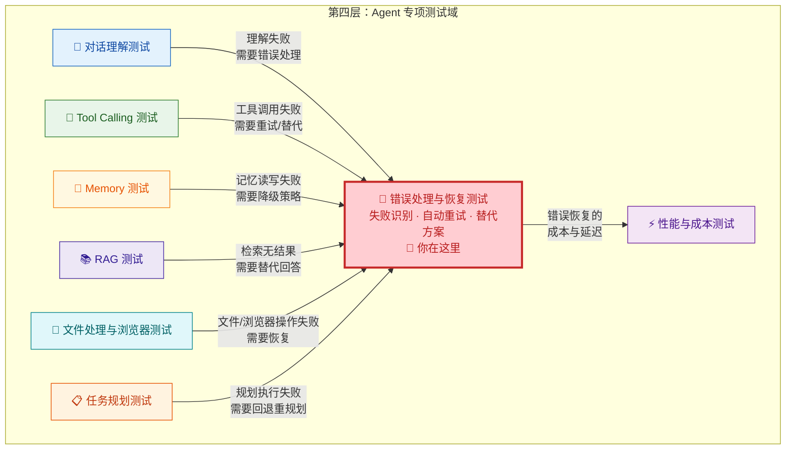
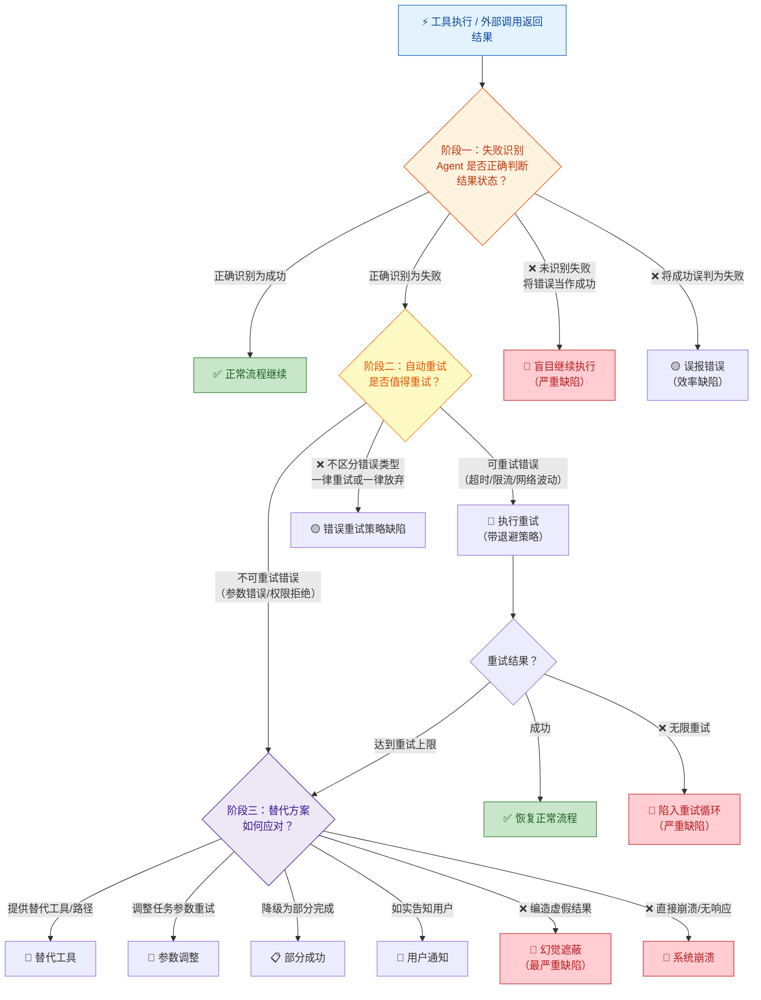
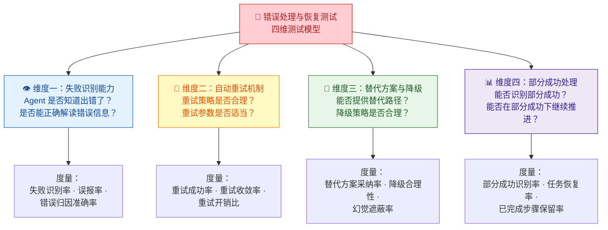
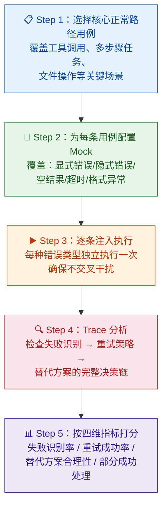
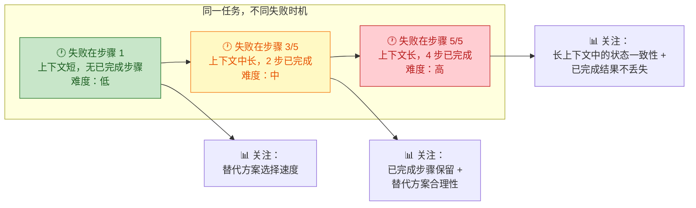
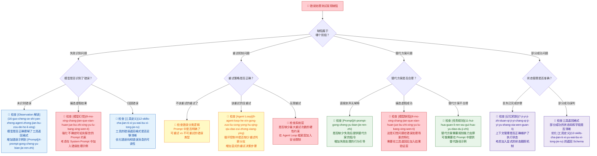

你正在阅读知识库**第四层：Agent 专项测试域**的第七篇文章。在前面的专项测试中，你已经验证了 Agent 的[对话理解](19-dui-hua-li-jie-ce-shi-yi-tu-shi-bie-duo-lun-shang-xia-wen-yu-qi-yi-chu-li)、[任务规划](20-ren-wu-gui-hua-ce-shi-chai-jie-pai-xu-hui-tui-yu-dong-tai-diao-zheng)、[Tool Calling](21-tool-calling-ce-shi-can-shu-ti-qu-duo-gong-ju-bian-pai-yu-yi-chang-chu-li)、[Memory](22-memory-ce-shi-ji-yi-bao-cun-guo-qi-shi-xiao-yu-kua-hui-hua-ge-chi)、[RAG](23-rag-ce-shi-jian-suo-zhao-hui-yin-yong-zhen-shi-xing-yu-wen-dang-chong-tu) 和 [文件处理与浏览器自动化](24-wen-jian-chu-li-yu-liu-lan-qi-zi-dong-hua-ce-shi) 这些"理想路径"下的能力。但真实的生产环境从不按剧本运行——工具调用会超时、API 会返回错误、外部数据可能不可用、浏览器页面可能加载失败。**错误处理与恢复测试就是检验 Agent 在"非理想路径"下表现的关键专项测试域。** 它回答一个最核心的问题：**当事情出了差错，Agent 能不能识别错误、应对错误、从错误中恢复？**

Sources: [readme.md](readme.md#L215-L224), [readme.md](readme.md#L15-L16)

## 错误处理与恢复测试在专项测试域中的定位

在第四层八个专项测试域中，错误处理与恢复测试是一个**横向测试域**——它不测试某个特定能力（如对话理解或工具调用），而是测试 Agent 在**任何能力执行失败时**的应急响应能力。在 [任务规划测试](20-ren-wu-gui-hua-ce-shi-chai-jie-pai-xu-hui-tui-yu-dong-tai-diao-zheng) 的"回退与恢复"维度中你已经接触了规划层面的错误响应；本文将从工具执行层面、结果消费层面和用户交互层面全面展开。

**一个关键的区分原则**：错误处理与恢复测试与 [任务规划测试](20-ren-wu-gui-hua-ce-shi-chai-jie-pai-xu-hui-tui-yu-dong-tai-diao-zheng) 的"回退与恢复"维度存在交叉，但关注层面不同——规划测试关注"失败后**规划层面**的回退策略"（如重新排序步骤、跳过受阻步骤），错误处理测试关注"失败后**执行层面**的响应机制"（如是否识别了错误、是否正确重试、是否给用户替代方案）。规划测试问的是"计划怎么改"，错误处理测试问的是"每一步出错时怎么办"。

Sources: [readme.md](readme.md#L215-L224), [readme.md](readme.md#L476-L479)

## 错误处理与恢复测试的核心价值：为什么"成功路径"测试远远不够

很多测试工程师在初次接触 Agent 测试时会自然地优先覆盖"正常路径"——用户给了正确的指令，Agent 正确调用了工具，工具返回了正确的结果，Agent 给出了正确的回复。但在生产环境中，**非理想路径才是常态而非例外**。readme 中将"错误处理与恢复"列为第一优先级测试领域，并明确指出"失败后不会回退和重试"是典型的规划缺陷，行业公开测评也单独强调了"错误处理与恢复"能力。

**第一，工具和外部系统失败是高频事件。** 在 [Skills / 插件体系](12-skills-cha-jian-ti-xi-yu-wai-bu-xi-tong-jie-ru) 中你已经了解到，Agent 系统依赖大量外部工具和 API。这些外部依赖天然不稳定——网络波动导致超时、API 限流导致拒绝服务、数据源更新导致格式变化。一个在"所有工具都正常工作"假设下测试通过的 Agent，可能在生产环境中因为一个天气 API 超时就彻底崩溃。

**第二，错误遮蔽是 Agent 系统最危险的缺陷模式之一。** 当工具返回 `{status: "error"}` 时，Agent 的模型层可能选择"编造一个看似合理的回答"而非向用户报告错误。在 [模型常见缺陷](8-mo-xing-chang-jian-que-xian-huan-jue-bu-zhi-xing-yu-lu-bang-xing-wen-ti) 中你学到的**幻觉问题**，在错误处理场景中会以更隐蔽的形式出现——模型不是凭空编造信息，而是**用虚假结果替代了真实的错误信息**。这种缺陷在只看最终输出的测试中极难被发现，因为回答看起来"合理且完整"。

**第三，错误恢复能力直接决定用户信任的底线。** 用户可以接受"暂时无法完成"（只要 Agent 如实告知），但无法接受"给了一个错误的完成"（Agent 隐瞒了失败并编造了结果）。前者是错误处理的边界问题，后者是错误处理的灾难性问题。错误处理与恢复测试的核心目标，就是确保 Agent 在面对错误时**至少做到诚实，最好做到自愈**。

Sources: [readme.md](readme.md#L215-L224), [readme.md](readme.md#L126-L138)

## 错误处理与恢复的三阶段模型

Agent 系统的错误处理可以抽象为一个**三阶段递进模型**：失败识别（感知错误）→ 自动重试（修复错误）→ 替代方案（绕过错误）。这三个阶段不是独立选项，而是一个递进的决策链——Agent 首先要**识别**错误，然后判断是否**可以重试**修复，如果重试也不行就提供**替代方案**。

上图揭示了错误处理三阶段的完整决策链。测试的核心任务是在每个决策节点上验证 Agent 的判断是否正确——是否识别了错误？是否选择了正确的重试策略？是否提供了合理的替代方案？任何一个节点的错误判断，都可能导致从"可恢复的失败"恶化为"不可恢复的灾难"。

Sources: [readme.md](readme.md#L215-L224), [readme.md](readme.md#L140-L158)

## 四维测试模型：错误处理与恢复的检验维度

基于三阶段模型和 readme 中明确列出的六个关注点（工具失败后是否知道失败、是否能解释失败原因、是否会盲编结果、是否能自动重试、是否能给用户替代方案、是否能在部分成功场景下继续推进），错误处理与恢复测试可以拆解为四个独立的检验维度：

下面逐一深入每个维度的内涵、典型缺陷模式和测试设计要点。

Sources: [readme.md](readme.md#L215-L224), [readme.md](readme.md#L476-L479)

### 维度一：失败识别能力——"Agent 是否知道出错了？"

**失败识别是错误处理的起点，也是最关键的防线。** 如果 Agent 不能正确识别工具调用失败，后续的重试和替代方案就无从谈起。在 [Agent Loop 核心工作流](9-agent-loop-he-xin-gong-zuo-liu-cong-yong-hu-qing-qiu-dao-zui-zhong-xiang-ying) 中你已经了解到，工具返回的 Observation 需要被模型正确解读才能进入下一轮推理。失败识别测试验证的正是这个"解读"环节。

失败识别缺陷有五种典型模式，按照严重程度递增排列：

| 缺陷模式 | 定义 | 典型场景 | 根因方向 | 严重程度 |
|:---|:---|:---|:---|:---:|
| **错误状态忽视** | 工具明确返回错误状态，Agent 却忽视继续执行 | 工具返回 `{status: "error", message: "API限流"}`，Agent 将其解读为成功并继续下一步骤 | [Observation 解读](16-guo-cheng-ce-shi-yan-zheng-agent-zhong-jian-bu-zou-de-he-li-xing) 能力不足，模型未能正确解析结构化错误信息 | 🔴 高 |
| **空结果误判** | 工具返回空数据，Agent 将"无数据"当作"有数据" | `search_contacts("张三")` 返回 `[]`，Agent 在回复中称"已找到张三的联系方式" | 模型对空值的处理能力不足，缺乏"无结果"与"错误"的区分逻辑 | 🔴 高 |
| **错误幻觉遮蔽** | 工具失败后，模型编造虚假结果替代真实错误信息 | 天气 API 超时，Agent 回复"明天北京 25°C，晴天"——完全编造 | [模型幻觉](8-mo-xing-chang-jian-que-xian-huan-jue-bu-zhi-xing-yu-lu-bang-xing-wen-ti) 在错误处理场景的特化表现，模型优先"给一个答案"而非"报告一个问题" | 🔴 极高 |
| **错误归因偏差** | Agent 识别了失败但归因到了错误的原因 | 工具返回参数格式错误，Agent 判断为"网络超时"并重试——当然重试也不会成功 | 模型对结构化错误信息的理解能力不足，或 [Prompt](4-prompt-gong-cheng-yu-bian-jie-ren-zhi) 中缺少错误分类引导 | 🟡 中 |
| **误报错误** | 工具实际成功返回，Agent 却误判为失败 | 工具返回 `{code: 200, data: [...]}`，Agent 看到数据量大就判定"异常" | 模型过于保守的错误判断阈值，或对非标准返回格式的理解偏差 | 🟡 中 |

**测试设计要点**：这个维度的核心测试策略是**Mock 注入法**——通过 Mock 框架向 Agent 的工具调用链中注入各种类型的错误返回，然后通过 [Trace](13-ri-zhi-trace-yu-zhi-xing-gui-ji-ke-guan-ce-xing) 检查 Agent 是否正确识别了错误。Mock 的错误类型应覆盖以下完整谱系：

| 错误类型 | Mock 返回示例 | 测试目的 | 覆盖的缺陷模式 |
|:---|:---|:---|:---|
| **显式错误状态** | `{status: "error", code: 500, message: "Internal Server Error"}` | Agent 是否识别标准错误格式 | 错误状态忽视 |
| **隐式错误状态** | `{status: "failed", data: null, reason: "rate_limited"}` | Agent 是否识别非标准错误格式 | 错误状态忽视、错误归因偏差 |
| **空结果** | `{status: "success", data: [], message: "no results found"}` | Agent 是否区分"成功但无数据"和"失败" | 空结果误判 |
| **部分数据** | `{status: "success", data: [item1], partial: true, missing: ["field_b"]}` | Agent 是否识别不完整返回 | 部分成功误判（与维度四交叉） |
| **超时无响应** | 工具执行超过阈值后不返回 | Agent 是否有超时处理机制 | 错误状态忽视 |
| **格式异常** | `"ERROR: rate limit exceeded"`（纯文本而非 JSON） | Agent 是否处理非结构化错误 | 错误归因偏差 |
| **含误导信息的成功** | `{status: "success", data: [{name: "张三", email: "test@example.com"}]}` | Agent 是否识别数据中的异常值 | 误报错误 / 错误归因 |

Sources: [readme.md](readme.md#L215-L224), [readme.md](readme.md#L140-L158)

### 维度二：自动重试机制——"出错了再试一次，策略对不对？"

**自动重试是错误处理中最常见的恢复策略，也是最容易被错误实现的机制。** 在 readme 的关注点中，"是否能自动重试"与"工具超时"被明确列为测试重点。一个设计良好的重试机制需要区分**可重试错误**和**不可重试错误**，并在可重试时采用合理的退避策略。一个设计不佳的重试机制要么"不该重试的反复重试"（浪费资源且无法恢复），要么"该重试的直接放弃"（错失恢复机会）。

重试机制缺陷有五种典型模式：

| 缺陷模式 | 定义 | 典型场景 | 后果 |
|:---|:---|:---|:---|
| **无差别重试** | 不区分错误类型，所有失败都重试 | 参数格式错误（不可重试）被重试 5 次，每次都因同样的原因失败 | 浪费 Token 和时间，用户等待过长 |
| **不重试可恢复错误** | 本可以通过重试解决的错误被直接放弃 | API 限流（429 错误）是临时性的，等几秒重试即可，但 Agent 直接告知用户"查询失败" | 降低了本可以达到的成功率 |
| **无退避策略** | 重试间隔固定或过短 | 每隔 100ms 重试一次限流的 API，反而加剧了限流 | 陷入"重试-限流-再重试"的恶性循环 |
| **无限重试** | 没有最大重试次数限制 | Agent 对超时工具持续重试直到上下文窗口耗尽 | 资源耗尽，任务无法完成 |
| **重试后不消费结果** | 重试成功但 Agent 忽略了重试结果 | 第 1 次查天气超时 → 重试成功返回数据 → Agent 仍然使用超时前的上下文继续推理 | 重试的资源浪费了，问题没有解决 |

**测试设计要点**：这个维度需要你通过 Trace 观察重试行为。核心策略是**可恢复/不可恢复对比法**——对同一个工具调用场景，分别注入可恢复错误（如临时超时、限流）和不可恢复错误（如参数格式错误、权限拒绝），对比 Agent 的重试决策。对于可恢复错误，还需要验证重试参数的合理性。

下表列出了重试机制测试的完整场景矩阵：

| 测试场景 | Mock 策略 | 期望的 Agent 行为 | 常见缺陷 |
|:---|:---|:---|:---|
| **临时性超时** | 第 1 次超时，第 2 次正常返回 | 重试 1-3 次，间隔递增，成功后继续 | 不重试 / 无限重试 / 无退避 |
| **API 限流（429）** | 连续返回 429，第 3 次正常 | 识别限流 → 退避等待 → 重试成功 | 立即重试加剧限流 / 直接放弃 |
| **参数格式错误** | 返回 `{error: "invalid parameter format"}` | **不重试**，识别为参数问题 → 修正参数或通知用户 | 盲目重试 N 次相同参数 |
| **权限拒绝（403）** | 返回 `{error: "permission denied"}` | **不重试**，识别为权限问题 → 提示用户或降级 | 反复重试相同权限请求 |
| **间歇性失败** | 第 1、3 次失败，第 2、4 次成功 | 在第 2 次重试时成功，但第 3 次又失败后仍能继续重试 | 第一次失败后就放弃 |
| **服务降级** | 返回数据但质量降低（如只返回摘要） | 识别降级 → 决定是否接受降级结果或重试 | 将降级结果当作完全成功处理 |

**重试机制的量化评估**：除了成功率，你还需要关注重试的**成本效率**。定义**重试开销比** = 重试消耗的额外 Token 数 / 重试后额外成功的任务数。理想情况下，重试开销比应低于某个业务定义的阈值——如果重试 10 次才多成功 1 个任务，那重试策略可能需要优化。

Sources: [readme.md](readme.md#L215-L224), [readme.md](readme.md#L140-L158)

### 维度三：替代方案与降级策略——"此路不通，还有别的路吗？"

**替代方案是重试失败后的第三道防线，也是衡量 Agent "智能恢复能力"的核心指标。** 在 readme 中明确列出了"是否能给用户替代方案"作为关键测试点。当工具调用失败且重试无法恢复时，Agent 需要能够识别"此路不通"并提供替代路径——这可能意味着换一个工具、换一组参数、降级完成部分任务，或者至少如实告知用户。

替代方案缺陷有四种典型模式，按严重程度递增：

| 缺陷模式 | 定义 | 典型场景 | 后果 | 严重程度 |
|:---|:---|:---|:---|:---:|
| **直接终止无解释** | 失败后直接停止，不给用户任何说明或选项 | 机票预订失败后回复"任务失败"就结束 | 用户体验极差，不知道发生了什么 | 🟡 中 |
| **虚假成功** | 失败后编造结果，让用户以为任务完成了 | 机票预订失败，Agent 回复"已为您预订了明天上午 9 点的航班"——实际没有 | 用户做出错误决策（如不购买真实机票） | 🔴 极高 |
| **无效替代** | 提供了替代方案但完全不合理 | 用户要"查北京明天天气"，天气 API 失败后 Agent 回复"要不我帮你查一下菜谱？" | 替代方案与原始任务无关 | 🟡 中 |
| **替代方案缺乏操作性** | 提出了合理方向但没有可执行步骤 | 机票预订失败后回复"您可以试试其他平台订票"——但不帮用户执行任何操作 | 用户需要自己完成剩余工作，Agent 价值未发挥 | 🟡 中 |

**替代方案的合理性等级**：替代方案不是二值的"有/没有"，而是一个从最优到最差的连续光谱。下表定义了替代方案的五个合理性等级，用于指导测试评估：

| 合理性等级 | 定义 | 示例场景（用户要"查天气后发邮件提醒带伞"） |
|:---|:---|:---|
| **L5：完美替代** | 使用替代工具/路径完全完成了原始任务 | 天气 API 失败 → 使用搜索引擎查询天气 → 成功获取数据 → 继续发邮件 |
| **L4：降级完成** | 完成了核心子任务，降级了非核心子任务 | 天气 API 失败 → 无法获取精确天气 → 但基于历史数据告知用户"近期多雨，建议带伞"并成功发邮件 |
| **L3：用户确认** | 提供了合理的替代路径，请求用户确认后执行 | 天气 API 失败 → 向用户提出"我可以用搜索引擎查天气，但数据可能不如专业天气 API 准确，是否继续？" |
| **L2：信息性通知** | 无法完成任务，但给出了清晰的失败原因和建议 | 天气 API 失败 → 回复"天气查询服务暂时不可用，您可以通过 [天气网站链接] 手动查询，稍后我可以帮您发邮件" |
| **L1：裸失败/虚假成功** | 直接报错无解释，或编造虚假结果 | 天气 API 失败 → 回复"任务失败"，或编造"明天北京 28°C 晴天" |

**测试设计策略**——**路径阻断法**：对每条多步骤测试用例，Mock 其中的某个关键工具为"不可恢复的失败"（即重试也无效），然后评估 Agent 提供的替代方案属于哪个合理性等级。关键在于 Mock 的失败必须是**不可恢复的**——这样测试的重点就集中在"替代方案的质量"而非"重试是否成功"。

Sources: [readme.md](readme.md#L215-L224), [readme.md](readme.md#L15-L16)

### 维度四：部分成功处理——"做了一半怎么办？"

**部分成功处理是错误处理中最复杂也最容易被忽视的维度。** 在 readme 中被明确列为关注点："是否能在部分成功场景下继续推进"。部分成功与完全失败不同——完全失败的判断相对简单（成功/失败是二值的），但部分成功需要 Agent 在"已经完成了什么""还差什么""是否可以继续"之间做出精细的判断。

部分成功场景有四种典型模式：

| 部分成功模式 | 定义 | 典型场景 | 期望的 Agent 行为 | 常见缺陷 |
|:---|:---|:---|:---|:---|
| **批量操作部分失败** | 批量操作中部分成功、部分失败 | 用户要"给张三、李四、王五发邮件"，只有张三和李四发送成功 | 报告部分失败结果，询问是否重试失败项 | 将部分成功误报为完全成功，或部分失败导致整体回滚 |
| **多步骤任务中间步骤失败** | 多步骤任务中某个中间步骤失败，但前后步骤都已成功 | 用户要"查天气→订机票→发邮件"，机票预订失败 | 保留已完成的查天气结果，尝试替代订票方案 | 失败后丢失了前序步骤的结果 |
| **数据不完整返回** | 工具返回了数据但缺少某些字段 | 查询航班返回了价格但没有时间信息 | 明确告知用户缺少的信息，而非编造 | 用推测数据填充缺失字段 |
| **工具返回含警告的成功** | 操作成功但伴随警告信息 | 邮件发送成功但提示"可能被归为垃圾邮件" | 告知用户成功结果和警告信息 | 忽略警告只报告成功 |

**一个关键的设计洞察**：部分成功处理的核心难点不在于"识别"，而在于**状态管理**——Agent 需要准确维护"哪些步骤已完成、哪些步骤失败、哪些步骤待执行"的状态。在 [记忆机制](7-ji-yi-ji-zhi-duan-qi-ji-yi-chang-qi-ji-yi-yu-shang-xia-wen-guan-li) 中你已经了解到，Agent 的上下文管理存在天然的信息衰减风险。当多步骤任务执行到第 5 步时，如果第 2 步的结果信息在上下文中已经模糊，Agent 可能无法准确判断"已经完成了什么"。

**测试设计策略**——**逐步注入法**：对于一条 N 步骤的测试用例，分别 Mock 步骤 1 失败、步骤 2 失败……步骤 N 失败，共产生 N 条子用例。对比在不同位置失败时 Agent 的状态管理能力——早期失败和晚期失败对 Agent 的难度截然不同。晚期失败要求 Agent 在更长的上下文中保持对已完成步骤的准确记忆。

Sources: [readme.md](readme.md#L215-L224), [readme.md](readme.md#L15-L16)

## 错误处理与恢复的量化指标体系

错误处理测试需要系统化的量化指标来支撑评估和回归。以下指标按三个阶段组织，对应三阶段模型中的每个决策环节：

| 指标类别 | 指标名称 | 定义 | 计算方法 | 合格阈值 |
|:---|:---|:---|:---|:---:|
| **失败识别** | 失败识别率 | 工具失败时 Agent 正确识别为失败的比例 | 正确识别次数 / 总失败注入次数 × 100% | ≥ 95% |
| **失败识别** | 幻觉遮蔽率 | 工具失败后 Agent 编造虚假结果的比例 | 编造次数 / 总失败注入次数 × 100% | **0%**（零容忍） |
| **失败识别** | 误报率 | 工具成功时 Agent 误判为失败的比例 | 误报次数 / 总成功执行次数 × 100% | ≤ 5% |
| **失败识别** | 错误归因准确率 | Agent 对失败原因的解释与实际原因一致的比率 | 正确归因次数 / 总失败识别次数 × 100% | ≥ 80% |
| **自动重试** | 重试成功率 | 重试后成功恢复任务的比例 | 重试成功次数 / 总重试次数 × 100% | ≥ 70%（可恢复错误） |
| **自动重试** | 重试策略正确率 | 选择了正确重试策略（重试/不重试/退避参数）的比例 | 策略正确次数 / 总错误处理次数 × 100% | ≥ 85% |
| **自动重试** | 重试开销比 | 重试消耗的额外资源与带来的额外成功的比率 | 重试消耗 Token 数 / 重试额外成功数 | ≤ 业务定义阈值 |
| **替代方案** | 替代方案采纳率 | 提供了替代方案且替代方案被成功执行的比例 | 替代方案执行成功次数 / 总替代方案尝试次数 × 100% | ≥ 60% |
| **替代方案** | 降级合理性评分 | 替代方案的合理性等级（L1-L5） | 使用 LLM-as-a-Judge 或人工评分 | 平均 ≥ L3 |
| **部分成功** | 部分成功识别率 | Agent 正确识别"部分成功"状态的比例 | 正确识别次数 / 总部分成功注入次数 × 100% | ≥ 90% |
| **部分成功** | 任务恢复率 | 经历失败后最终成功完成（完全或降级）任务的比例 | 恢复成功次数 / 总失败注入次数 × 100% | ≥ 70% |
| **部分成功** | 已完成步骤保留率 | 失败后已成功步骤的结果被正确保留的比例 | 保留的步骤数 / 应保留的步骤数 × 100% | 100% |

**指标选择策略**：**幻觉遮蔽率**是最高优先级指标——一旦 Agent 在失败时编造虚假结果，就是零容忍的安全缺陷。**失败识别率**和**任务恢复率**是第二优先级——它们直接衡量错误处理的入口和出口质量。重试策略和替代方案合理性是第三优先级的优化指标。

Sources: [readme.md](readme.md#L215-L224), [readme.md](readme.md#L346-L366)

## 错误处理与恢复测试用例设计方法论

理解了四个检验维度和量化指标之后，接下来的核心问题是：**如何系统地设计错误处理测试用例？** 以下五种方法从不同角度覆盖错误处理的核心场景，每种方法都配有可操作的测试步骤。

### 方法一：全错误类型注入法

**全错误类型注入法是错误处理测试最基础也最核心的方法。** 它的操作逻辑是：对每条"正常路径"测试用例，逐一注入所有类型的错误（按上面的 Mock 错误类型谱系），验证 Agent 对每种错误的处理质量。这种方法的价值在于**系统性**——确保不遗漏任何错误类型的处理验证。

**用例数量计算**：假设你有 20 条正常路径用例，每条注入 7 种错误类型，则产生 20 × 7 = 140 条错误处理用例。加上 20 条正常路径基线（用于对比），总计 160 条。这个规模在自动化测试下是可控的。

Sources: [readme.md](readme.md#L215-L224), [readme.md](readme.md#L140-L158)

### 方法二：逐步失败注入法

**逐步失败注入法专门用于测试部分成功处理能力。** 它的核心思路是：对于一条 N 步骤的多步骤任务，分别让步骤 1、步骤 2……步骤 N 失败，观察 Agent 在不同失败位置的表现差异。这种方法来自 [任务规划测试](20-ren-wu-gui-hua-ce-shi-chai-jie-pai-xu-hui-tui-yu-dong-tai-diao-zheng) 中"回退与恢复"维度的测试设计思路，但在错误处理测试中聚焦于**执行层面**的响应。

| 测试场景 | 用户请求示例 | 步骤拆解 | 逐步失败注入点 | 重点关注 |
|:---|:---|:---|:---|:---|
| **三步串行任务** | "查北京天气，订机票，发邮件确认" | 查天气 → 订机票 → 发邮件 | 分别在步骤 1/2/3 注入失败 | 后续步骤是否仍可执行、前序结果是否保留 |
| **含条件分支任务** | "查天气，下雨就订伞，不下就订墨镜" | 查天气 → 条件判断 → 选分支执行 | 在条件判断步骤注入异常返回 | 是否能处理无法判断条件的场景 |
| **并行步骤任务** | "同时查北京和上海的天气" | 并行查天气A、查天气B → 汇总 | 其中一个并行步骤失败 | 是否能使用部分结果继续 |
| **链式依赖任务** | "查日程 → 查航班 → 订机票 → 通知同事" | 每步依赖上步结果 | 在中间步骤 3 注入失败 | 是否能回退到步骤 2 并尝试替代方案 |

**关键观察指标**：对于每条子用例，记录三个维度的数据——**已完成步骤保留率**（失败前的步骤结果是否被保留）、**任务恢复率**（经历失败后是否最终完成了部分或全部任务）、**状态一致性**（Agent 对当前进度的描述是否与实际执行状态一致）。

Sources: [readme.md](readme.md#L215-L224), [readme.md](readme.md#L126-L138)

### 方法三：连续失败压力法

**连续失败压力法检验 Agent 在连续遭遇多次失败时的行为下限。** 不同于单次失败注入，这种方法模拟的是"什么都不顺"的极端场景——多个步骤连续失败、重试也失败、替代方案也受阻。测试的目的是观察 Agent 在这种压力下是**逐步降级但保持理性**，还是**完全崩溃**。

| 压力等级 | 场景设计 | 期望行为 | 不可接受行为 |
|:---|:---|:---|:---|
| **轻度压力** | 主工具失败，替代工具成功 | 使用替代工具完成任务 | 放弃不尝试替代方案 |
| **中度压力** | 主工具和替代工具都失败 | 清晰告知用户失败原因和已尝试的方案 | 编造虚假结果 |
| **重度压力** | 所有工具都失败，重试也失败 | 给出明确的状态报告和建议的后续步骤 | 无限重试耗尽资源 / 无响应 |
| **极端压力** | 连续 5+ 次不同类型的失败 | 保持稳定的错误报告格式，不崩溃 | 错误信息越来越混乱 / 上下文爆炸 |

**一个高级测试场景——错误叠加风暴**：设计一个场景，让 Agent 同时面对多种错误——工具 A 超时、工具 B 返回空结果、工具 C 返回格式异常。观察 Agent 是否能区分不同类型的错误并分别采取不同的处理策略（对 A 重试、对 B 调整查询、对 C 尝试解析），而不是对"所有工具都出了问题"做出笼统的"全部失败"判断。

Sources: [readme.md](readme.md#L215-L224), [readme.md](readme.md#L15-L16)

### 方法四：错误时机对比法

**错误时机对比法检验 Agent 在不同执行阶段遭遇错误时的响应差异。** 同一个错误发生在任务开始时和任务结束时，对 Agent 的挑战完全不同——早期失败只需从头选择替代方案，晚期失败则需要保留大量已完成的状态信息。

**测试设计要点**：选择 5-10 条多步骤任务用例（每条 3-8 步），对每条用例在每个步骤都注入一次失败。这样一条 5 步的用例会产生 5 条子用例，记录每条子用例的恢复表现。然后绘制"失败位置 vs 恢复成功率"的散点图——如果恢复成功率随失败位置后移而显著下降，说明 Agent 的**长上下文状态管理**是错误恢复的瓶颈。

Sources: [readme.md](readme.md#L215-L224), [readme.md](readme.md#L34-L35)

### 方法五：边界条件极端法

**边界条件极端法通过构造极端的错误场景来检验 Agent 的错误处理下限。** 不同于常规的错误注入，这种方法测试的是"错误处理本身出错"的元错误场景：

| 极端场景 | 设计思路 | 关注指标 | 风险等级 |
|:---|:---|:---|:---:|
| **错误信息自相矛盾** | 工具返回 `{status: "success", error: "timeout"}` | Agent 如何解读自相矛盾的状态 | 🟡 中 |
| **错误信息为空** | 工具返回 `{status: "error", message: ""}` | Agent 在无错误原因时的推理能力 | 🟡 中 |
| **错误码不存在** | 工具返回从未定义过的错误码 999 | Agent 的未知错误处理策略 | 🔴 高 |
| **多个工具同时失败** | 同一轮循环中调用的多个工具全部失败 | Agent 的多错误并发处理能力 | 🔴 高 |
| **错误恢复操作也失败** | 重试时再次失败、替代工具也失败 | Agent 的错误处理递归深度 | 🔴 高 |

Sources: [readme.md](readme.md#L215-L224), [readme.md](readme.md#L243-L250)

## 错误处理的缺陷归因：当测试发现问题时

当错误处理测试发现了缺陷，下一步是**缺陷归因**——判断错误处理能力不足的根源在系统的哪个层面。错误处理缺陷的归因比其他测试维度更复杂，因为同一个"失败后没有重试"的表面现象，可能对应完全不同的根因。

**归因操作要点**：错误处理缺陷的归因高度依赖 [Trace](13-ri-zhi-trace-yu-zhi-xing-gui-ji-ke-guan-ce-xing)。对于每次错误处理不当的执行，你需要提取完整 Trace 并重点关注三个位置：**工具返回结果**（Agent 看到了什么）、**模型推理输出**（Agent 判断了什么）、**最终响应**（Agent 做了什么）。三者的不一致就是缺陷的定位点。

Sources: [readme.md](readme.md#L215-L224), [readme.md](readme.md#L253-L262)

## 错误处理与恢复测试的工程化实践清单

将以上方法论落地为可执行的工程实践，以下是你应该建立的错误处理测试基础设施：

| 工程化要素 | 说明 | 覆盖的维度 | 优先级 |
|:---|:---|:---|:---:|
| **工具 Mock 框架** | 可配置的工具 Mock，支持失败/空结果/部分成功/超时/格式异常等多种返回类型 | 全部四维 | 🔴 必须 |
| **错误类型谱系库** | 预定义的标准错误 Mock 模板（按工具类型分类），确保覆盖所有常见错误类型 | 维度一 | 🔴 必须 |
| **逐步失败注入器** | 对多步骤任务自动逐步骤注入失败，生成 N 条子用例 | 维度四 | 🔴 必须 |
| **失败 Trace 自动采集** | 对每次失败注入的执行自动保存完整 Trace，包括工具原始返回和模型推理输出 | 归因 | 🔴 必须 |
| **幻觉遮蔽检测器** | 自动检测 Agent 是否在工具失败后编造了虚假结果（基于工具返回和 Agent 回复的对比） | 维度一、三 | 🔴 必须 |
| **重试行为分析器** | 从 Trace 中自动提取重试次数、间隔、结果，计算重试策略正确率和开销比 | 维度二 | 🟡 建议 |
| **替代方案评分器** | 使用 LLM-as-a-Judge 对替代方案进行 L1-L5 合理性评分 | 维度三 | 🟡 建议 |
| **错误时机热力图** | 可视化"失败位置 vs 恢复成功率"的关系，帮助定位状态管理瓶颈 | 维度四 | 🟡 建议 |
| **错误风暴模拟器** | 自动构造多工具同时失败、连续失败等极端场景 | 压力测试 | 🟢 进阶 |

**落地建议**：从"工具 Mock 框架 + 错误类型谱系库 + 失败 Trace 自动采集 + 幻觉遮蔽检测器"四项开始。这四项覆盖了错误处理测试中最高价值的检测场景——失败识别和幻觉遮蔽。幻觉遮蔽检测器是最关键的单项工具，因为"Agent 编造虚假结果"是错误处理中最严重的安全风险，必须被系统性地检测。随着测试体系成熟，再逐步加入重试行为分析、替代方案评分和错误时机分析。

Sources: [readme.md](readme.md#L264-L276), [readme.md](readme.md#L402-L430)

## 与相邻测试域的协作

错误处理与恢复测试不是孤立的。理解它与相邻测试域的边界和协作关系，能帮助你设计更高效的测试策略：

| 协作关系 | 边界说明 | 实践建议 |
|:---|:---|:---|
| **→ [任务规划测试](20-ren-wu-gui-hua-ce-shi-chai-jie-pai-xu-hui-tui-yu-dong-tai-diao-zheng)** | 规划测试关注"失败后**计划**如何调整"，错误处理测试关注"失败后**执行**如何响应"。规划测试问"计划要不要改"，错误处理测试问"这一步出错后怎么处理" | 规划测试的"回退与恢复"维度与错误处理测试可以共享 Mock 框架和 Trace 数据，但分析维度不同 |
| **→ [Tool Calling 测试](21-tool-calling-ce-shi-can-shu-ti-qu-duo-gong-ju-bian-pai-yu-yi-chang-chu-li)** | Tool Calling 测试关注"正常参数下的调用质量"，错误处理测试关注"异常返回下的响应质量"。两者是同一枚硬币的正反面 | 将 Tool Calling 测试的正常路径用例作为错误处理测试的基线——在正常路径上注入错误 |
| **→ [过程测试](16-guo-cheng-ce-shi-yan-zheng-agent-zhong-jian-bu-zou-de-he-li-xing)** | 过程测试关注"每一步的执行质量"包括 Observation 解读，错误处理测试是过程测试在"异常 Observation"场景下的深度展开 | 过程测试中的"Observation 解读忠实度"维度与错误处理的"失败识别"维度直接交叉 |
| **→ [安全性测试](18-an-quan-xing-ce-shi-yue-quan-zhu-ru-yu-shu-ju-xie-lu-fang-hu)** | 错误处理中的"幻觉遮蔽"——Agent 编造虚假结果——可能构成信息安全事故（如编造航班信息导致用户误机） | 将幻觉遮蔽率同时纳入安全性测试的监控指标 |
| **→ [性能与成本测试](26-xing-neng-yu-cheng-ben-ce-shi-yan-chi-token-xiao-hao-yu-bing-fa-ping-gu)** | 错误处理中的重试机制直接增加 Token 消耗和响应延迟；无限重试是成本灾难 | 将重试开销比纳入性能测试的评估指标 |
| **→ [稳定性测试](17-wen-ding-xing-ce-shi-duo-ci-zhi-xing-de-ke-kao-xing-yu-zhi-xing)** | 稳定性测试中的"成功/失败翻转"可能部分源于错误处理能力的不稳定——同一个错误有时能恢复有时不能 | 对稳定性测试中发现的失败样本，用错误处理的四维指标进行深入归因 |

**核心原则**：错误处理与恢复测试是连接"正常能力测试"和"生产可靠性保障"的桥梁——它验证的不是 Agent "会不会做"，而是 Agent "**做不好时能不能处理好**"。这种能力决定了 Agent 在真实生产环境中的可靠性底线。

Sources: [readme.md](readme.md#L66-L106), [readme.md](readme.md#L215-L224)

## 下一步

错误处理与恢复测试帮你回答了"当事情出了差错，Agent 能不能应对"——它能不能识别失败、合理重试、提供替代方案、处理部分成功。接下来的测试专项将深入 Agent 的另一个关键维度——**性能与成本**：

- [性能与成本测试：延迟、Token 消耗与并发评估](26-xing-neng-yu-cheng-ben-ce-shi-yan-chi-token-xiao-hao-yu-bing-fa-ping-gu) — 验证错误处理中的重试机制和降级策略在性能和成本层面的影响
- [评估体系搭建：Golden Set、Rubric 评分与 LLM-as-a-Judge](27-ping-gu-ti-xi-da-jian-golden-set-rubric-ping-fen-yu-llm-as-a-judge) — 将本文的替代方案合理性评分和幻觉遮蔽检测纳入系统化评估工程
- [自动化评测工程：脚本、数据集与回归看板](28-zi-dong-hua-ping-ce-gong-cheng-jiao-ben-shu-ju-ji-yu-hui-gui-kan-ban) — 将本文的 Mock 框架和错误注入器落地为可回归的自动化评测管线