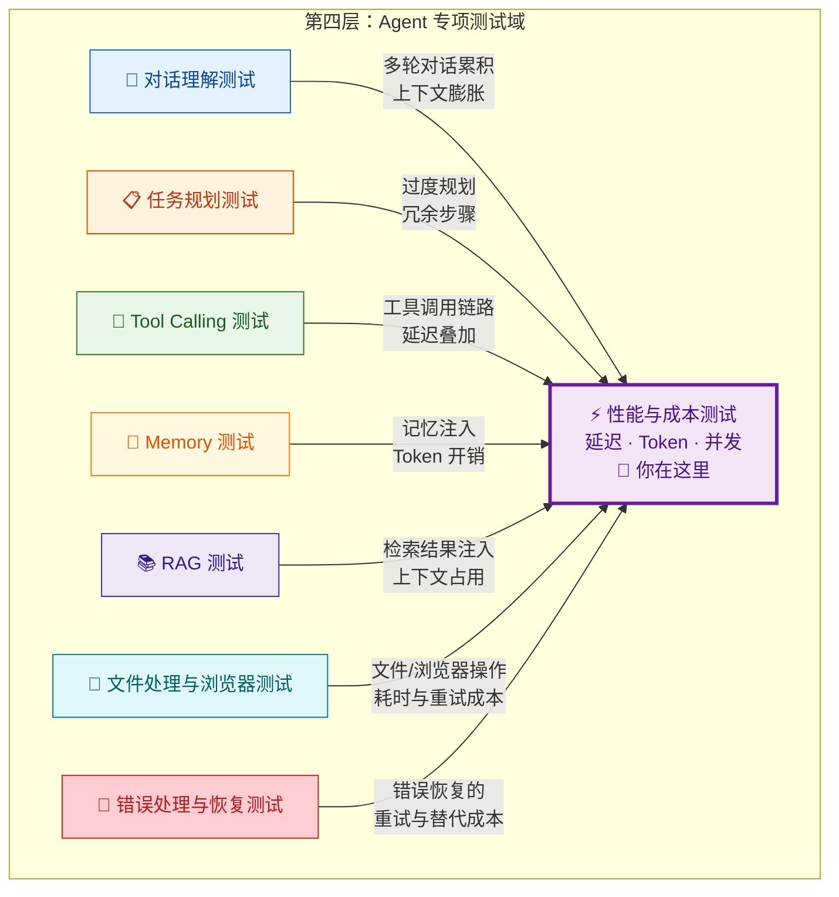
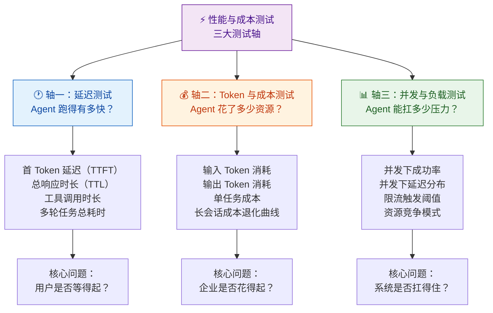
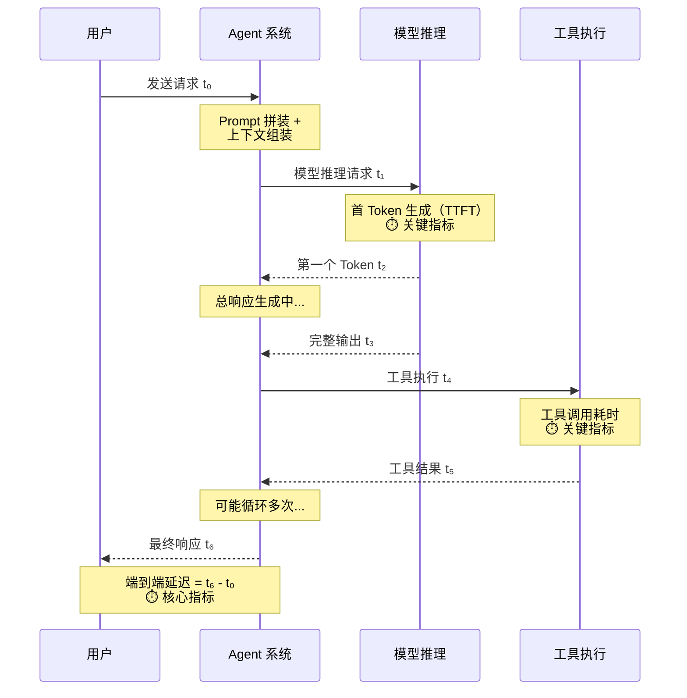
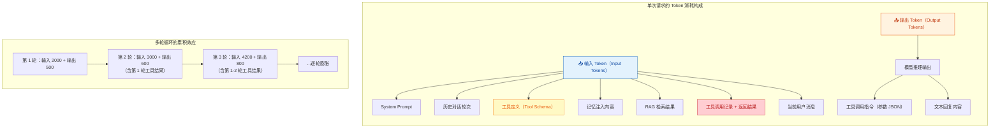
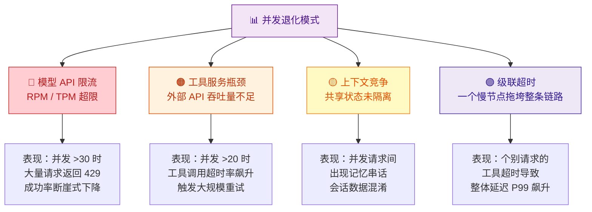
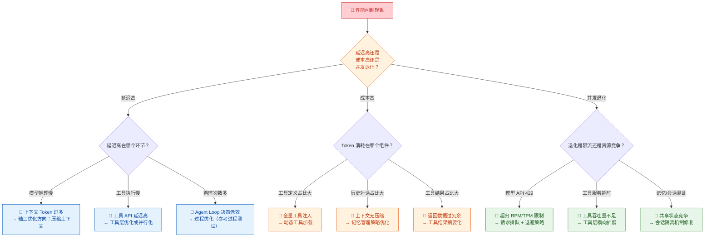

你正在阅读知识库**第四层：Agent 专项测试域**的最后一篇文章。在前面的专项测试中，你已经验证了 Agent 的[对话理解](19-dui-hua-li-jie-ce-shi-yi-tu-shi-bie-duo-lun-shang-xia-wen-yu-qi-yi-chu-li)、[任务规划](20-ren-wu-gui-hua-ce-shi-chai-jie-pai-xu-hui-tui-yu-dong-tai-diao-zheng)、[Tool Calling](21-tool-calling-ce-shi-can-shu-ti-qu-duo-gong-ju-bian-pai-yu-yi-chang-chu-li)、[Memory](22-memory-ce-shi-ji-yi-bao-cun-guo-qi-shi-xiao-yu-kua-hui-hua-ge-chi)、[RAG](23-rag-ce-shi-jian-suo-zhao-hui-yin-yong-zhen-shi-xing-yu-wen-dang-chong-tu)、[文件处理与浏览器自动化](24-wen-jian-chu-li-yu-liu-lan-qi-zi-dong-hua-ce-shi)以及[错误处理与恢复](25-cuo-wu-chu-li-yu-hui-fu-ce-shi-shi-bai-shi-bie-zi-dong-zhong-shi-yu-ti-dai-fang-an)——这些测试回答的都是"功能层"的问题：Agent 能不能做、做得对不对、过程合不合理。但一个只通过功能测试的 Agent 并不等同于一个**生产可用**的 Agent。本文将带你进入一个全新的测试维度：**性能与成本**——它回答的问题是："Agent 跑得够不够快、花得够不够省、扛得够不够多？"

Sources: [readme.md](readme.md#L240-L251), [readme.md](readme.md#L355-L363)

## 性能与成本测试在专项测试域中的定位

在第四层八个专项测试域中，性能与成本测试是一个**全局性测试域**——它不测试某个特定功能模块（如对话理解或工具调用），而是横跨所有模块，检验 Agent 系统在**延迟、资源消耗和并发负载**三个维度的表现。在 [过程测试](16-guo-cheng-ce-shi-yan-zheng-agent-zhong-jian-bu-zou-de-he-li-xing) 中你已经了解到，冗余的中间步骤会直接导致 Token 浪费和延迟增加；在 [稳定性测试](17-wen-ding-xing-ce-shi-duo-ci-zhi-xing-de-ke-kao-xing-yu-zhi-xing) 中你已经注意到，长对话后性能退化是一个重要的不稳定信号——这些发现都指向了同一个结论：性能与成本问题不是孤立的，它们是所有功能缺陷在系统层面的"放大器"。

**一个关键的定位原则**：性能与成本测试与 [过程测试](16-guo-cheng-ce-shi-yan-zheng-agent-zhong-jian-bu-zou-de-he-li-xing) 存在交叉，但关注层面不同——过程测试关注"步骤是否合理"（定性），性能测试关注"这些步骤花了多少时间和资源"（定量）。一个过程合理的 Agent 仍然可能因为上下文过大、工具延迟高或并发处理不当而无法满足生产要求。

Sources: [readme.md](readme.md#L240-L251), [readme.md](readme.md#L355-L363)

## 性能与成本测试的核心价值：为什么"功能通过"远远不够

很多测试团队在初期的测试策略中会自然地将性能测试放在"第二优先级"——"先让它能用，再让它快"。但在 Agent 系统中，这个优先级排序是危险的，因为性能问题不仅是"慢"的问题，它直接决定了系统的**可用性边界**和**商业可行性**。

**第一，延迟直接决定用户体验和任务完成率。** 在 [Agent Loop 核心工作流](9-agent-loop-he-xin-gong-zuo-liu-cong-yong-hu-qing-qiu-dao-zui-zhong-xiang-ying) 中你已经了解到，一个多步骤任务可能需要多轮循环——每轮循环都包含"Prompt 拼装 → 模型推理 → 工具执行 → 结果观察"的完整链路。如果一个 5 轮循环的任务每轮平均耗时 8 秒，用户需要等待 40 秒才能得到结果——在即时通讯或客服场景中，这个等待时间已经远超用户容忍阈值。更严重的是，过长的等待可能导致用户中途取消请求，使得 Agent 之前消耗的 Token 和 API 调用成本全部白费。

**第二，Token 消耗直接转化为真金白银的运营成本。** 在 [LLM 核心概念](3-llm-he-xin-gai-nian-token-shang-xia-wen-chuang-kou-cai-yang-can-shu) 中你已经了解到，模型 API 按 Token 数量收费。一个单次请求消耗 2000 Token 的 Agent，如果在 [错误处理与恢复](25-cuo-wu-chu-li-yu-hui-fu-ce-shi-shi-bai-shi-bie-zi-dong-zhong-shi-yu-ti-dai-fang-an) 中因为不合理的重试策略额外消耗了 8000 Token，单次交互的成本就翻了 5 倍。在日活 10 万用户、每人平均 5 次请求的场景下，这种 Token 浪费可能导致每月数十万的额外成本——而这些问题在功能测试中完全不可见。

**第三，并发能力决定了系统的弹性边界。** Agent 系统不是单用户的——在生产环境中，数十甚至数百个用户可能同时发起请求。每个请求都会触发模型推理和工具调用，如果 Agent 系统没有合理的并发控制、限流和资源管理，并发压力可能导致模型 API 限流（429 错误）、工具超时、上下文管理混乱，最终表现为**并发下成功率断崖式下降**——这种退化在单用户测试中完全无法暴露。

Sources: [readme.md](readme.md#L240-L251), [readme.md](readme.md#L27-L35)

## 三大测试轴与量化指标体系

性能与成本测试需要你从三个独立的测试轴系统性地评估 Agent 系统。每个轴对应不同的系统瓶颈和优化方向，三者之间既有独立的价值，也存在复杂的相互作用关系。

下面逐一深入每个测试轴的度量维度、典型瓶颈模式和测试设计方法。

Sources: [readme.md](readme.md#L240-L251), [readme.md](readme.md#L355-L363)

## 轴一：延迟测试——"Agent 跑得有多快？"

延迟测试是性能测试中最直观的维度——用户的第一感受就是"快不快"。但在 Agent 系统中，"快不快"不是一个单一数字，而是一个由多个时间节点组成的链路。在 [Agent Loop 六阶段模型](9-agent-loop-he-xin-gong-zuo-liu-cong-yong-hu-qing-qiu-dao-zui-zhong-xiang-ying) 中，每一阶段都有独立的延迟贡献，你需要分别度量、分别归因。

### 延迟的四个度量层次

上图展示了 Agent 系统中四个关键的时间节点。每个节点对应一个独立的度量指标：

| 延迟指标 | 定义 | 测量方式 | 典型阈值参考 |
|:---|:---|:---|:---|
| **首 Token 延迟（TTFT）** | 从请求发出到模型返回第一个 Token 的时间 | 记录模型 API 调用的 `created` 到第一个 chunk 到达的时间差 | 简单请求 ≤ 2s；复杂推理 ≤ 5s |
| **总响应时长（TTL）** | 从用户发送请求到收到 Agent 最终响应的端到端时间 | 记录用户请求的 `request_id` 对应的 `start_time` 和 `end_time` 差值 | 单轮对话 ≤ 5s；多工具任务 ≤ 30s |
| **工具调用时长** | 单次工具从发起调用到收到返回结果的时间 | 在 [Trace](13-ri-zhi-trace-yu-zhi-xing-gui-ji-ke-guan-ce-xing) 中记录每个工具调用的 `start_time` 和 `end_time` | 内部工具 ≤ 1s；外部 API ≤ 5s |
| **多轮任务总耗时** | 包含多轮循环的完整任务的累积时间 | 从第一个用户请求到最后一个 Agent 响应的总时长 | 视任务复杂度设定，通常 ≤ 60s |

### 延迟瓶颈的五种典型模式

| 瓶颈模式 | 定义 | 典型表现 | 根因方向 |
|:---|:---|:---|:---|
| **Prompt 膨胀延迟** | 上下文过大导致模型推理变慢 | 单轮对话 3 秒响应，10 轮后变成 15 秒——但工具调用耗时没变 | [上下文窗口](3-llm-he-xin-gai-nian-token-shang-xia-wen-chuang-kou-cai-yang-can-shu) 填满后，模型推理的注意力计算量随 Token 数非线性增长 |
| **工具串行瓶颈** | 多个工具按顺序执行，延迟线性叠加 | 查天气 2s + 查日历 2s + 发邮件 2s = 总计 6s——其中查天气和查日历其实可以并行 | [Agent Loop](9-agent-loop-he-xin-gong-zuo-liu-cong-yong-hu-qing-qiu-dao-zui-zhong-xiang-ying) 的规划阶段未识别独立任务的并行执行机会 |
| **首 Token 延迟过高** | 模型推理的初始化阶段过慢 | 用户点击发送后等了 6 秒才看到第一个字——期间完全没有反馈 | System Prompt 过长、工具定义过多、或模型提供商的推理冷启动 |
| **工具超时累积** | 外部工具响应慢或触发重试 | 天气 API 超时 5s → [重试](25-cuo-wu-chu-li-yu-hui-fu-ce-shi-shi-bai-shi-bie-zi-dong-zhong-shi-yu-ti-dai-fang-an) 又超时 5s → 替代方案 3s = 总计 13s | 外部 API 稳定性差、超时阈值设置过高、缺少快速失败机制 |
| **循环次数过多** | Agent Loop 循环轮次超出预期 | 一个本应 2 轮完成的任务走了 8 轮，总耗时 40 秒 | [过程测试](16-guo-cheng-ce-shi-yan-zheng-agent-zhong-jian-bu-zou-de-he-li-xing) 中识别的循环控制问题 |

**测试设计要点**：延迟测试的核心策略是**分层度量 + 分场景对比**。你需要在 [Trace](13-ri-zhi-trace-yu-zhi-xing-gui-ji-ke-guan-ce-xing) 的基础上建立延迟的分解视图——将总延迟拆解为 Prompt 拼装时间、模型推理时间、工具执行时间、结果处理时间等组件，然后针对不同场景（短对话 vs 长对话、单工具 vs 多工具、简单任务 vs 复杂规划）绘制延迟分布图，快速定位瓶颈环节。

Sources: [readme.md](readme.md#L240-L251), [readme.md](readme.md#L44-L50)

## 轴二：Token 与成本测试——"Agent 花了多少资源？"

Token 消耗是 Agent 系统独有的成本维度——传统软件的性能测试关注 CPU、内存、带宽，而 Agent 系统的性能测试必须增加一个核心指标：**每次交互消耗了多少 Token，折算成多少钱。** 在 [LLM 核心概念](3-llm-he-xin-gai-nian-token-shang-xia-wen-chuang-kou-cai-yang-can-shu) 中你已经了解到 Token 是模型 API 计费的基础单位，而 Agent 系统的 Token 消耗远不止"用户输入 + 模型输出"这么简单。

### Agent 系统的 Token 消耗结构

上图揭示了一个关键事实：**Agent 系统的 Token 消耗远大于"用户输入 + 模型输出"。** 每轮循环的输入都包含 System Prompt、所有工具定义、历史对话、记忆注入、RAG 检索结果和之前所有工具调用记录——这些"隐形 Token"可能占单轮输入的 70% 以上。更严重的是，这些隐形 Token 随循环轮次**累积增长**——第 5 轮循环的输入可能比第 1 轮大 3-5 倍。

### Token 消耗的六个度量指标

| 指标 | 定义 | 计算方式 | 优化方向 |
|:---|:---|:---|:---|
| **单轮交互 Token 消耗** | 一次用户请求到 Agent 响应的完整 Token 消耗 | 从模型 API 返回的 `usage.total_tokens` 获取 | 压缩 Prompt、精简工具定义 |
| **多轮任务累积 Token** | 一个多步骤任务的 Token 总消耗 | 累加所有循环轮次的 `total_tokens` | 减少 [Agent Loop](9-agent-loop-he-xin-gong-zuo-liu-cong-yong-hu-qing-qiu-dao-zui-zhong-xiang-ying) 循环次数 |
| **隐形 Token 占比** | 非用户直接输入的 Token（System Prompt、工具定义、历史记录等）占总输入 Token 的比例 | `(input_tokens - user_message_tokens) / input_tokens` | 精简 System Prompt、动态加载工具定义 |
| **单任务成本** | 完成一个完整任务所需的 API 调用费用 | `Σ(每轮 input_tokens × 输入单价 + output_tokens × 输出单价)` | 全链路优化 |
| **有效输出比** | 最终用户可感知的输出 Token 占总输出 Token 的比例 | `final_response_tokens / total_output_tokens` | 减少中间步骤的冗余输出 |
| **成本退化曲线** | 会话长度增加时单次交互成本的变化趋势 | 绘制"会话轮次 vs 单轮 Token 消耗"的散点图 | [记忆管理](7-ji-yi-ji-zhi-duan-qi-ji-yi-chang-qi-ji-yi-yu-shang-xia-wen-guan-li) 的上下文压缩策略 |

### Token 浪费的五种典型模式

| 浪费模式 | 定义 | 典型表现 | 成本影响 |
|:---|:---|:---|:---|
| **工具定义全量注入** | 每轮循环都将所有工具的完整 JSON Schema 注入 Prompt | Agent 有 30 个工具，每轮注入 3000 Token 的工具定义，但用户请求只需要其中 1 个 | 每轮浪费约 2000-2500 Token（工具定义的 70-80%） |
| **历史对话无压缩** | 所有历史对话轮次完整保留在上下文中 | 20 轮对话后，历史对话占用 15000 Token，其中 80% 是无关的早期上下文 | 输入 Token 线性增长，成本随对话长度平方级膨胀 |
| **工具返回结果过大** | 工具返回了远超任务需要的大量数据 | 用户问"明天北京天气"，天气 API 返回了 7 天逐小时预报（5000 Token），Agent 只需要其中 50 Token | 单次工具结果可能浪费 90%+ 的 Token |
| **冗余循环累积** | [过程测试](16-guo-cheng-ce-shi-yan-zheng-agent-zhong-jian-bu-zou-de-he-li-xing) 中的冗余步骤每轮都带入完整上下文 | 本应 2 轮完成的任务走了 6 轮，每轮都携带 4000+ Token 的完整上下文 | 额外 4 轮 × 4000 Token = 16000+ Token 浪费 |
| **重试不消费历史** | [错误恢复](25-cuo-wu-chu-li-yu-hui-fu-ce-shi-shi-bai-shi-bie-zi-dong-zhong-shi-yu-ti-dai-fang-an) 重试时上下文仍然包含失败记录 | 第 1 次调用失败（占 1000 Token），重试时携带了失败记录再占 1000 Token，如果重试 3 次 = 3000 Token 浪费 | 重试成本可能超过原始请求成本 |

**测试设计要点**：Token 消耗测试的核心策略是**全链路追踪 + 分组件归因**。你需要通过 [Trace](13-ri-zhi-trace-yu-zhi-xing-gui-ji-ke-guan-ce-xing) 记录每轮循环的 Token 消耗分解——System Prompt 多少 Token、工具定义多少 Token、历史对话多少 Token、工具结果多少 Token——然后按组件维度绘制 Token 消耗的堆叠图，快速定位哪个组件是最大的 Token "黑洞"。同时，你需要建立**成本基线**——为每个典型任务场景定义"合理的 Token 消耗上限"，任何超过基线的测试结果都值得深入分析。

Sources: [readme.md](readme.md#L240-L251), [readme.md](readme.md#L27-L28)

## 轴三：并发与负载测试——"Agent 能扛多少压力？"

并发测试是性能测试中最复杂、也最容易被忽略的维度。单用户测试中表现完美的 Agent，在多用户并发场景下可能出现完全不可预期的问题——因为并发不仅考验 Agent 系统自身的处理能力，还考验底层模型 API 的限流策略、工具服务的吞吐量、以及上下文管理的线程安全性。

### 并发测试的四个度量层次

| 度量指标 | 定义 | 测量方式 | 典型退化模式 |
|:---|:---|:---|:---|
| **并发下成功率** | 在 N 个并发请求下，任务成功完成的比例 | 同时发起 N 个独立请求，统计成功完成的比例 | 并发 10 时成功率 95%，并发 50 时降至 70%——模型 API 限流导致请求被拒绝 |
| **并发下延迟分布** | 在 N 个并发请求下，延迟的统计分布（P50/P90/P99） | 记录每个并发请求的端到端延迟，绘制分布图 | 并发 10 时 P50 = 5s，并发 50 时 P50 = 20s——排队等待导致延迟线性增长 |
| **限流触发阈值** | 模型 API 或工具服务开始限流（返回 429）的并发量 | 逐步增加并发量，记录首次出现 429 错误的并发数 | Agent 系统未实现请求排队和退避策略，直接将所有并发请求转发给模型 API |
| **资源竞争模式** | 并发场景下共享资源（记忆、会话状态、工具连接池）的竞争情况 | 在 [Trace](13-ri-zhi-trace-yu-zhi-xing-gui-ji-ke-guan-ce-xing) 中检查并发请求之间是否存在记忆串话、会话混乱 | 请求 A 的工具结果被写入了请求 B 的上下文——会话管理缺乏线程隔离 |

### 并发退化的四种典型模式

**测试设计要点**：并发测试的核心策略是**渐进式加压 + 分阶段观测**。不要一开始就压到极限，而是从 1 → 5 → 10 → 20 → 50 逐步增加并发量，在每个阶段记录成功率、延迟分布和资源使用情况。这样可以精确找到系统退化的**拐点**——而不是只知道"高并发会崩"。同时，并发测试需要特别注意**请求多样性**——如果所有并发请求都是相同的简单对话，你可能无法暴露资源竞争问题；需要混合不同类型的请求（简单对话 + 多工具任务 + 长对话 + 文件处理），才能模拟真实负载模式。

Sources: [readme.md](readme.md#L240-L251), [readme.md](readme.md#L249-L251)

## 三轴交叉：性能问题的系统级归因

三个测试轴不是孤立存在的——延迟问题可能源于 Token 膨胀（轴一 ← 轴二），并发退化可能表现为延迟飙升（轴三 → 轴一），高并发下的重试风暴可能让 Token 消耗暴增（轴三 → 轴二）。你需要建立一个**三轴交叉归因模型**，才能在发现性能问题时精准定位根因。

**交叉归因的典型场景**：你发现并发 30 时成功率从 95% 降至 60%——表面上是并发问题（轴三），但深入分析 Trace 后发现，30 个并发请求中有 15 个触发了模型 API 的 429 限流错误，Agent 的 [重试机制](25-cuo-wu-chu-li-yu-hui-fu-ce-shi-shi-bai-shi-bie-zi-dong-zhong-shi-yu-ti-dai-fang-an) 对每个 429 都重试了 3 次，每次重试都消耗了完整的上下文 Token（轴二），而重试期间的排队等待又把剩余请求的延迟从 5 秒推高到 25 秒（轴一）。根因不是并发控制不足，而是**缺少请求级别的排队和退避策略**——优化方向不是增加并发能力，而是在 Agent 系统层引入请求队列。

Sources: [readme.md](readme.md#L240-L251), [readme.md](readme.md#L44-L50)

## 性能与成本测试用例设计方法论

理解了三大测试轴和量化指标之后，接下来的核心问题是：**如何系统地设计性能与成本测试用例？** 以下六种方法从不同维度覆盖性能测试的核心场景。

### 方法一：延迟分解测试——"把每一毫秒归因到正确的环节"

延迟分解测试的核心操作是：选择一组代表性任务（覆盖简单对话、单工具调用、多工具编排、复杂规划等场景），对每个任务执行并记录 Trace 中的时间戳，然后将总延迟拆解为各组件的贡献。

| 测试场景 | 期望的延迟分解 | 典型瓶颈信号 |
|:---|:---|:---|
| **简单对话（无需工具）** | Prompt 拼装 ≤ 100ms + 模型推理 ≤ 3s + 响应格式化 ≤ 50ms | Prompt 拼装超过 500ms → System Prompt 过长或工具定义过多 |
| **单工具调用** | 简单对话延迟 + 工具执行 ≤ 3s + 结果处理 ≤ 200ms | 工具执行超过 5s → 外部 API 延迟或参数构造问题 |
| **多工具串行任务** | 每轮循环延迟 × 轮次 | 单轮延迟正常但总耗时过高 → 循环轮次过多（过程问题） |
| **多工具并行潜力任务** | 并行执行 vs 串行执行的延迟对比 | 并行执行后延迟未降低 → Agent 系统不支持工具并行 |
| **长对话后的请求** | 与短对话延迟对比 | 长对话后延迟翻倍 → 上下文膨胀延迟 |

### 方法二：Token 审计测试——"每一千 Token 都要有去处"

Token 审计测试的核心操作是：对每个典型任务场景，执行完整的 Trace 记录，然后按 Token 消耗组件绘制堆叠图，审计每个组件的 Token 占比是否合理。

| 审计维度 | 检查内容 | 合理占比参考 | 优化策略 |
|:---|:---|:---|:---|
| **System Prompt** | 核心指令是否精炼？是否包含过多示例？ | ≤ 总输入的 15% | 压缩冗余描述、移除不必要的示例 |
| **工具定义** | 是否全量注入了所有工具？ | ≤ 总输入的 20%（或动态加载后 ≤ 5%） | 按任务意图动态加载相关工具定义 |
| **历史对话** | 是否保留了过多历史轮次？是否包含冗余信息？ | ≤ 总输入的 40% | 引入 [记忆摘要](7-ji-yi-ji-zhi-duan-qi-ji-yi-chang-qi-ji-yi-yu-shang-xia-wen-guan-li) 机制，压缩早期对话 |
| **工具结果** | 工具返回是否过大？是否需要全部保留？ | ≤ 总输入的 20% | 工具结果摘要化、只保留关键字段 |
| **用户消息** | 用户原始输入的 Token 消耗 | 通常 ≤ 总输入的 5% | 一般不需要优化，但注意用户上传的大文件 |

### 方法三：渐进式并发测试——"找到系统的弹性边界"

渐进式并发测试的核心操作是：选择一组代表性任务，从 1 个并发逐步增加到系统预期的峰值负载，在每个并发级别记录成功率、延迟分布（P50/P90/P99）和 Token 消耗。

| 并发级别 | 观测目标 | 典型退化信号 |
|:---|:---|:---|
| **1-5 并发** | 建立单用户/低并发的性能基线 | 此阶段延迟应与单用户测试基本一致 |
| **10-20 并发** | 检测模型 API 限流的早期信号 | 偶发 429 错误 → 需要引入请求排队 |
| **30-50 并发** | 检测工具服务吞吐量瓶颈 | 工具超时率升高 → 工具服务需要横向扩展 |
| **50-100 并发** | 检测 Agent 系统自身的状态管理问题 | 会话混乱、记忆串话 → 线程隔离机制有缺陷 |
| **100+ 并发** | 压力测试——找到系统的崩溃边界 | 成功率低于 50% 或延迟超过 60s → 需要限流降级策略 |

### 方法四：长会话退化测试——"对话越长，性能越差吗？"

长会话退化测试与 [稳定性测试](17-wen-ding-xing-ce-shi-duo-ci-zhi-xing-de-ke-kao-xing-yu-zhi-xing) 的"上下文膨胀稳定性"维度存在交叉，但关注层面不同——稳定性测试关注"能力是否退化"，性能测试关注"成本和延迟是否退化"。核心操作是：设计一组递进式多轮对话（10-30 轮），在每轮对话后记录 Token 消耗、延迟和响应质量，绘制退化曲线。

| 退化指标 | 正常退化模式 | 异常退化信号 | 根因方向 |
|:---|:---|:---|:---|
| **单轮 Token 消耗** | 随轮次缓慢线性增长 | 10 轮后单轮消耗是第 1 轮的 5 倍以上 | [记忆管理](7-ji-yi-ji-zhi-duan-qi-ji-yi-chang-qi-ji-yi-yu-shang-xia-wen-guan-li) 缺少上下文压缩或摘要机制 |
| **单轮延迟** | 随轮次缓慢增长（上下文变大推理变慢） | 10 轮后延迟是第 1 轮的 3 倍以上 | 上下文 Token 膨胀导致模型推理时间非线性增长 |
| **累积成本** | 线性增长 | 指数增长 | Token 消耗每轮都在"滚雪球"——每轮都带着所有历史 |

### 方法五：成本归因测试——"哪些任务类型最烧钱？"

成本归因测试的核心操作是：按任务类型分类统计 Token 消耗和对应成本，建立成本分布图，识别成本最高的任务类型和优化机会。

| 任务类型 | 典型 Token 消耗特征 | 成本敏感度 | 优化优先级 |
|:---|:---|:---|:---|
| **简单闲聊** | 输入少、输出少、无需工具 | 低 | 低 |
| **知识库问答** | RAG 检索结果注入、输出中等 | 中 | 中——优化 RAG 返回的 chunk 数量 |
| **单工具调用** | 工具定义 + 工具结果、输出少 | 中 | 中——优化工具定义和结果格式 |
| **多工具编排** | 多轮循环、Token 累积 | 高 | 高——减少循环轮次、并行化工具调用 |
| **复杂任务规划** | 长推理链、多步骤、高 Token 消耗 | 极高 | 最高——优化规划效率、引入步骤缓存 |

### 方法六：配置变更成本回归——"改一行 Prompt，成本翻倍了？"

这种测试方法与 [稳定性测试](17-wen-ding-xing-ce-shi-duo-ci-zhi-xing-de-ke-kao-xing-yu-zhi-xing) 的"配置变更稳定性"维度平行，但关注的是配置变更对**成本**的影响而非功能影响。核心操作是：每次 Prompt 修改、工具定义变更、采样参数调整后，运行一套标准化的性能测试集，对比变更前后的延迟和 Token 消耗。

| 配置变更类型 | 潜在成本影响 | 检测方法 |
|:---|:---|:---|
| **System Prompt 加长** | 每轮循环都多消耗 System Prompt 增加的 Token | 对比变更前后的单轮输入 Token 数 |
| **新增工具定义** | 每轮循环都多注入新工具的 JSON Schema | 对比变更前后的工具定义 Token 占比 |
| **Temperature 调整** | 可能增加冗余循环次数（推理不稳定导致来回试探） | 对比变更前后的平均循环轮次 |
| **记忆策略变更** | 注入更多/更少的历史摘要，影响上下文大小 | 对比变更前后的上下文 Token 总量 |

Sources: [readme.md](readme.md#L240-L251), [readme.md](readme.md#L355-L363)

## 性能与成本测试的工程化实践

性能测试不是"跑一次出个报告"的事后活动，而需要嵌入到日常的测试流程中。以下是一套可落地的工程化实践方案。

### 测试基础设施：性能看板的构建

一个可持续的性能测试体系需要三类基础设施：

**第一，性能基线数据集。** 你需要选择 20-50 个代表性任务（覆盖所有核心场景），为每个任务建立**延迟基线**和**Token 消耗基线**。这些基线不是一成不变的——每次模型版本升级、Prompt 优化或架构变更后都需要重新校准。基线的价值不在于绝对数值，而在于**提供对比参照**——任何偏离基线超过阈值的测试结果都应该触发告警。

**第二，自动化性能测试脚本。** 性能测试需要高频执行（至少每天一次），手动操作不可持续。你需要编写脚本实现：自动发起测试请求 → 收集 Trace 数据 → 解析延迟和 Token 消耗 → 对比基线 → 生成报告。在 [自动化评测工程](28-zi-dong-hua-ping-ce-gong-cheng-jiao-ben-shu-ju-ji-yu-hui-gui-kan-ban) 中你将学到更完整的自动化框架设计方法。

**第三，性能回归看板。** 将每次测试的关键指标（TTFT、TTL、Token 消耗、成本估算）可视化到看板上，支持按时间维度查看趋势。当某次变更导致成本突然增加 30% 时，看板应该能直观地展示这个退化。

### 关键指标告警阈值建议

| 指标 | 绿色（正常） | 黄色（关注） | 红色（告警） | 建议动作 |
|:---|:---|:---|:---|:---|
| **TTFT** | ≤ 2s | 2-5s | > 5s | 检查 System Prompt 长度和工具定义数量 |
| **TTL（单轮）** | ≤ 5s | 5-15s | > 15s | 检查工具调用链路和循环次数 |
| **TTL（多步骤）** | ≤ 30s | 30-60s | > 60s | 检查规划效率和并行化能力 |
| **单任务 Token** | ≤ 基线 × 1.2 | 基线 × 1.2-1.5 | > 基线 × 1.5 | 执行 Token 审计，定位浪费组件 |
| **单任务成本** | ≤ 基线 × 1.2 | 基线 × 1.2-1.5 | > 基线 × 1.5 | 结合 Token 审计和延迟分解综合分析 |
| **并发成功率** | ≥ 95% | 80-95% | < 80% | 检查限流策略和资源竞争 |
| **长会话 Token 退化** | ≤ 线性增长 | 略超线性 | 指数增长 | 检查上下文压缩和记忆管理策略 |

Sources: [readme.md](readme.md#L240-L251), [readme.md](readme.md#L346-L366)

## 从专项测试到评估体系：下一步

至此，你已经完成了第四层"Agent 专项测试域"全部八个专项的学习。性能与成本测试作为最后一个专项，揭示了一个核心认知：**功能正确只是 Agent 系统的入场券，性能和成本才是决定生产可行性的关键门槛。** 一个通过了所有功能测试但 Token 消耗超标、延迟不可接受、并发能力不足的 Agent，与一个功能有缺陷的 Agent 一样——都不能上线。

但专项测试只是第一步。你还需要将分散的测试实践整合为一个可持续的**评估体系**——如何建立 Golden Set、如何设计 Rubric 评分标准、如何用 LLM-as-a-Judge 自动化评估——这些内容将在 [评估体系搭建：Golden Set、Rubric 评分与 LLM-as-a-Judge](27-ping-gu-ti-xi-da-jian-golden-set-rubric-ping-fen-yu-llm-as-a-judge) 中展开。而如何将评估体系工程化为可回归的自动化流水线，将在 [自动化评测工程：脚本、数据集与回归看板](28-zi-dong-hua-ping-ce-gong-cheng-jiao-ben-shu-ju-ji-yu-hui-gui-kan-ban) 中详细介绍。