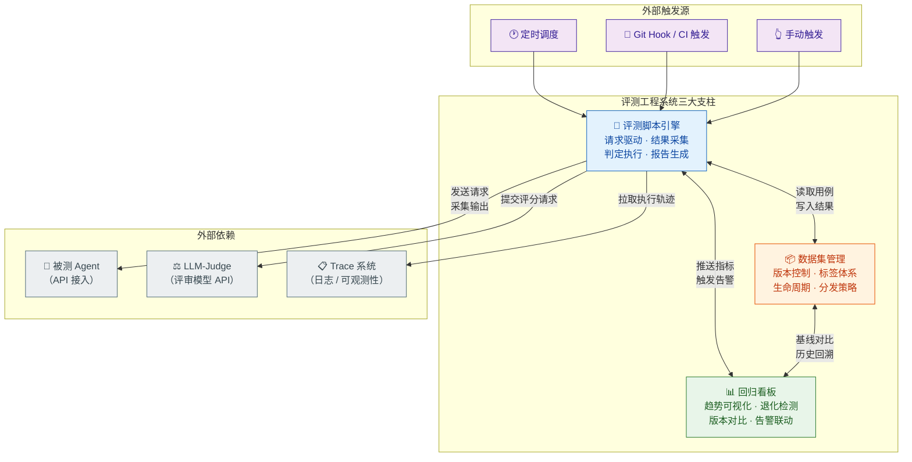
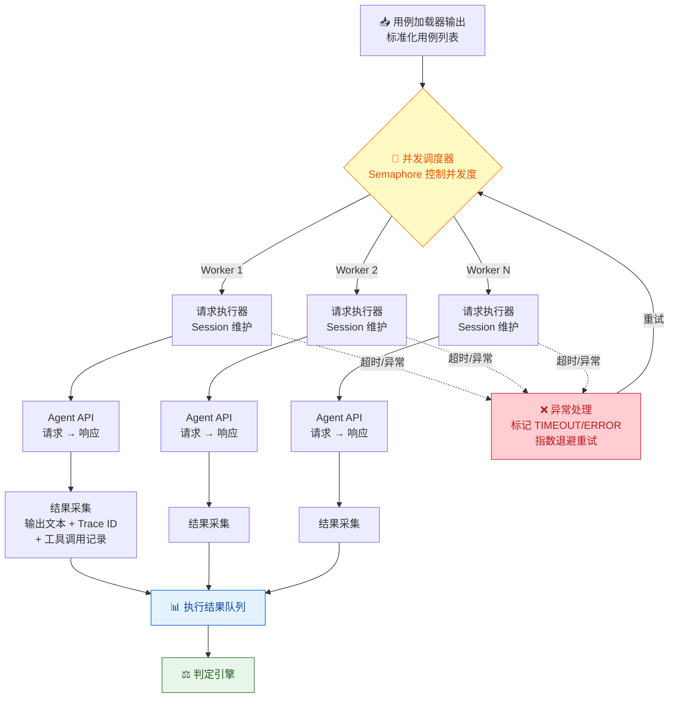
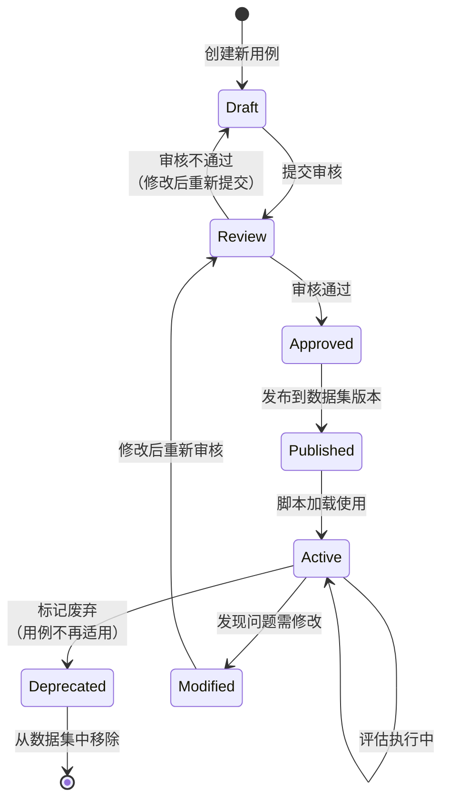
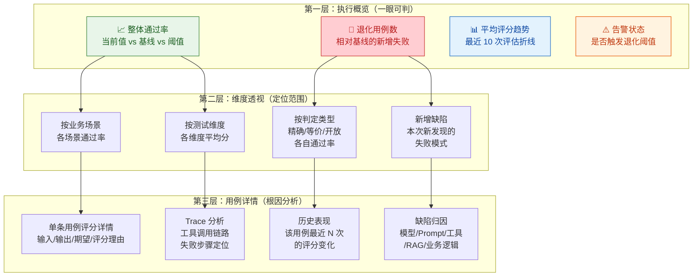
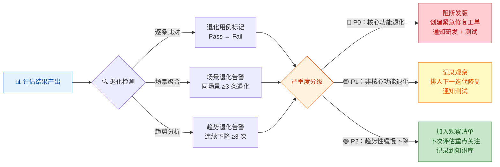
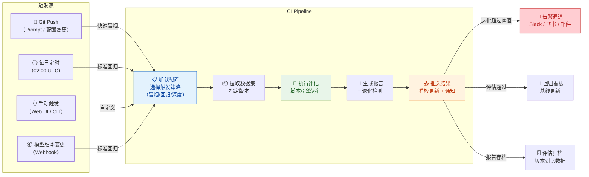

你正在阅读知识库**第五层：评估体系与工程化**的第二篇文章。在前一篇 [评估体系搭建：Golden Set、Rubric 评分与 LLM-as-a-Judge](27-ping-gu-ti-xi-da-jian-golden-set-rubric-ping-fen-yu-llm-as-a-judge) 中，你已经完成了评估体系三大组件的设计方法论——Golden Set 定义"测什么"、Rubric 定义"怎么判"、LLM-as-a-Judge 定义"谁来判"，并且了解了从基建期到成熟期的分阶段落地路径。本文的核心任务是**将这套评估体系转化为可运行的工程系统**：你需要搭建自动执行脚本、管理评测数据集的生命周期、建设回归看板实现质量趋势可视化，最终让"一键回归评测"成为现实。

Sources: [readme.md](readme.md#L264-L276), [readme.md](readme.md#L462-L471)

## 从评估体系到工程系统的跃迁

在 [评估体系搭建](27-ping-gu-ti-xi-da-jian-golden-set-rubric-ping-fen-yu-llm-as-a-judge) 中定义的九步评估流水线（加载用例 → 执行测试 → 按判定类型分流 → 汇总评分 → 人工校准 → 生成报告 → 存档基线），在手工模式下可能需要几名测试工程师花一整天完成。而工程化的目标是将这个流程压缩到**30 分钟内全自动完成**——这意味着你需要解决三个核心工程问题：如何用脚本驱动 Agent 并采集完整的输出与 Trace 数据；如何以版本化的方式管理不断演进的评测数据集；如何将每次评估的结果聚合为可追溯、可对比、可告警的回归看板。下图展示了自动化评测工程系统的整体架构：



Sources: [readme.md](readme.md#L264-L276), [readme.md](readme.md#L423-L431), [readme.md](readme.md#L336-L371)

## 评测脚本引擎：自动化评估的执行核心

### 脚本引擎的模块拆解

评测脚本引擎是整个自动化评测系统的中枢——它负责驱动 Agent 执行、采集输出数据、调用判定引擎、汇总评分结果。基于 [评估体系搭建](27-ping-gu-ti-xi-da-jian-golden-set-rubric-ping-fen-yu-llm-as-a-judge) 中定义的评估流水线，脚本引擎应当被拆解为五个**职责内聚**的模块，每个模块独立可测试、可替换：

| 模块 | 职责 | 输入 | 输出 | 技术选型建议 |
|:---|:---|:---|:---|:---|
| **用例加载器** | 从数据集中读取、过滤、组装测试用例 | 数据集路径 + 过滤条件（标签/场景/优先级） | 标准化的用例列表 | Python + Pydantic 校验 |
| **请求执行器** | 向被测 Agent 发送请求并采集完整响应 | 用户输入 + 上下文配置 | Agent 输出文本 + 工具调用链 + Trace ID | httpx/aiohttp + 重试机制 |
| **判定引擎** | 按判定类型分流并执行评分 | Agent 输出 + 期望要素 + Rubric | 每条用例的判定结果 + 评分详情 | 正则引擎 + LLM-Judge API 调用 |
| **报告生成器** | 汇总所有判定结果，生成结构化报告 | 判定结果列表 + 历史基线数据 | HTML 报告 + JSON 数据 + 指标摘要 | Jinja2 模板 + 统计计算 |
| **调度控制器** | 编排上述模块的执行流程，处理异常和重试 | 评估任务配置（并发度、超时、重试策略） | 任务执行状态 + 日志 | asyncio + 信号量控制并发 |

Sources: [readme.md](readme.md#L264-L276), [readme.md](readme.md#L364-L371), [readme.md](readme.md#L423-L431)

### 请求执行器的关键设计

请求执行器是脚本引擎中**最复杂**的模块，因为它需要处理 Agent 交互中的大量不确定性：网络超时、Agent 响应格式变化、多轮对话状态维护、Trace 数据关联等。以下是请求执行器需要解决的核心问题和推荐的设计策略：

**异步并发控制。** Agent 评测不能串行执行——150 条用例按平均 15 秒/条计算，串行需要 37 分钟；而 10 并发可以将时间压缩到 4 分钟左右。但并发度不能无限提高，因为被测 Agent 通常有 API 速率限制。推荐使用 **信号量（Semaphore）** 控制最大并发数，同时为每条用例设置独立的超时时间（建议 60 秒），超时后标记为 TIMEOUT 并继续执行后续用例。

**多轮对话状态管理。** 部分 Golden Set 用例涉及多轮交互（如 [对话理解测试](19-dui-hua-li-jie-ce-shi-yi-tu-shi-bie-duo-lun-shang-xia-wen-yu-qi-yi-chu-li) 中的多轮补充条件场景）。执行器需要维护每条用例独立的会话上下文——每轮发送后，将 Agent 响应追加到上下文中，作为下一轮的输入。这意味着用例数据结构需要从单轮消息扩展为**消息序列**。

**Trace 数据关联。** 如 [日志、Trace 与执行轨迹可观测性](13-ri-zhi-trace-yu-zhi-xing-gui-ji-ke-guan-ce-xing) 中所述，Agent 的执行轨迹是过程评估的核心数据源。执行器在发送请求后，必须同时采集 Agent 返回的 Trace ID（或通过日志系统关联），以便后续的判定引擎进行过程层面的验证。推荐的设计是：执行器在请求头中注入唯一的 `evaluation_run_id`，通过这个 ID 在日志系统中回溯完整的执行轨迹。

**重试与幂等性。** Agent 输出的非确定性意味着同一条用例执行两次可能得到不同结果——但网络错误、API 限流等**基础设施故障**应当被重试。关键区分：判定结果为 Fail 不是重试的理由（那是真实的质量信号），只有网络超时、5xx 错误等才触发重试。建议设置最大重试次数为 3 次，使用指数退避策略（1s → 2s → 4s）。



Sources: [readme.md](readme.md#L364-L371), [readme.md](readme.md#L253-L261), [readme.md](readme.md#L423-L431)

### 判定引擎的三层分流实现

在 [评估体系搭建](27-ping-gu-ti-xi-da-jian-golden-set-rubric-ping-fen-yu-llm-as-a-judge) 中你已经了解了按判定类型分流处理的策略。工程化实现时，判定引擎需要将这个策略转化为可执行的判定管道。每一层判定引擎的输入输出接口应当标准化，使得上层调度器无需关心具体使用哪种判定方式：

**第一层：精确匹配引擎（零 LLM 成本）。** 这是效率最高的一层，完全不依赖 LLM。实现方式是对 Agent 输出进行正则提取或 JSON Schema 校验，将提取结果与 Golden Set 中的 `key_facts` 逐项比对。例如，对于天气查询用例，引擎通过正则从 Agent 输出中提取城市名、温度数值、天气状况，然后与期望值做精确比对。判定结果为布尔值（Pass/Fail）加具体的匹配详情（哪些 key_facts 命中、哪些未命中）。

**第二层：等价判定引擎（轻量 LLM 成本）。** 对于无法精确匹配但存在明确参考标准的场景，使用 LLM-Judge 的**参考比对模式**。实现时需要注意：控制 Judge Prompt 的 Token 消耗——不需要将完整的 Rubric 注入，只需要注入"比对以下两个文本中的关键信息是否语义等价"这一简化指令，加上期望要素列表和 Agent 输出。这一层的成本约为完整 Rubric 评分的 1/3。

**第三层：开放评估引擎（完整 Rubric 评分）。** 只有前两层无法覆盖的场景（如创意写作、方案设计等开放性任务）才进入这一层。这里使用 [评估体系搭建](27-ping-gu-ti-xi-da-jian-golden-set-rubric-ping-fen-yu-llm-as-a-judge) 中定义的完整 Judge Prompt 模板，包含所有维度定义、等级描述和锚点示例。为了提升一致性，每条用例执行 3 次评分取中位数。

| 判定层级 | 覆盖用例比例 | 单条成本 | 单条耗时 | 可信度 | 实现复杂度 |
|:---:|:---:|:---:|:---:|:---:|:---:|
| **精确匹配** | 40-50% | ¥0 | <100ms | ⭐⭐⭐⭐⭐ | 低 |
| **等价判定** | 30-40% | ¥0.01-0.05 | 2-5s | ⭐⭐⭐⭐ | 中 |
| **开放评估** | 10-20% | ¥0.05-0.20 | 5-15s | ⭐⭐⭐ | 高 |

Sources: [readme.md](readme.md#L264-L276), [readme.md](readme.md#L346-L371), [readme.md](readme.md#L402-L410)

### 脚本配置化而非硬编码

评测脚本最常见的设计错误是**将评估参数硬编码在脚本中**——Judge Prompt、并发度、超时阈值、评分权重全部写死在代码里。这意味着每次调整评估策略都需要修改代码、重新部署。正确的做法是将所有可变的评估参数**外部化为配置文件**，脚本只负责执行配置定义的逻辑：

```
# eval_config.yaml — 评测任务配置文件示例
task:
  name: "ArkClaw v2.3 回归评测"
  golden_set_path: "./datasets/golden_set_v2.json"
  filter:
    tags: ["核心场景", "P0"]
    exclude_tags: ["已知缺陷"]
  concurrency: 10
  timeout_per_case: 60
  retry:
    max_attempts: 3
    backoff: "exponential"

judge:
  model: "claude-3.5-sonnet"
  temperature: 0.0
  rubric_path: "./rubrics/result_quality_v2.json"
  pairwise_runs: 3

report:
  output_dir: "./reports/2025-01-15"
  baseline_path: "./reports/2025-01-08/summary.json"
  format: ["html", "json"]
  regression_threshold: 0.05  # 通过率下降超过 5% 触发告警
```

这种配置化的设计使得非开发人员（如测试工程师）也能通过修改 YAML 文件来调整评估策略，而无需接触代码。更重要的是，每次评估的完整配置可以与结果一起归档，确保**评估结果的可复现性**——三个月后回看某次评估报告时，你能精确知道当时使用了什么 Golden Set 版本、什么 Rubric、什么评审模型。

Sources: [readme.md](readme.md#L264-L276), [readme.md](readme.md#L364-L371)

## 数据集管理：版本化、标签化与生命周期

### 为什么评测数据集需要工程化管理

在 [评估体系搭建](27-ping-gu-ti-xi-da-jian-golden-set-rubric-ping-fen-yu-llm-as-a-judge) 中你设计了 Golden Set 的数据结构，但一个静态的 JSON 文件无法支撑长期运行的评估体系。现实中的数据集面临以下工程挑战：**版本演进**（Agent 新增能力时需要同步扩充用例）、**标签管理**（按场景/维度/优先级灵活筛选）、**数据完整性**（用例之间的引用关系、Rubric 的关联映射）、**协作编辑**（多人同时维护用例时避免冲突）。如果缺乏工程化管理，数据集很快就会退化为一堆无法维护的 JSON 碎片。

Sources: [readme.md](readme.md#L346-L371), [readme.md](readme.md#L264-L276)

### 数据集的目录结构与版本控制

推荐将评测数据集组织为以下目录结构，并使用 Git 进行版本控制：

```
datasets/
├── golden_set/
│   ├── v1.0/                          # 版本化目录
│   │   ├── manifest.json              # 版本清单：用例总数、场景分布、更新日志
│   │   ├── cases/                     # 用例文件
│   │   │   ├── tool_calling/          # 按业务场景聚类
│   │   │   │   ├── TC-TOOL-WEATHER-001.json
│   │   │   │   ├── TC-TOOL-EMAIL-002.json
│   │   │   │   └── ...
│   │   │   ├── rag_qa/
│   │   │   ├── conversation/
│   │   │   └── security/
│   │   └── references/               # 参考答案（用于参考比对模式）
│   │       ├── TC-TOOL-WEATHER-001_ref.md
│   │       └── ...
│   ├── v1.1/                          # 增量更新
│   └── latest -> v1.1/               # 符号链接指向最新版本
├── rubrics/
│   ├── result_quality_v2.json
│   ├── process_rationality_v1.json
│   ├── tool_calling_v1.json
│   └── security_compliance_v1.json
├── baselines/                         # 历史评估基线
│   ├── 2025-01-08_summary.json
│   ├── 2025-01-15_summary.json
│   └── ...
└── config_schema/                     # 配置文件的 JSON Schema
    ├── golden_set_case_schema.json
    └── rubric_schema.json
```

**版本清单（manifest.json）** 是数据集管理的核心文件。它记录了每个版本包含的用例总数、按场景和维度的分布、相对于上一版本的变更内容（新增/修改/删除了哪些用例），以及该版本的审核状态和发布时间。评估脚本在加载用例时首先读取 manifest.json，确认数据集版本的完整性。

```json
{
  "version": "1.1",
  "released_at": "2025-01-15T10:00:00Z",
  "total_cases": 95,
  "distribution": {
    "by_scenario": {"tool_calling": 30, "rag_qa": 25, "conversation": 20, "security": 20},
    "by_judgment_type": {"exact_match": 45, "equivalence": 30, "open_eval": 20},
    "by_priority": {"P0": 30, "P1": 40, "P2": 25}
  },
  "changes_from_prev": {
    "added": ["TC-SEC-INJECT-021", "TC-TOOL-FILE-015"],
    "modified": ["TC-RAG-CONF-008"],
    "deprecated": []
  },
  "review_status": "approved",
  "reviewer": "测试团队"
}
```

Sources: [readme.md](readme.md#L346-L371), [readme.md](readme.md#L264-L276), [readme.md](readme.md#L437-L471)

### 标签体系与灵活筛选

Golden Set 的用例组织需要支持**多维度的灵活筛选**——一次回归评测可能只需要跑"Tool Calling 相关的 P0 用例"，而专项测试可能需要跑"所有涉及多轮对话的安全场景用例"。标签体系就是实现这种灵活筛选的基础。

推荐使用**两级标签体系**：一级标签按测试维度（`结果测试`、`过程测试`、`安全性测试`、`稳定性测试`）组织，二级标签按业务场景（`天气查询`、`邮件发送`、`知识库问答`、`文件处理`）组织。每条用例至少包含一个一级标签和一个二级标签，外加可选的元数据标签（如 `多步骤`、`对抗性`、`边界条件`、`已知缺陷`）。评估脚本通过标签组合实现任意粒度的用例筛选，无需修改数据集本身。

| 标签层级 | 示例标签 | 用途 | 筛选场景 |
|:---|:---|:---|:---|
| **一级：测试维度** | `结果测试`、`过程测试`、`安全性测试` | 按评估维度筛选，加载对应 Rubric | "只回归安全性相关用例" |
| **二级：业务场景** | `天气查询`、`邮件发送`、`知识库问答` | 按功能模块筛选，定位问题范围 | "只测知识库问答相关用例" |
| **元数据标签** | `多步骤`、`对抗性`、`边界条件`、`P0` | 按用例特征和优先级筛选 | "只跑 P0 级别对抗性用例" |

Sources: [readme.md](readme.md#L346-L371), [readme.md](readme.md#L264-L276)

### 数据集生命周期管理

评测数据集不是"建完就完"的静态资源，它有完整的生命周期：**创建 → 审核 → 发布 → 使用 → 维护 → 废弃**。下图展示了数据集在整个生命周期中的状态流转：



**关键管理规则**：

**审核机制。** 新增或修改的用例必须经过至少一名其他测试工程师的审核才能发布。审核重点包括：期望输出要素是否完整且无歧义、判定场景分类是否正确、用例是否与现有用例重复。这个机制确保数据集质量不会因个人疏忽而退化。

**废弃而非删除。** 当用例不再适用时（如对应功能已下线），不要直接删除——将其标记为 `Deprecated` 并保留在数据集中，记录废弃原因和时间。这样做是为了保留历史评估结果的可追溯性——三个月前的评估报告中某条用例的 Pass/Fail 结果，应当能在数据集中找到对应的用例定义。

**变更日志。** 每次 Golden Set 版本更新时，必须记录变更日志——新增了哪些用例、修改了哪些用例的期望输出、废弃了哪些用例。评估脚本在加载新版本数据集时，会自动与上一版本的基线进行对比，确保变更不会导致评估结果的不可比性。

Sources: [readme.md](readme.md#L346-L371), [readme.md](readme.md#L264-L276)

## 回归看板：从数据到决策

### 回归看板的核心定位

**回归看板是评估体系工程化的最终交付物**——它是将每次评估的 JSON 数据转化为可视化信息的窗口，让产品经理、测试工程师和研发团队能够快速回答一个核心问题："这次变更，Agent 是变好了还是变差了？" 一个设计优秀的回归看板应当满足三个条件：**一眼可判**（核心指标无需解读即可理解）、**可下钻**（从整体趋势到单条用例的逐层穿透）、**可行动**（看板结果直接驱动后续动作——发版/修复/回退）。

Sources: [readme.md](readme.md#L462-L471), [readme.md](readme.md#L264-L276)

### 看板的信息架构

回归看板的信息架构应当按照**从宏观到微观**的逻辑组织，让不同角色的读者都能快速找到自己关心的信息层次：



Sources: [readme.md](readme.md#L462-L471), [readme.md](readme.md#L336-L371)

### 核心指标定义与计算方法

回归看板上的每一个指标都必须有**明确的计算方法和统计口径**，否则不同人对同一指标的理解可能完全不同，导致决策偏差。以下是回归看板的核心指标体系：

| 指标名称 | 计算方法 | 统计口径 | 阈值建议 | 决策含义 |
|:---|:---|:---|:---|:---|
| **整体通过率** | `(Pass 数 + 0.5 × Review 数) / 总用例数` | 所有 Golden Set 用例 | ≥ 85% | 低于阈值阻断发版 |
| **精确匹配通过率** | `Pass 数 / 精确匹配用例数` | 仅第一层用例 | ≥ 95% | 低于阈值立即排查 |
| **维度平均分** | `Σ(各维度加权得分) / 维度数` | 所有经 Rubric 评分的用例 | ≥ 3.5 分 | 低于 2.0 分进入修复流程 |
| **退化用例数** | `上次 Pass 本次 Fail 的用例数` | 与上次评估结果逐条比对 | ≤ 3 条 | 超过阈值自动创建修复工单 |
| **新增通过数** | `上次 Fail 本次 Pass 的用例数` | 与上次评估结果逐条比对 | — | 正向信号，确认修复有效性 |
| **LLM-Judge 一致性** | `人工评分与模型评分的 Spearman 相关系数` | 人工抽检的 10-15% 样本 | ≥ 0.8 | 低于阈值需调整 Judge Prompt |
| **评估覆盖率** | `本次评估用例数 / Golden Set 总用例数` | 按标签筛选后 | ≥ 80%（全量回归） | 过低意味着回归范围不足 |

**一个关键的设计决策**：`Review`（介于 Pass 和 Fail 之间的"需人工确认"状态）在通过率计算中如何处理。推荐按 0.5 的权重折算——这样做的理由是：Review 状态通常表示"可以接受但不够好"，完全算通过会掩盖质量隐患，完全算失败又会造成过度告警。如果团队对质量要求更严格，可以将 Review 的权重调整为 0.3 或直接算作 Fail。

Sources: [readme.md](readme.md#L336-L371), [readme.md](readme.md#L264-L276)

### 退化检测与自动告警

回归看板的核心价值不是"展示数据"，而是**主动发现问题**。退化检测机制需要在评估结果产出时自动执行以下检查：

**逐条比对退化检测。** 将本次评估结果与基线（上次评估或指定版本评估）逐条比对，标记出"上次 Pass 本次 Fail"的退化用例。每条退化用例需要附带：退化前后的评分差异、该用例关联的测试维度和业务场景、可能的退化原因（如近期是否有 Prompt 变更、模型升级、工具接口修改）。

**场景级退化聚合。** 当同一业务场景下的退化用例数达到阈值时（如"知识库问答"场景下连续 3 条用例退化），触发场景级告警。场景级告警比单条用例告警更有行动指导意义——它通常指向某个模块的系统性退化，而非偶然的波动。

**趋势退化检测。** 某些退化不是突变的，而是渐进的——某维度的平均分在最近 5 次评估中持续下降（如 4.2 → 4.0 → 3.8 → 3.6 → 3.4）。这种渐进退化容易被单次比对忽略，但对长期质量趋势的预警至关重要。推荐使用**简单线性回归**检测最近 N 次评估的趋势斜率，当斜率显著为负且 R² > 0.7 时触发趋势告警。



Sources: [readme.md](readme.md#L264-L276), [readme.md](readme.md#L307-L318)

### 版本对比报告模板

版本对比是回归看板最高频的使用场景——每次 Prompt 调整、模型升级、工具接口变更后，都需要对比变更前后的评估结果。一份标准化的版本对比报告应当包含以下结构：

| 报告区域 | 核心内容 | 可视化方式 |
|:---|:---|:---|
| **版本信息头** | 基线版本号、当前版本号、评估时间、触发原因（Prompt 变更/模型升级/定时回归） | 文本卡片 |
| **整体对比摘要** | 通过率变化（Δ%）、平均分变化（Δ分）、退化/新增通过用例数 | 大数字卡片 + 红绿箭头 |
| **场景对比矩阵** | 每个业务场景在两个版本中的通过率对比，高亮退化场景 | 热力图表格 |
| **维度评分雷达图** | 两个版本的各 Rubric 维度评分叠加对比 | 雷达图 |
| **退化用例清单** | 所有退化用例的详细信息，包含 Trace 链接和可能根因 | 可展开表格 |
| **改进用例清单** | 所有从 Fail 变为 Pass 的用例，确认修复有效性 | 可展开表格 |

Sources: [readme.md](readme.md#L462-L471), [readme.md](readme.md#L264-L276)

## CI/CD 集成：将评估嵌入研发流水线

### 评估流水线的触发策略

自动化评测的终极形态是**完全融入研发流程**——开发和测试人员不需要手动触发评估，而是由研发流水线在关键节点自动触发。以下是三种触发策略及其适用场景：

| 触发策略 | 触发时机 | 运行的用例范围 | 评估耗时目标 | 适用场景 |
|:---|:---|:---|:---:|:---|
| **快速冒烟** | 每次 Prompt 提交、每次小改动 | P0 用例 + 精确匹配层（约 30 条） | ≤ 5 分钟 | 日常开发迭代，快速反馈 |
| **标准回归** | 每日定时 / 模型版本切换 | 全量 Golden Set（80-150 条） | ≤ 30 分钟 | 版本发布前的完整回归 |
| **深度评估** | 每周定时 / 大版本发布前 | 全量 + 扩展用例 + 多次重复执行 | ≤ 2 小时 | 发布决策评估、季度质量审计 |

**快速冒烟的策略设计。** 快速冒烟的核心目标是"不阻塞开发节奏的情况下提供即时反馈"。只运行 P0 级别的精确匹配用例（约 30 条），使用高并发（15-20 并发）和短超时（30 秒），将整体耗时控制在 5 分钟以内。如果冒烟通过，开发者可以继续推进；如果冒烟失败，在终端输出退化用例的摘要信息，引导开发者快速定位问题。

**标准回归的策略设计。** 标准回归覆盖全量 Golden Set，包括精确匹配、等价判定和开放评估三层用例。并发度根据 Judge API 的速率限制调整（通常 5-10 并发），整体耗时目标 30 分钟。标准回归的结果自动更新回归看板的基线数据。

**深度评估的策略设计。** 深度评估在标准回归的基础上增加了 [稳定性测试](17-wen-ding-xing-ce-shi-duo-ci-zhi-xing-de-ke-kao-xing-yu-zhi-xing) 所需的**多次重复执行**——每条用例执行 5-10 次，统计成功率和语义一致率。这种评估耗时较长（1-2 小时），但能提供最全面的质量画像。

Sources: [readme.md](readme.md#L423-L431), [readme.md](readme.md#L264-L276), [readme.md](readme.md#L307-L318)

### CI/CD 集成的架构实现



**关键技术决策：**

**评估环境隔离。** 评估脚本的运行环境必须与被测 Agent 的运行环境隔离。推荐使用独立的容器或虚拟机运行评估脚本，通过网络调用访问被测 Agent 的 API。这样做的好处是：评估脚本不会影响 Agent 的性能；评估环境的依赖（Python 版本、库版本）不会与 Agent 环境冲突；可以方便地横向扩展评估并发度。

**幂等性保障。** 每次评估运行必须有一个唯一的 `run_id`，所有结果数据（用例输出、评分、报告）都关联到这个 `run_id`。当 CI Pipeline 因网络抖动等原因需要重试时，脚本应当能通过 `run_id` 检测到已完成的用例并跳过，只重试失败的用例。

**结果持久化。** 每次评估的完整结果（不仅是摘要指标）必须持久化存储。推荐使用时序数据库（如 InfluxDB）存储指标数据，对象存储（如 S3）存储完整的评估报告和用例详情。这样回归看板可以快速查询任意时间段的趋势数据，同时保留完整的用例详情用于根因分析。

Sources: [readme.md](readme.md#L423-L431), [readme.md](readme.md#L264-L276)

## 技术选型与工具链

### 推荐技术栈

将上述所有工程组件落地的推荐技术栈如下表。选型原则是**优先选择团队已有的技术栈**，避免引入过多新工具：

| 工程组件 | 推荐技术 | 备选方案 | 选型理由 |
|:---|:---|:---|:---|
| **脚本语言** | Python 3.10+ | Node.js (TypeScript) | AI/ML 生态最成熟，asyncio 支持异步并发 |
| **数据校验** | Pydantic V2 | marshmallow | 与 Python 类型提示深度集成，JSON Schema 自动生成 |
| **异步 HTTP** | httpx (async) | aiohttp | 支持 HTTP/2，API 更现代，超时和重试配置灵活 |
| **并发控制** | asyncio.Semaphore | ThreadPoolExecutor | IO 密集型场景，asyncio 效率最优 |
| **模板引擎** | Jinja2 | — | Python 生态标准，HTML 报告生成 |
| **数据格式** | YAML (配置) + JSON (数据) | TOML | YAML 可读性最好，JSON 与 API 交互无缝 |
| **版本控制** | Git | — | 数据集和 Rubric 的版本管理，与代码库统一 |
| **看板可视化** | Grafana + InfluxDB | 自研 Web App | Grafana 开箱即用的仪表盘和告警，InfluxDB 时序数据天然适配 |
| **CI/CD** | GitHub Actions / GitLab CI | Jenkins | 与代码仓库集成最紧密，配置即代码 |
| **告警通道** | Slack Webhook / 飞书机器人 | 邮件 / PagerDuty | 实时性最好，团队日常沟通工具直达 |

Sources: [readme.md](readme.md#L423-L431), [readme.md](readme.md#L364-L371)

### 脚本引擎的核心代码骨架

以下展示评测脚本引擎的模块化骨架设计。注意这是一个**架构级伪代码**，展示模块间的协作关系和核心接口，而非可直接运行的完整实现：

```
# eval_engine.py — 评测脚本引擎核心骨架

class EvaluationEngine:
    """评测引擎主控制器：编排各模块的执行流程"""

    def __init__(self, config: EvalConfig):
        self.loader = CaseLoader(config.golden_set_path)
        self.executor = RequestExecutor(
            agent_url=config.agent_url,
            concurrency=config.concurrency,
            timeout=config.timeout_per_case,
        )
        self.judge = JudgmentEngine(
            judge_model=config.judge.model,
            rubric_path=config.judge.rubric_path,
            pairwise_runs=config.judge.pairwise_runs,
        )
        self.reporter = ReportGenerator(
            output_dir=config.report.output_dir,
            baseline_path=config.report.baseline_path,
        )

    async def run(self, tags: list[str] | None = None) -> EvalReport:
        cases = self.loader.load(filter_tags=tags)           # Step 1: 加载用例
        results = await self.executor.execute_all(cases)       # Step 2: 并发执行
        judgments = await self.judge.judge_all(results)        # Step 3: 分层判定
        report = self.reporter.generate(judgments)             # Step 4: 生成报告
        return report


class JudgmentEngine:
    """三层判定引擎：根据判定类型自动分流"""

    async def judge_all(self, results: list[CaseResult]) -> list[Judgment]:
        judgments = []
        for result in results:
            match result.case.judgment_type:
                case "exact_match":
                    j = self._exact_match_judge(result)       # 零成本精确比对
                case "equivalence":
                    j = await self._equivalence_judge(result) # 轻量 LLM 比对
                case "open_eval":
                    j = await self._rubric_judge(result)      # 完整 Rubric 评分
            judgments.append(j)
        return judgments
```

**骨架设计的核心思想**：`EvaluationEngine` 是唯一的编排入口，它通过依赖注入接收各模块实例，使得每个模块可以被独立替换和测试。`JudgmentEngine` 的 `match-case` 分流结构清晰地将三种判定策略隔离开来，避免逻辑交叉。整个引擎的核心方法 `run()` 只需四步调用，就完成了从用例加载到报告生成的全流程。

Sources: [readme.md](readme.md#L364-L371), [readme.md](readme.md#L264-L276), [readme.md](readme.md#L423-L431)

## 常见工程陷阱与避坑指南

在自动化评测工程的落地过程中，有几类高频出现的工程陷阱，每一个都可能导致整个系统失效或产生误导性结论：

| 陷阱 | 表现 | 根因 | 规避方法 |
|:---|:---|:---|:---|
| **"全量 LLM-Judge"陷阱** | 每条用例都调用 LLM-Judge 评分，不管判定类型 | 忽视三层分流策略，一刀切使用最高成本判定 | 严格执行判定类型标注，精确匹配用例绝不调用 Judge API |
| **数据集漂移** | Golden Set 版本与评估结果版本不匹配，基线对比无意义 | 多人维护数据集时缺乏版本同步机制 | 每次评估锁定数据集版本号，结果中记录数据集 hash |
| **告警疲劳** | 每次评估产出大量"退化"告警，大部分是噪声 | 退化阈值设置过低，未区分统计波动和真实退化 | 设置合理的退化阈值（5%）；使用统计显著性检验替代简单差值比较 |
| **基线腐化** | 回归看板的基线数据来自一个已知有缺陷的版本 | 自动更新基线时未验证新基线的质量 | 基线更新必须经过人工确认；基线版本必须是"已验证可接受"的质量水平 |
| **评估结果不可复现** | 同一配置跑两次得到不同的通过率 | Agent 输出的随机性 + Judge 评分的随机性 | 记录完整配置（模型版本、temperature、数据集版本）；Judge 使用 Temperature=0 |
| **Trace 断链** | 评估报告中链接的 Trace 无法打开或数据不完整 | Trace 系统的数据保留策略过短 | 评估执行后立即归档关键 Trace 数据，与评估结果一起持久化 |

**最重要的工程原则**：自动化评测系统的核心目标不是"量化 Agent 的绝对能力"，而是**在每次变更后，以最低成本、最快速度、最高可信度地回答"是变好了还是变差了"**。所有工程决策（分层判定策略、并发控制、告警阈值设置）都应当围绕这个目标进行权衡。

Sources: [readme.md](readme.md#L264-L276), [readme.md](readme.md#L473-L491)

## 分阶段落地路线图

将上述所有工程组件落地需要一个务实的分阶段计划。以下路线图与 [评估体系搭建](27-ping-gu-ti-xi-da-jian-golden-set-rubric-ping-fen-yu-llm-as-a-judge) 中的三个阶段对齐，聚焦于**工程化**部分的交付物：

```mermaid
flowchart LR
    subgraph "阶段一：脚本基建（第 1-2 周）"
        P1A["🔧 请求执行器<br/>Agent API 调用<br/>并发控制 + 超时重试"]
        P1B["✅ 精确匹配引擎<br/>正则提取 + 关键要素比对"]
        P1C["📊 简版报告<br/>通过率 + 失败用例清单<br/>JSON + 纯文本"]
        P1D["📦 数据集 v1.0<br/>30 条 JSON 用例<br/>单文件存储"]
    end

    subgraph "阶段二：引擎增强（第 3-5 周）"
        P2A["🤖 LLM-Judge 集成<br/>三层判定引擎<br/>等价判定 + 开放评估"]
        P2B["📦 数据集 v1.1+<br/>目录结构 + manifest<br/>标签体系 + Git 版本控制"]
        P2C["📊 HTML 报告<br/>场景维度汇总<br/>单用例详情 + Trace 链接"]
        P2D["🔔 基础告警<br/>退化用例邮件通知"]
    end

    subgraph "阶段三：看板成熟（第 6-8 周）"
        P3A["📈 Grafana 看板<br/>趋势图 + 雷达图<br/>热力图 + 下钻"]
        P3B["🔀 CI/CD 集成<br/>Git Hook + 定时调度<br/>冒烟/回归/深度三档"]
        P3C["🤖 自动告警联动<br/>Slack/飞书机器人<br/>工单自动创建"]
        P3D["📊 版本对比报告<br/>双版本叠加对比<br/>变更影响分析"]
    end

    P1A --> P1B --> P1C --> P1D
    P1D --> P2A --> P2B --> P2C --> P2D
    P2D --> P3A --> P3B --> P3C --> P3D

    style P1A fill:#E3F2FD,stroke:#1565C0,color:#0D47A1
    style P1B fill:#E3F2FD,stroke:#1565C0,color:#0D47A1
    style P1C fill:#E3F2FD,stroke:#1565C0,color:#0D47A1
    style P1D fill:#E3F2FD,stroke:#1565C0,color:#0D47A1
    style P2A fill:#FFF3E0,stroke:#E65100,color:#BF360C
    style P2B fill:#FFF3E0,stroke:#E65100,color:#BF360C
    style P2C fill:#FFF3E0,stroke:#E65100,color:#BF360C
    style P2D fill:#FFF3E0,stroke:#E65100,color:#BF360C
    style P3A fill:#E8F5E9,stroke:#2E7D32,color:#1B5E20
    style P3B fill:#E8F5E9,stroke:#2E7D32,color:#1B5E20
    style P3C fill:#E8F5E9,stroke:#2E7D32,color:#1B5E20
    style P3D fill:#E8F5E9,stroke:#2E7D32,color:#1B5E20
```



### 每个阶段的验收标准

| 阶段 | 核心交付物 | 量化验收标准 |
|:---:|:---|:---|
| **阶段一** | 请求执行器 + 精确匹配引擎 + 30 条 JSON 用例 + 简版报告 | 30 条用例 5 分钟内完成执行和判定，输出包含通过率和失败用例详情 |
| **阶段二** | 三层判定引擎 + 目录化数据集 + HTML 报告 + 邮件告警 | 80-100 条用例 30 分钟内完成；数据集有 manifest 和标签；退化用例自动邮件通知 |
| **阶段三** | Grafana 看板 + CI/CD 三档触发 + 即时告警 + 版本对比报告 | Prompt 提交后 5 分钟内收到冒烟结果；看板展示最近 20 次评估趋势；版本对比报告可在 CI 中自动生成 |

**阶段一最重要的行动建议**：不要试图一步到位搭建完美系统。先实现一个**最小可用的闭环**——哪怕只有 30 条精确匹配用例、一个 Python 脚本、一份 JSON 格式的通过率报告。一个能跑通的最小闭环，比一个永远在设计中"完美架构"有价值一万倍。

Sources: [readme.md](readme.md#L462-L471), [readme.md](readme.md#L264-L276), [readme.md](readme.md#L437-L471)

## 与前文页面的工程化衔接

本文涉及的工程化方案，将知识库前文各测试维度的方法论转化为可自动执行的脚本和可可视化的看板。以下是各页面与本文工程化组件的对应关系：

| 前文页面 | 工程化出口 |
|:---|:---|
| [评估体系搭建：Golden Set、Rubric 评分与 LLM-as-a-Judge](27-ping-gu-ti-xi-da-jian-golden-set-rubric-ping-fen-yu-llm-as-a-judge) | Golden Set → 数据集管理模块；Rubric → 判定引擎配置；LLM-as-a-Judge → 三层判定引擎的 LLM 调用层 |
| [稳定性测试：多次执行的可靠性与一致性](17-wen-ding-xing-ce-shi-duo-ci-zhi-xing-de-ke-kao-xing-yu-zhi-xing) | 多次重复执行 → 深度评估策略；统计指标 → 回归看板的一致性指标 |
| [日志、Trace 与执行轨迹可观测性](13-ri-zhi-trace-yu-zhi-xing-gui-ji-ke-guan-ce-xing) | Trace 数据 → 请求执行器的 Trace 采集；执行轨迹 → 看板第三层的根因分析 |
| [过程测试：验证 Agent 中间步骤的合理性](16-guo-cheng-ce-shi-yan-zheng-agent-zhong-jian-bu-zou-de-he-li-xing) | 过程 Rubric → 判定引擎对 Trace 的自动评分；路径偏差率 → 看板维度指标 |
| [认知升级：从传统测试到 AI/Agent 测试的思维转变](2-ren-zhi-sheng-ji-cong-chuan-tong-ce-shi-dao-ai-agent-ce-shi-de-si-wei-zhuan-bian) | "从断言到评估" → 配置化判定策略而非硬编码断言 |

Sources: [readme.md](readme.md#L264-L276), [readme.md](readme.md#L66-L106), [readme.md](readme.md#L336-L371)

## 下一步

至此，你已经掌握了从评估体系设计到自动化工程落地的完整知识链路。接下来的学习路径将帮助你规划整体的学习节奏和能力建设：

- **[三个月学习路线图：基础→设计→评估](29-san-ge-yue-xue-xi-lu-xian-tu-ji-chu-she-ji-ping-gu)**：将本文的工程化方案整合到第三个月的评估体系搭建阶段，明确每周的具体交付物和验收标准
- **[测试工程师能力差距分析与优先级排序](30-ce-shi-gong-cheng-shi-neng-li-chai-ju-fen-xi-yu-you-xian-ji-pai-xu)**：对照工程化所需的具体技能（Python 异步编程、数据校验、CI/CD 配置、可视化工具），评估自身的能力差距并制定补强计划
- **[ArkClaw 测试知识树与内部汇报框架](31-arkclaw-ce-shi-zhi-shi-shu-yu-nei-bu-hui-bao-kuang-jia)**：将自动化评测工程的落地成果整合到内部汇报框架中，向上级展示"从手工测试到自动化评估体系"的转型进展