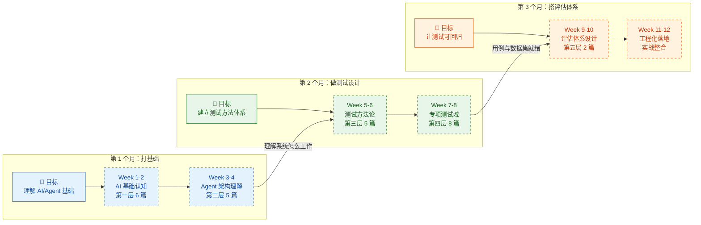
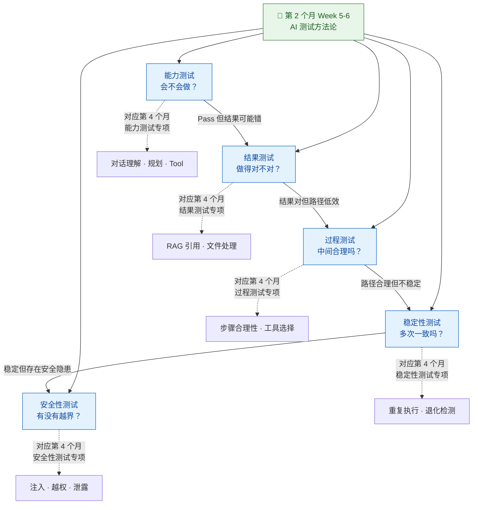
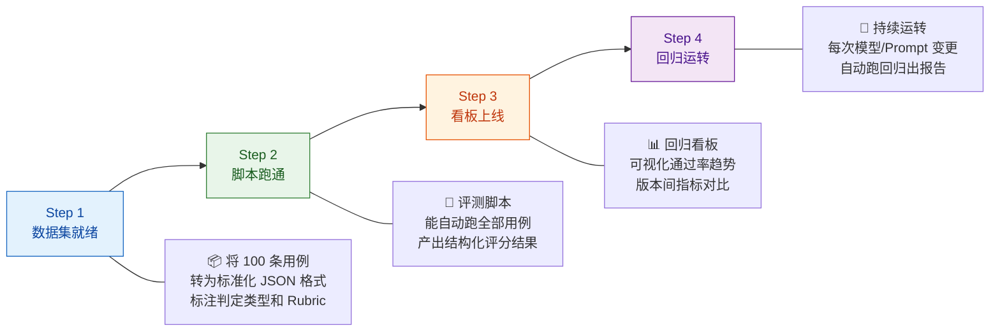

你已经有功能测试、用例拆解、Bug 归因、自动化测试思维、接口验证、回归测试意识这些能力——**这些不会失效**。你需要做的是在这块地基上，用三个月时间依次完成三件事：**补 AI/Agent 基础认知 → 掌握测试设计方法 → 搭建可回归的评估体系**。本文是这份知识库中唯一一篇"按时间线组织"的学习指南，它不会重复讲解具体知识点，而是将前 28 篇章节编排为一条你可以直接照着走的 12 周行动路线，每一步都有明确的输入（读什么）、输出（做什么）和验收标准（怎么判断自己学会了）。

Sources: [readme.md](readme.md#L336-L371), [wiki.json](.zread/wiki/drafts/wiki.json#L225-L233)

## 路线图总览：三个月的架构逻辑

这条学习路线的设计遵循一条底层原则：**你必须先理解你在测什么（基础），然后才能设计怎么测（设计），最后才能让测试持续运转（评估）**。跳过任何一个月直接进入后面的阶段，都会因为缺少前置知识而"做不深"——比如你不会在没理解 Tool Calling 机制的情况下去设计 Tool Calling 测试用例，也不会在没有 Golden Set 的情况下去搭自动化回归流水线。下面这张全景图展示了三个月的目标、关键产出物以及与知识库五层架构的映射关系：

**时间投入基准**：假设你每天能投入 **1.5-2 小时** 的专注学习时间（工作日 1 小时 + 周末额外补充），每周约 10-12 小时。如果你能全职投入，节奏可以压缩到 6-8 周完成。下表是三个月的整体节奏、每周核心任务和期望产出物的一览：

| 月份 | 阶段定位 | 每周投入 | 核心任务 | 月末验收产出物 |
|:---:|:---|:---:|:---|:---|
| **第 1 个月** | 📘 打基础：理解被测对象 | 10-12h/周 | 阅读 11 篇章节 + 画架构图 + 写知识笔记 | 《AI 测试基础概念笔记》+《Agent 架构图》+《常见缺陷分类清单》 |
| **第 2 个月** | 📗 做设计：建立测试方法 | 10-12h/周 | 阅读 13 篇章节 + 拆模块 + 设计用例 | 《测试模块图》+《风险清单》+ 100 条核心用例 +《缺陷分类标准》 |
| **第 3 个月** | 📙 搭评估：让测试可回归 | 10-12h/周 | 阅读工程化章节 + 建 Golden Set + 写评测脚本 | 评测数据集 + 自动评估脚本 + 回归看板 + 版本对比报告模板 |

Sources: [readme.md](readme.md#L438-L471), [wiki.json](.zread/wiki/drafts/wiki.json#L1-L253)

## 第 1 个月：打基础——理解你在测什么

第 1 个月的核心目标是完成一次**认知切换**：从"我在测一个功能系统"切换到"我在测一个由大模型 + Prompt + Tool 调用 + 记忆 + 规划 + 外部系统组成的概率性推理系统"。月底时，你应该能画出一棵完整的产品架构图、说清楚 ArkClaw 测的不是"聊天机器人"而是"任务执行系统"、并且在看到缺陷时能初步判断问题大概率出在模型、Prompt、工具、知识库、记忆还是业务逻辑层面。

Sources: [readme.md](readme.md#L439-L447), [readme.md](readme.md#L1-L19)

### Week 1-2：AI 基础认知（知识库第一层）

前两周的任务是密集阅读知识库**第一层：AI 与大模型基础认知**的 6 篇文章。这 6 篇文章按照由浅入深的顺序排列，每一篇都建立在前一篇的基础上。不要跳读——尤其是 [LLM 核心概念](3-llm-he-xin-gai-nian-token-shang-xia-wen-chuang-kou-cai-yang-can-shu) 和 [模型常见缺陷](8-mo-xing-chang-jian-que-xian-huan-jue-bu-zhi-xing-yu-lu-bang-xing-wen-ti) 这两篇，它们是后续所有测试工作的认知地基。

| 天数 | 阅读章节 | 学习重点 | 输出任务 |
|:---:|:---|:---|:---|
| Day 1-2 | [认知升级：从传统测试到 AI/Agent 测试的思维转变](2-ren-zhi-sheng-ji-cong-chuan-tong-ce-shi-dao-ai-agent-ce-shi-de-si-wei-zhuan-bian) | 理解"断言思维 → 评估思维"的转变、五种新缺陷类型 | 写一份"传统测试 vs Agent 测试"的思维转变笔记 |
| Day 3-4 | [LLM 核心概念：Token、上下文窗口、采样参数](3-llm-he-xin-gai-nian-token-shang-xia-wen-chuang-kou-cai-yang-can-shu) | Token 计费逻辑、上下文窗口对长对话的影响、Temperature/Top_P 对输出确定性的影响 | 能解释"为什么同一个问题每次回答会不一样" |
| Day 5-6 | [Prompt 工程与边界认知](4-prompt-gong-cheng-yu-bian-jie-ren-zhi) | System Instruction 的作用、Prompt 的能力边界、Prompt 问题 vs 模型问题的区分 | 列出 3 个"Prompt 问题"和 3 个"模型问题"的区分案例 |
| Day 7-8 | [工具调用（Tool Calling / Function Calling）机制](5-gong-ju-diao-yong-tool-calling-function-calling-ji-zhi) | 工具调用的完整链路（选择→参数提取→执行→结果消费）、常见失败模式 | 画出 Tool Calling 的完整执行流程图 |
| Day 9-10 | [RAG 检索增强与知识库问答原理](6-rag-jian-suo-zeng-qiang-yu-zhi-shi-ku-wen-da-yuan-li) + [记忆机制](7-ji-yi-ji-zhi-duan-qi-ji-yi-chang-qi-ji-yi-yu-shang-xia-wen-guan-li) | RAG 的检索-增强-生成三阶段、短期/长期记忆的区别与失效模式 | 写一份"RAG vs 纯模型回答"的区别说明 |
| Day 11-12 | [模型常见缺陷：幻觉、不一致性与鲁棒性问题](8-mo-xing-chang-jian-que-xian-huan-jue-bu-zhi-xing-yu-lu-bang-xing-wen-ti) | 幻觉的触发条件、不一致性的表现形式、鲁棒性问题的根源 | 产出《AI 产品常见缺陷分类清单》初版 |

**Week 2 结束时的自检清单**（全部能回答"是"才算通过）：

- [ ] 我能解释 Token、上下文窗口、Temperature 三个概念对测试的影响
- [ ] 我能区分"Prompt 问题"和"模型问题"——至少各举 2 个例子
- [ ] 我能画出 Tool Calling 的完整执行链路（从模型决策到工具返回结果）
- [ ] 我能说清楚 RAG 系统中"检索"和"生成"各自可能出什么问题
- [ ] 我能列出至少 5 种 Agent 系统中常见的缺陷类型及其触发条件

Sources: [readme.md](readme.md#L6-L63), [wiki.json](.zread/wiki/drafts/wiki.json#L36-L79)

### Week 3-4：Agent 架构理解（知识库第二层）

后两周进入**第二层：Agent 架构与系统链路**。这里的关键转变是从"理解单个模块"升级到"理解模块之间怎么协作"。你需要建立一条完整的脑图：用户请求 → Prompt 拼装 → Planner / Agent Loop → Tool Selection → Tool Execution → Observation → Memory Update → Final Response。理解了这条链路，你才能在后续测试中准确判断"缺陷出在链路的哪一环"。

| 天数 | 阅读章节 | 学习重点 | 输出任务 |
|:---:|:---|:---|:---|
| Day 13-15 | [Agent Loop 核心工作流：从用户请求到最终响应](9-agent-loop-he-xin-gong-zuo-liu-cong-yong-hu-qing-qiu-dao-zui-zhong-xiang-ying) | 六阶段模型（输入预处理 → Prompt 拼装 → 模型推理 → 工具执行 → 结果观察 → 响应生成）、每阶段的失败模式 | 画出完整的 Agent Loop 六阶段图，标注每阶段的输入输出 |
| Day 16-17 | [ArkClaw / OpenClaw 产品架构与模块拆解](10-arkclaw-openclaw-chan-pin-jia-gou-yu-mo-kuai-chai-jie) | 产品定位（不是聊天机器人）、核心能力边界、云端 vs 本地部署差异 | 产出《ArkClaw 测试对象拆解图》 |
| Day 18-19 | [会话管理、任务规划与调度机制](11-hui-hua-guan-li-ren-wu-gui-hua-yu-diao-du-ji-zhi) | Planner/Executor 的拆解逻辑、会话生命周期管理、定时任务调度 | 列出 ArkClaw 的所有关键模块清单 |
| Day 20-21 | [Skills / 插件体系与外部系统接入](12-skills-cha-jian-ti-xi-yu-wai-bu-xi-tong-jie-ru) | 工具注册与选择、Skill 生态、外部系统接入方式 | 产出《模块-风险-测试点映射表》初版 |
| Day 22-24 | [日志、Trace 与执行轨迹可观测性](13-ri-zhi-trace-yu-zhi-xing-gui-ji-ke-guan-ce-xing) | 执行轨迹的采集与结构、Trace 的关键字段、如何用 Trace 做缺陷归因 | 写一份"如何用 Trace 定位 Agent 缺陷"的实操笔记 |

**第 1 个月结束时的自检清单**：

- [ ] 我能画出 ArkClaw 的完整架构图，标注每个模块的职责边界
- [ ] 我能说清楚 ArkClaw 不是"聊天机器人"而是"任务执行系统"——至少举 3 个差异
- [ ] 我能从 Trace 日志中识别出一次 Agent 执行经过了哪些阶段、调用了哪些工具
- [ ] 看到一个 Agent 缺陷，我能初步判断它属于模型、Prompt、工具、知识库、记忆还是业务逻辑层面

**月末产出物汇总**：

| 产出物 | 用途 | 后续如何使用 |
|:---|:---|:---|
| 《AI 测试基础概念笔记》 | 个人认知沉淀 | 第 2 个月设计测试用例时的参考 |
| 《Agent 架构图》 | 理解被测系统的全景 | 第 2 个月拆模块、标注测试边界的底图 |
| 《常见缺陷分类清单》 | 缺陷归因的快速索引 | 第 2 个月做风险清单和用例设计的输入 |
| 《模块-风险-测试点映射表》 | 模块级测试策略 | 直接演进为第 2 个月的《测试模块图》 |

Sources: [readme.md](readme.md#L439-L447), [readme.md](readme.md#L43-L63)

## 第 2 个月：做测试设计——建立测试方法体系

第 2 个月是从"理解系统"跨越到"设计测试"的关键阶段。你要完成一次思维升级：从传统测试的"断言思维"（Pass/Fail 二元判定）升级到 AI 测试的"评估思维"（多维度、多轮次、统计置信）。月底时，你应该拥有一套完整的测试模块图、100 条覆盖核心场景的测试用例、以及一份可执行的缺陷分类标准。这个月的阅读量是整个路线中最密集的——13 篇章节，覆盖第三层方法论和第四层专项测试域。

Sources: [readme.md](readme.md#L450-L459), [readme.md](readme.md#L66-L106)

### Week 5-6：AI 测试方法论（知识库第三层）

这两周集中学习**第三层：AI 测试方法论**的 5 篇文章。这 5 篇文章定义了五个独立的测试维度，每个维度回答一个核心问题。理解这五个维度的边界和交互关系，是你后续设计专项测试用例的理论基础。

| 天数 | 阅读章节 | 学习重点 | 输出任务 |
|:---:|:---|:---|:---|
| Day 25-27 | [能力测试：验证 Agent "会不会做"](14-neng-li-ce-shi-yan-zheng-agent-hui-bu-hui-zuo) | 能力测试的五大检验维度（意图理解、任务拆解、工具选择、步骤执行、失败恢复）、Pass/Fail 判定逻辑 | 为 ArkClaw 的 3 个核心场景设计能力测试用例 |
| Day 28-29 | [结果测试：验证 Agent "做得对不对"](15-jie-guo-ce-shi-yan-zheng-agent-zuo-de-dui-bu-dui) | 三类结果判定场景（精确匹配、等价判定、开放评估）、关键信息检查清单的设计方法 | 将上面的 3 个场景扩展为结果测试用例 |
| Day 30-31 | [过程测试：验证 Agent 中间步骤的合理性](16-guo-cheng-ce-shi-yan-zheng-agent-zhong-jian-bu-zou-de-he-li-xing) | Trace 分析方法、步骤合理性判定、冗余和遗漏的检测 | 用 Trace 对一次 Agent 执行做过程层面的分析 |
| Day 32-33 | [稳定性测试：多次执行的可靠性与一致性](17-wen-ding-xing-ce-shi-duo-ci-zhi-xing-de-ke-kao-xing-yu-zhi-xing) | 统计置信思维、重复执行策略、退化检测方法 | 设计一个"跑 20 次统计成功率"的稳定性测试方案 |
| Day 34-36 | [安全性测试：越权、注入与数据泄露防护](18-an-quan-xing-ce-shi-yue-quan-zhu-ru-yu-shu-ju-xie-lu-fang-hu) | Prompt Injection、Tool Injection、数据泄露、越权调用的测试方法 | 设计 5 条安全性测试用例（含 2 条对抗性场景） |

Sources: [readme.md](readme.md#L66-L106), [wiki.json](.zread/wiki/drafts/wiki.json#L117-L161)

### Week 7-8：Agent 专项测试域（知识库第四层）

后两周进入**第四层：Agent 专项测试域**，这是整个学习路线中实战性最强的部分。8 篇章节分别覆盖了 Agent 系统中 8 个独立的测试域——每个测试域都有特定的缺陷模式、用例设计方法和判定标准。你需要按照优先级（不是按编号顺序）来阅读，因为你的时间有限，不应该平均用力。

**推荐阅读顺序（按优先级排列）**：

```mermaid
flowchart TD
    P1["🔴 第一优先级<br/>Week 7 必读"]
    P2["🟡 第二优先级<br/>Week 8 必读"]
    P3["🟢 第三优先级<br/>Week 8 选读/速览"]

    P1 --> A["Tool Calling 测试<br/>参数提取 · 多工具编排 · 异常"]
    P1 --> B["任务规划测试<br/>拆解 · 排序 · 回退 · 动态调整"]
    P1 --> C["错误处理与恢复测试<br/>失败识别 · 自动重试 · 替代方案"]

    P2 --> D["对话理解测试<br/>意图识别 · 多轮上下文 · 歧义"]
    P2 --> E["安全性测试深化<br/>注入 · 越权 · 审批流"]
    P2 --> F["Memory 测试<br/>保存 · 过期 · 跨会话隔离"]

    P3 --> G["RAG 测试<br/>检索召回 · 引用真实性 · 文档冲突"]
    P3 --> H["文件处理与浏览器自动化<br/>文件读写 · 浏览器操作 · 性能与成本"]

    style P1 fill:#FFCDD2,stroke:#C62828,color:#B71C1C
    style P2 fill:#FFF9C4,stroke:#F57F17,color:#E65100
    style P3 fill:#C8E6C9,stroke:#2E7D32,color:#1B5E20
    style A fill:#FFCDD2,stroke:#C62828,color:#B71C1C,stroke-dasharray: 5 5
    style B fill:#FFCDD2,stroke:#C62828,color:#B71C1C,stroke-dasharray: 5 5
    style C fill:#FFCDD2,stroke:#C62828,color:#B71C1C,stroke-dasharray: 5 5
    style D fill:#FFF9C4,stroke:#F57F17,color:#E65100,stroke-dasharray: 5 5
    style E fill:#FFF9C4,stroke:#F57F17,color:#E65100,stroke-dasharray: 5 5
    style F fill:#FFF9C4,stroke:#F57F17,color:#E65100,stroke-dasharray: 5 5
    style G fill:#C8E6C9,stroke:#2E7D32,color:#1B5E20,stroke-dasharray: 5 5
    style H fill:#C8E6C9,stroke:#2E7D32,color:#1B5E20,stroke-dasharray: 5 5
```

| 优先级 | 阅读章节 | 为什么优先 |
|:---:|:---|:---|
| 🔴 **必读** | [Tool Calling 测试](21-tool-calling-ce-shi-can-shu-ti-qu-duo-gong-ju-bian-pai-yu-yi-chang-chu-li) | Agent 的核心价值在于"会做事"，Tool Calling 是"做事"的机制，也是缺陷高发区 |
| 🔴 **必读** | [任务规划测试](20-ren-wu-gui-hua-ce-shi-chai-jie-pai-xu-hui-tui-yu-dong-tai-diao-zheng) | 多步骤任务是 Agent 区别于聊天机器人的关键，规划失败是最隐蔽的缺陷类型 |
| 🔴 **必读** | [错误处理与恢复测试](25-cuo-wu-chu-li-yu-hui-fu-ce-shi-shi-bai-shi-bie-zi-dong-zhong-shi-yu-ti-dai-fang-an) | 真实环境中工具经常失败，恢复能力直接决定用户体验 |
| 🟡 **必读** | [对话理解测试](19-dui-hua-li-jie-ce-shi-yi-tu-shi-bie-duo-lun-shang-xia-wen-yu-qi-yi-chu-li) | 意图识别是一切后续动作的起点，理解错了后面全错 |
| 🟡 **必读** | [Memory 测试](22-memory-ce-shi-ji-yi-bao-cun-guo-qi-shi-xiao-yu-kua-hui-hua-ge-chi) | 记忆污染和过期失效是长会话场景中最常见的质量退化原因 |
| 🟡 **必读** | [安全性测试深化](18-an-quan-xing-ce-shi-yue-quan-zhu-ru-yu-shu-ju-xie-lu-fang-hu) | 安全是底线——即便功能完美，一次注入攻击就能毁掉用户信任 |
| 🟢 **选读** | [RAG 测试](23-rag-ce-shi-jian-suo-zhao-hui-yin-yong-zhen-shi-xing-yu-wen-dang-chong-tu) | 如果产品接入了知识库，这是必读；否则可先速览 |
| 🟢 **选读** | [文件处理与浏览器自动化测试](24-wen-jian-chu-li-yu-liu-lan-qi-zi-dong-hua-ce-shi) + [性能与成本测试](26-xing-neng-yu-cheng-ben-ce-shi-yan-chi-token-xiao-hao-yu-bing-fa-ping-gu) | 按产品能力优先级决定是否深入 |

**第 2 个月结束时的自检清单**：

- [ ] 我能为 ArkClaw 的每个核心模块设计至少 10 条测试用例，覆盖正常/边界/异常场景
- [ ] 我能区分一个缺陷属于"能力问题"还是"结果问题"还是"过程问题"——并给出不同的修复建议
- [ ] 我手里有 100 条核心测试用例，按模块分类、标注了优先级和判定方式
- [ ] 我有一份可执行的《缺陷分类标准》，每类缺陷都有判定条件和归因路径

**月末产出物汇总**：

| 产出物 | 用途 | 后续如何使用 |
|:---|:---|:---|
| 《测试模块图》 | 清晰展示 ArkClaw 各模块的测试边界 | 第 3 个月搭建评估体系时的模块覆盖依据 |
| 《风险清单》 | 每个模块的 Top 风险和对应的测试策略 | 优先级排序和资源分配的依据 |
| 100 条核心测试用例 | 覆盖核心场景的可执行用例集 | 直接演进为第 3 个月的 Golden Set |
| 《缺陷分类标准》 | 统一团队的缺陷归因语言 | 评测脚本中判定逻辑的设计依据 |

Sources: [readme.md](readme.md#L450-L459), [readme.md](readme.md#L473-L491)

## 第 3 个月：搭评估体系——让测试可回归

第 3 个月是从"人工测试"升级为"工程化评估"的跃迁期。前两个月你已经理解了被测系统（第 1 个月）和测试方法（第 2 个月），现在你需要让这些知识变成**可持续运转的工程系统**——能自动跑批、自动评分、自动产出报告、自动检测退化。月底时，你应该拥有一套初始的 Golden Set、一个可运行的自动评测脚本、一个回归看板、以及一份版本对比报告模板。

Sources: [readme.md](readme.md#L462-L471), [readme.md](readme.md#L402-L410)

### Week 9-10：评估体系设计（知识库第五层）

这两周集中学习**第五层：评估体系与工程化**的 2 篇核心文章。这两篇是整个知识库中工程化程度最高的内容——它们不教你"怎么想"，而是教你"怎么做"：如何设计 Golden Set、如何编写 Rubric 评分标准、如何用 LLM-as-a-Judge 自动评分、如何搭建评测脚本引擎、如何建设回归看板。学习时请务必同步动手实践——边读边用你的 100 条用例构建 Golden Set 的初始版本。

| 天数 | 阅读章节 | 学习重点 | 实践任务 |
|:---:|:---|:---|:---|
| Day 37-39 | [评估体系搭建：Golden Set、Rubric 评分与 LLM-as-a-Judge](27-ping-gu-ti-xi-da-jian-golden-set-rubric-ping-fen-yu-llm-as-a-judge) | Golden Set 的分层架构（精确匹配 40-50% + 等价判定 30-40% + 开放评估 10-20%）、Rubric 评分的维度-尺度-描述三层结构、LLM-as-a-Judge 的 Prompt 设计 | 将 100 条用例按判定类型分层，标注 case_id、期望输出要素、判定场景类型 |
| Day 40-42 | 同上（深入 Rubric 和 Judge 部分） | 按测试维度设计专用 Rubric（结果质量、过程合理性、安全性等）、LLM-Judge 的一致性校准方法 | 为 3 个核心业务场景各设计一套 Rubric 评分标准 |
| Day 43-46 | [自动化评测工程：脚本、数据集与回归看板](28-zi-dong-hua-ping-ce-gong-cheng-jiao-ben-shu-ju-ji-yu-hui-gui-kan-ban) | 评测脚本引擎的五大模块（用例加载器、请求执行器、判定引擎、报告生成器、调度控制器）、数据集版本管理、回归看板设计 | 用 Python 写一个最小可用的评测脚本（能跑 10 条用例、产出 JSON 格式结果） |

Sources: [readme.md](readme.md#L462-L471), [wiki.json](.zread/wiki/drafts/wiki.json#L212-L232)

### Week 11-12：工程化落地与实战整合

最后两周是**整合与落地**阶段。你需要将前两个月学到的所有知识和第 3 个月前两周搭建的评估工具串成一个完整的端到端流程：从 Golden Set 加载 → Agent 请求执行 → 自动判定评分 → 报告产出 → 退化检测。这个阶段不再有新的阅读任务，核心是动手实践和迭代优化。

**实战落地的四步走流程**：

| 步骤 | 时间 | 核心任务 | 验收标准 |
|:---:|:---|:---|:---|
| **Step 1：数据集就绪** | Day 47-48 | 将 100 条用例转为 JSON Schema 格式，标注 case_id、判定类型、期望输出要素 | 所有用例可通过 Pydantic 校验，无格式错误 |
| **Step 2：脚本跑通** | Day 49-52 | 完善评测脚本，支持并发执行、Trace 关联、多判定类型分流 | 能在 30 分钟内跑完 100 条用例并产出结构化报告 |
| **Step 3：看板上线** | Day 53-55 | 搭建回归看板（可用 Grafana / 自建 HTML），展示通过率趋势和版本对比 | 看板可展示至少 2 个版本的指标对比 |
| **Step 4：回归运转** | Day 56-60 | 将评测脚本接入 CI/CD 或定时任务，完成至少 1 次完整的回归运行 | 一次模型或 Prompt 变更后，自动跑出回归报告 |

**第 3 个月结束时的自检清单**：

- [ ] 我有一套 100 条以上的 Golden Set，按判定类型分层，格式标准化
- [ ] 我的评测脚本能自动执行全部用例、自动评分、自动产出报告
- [ ] 我的回归看板能展示通过率趋势，并能检测版本间的能力退化
- [ ] 我能在一次模型/Prompt 变更后，30 分钟内获得完整的回归评估报告

**月末产出物汇总**：

| 产出物 | 用途 | 价值 |
|:---|:---|:---|
| 评测数据集（Golden Set） | 标准化测试用例集 | 所有评估和回归的基础设施 |
| 自动评估脚本 | 端到端评测引擎 | 让评估从"手工"升级为"自动化" |
| 回归看板 | 可视化质量趋势 | 让质量变化"看得见" |
| 版本对比报告模板 | 标准化评估报告 | 让每次变更的影响可量化、可追溯 |

Sources: [readme.md](readme.md#L462-L471), [readme.md](readme.md#L423-L431)

## 每周时间分配建议

以下表格给出每周的标准时间分配方案。核心假设是你每天能投入 1.5-2 小时（工作日 1 小时 + 周末额外补充），每周约 10-12 小时。如果你能投入更多时间，建议加量在"动手实践"环节而非"阅读"环节——因为 AI 测试能力的核心不是"读了多少"，而是"设计了多少用例、分析了多少 Trace、跑了多少次评估"。

| 周次 | 阅读输入（h） | 动手实践（h） | 产出整理（h） | 合计（h） |
|:---:|:---:|:---:|:---:|:---:|
| Week 1-2 | 5-6 | 3-4 | 1-2 | 10-12 |
| Week 3-4 | 5-6 | 3-4 | 1-2 | 10-12 |
| Week 5-6 | 4-5 | 4-5 | 1-2 | 10-12 |
| Week 7-8 | 4-5 | 4-5 | 1-2 | 10-12 |
| Week 9-10 | 3-4 | 5-6 | 2-3 | 10-12 |
| Week 11-12 | 1-2 | 7-8 | 2-3 | 10-12 |
| **合计** | **22-28** | **26-32** | **8-14** | **60-72** |

**关键洞察**：前两个月以"阅读输入"为主（约 50%），最后一个月以"动手实践"为主（约 65%）。这个比例是刻意设计的——前期需要大量概念输入来建立认知框架，后期需要大量实践来把知识转化为可运行的工程系统。

Sources: [readme.md](readme.md#L438-L471)

## 三个月能力增长全景

下面这张能力雷达图展示了你在三个月中每个维度的能力增长预期。"起始水平"是你作为传统测试工程师已有的能力基线，"月末预期"是完成该月全部学习任务后应达到的水平。你可以用这张图做月末自我评估——如果某个维度明显低于预期，说明该维度的学习需要补强。

| 能力维度 | 起始水平 | 第 1 月末 | 第 2 月末 | 第 3 月末 |
|:---|:---:|:---:|:---:|:---:|
| **Prompt / LLM 理解** | ⭐ | ⭐⭐⭐ | ⭐⭐⭐⭐ | ⭐⭐⭐⭐ |
| **Agent 架构理解** | ⭐ | ⭐⭐⭐⭐ | ⭐⭐⭐⭐⭐ | ⭐⭐⭐⭐⭐ |
| **数据集设计** | ⭐⭐ | ⭐⭐ | ⭐⭐⭐⭐ | ⭐⭐⭐⭐⭐ |
| **测试方法论** | ⭐⭐⭐ | ⭐⭐⭐ | ⭐⭐⭐⭐⭐ | ⭐⭐⭐⭐⭐ |
| **评估指标设计** | ⭐ | ⭐⭐ | ⭐⭐⭐ | ⭐⭐⭐⭐⭐ |
| **Trace / 日志分析** | ⭐ | ⭐⭐⭐ | ⭐⭐⭐⭐ | ⭐⭐⭐⭐⭐ |
| **Python 自动化** | ⭐⭐ | ⭐⭐ | ⭐⭐⭐ | ⭐⭐⭐⭐⭐ |

**注意**："Prompt / LLM 理解"和"Agent 架构理解"在第 1 个月会有显著跃升，之后趋于稳定——这说明第 1 个月的投入是高效的。"数据集设计"和"评估指标设计"的增长曲线更靠后——这印证了"先理解再设计再评估"的学习顺序是合理的。你的已有能力（测试方法论中的传统部分）起始就较高，三个月的增量在于将它适配到 AI/Agent 测试场景中。

Sources: [readme.md](readme.md#L336-L371)

## 如果时间不够：优先级压缩方案

现实中你可能无法完整投入三个月。以下提供两套压缩方案，分别适用于只有 **6 周** 和只有 **3 周** 的情况。压缩的核心原则是：**永远保住第一优先级的 5 个模块**（Agent 架构、Tool Calling 测试、任务规划测试、异常恢复测试、安全测试），它们是 Agent 产品测试的核心价值所在。

### 压缩方案 A：6 周完成（时间减半）

| 阶段 | 时间 | 内容 | 产出 |
|:---:|:---|:---|:---|
| **第 1-2 周** | 补基础 | 第一层 6 篇 + 第二层 3 篇（Agent Loop + 产品架构 + Trace） | 架构图 + 缺陷清单 |
| **第 3-4 周** | 做设计 | 第三层 3 篇（能力测试 + 结果测试 + 安全性测试）+ 第四层 3 篇（Tool Calling + 任务规划 + 错误恢复） | 50 条核心用例 + 风险清单 |
| **第 5-6 周** | 搭评估 | 第五层 2 篇 + 动手建 Golden Set + 写评测脚本 | 30 条 Golden Set + 最小可用脚本 |

### 压缩方案 B：3 周速成（极速版）

| 阶段 | 时间 | 内容 | 产出 |
|:---:|:---|:---|:---|
| **第 1 周** | 补基础 | [认知升级](2-ren-zhi-sheng-ji-cong-chuan-tong-ce-shi-dao-ai-agent-ce-shi-de-si-wei-zhuan-bian) + [Agent Loop](9-agent-loop-he-xin-gong-zuo-liu-cong-yong-hu-qing-qiu-dao-zui-zhong-xiang-ying) + [产品架构](10-arkclaw-openclaw-chan-pin-jia-gou-yu-mo-kuai-chai-jie) + [模型缺陷](8-mo-xing-chang-jian-que-xian-huan-jue-bu-zhi-xing-yu-lu-bang-xing-wen-ti) | 架构图 + 缺陷清单 |
| **第 2 周** | 做设计 | [能力测试](14-neng-li-ce-shi-yan-zheng-agent-hui-bu-hui-zuo) + [Tool Calling 测试](21-tool-calling-ce-shi-can-shu-ti-qu-duo-gong-ju-bian-pai-yu-yi-chang-chu-li) + [任务规划测试](20-ren-wu-gui-hua-ce-shi-chai-jie-pai-xu-hui-tui-yu-dong-tai-diao-zheng) + [错误恢复测试](25-cuo-wu-chu-li-yu-hui-fu-ce-shi-shi-bai-shi-bie-zi-dong-zhong-shi-yu-ti-dai-fang-an) | 30 条核心用例 |
| **第 3 周** | 搭评估 | [评估体系搭建](27-ping-gu-ti-xi-da-jian-golden-set-rubric-ping-fen-yu-llm-as-a-judge) + [自动化评测](28-zi-dong-hua-ping-ce-gong-cheng-jiao-ben-shu-ju-ji-yu-hui-gui-kan-ban)（速览）+ 动手实践 | 15 条 Golden Set + 脚本框架 |

**压缩方案的取舍逻辑**：3 周速成版保住了"理解系统 → 设计测试 → 搭评估"的三阶段骨架，但砍掉了 RAG、Memory、对话理解、性能成本等专项测试域。这些被砍掉的内容不是不重要，而是可以在日常测试工作中"边做边学"——当你遇到 Memory 污染问题时，再回头读 [Memory 测试](22-memory-ce-shi-ji-yi-bao-cun-guo-qi-shi-xiao-yu-kua-hui-hua-ge-chi) 会更有针对性。

Sources: [readme.md](readme.md#L473-L491), [readme.md](readme.md#L438-L471)

## 三个月后的你：能力画像

完成这条学习路线后，你将拥有以下七项核心能力的完整闭环。这张表同时标注了每项能力对应的知识库章节，方便你后续按需回溯复习：

| # | 核心能力 | 能达到什么水平 | 对应知识库章节 |
|:---:|:---|:---|:---|
| 1 | **Prompt / LLM 理解** | 看到缺陷时能判断问题属于模型、Prompt、工具、知识库还是业务逻辑 | [LLM 核心概念](3-llm-he-xin-gai-nian-token-shang-xia-wen-chuang-kou-cai-yang-can-shu)、[Prompt 工程](4-prompt-gong-cheng-yu-bian-jie-ren-zhi)、[模型缺陷](8-mo-xing-chang-jian-que-xian-huan-jue-bu-zhi-xing-yu-lu-bang-xing-wen-ti) |
| 2 | **Agent 架构理解** | 能画出完整的产品架构图，标注每个模块的测试边界 | [Agent Loop](9-agent-loop-he-xin-gong-zuo-liu-cong-yong-hu-qing-qiu-dao-zui-zhong-xiang-ying)、[产品架构](10-arkclaw-openclaw-chan-pin-jia-gou-yu-mo-kuai-chai-jie) |
| 3 | **数据集设计** | 能设计 Golden Set、对抗样本集、多轮会话集 | [评估体系搭建](27-ping-gu-ti-xi-da-jian-golden-set-rubric-ping-fen-yu-llm-as-a-judge) |
| 4 | **评估指标设计** | 能定义任务成功率、幻觉率、引用正确率等量化指标 | [评估体系搭建](27-ping-gu-ti-xi-da-jian-golden-set-rubric-ping-fen-yu-llm-as-a-judge) |
| 5 | **Trace / 日志分析** | 能从执行轨迹中定位缺陷归属 | [日志与 Trace](13-ri-zhi-trace-yu-zhi-xing-gui-ji-ke-guan-ce-xing) |
| 6 | **专项测试设计** | 能为对话、规划、Tool Calling、Memory、安全等模块设计完整用例 | 第四层全部 8 篇章节 |
| 7 | **Python 自动化** | 能写评测脚本、搭回归看板、接入 CI/CD | [自动化评测工程](28-zi-dong-hua-ping-ce-gong-cheng-jiao-ben-shu-ju-ji-yu-hui-gui-kan-ban) |

你这次转型的关键，不是"学 AI 算法"，而是把自己升级成：**既懂测试方法，又懂 Agent 系统行为，还能搭评估体系的 AI 测试工程师**。

Sources: [readme.md](readme.md#L336-L371), [readme.md](readme.md#L506-L512)

## 下一步：从路线图到行动

本文给了你一条可执行的 12 周学习路线。但"路线图"本身只是地图——**你需要开始走**。建议你从以下两个方向同步推进：

**方向一：如果你准备按完整路线学习**，建议立即开始 [认知升级：从传统测试到 AI/Agent 测试的思维转变](2-ren-zhi-sheng-ji-cong-chuan-tong-ce-shi-dao-ai-agent-ce-shi-de-si-wei-zhuan-bian)——这是 Week 1 的第一篇阅读任务，也是整个学习路线的认知起点。

**方向二：如果你想先做一次自我诊断再决定学习重点**，建议先读 [测试工程师能力差距分析与优先级排序](30-ce-shi-gong-cheng-shi-neng-li-chai-ju-fen-xi-yu-you-xian-ji-pai-xu)——它会帮你评估自己目前在哪几个维度存在最大差距，从而在本路线图中做出个性化的优先级调整。

**方向三：如果你需要向团队或上级汇报学习计划**，建议参考 [ArkClaw 测试知识树与内部汇报框架](31-arkclaw-ce-shi-zhi-shi-shu-yu-nei-bu-hui-bao-kuang-jia)——其中第七段"分阶段学习与建设计划"可以直接用本文的三个月路线图作为素材。