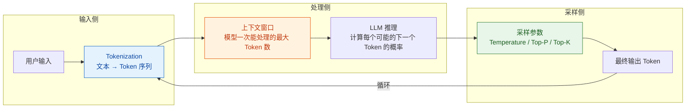
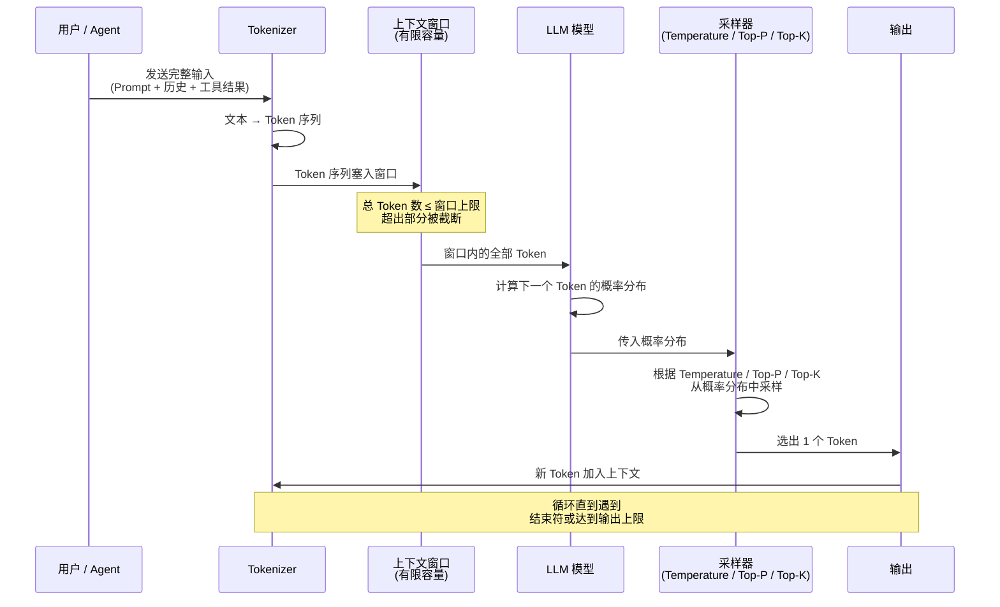

你正在进入知识库的**第一层：AI 与大模型基础认知**。本文的目标是帮你理解大语言模型（LLM）最底层的三个核心概念——**Token**、**上下文窗口**和**采样参数**。你不需要训练模型，也不需要研究算法原理，但你必须做到一件事：**看到缺陷时，能判断问题大概率出在模型本身、Prompt 设计、上下文管理还是采样配置**。这三个概念就是你的判断基准。

Sources: [readme.md](readme.md#L24-L37)

## 一个总览：这三个概念如何决定模型行为

在逐一展开之前，先用一张图帮你建立整体认知。Token 决定了模型"看到什么"，上下文窗口决定了模型"一次能看多少"，采样参数决定了模型"从可能性中选什么"。三者协同作用，共同决定了你最终拿到的输出：

上图揭示了 LLM 生成文本的本质流程：**用户输入被切分为 Token → 塞入上下文窗口 → 模型计算概率分布 → 采样参数决定选哪个 Token → 循环往复直到生成完毕**。理解了这个闭环，你就能理解为什么"同样的问题每次回答可能不一样"——因为采样环节引入了随机性。

Sources: [readme.md](readme.md#L27-L28), [readme.md](readme.md#L376-L380)

## Token：大模型理解和计量的基本单位

### Token 是什么

**Token 是大模型处理文本的最小单位**。你可以把它理解为一种"介于字符和词语之间的切分单元"。模型不会直接阅读汉字或英文字母，而是先把所有输入文本切分成 Token，再逐个处理。

一个简单的例子：中文里，"今天天气真好"这句话可能被切分为 `["今天", "天气", "真", "好"]` 四个 Token；而英文的 "Hello world" 可能被切分为 `["Hello", " world"]` 两个 Token。不同模型的分词器（Tokenizer）切分规则不同，所以同样的文本在不同模型中的 Token 数量可能不一样。

### Token 对你意味着什么

作为测试工程师，你关心 Token 的原因**不是语言学，而是成本和性能**。以下是 Token 直接影响你日常工作的三个维度：

| 影响维度 | 具体表现 | 你的关注点 |
|:---|:---|:---|
| **计费** | 模型 API 按 Token 数量收费，输入和输出的 Token 分别计价 | 每次请求消耗了多少 Token？是否存在浪费？ |
| **性能** | Token 越多，推理时间越长；首 Token 延迟和总响应时长都与 Token 数相关 | Agent 的响应速度是否可接受？长对话是否明显变慢？ |
| **截断风险** | 当输入超过上下文窗口容量时，超出部分会被丢弃 | 关键信息是否被截断？多轮对话后是否出现"遗忘"？ |

一个实用的直觉是：**中文场景下，1 个汉字大约对应 1-2 个 Token；英文场景下，1 个常见单词大约对应 1 个 Token**。当你拿到一段测试输入时，可以粗估它的 Token 消耗，从而预判是否会触达上下文窗口的上限。

Sources: [readme.md](readme.md#L27-L28), [readme.md](readme.md#L243-L250)

## 上下文窗口：模型的"工作记忆"容量

### 上下文窗口是什么

**上下文窗口（Context Window）是指模型在一次请求中能够处理的最大 Token 数量**。它包含两部分：输入部分（你发给模型的所有内容，包括 System Prompt、用户消息、历史对话、工具调用结果等）和输出部分（模型生成的回复）。

你可以把它想象成一张固定大小的"桌面"——模型只能看到桌面上摆着的内容，桌面放不下的东西，模型完全看不到。无论你的对话历史有多长，只要总 Token 数超过了上下文窗口，超出部分就会被截断或丢弃。

### 上下文窗口的典型数值

不同模型的上下文窗口差异很大，下表列出了几种常见模型的窗口大小供你建立直觉：

| 模型系列 | 典型上下文窗口 | 大约能容纳的中文量 |
|:---|:---|:---|
| GPT-4o | 128K Tokens | 约 6-8 万字 |
| Claude 3.5 Sonnet | 200K Tokens | 约 10-12 万字 |
| 端侧小模型（如 7B） | 4K-32K Tokens | 约 2000-1.6 万字 |

**注意**：这些是理论最大值。在实际的 Agent 系统中，System Prompt、工具定义、历史对话、工具返回结果都在抢占同一个窗口空间，真正留给当前对话的有效空间可能远小于理论值。

### 上下文窗口对测试的直接影响

上下文窗口是你作为测试工程师需要重点关注的约束条件，因为它直接导致了以下几类常见问题：

| 问题类型 | 具体表现 | 测试关注点 |
|:---|:---|:---|
| **信息截断** | 长对话后，早期关键信息被丢弃，模型"忘记"了用户之前的设定 | 多轮对话后，模型是否还记得第 1 轮的关键信息？ |
| **指令遗忘** | System Prompt 太长，核心指令被挤到窗口边缘甚至被截断 | 关键约束（如"不要执行某操作"）在长对话后是否仍然生效？ |
| **工具结果丢失** | 工具返回了大量数据，占满了窗口，导致其他上下文被挤出 | 工具返回超长结果时，Agent 是否仍能正确理解和处理？ |
| **性能退化** | 上下文越长，推理延迟越高，Token 消耗也越大 | 长会话场景下，响应时长是否在可接受范围内？ |

这些问题将在后续的 [记忆机制：短期记忆、长期记忆与上下文管理](7-ji-yi-ji-zhi-duan-qi-ji-yi-chang-qi-ji-yi-yu-shang-xia-wen-guan-li) 中深入展开。你在这里需要建立的核心认知是：**上下文窗口是一个有限资源，Agent 系统的所有模块（Prompt、对话、工具、记忆）都在争夺这个资源**。

Sources: [readme.md](readme.md#L27-L28), [readme.md](readme.md#L34-L35), [readme.md](readme.md#L243-L250)

## 采样参数：控制模型"创造性"与"确定性"的旋钮

### 为什么同样的问题每次回答会不一样

这是新手最常见的困惑。答案的核心在于：**模型并不直接输出"答案"，而是为每个可能的下一个 Token 计算一个概率分布，然后从中"采样"一个 Token 作为输出**。采样参数就是控制这个"从概率分布中选取"过程的旋钮——不同的参数设置，会让你从同样的概率分布中选到不同的 Token。

### 三个核心采样参数

下表是你在测试工作中最常遇到的三个采样参数，以及它们对模型行为的实际影响：

| 参数 | 控制什么 | 低值效果 | 高值效果 | 测试中的典型设置 |
|:---|:---|:---|:---|:---|
| **Temperature** | 整体随机性。值越高，越倾向选择低概率 Token | 输出更确定、更保守、更重复 | 输出更多样、更有"创造性"、更不可预测 | 需要稳定结果时设 0-0.3；需要多样性时设 0.7-1.0 |
| **Top-P（Nucleus Sampling）** | 候选 Token 范围。只从累积概率不超过 P 的最高概率 Token 中选 | 候选范围小，输出更集中 | 候选范围大，输出更多样 | 通常设 0.9 或 0.95 |
| **Top-K** | 候选 Token 数量上限。只从概率最高的 K 个 Token 中选 | K 小则输出更确定 | K 大则输出更多样 | 部分模型默认 50 或不启用 |

### 参数如何影响你的测试

采样参数对测试工作的影响是直接且显著的：

**第一，它决定了你是否需要"多次运行"。** 当 Temperature 较高时（如 0.7 以上），同一个测试用例跑一次和跑三次可能得到完全不同的结果。你不能再用"跑一次 Pass 就算通过"的思维，而需要建立统计置信——跑多次，看成功率和一致性。这正是 [稳定性测试：多次执行的可靠性与一致性](17-wen-ding-xing-ce-shi-duo-ci-zhi-xing-de-ke-kao-xing-yu-zhi-xing) 要解决的核心问题。

**第二，它影响缺陷的可复现性。** 你发现了一个"回答错误"的缺陷，但重新运行时消失了——这不是你看错了，而是采样参数的随机性在起作用。你需要记录当时的 Temperature 设置、上下文内容、甚至模型版本，才能提高复现概率。

**第三，不同场景适合不同的参数配置。** 下表给出了几个典型场景的建议：

| 场景 | 建议参数配置 | 原因 |
|:---|:---|:---|
| **工具调用参数提取** | Temperature 0-0.1，Top-P 0.9 | 需要精确提取参数，不需要"创造性" |
| **知识库问答** | Temperature 0.2-0.4，Top-P 0.9 | 需要基于事实回答，但允许一定表达灵活性 |
| **创意生成 / 头脑风暴** | Temperature 0.8-1.0，Top-P 0.95 | 需要多样性和创新性 |
| **安全测试（对抗样本）** | 多种 Temperature 组合测试 | 低 Temperature 暴露模型的"默认倾向"，高 Temperature 可能触发边界行为 |

Sources: [readme.md](readme.md#L27-L28), [readme.md](readme.md#L28-L29)

## 三者协同：一个完整的推理流程

将 Token、上下文窗口和采样参数放在一起，你可以用下图理解一次完整的 LLM 推理调用发生了什么：

这个流程图揭示了几个关键洞察：

**Token 是全流程的基础货币。** 从输入到输出，一切信息都以 Token 的形式存在。你设计的每一条测试用例，本质上都是在构造一组特定的 Token 序列，然后观察模型如何响应。

**上下文窗口是系统瓶颈。** 无论你的 Prompt 设计得多精妙、历史对话多有价值，一旦总 Token 数超限，超出部分就像从未存在过。这也是为什么 Agent 系统需要复杂的上下文管理策略——它要在有限的窗口内做出取舍。

**采样参数是输出不确定性的根源。** 即使所有输入完全相同，只要 Temperature > 0，每次运行的结果都可能不同。这不是 Bug，而是特性——理解这一点，是你从"断言思维"转向"评估思维"的第一步。

Sources: [readme.md](readme.md#L24-L37), [readme.md](readme.md#L376-L380)

## 测试工程师的实践检查清单

基于以上三个核心概念，这里给你一份可以直接在日常工作中使用的检查清单。当你发现 Agent 行为异常时，按这个顺序排查：

```mermaid
flowchart TD
    Bug["🔴 Agent 行为异常"] --> Q1{"问题是否与<br/>上下文长度有关？"}
    
    Q1 -->|"是：长对话后出现"| A1["📍 检查上下文窗口<br/>是否有关键信息被截断"]
    Q1 -->|"否"| Q2{"问题是否与<br/>输出不一致有关？"}
    
    Q2 -->|"是：同样输入不同结果"| A2["📍 检查采样参数<br/>Temperature 是否过高"]
    Q2 -->|"否"| Q3{"问题是否与<br/>成本/性能有关？"}
    
    Q3 -->|"是：响应慢或费用高"| A3["📍 检查 Token 消耗<br/>是否存在冗余 Token"]
    Q3 -->|"否"| A4["📍 进入其他归因路径<br/>（Prompt / 工具 / 记忆 / 安全）"]
    
    A1 --> Ref["参考：记忆机制章节"]
    A2 --> Ref2["参考：稳定性测试章节"]
    A3 --> Ref3["参考：性能与成本测试章节"]
    A4 --> Ref4["参考：模型常见缺陷章节"]

    style Bug fill:#FFCDD2,stroke:#C62828,color:#B71C1C
    style A1 fill:#E3F2FD,stroke:#1565C0,color:#0D47A1
    style A2 fill:#E3F2FD,stroke:#1565C0,color:#0D47A1
    style A3 fill:#E3F2FD,stroke:#1565C0,color:#0D47A1
    style A4 fill:#FFF3E0,stroke:#E65100,color:#BF360C
```

| 检查项 | 什么时候检查 | 怎么检查 |
|:---|:---|:---|
| **Token 消耗是否合理** | 每次 API 调用后 | 查看返回的 `usage.total_tokens`，对比输入/输出 Token 比例 |
| **上下文是否溢出** | 长对话、多工具调用后 | 检查日志中是否有截断标记，或模型是否"忘记"了早期信息 |
| **采样参数是否匹配场景** | 发现输出不一致时 | 确认当前 Temperature / Top-P 设置是否符合该场景的预期 |
| **System Prompt 是否过长** | 指令不被遵守时 | 计算 System Prompt 的 Token 占比，确保核心指令不被挤出窗口 |

Sources: [readme.md](readme.md#L24-L37), [readme.md](readme.md#L243-L250)

## 下一步

现在你已经掌握了 LLM 最底层的三个核心概念。Token、上下文窗口和采样参数是理解一切 Agent 行为的基石——当你后续看到模型"忘记信息""回答不一致""响应变慢"时，这三个概念就是你的第一层归因工具。建议你继续按以下顺序深入：

1. **[Prompt 工程与边界认知](4-prompt-gong-cheng-yu-bian-jie-ren-zhi)** — 理解 Prompt 如何影响模型行为，以及 Prompt 的能力边界在哪里。这是你进行缺陷归因的第二个关键维度。
2. **[工具调用（Tool Calling / Function Calling）机制](5-gong-ju-diao-yong-tool-calling-function-calling-ji-zhi)** — 理解 Agent 最核心的"做事"能力，以及工具调用与 Token/上下文窗口之间的关系。
3. **[记忆机制：短期记忆、长期记忆与上下文管理](7-ji-yi-ji-zhi-duan-qi-ji-yi-chang-qi-ji-yi-yu-shang-xia-wen-guan-li)** — 深入理解上下文窗口的限制如何催生出各种记忆管理策略。
4. **[模型常见缺陷：幻觉、不一致性与鲁棒性问题](8-mo-xing-chang-jian-que-xian-huan-jue-bu-zhi-xing-yu-lu-bang-xing-wen-ti)** — 建立对模型固有缺陷的直觉，为后续测试设计打下基础。