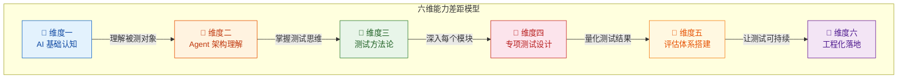
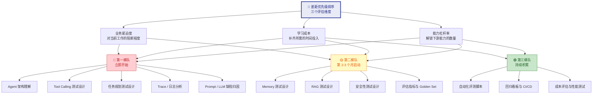

你已经完成了前面 29 篇章节的学习，对 AI/Agent 测试的知识体系有了全景认知。现在到了最关键的一步：**正视你当前的能力现状与目标状态之间的差距，然后把有限的时间和精力精准投入到产出比最高的地方。** 本文不是一份笼统的"学习建议"，而是一个可操作的分析框架——它将帮助你逐项对照现有能力、识别差距、评估差距的紧迫程度，并最终产出一份属于你自己的 **能力补齐优先级清单**。如果你想直接查看整个知识体系的结构化索引，请跳转至 [ArkClaw 测试知识树与内部汇报框架](31-arkclaw-ce-shi-zhi-shi-shu-yu-nei-bu-hui-bao-kuang-jia)；如果你想了解三个月的时间节奏安排，请参考 [三个月学习路线图：基础→设计→评估](29-san-ge-yue-xue-xi-lu-xian-tu-ji-chu-she-ji-ping-gu)。

Sources: [readme.md](readme.md#L336-L371), [wiki.json](.zread/wiki/drafts/wiki.json#L225-L233)

## 能力盘点：你已有的底座与需要新增的拼图

在分析差距之前，必须先做一次诚实的**能力盘点**。你作为一名有经验的测试工程师，手上的"底牌"比你想象的要多。下表将你的现有能力分为三类：**直接沿用**、**需要升级**、**全新学习**。这个分类逻辑来自 [认知升级：从传统测试到 AI/Agent 测试的思维转变](2-ren-zhi-sheng-ji-cong-chuan-tong-ce-shi-dao-ai-agent-ce-shi-de-si-wei-zhuan-bian) 中对能力保留与升级的详细论述。

| 能力类型 | 具体能力 | 状态 | 当前水平（典型） | AI/Agent 场景下的新要求 |
|:---|:---|:---:|:---|:---|
| **保留** | 功能测试设计 | ✅ 沿用 | 能系统拆解功能点、设计等价类和边界值用例 | 直接用于 Agent 各模块的功能验证 |
| **保留** | 用例拆解与场景覆盖 | ✅ 沿用 | 能按模块、流程、用户故事拆分测试场景 | 用于拆解 Agent 的多步骤任务场景 |
| **保留** | Bug 归因思维 | ✅ 沿用 | 能从现象追溯到代码级根因 | 归因对象从"代码行"变为"模型/Prompt/工具/记忆/RAG" |
| **保留** | 接口 / 流程验证 | ✅ 沿用 | 能验证 API 入参出参、流程正确性 | 用于验证 Tool Calling 的参数提取和执行链路 |
| **保留** | 回归测试意识 | ✅ 沿用 | 每次发版都跑核心用例确认不退化 | 每次模型更新、Prompt 修改都需要回归验证 |
| **保留** | 自动化测试思维 | ✅ 沿用 | 能设计自动化测试方案、编写脚本 | 从"接口/UI 自动化"升级为"模型调用→比对→评分→报告"全链路 |
| **升级** | 数据集设计 | 🔄 升级 | 能设计测试数据（覆盖正常/异常/边界） | 需要设计 Golden Set、对抗样本集、多轮会话集、工具调用样本集 |
| **升级** | Python 自动化 | 🔄 升级 | 能用 Python 写接口/UI 自动化脚本 | 需要调用模型 API 跑 Case、自动比对、自动评分、自动出报告 |
| **新增** | Prompt / LLM 理解 | 🆕 新增 | 可能仅了解基本概念 | 需理解 Token、上下文窗口、Temperature、幻觉等核心概念，能定位缺陷归属 |
| **新增** | 评估指标设计 | 🆕 新增 | 习惯用 Pass/Fail 做判定 | 需要设计成功率、幻觉率、引用正确率、Token 成本等量化指标 |
| **新增** | Trace / 日志分析 | 🆕 新增 | 可能看过服务端日志 | 需要从 Agent 执行轨迹中提取规划步骤、工具调用明细和失败路径 |

**核心判断**：你的转型方向不是"放弃测试基础去学 AI"，而是**在已有 6 项保留能力的基础上，升级 2 项、新增 3 项**。差距没有你想象的那么大，但每项新增和升级的能力都有明确的学习曲线和应用场景。

Sources: [readme.md](readme.md#L336-L371), [readme.md](readme.md#L6-L19)

## 能力差距矩阵：从"知道"到"能做"的六维评估

单纯列出"你需要学什么"并不够——你需要一个更精细的评估框架来量化每个能力维度上的差距。下面这个**六维能力差距矩阵**将 AI/Agent 测试所需的核心能力拆解为六个维度，每个维度设置了四个成熟度等级。你可以用它做一次自我诊断：在自己当前的岗位上，你处于哪个等级？你的目标等级是什么？两者之间的差距就是你需要补齐的空间。

| 维度 | L1 入门 | L2 理解 | L3 应用 | L4 精通 | 对应 Wiki 章节 |
|:---|:---|:---|:---|:---|:---|
| **AI 基础认知** | 听说过 Token、幻觉等概念 | 能解释 Token 计费、Temperature 对输出的影响 | 看到缺陷时能判断属于模型、Prompt 还是工具层面 | 能独立设计针对模型行为的测试策略 | [LLM 核心概念](3-llm-he-xin-gai-nian-token-shang-xia-wen-chuang-kou-cai-yang-can-shu)、[Prompt 工程与边界认知](4-prompt-gong-cheng-yu-bian-jie-ren-zhi)、[模型常见缺陷](8-mo-xing-chang-jian-que-xian-huan-jue-bu-zhi-xing-yu-lu-bang-xing-wen-ti) |
| **Agent 架构理解** | 知道 Agent 大致是什么 | 能画出 Agent Loop 六阶段流程 | 能从 Trace 日志中识别执行经过了哪些阶段和工具 | 能标注产品架构中每个模块的测试边界和风险点 | [Agent Loop 核心工作流](9-agent-loop-he-xin-gong-zuo-liu-cong-yong-hu-qing-qiu-dao-zui-zhong-xiang-ying)、[产品架构与模块拆解](10-arkclaw-openclaw-chan-pin-jia-gou-yu-mo-kuai-chai-jie) |
| **测试方法论** | 知道传统测试和 AI 测试有区别 | 能区分能力/结果/过程/稳定/安全五个测试维度 | 能为具体场景选择合适的测试维度并设计用例 | 能建立完整的测试策略文档和缺陷分类标准 | [能力测试](14-neng-li-ce-shi-yan-zheng-agent-hui-bu-hui-zuo)、[结果测试](15-jie-guo-ce-shi-yan-zheng-agent-zuo-de-dui-bu-dui)、[过程测试](16-guo-cheng-ce-shi-yan-zheng-agent-zhong-jian-bu-zou-de-he-li-xing) |
| **专项测试设计** | 知道要测 Tool Calling、规划等模块 | 能说出每个专项测试的核心关注点 | 能为每个专项设计出 20+ 条有效测试用例 | 能识别跨模块的缺陷模式并设计组合测试场景 | [Tool Calling 测试](21-tool-calling-ce-shi-can-shu-ti-qu-duo-gong-ju-bian-pai-yu-yi-chang-chu-li)、[任务规划测试](20-ren-wu-gui-hua-ce-shi-chai-jie-pai-xu-hui-tui-yu-dong-tai-diao-zheng)、[Memory 测试](22-memory-ce-shi-ji-yi-bao-cun-guo-qi-shi-xiao-yu-kua-hui-hua-ge-chi) |
| **评估体系搭建** | 知道需要 Golden Set 和评分标准 | 能设计 Rubric 评分维度和 LLM-as-a-Judge 方案 | 能构建完整的评测数据集并产出自动化评估脚本 | 能搭建回归看板、做版本间 A/B 对比 | [评估体系搭建](27-ping-gu-ti-xi-da-jian-golden-set-rubric-ping-fen-yu-llm-as-a-judge)、[自动化评测工程](28-zi-dong-hua-ping-ce-gong-cheng-jiao-ben-shu-ju-ji-yu-hui-gui-kan-ban) |
| **工程化落地** | 能用 Python 写基础脚本 | 能调用模型 API 自动跑测试 Case | 能产出包含自动评分和可视化的评测报告 | 能将评测集成到 CI/CD 流水线做持续回归 | [自动化评测工程](28-zi-dong-hua-ping-ce-gong-cheng-jiao-ben-shu-ju-ji-yu-hui-gui-kan-ban)、[日志、Trace 与可观测性](13-ri-zhi-trace-yu-zhi-xing-gui-ji-ke-guan-ce-xing) |

**使用方式**：在每一行中标记你当前的等级和目标等级，两者之间的差距就是你需要补齐的具体空间。例如，如果你在"AI 基础认知"维度当前是 L1、目标是 L3，那么你需要重点学习 [LLM 核心概念](3-llm-he-xin-gai-nian-token-shang-xia-wen-chuang-kou-cai-yang-can-shu) 和 [模型常见缺陷](8-mo-xing-chang-jian-que-xian-huan-jue-bu-zhi-xing-yu-lu-bang-xing-wen-ti)，并产出一份《AI 产品常见缺陷分类清单》。

Sources: [readme.md](readme.md#L336-L371), [readme.md](readme.md#L1-L19), [wiki.json](.zread/wiki/drafts/wiki.json#L1-L253)

## 差距优先级排序：不是所有差距都同等紧急

识别了差距之后，最关键的问题是：**先补哪个？** 优先级排序的逻辑不是"哪个最难就先学哪个"，而是基于三个维度交叉评估——**业务紧迫度**（这个能力对当前工作的阻断程度）、**学习成本**（从当前水平到目标水平需要投入的时间）、**能力杠杆率**（补齐这个能力后能解锁多少下游能力）。下面按照这三个维度，将所有需要补齐的能力分为三个优先级梯队。

### 🔴 第一梯队：立即开始（第 1-4 周）

这五项能力具有共同特征：**不补齐它们，你连 Agent 测试的"入口"都找不到。** 它们是后续所有专项测试的前置条件，学习成本适中但杠杆率极高。

| 能力 | 为什么是第一梯队 | 当前典型差距 | 补齐路径 | 预期产出物 | 建议时间 |
|:---|:---|:---|:---|:---|:---:|
| **Agent 架构理解** | 不理解 Agent Loop 六阶段流程，就无法设计任何有效的测试用例 | 知道 Agent 大致是什么，但画不出完整的执行链路 | 阅读 [Agent Loop 核心工作流](9-agent-loop-he-xin-gong-zuo-liu-cong-yong-hu-qing-qiu-dao-zui-zhong-xiang-ying) + [产品架构与模块拆解](10-arkclaw-openclaw-chan-pin-jia-gou-yu-mo-kuai-chai-jie) | 《Agent 架构图》+《模块-风险-测试点映射表》 | 5-7 天 |
| **Prompt / LLM 缺陷归因** | 看到缺陷时无法判断归属，Bug 报告就缺少定位信息 | 能描述缺陷现象，但说不清是模型、Prompt、工具还是记忆的问题 | 阅读 [LLM 核心概念](3-llm-he-xin-gai-nian-token-shang-xia-wen-chuang-kou-cai-yang-can-shu) + [模型常见缺陷](8-mo-xing-chang-jian-que-xian-huan-jue-bu-zhi-xing-yu-lu-bang-xing-wen-ti) | 《AI 产品常见缺陷分类清单》 | 4-5 天 |
| **Tool Calling 测试设计** | ArkClaw 这类产品的核心价值在于"调用工具做事"，这是缺陷最高发的区域 | 习惯验证接口入参出参，但不理解模型如何选择工具、提取参数、处理工具返回 | 阅读 [Tool Calling 测试](21-tool-calling-ce-shi-can-shu-ti-qu-duo-gong-ju-bian-pai-yu-yi-chang-chu-li) + [工具调用机制](5-gong-ju-diao-yong-tool-calling-function-calling-ji-zhi) | 30+ 条 Tool Calling 测试用例 | 5-7 天 |
| **任务规划测试设计** | Agent 能否正确拆解任务、合理排序步骤、中途动态调整，直接决定任务成功率 | 知道要测"规划"，但不清楚规划失败的典型模式和判定标准 | 阅读 [任务规划测试](20-ren-wu-gui-hua-ce-shi-chai-jie-pai-xu-hui-tui-yu-dong-tai-diao-zheng) + [会话管理与调度机制](11-hui-hua-guan-li-ren-wu-gui-hua-yu-diao-du-ji-zhi) | 20+ 条规划测试用例 +《规划失败模式清单》 | 4-6 天 |
| **Trace / 日志分析** | Agent 测试不看执行轨迹基本测不深——这是所有过程测试和缺陷归因的基础 | 可能看过服务端日志，但没有从 Trace 中提取规划步骤和工具调用明细的经验 | 阅读 [日志、Trace 与可观测性](13-ri-zhi-trace-yu-zhi-xing-gui-ji-ke-guan-ce-xing) + 实操 Trace 分析 | "如何用 Trace 定位 Agent 缺陷"实操笔记 | 3-5 天 |

Sources: [readme.md](readme.md#L473-L491), [readme.md](readme.md#L336-L371)

### 🟡 第二梯队：第 2-3 个月启动

这些能力的特征是：**第一梯队补齐后，你才有知识基础来理解和应用它们。** 它们对测试深度和覆盖面至关重要，但不是你"第一天就要用的"。

| 能力 | 为什么是第二梯队 | 前置依赖 | 补齐路径 | 预期产出物 | 建议时间 |
|:---|:---|:---|:---|:---|:---:|
| **Memory 测试设计** | 记忆污染和跨会话串话是高频缺陷，但理解它需要先理解 Agent 架构 | Agent 架构理解 + Trace 分析 | 阅读 [Memory 测试](22-memory-ce-shi-ji-yi-bao-cun-guo-qi-shi-xiao-yu-kua-hui-hua-ge-chi) + [记忆机制](7-ji-yi-ji-zhi-duan-qi-ji-yi-chang-qi-ji-yi-yu-shang-xia-wen-guan-li) | 15+ 条 Memory 测试用例 | 3-4 天 |
| **RAG 测试设计** | 知识库问答的检索召回和引用真实性是独立测试域 | AI 基础认知 + Prompt 缺陷归因 | 阅读 [RAG 测试](23-rag-ce-shi-jian-suo-zhao-hui-yin-yong-zhen-shi-xing-yu-wen-dang-chong-tu) + [RAG 检索增强](6-rag-jian-suo-zeng-qiang-yu-zhi-shi-ku-wen-da-yuan-li) | 15+ 条 RAG 测试用例 | 3-4 天 |
| **安全性测试设计** | Prompt Injection、越权调用等安全缺陷影响严重，但需要先理解工具调用和权限模型 | Tool Calling 测试 + Agent 架构理解 | 阅读 [安全性测试](18-an-quan-xing-ce-shi-yue-quan-zhu-ru-yu-shu-ju-xie-lu-fang-hu) + [错误处理与恢复测试](25-cuo-wu-chu-li-yu-hui-fu-ce-shi-shi-bai-shi-bie-zi-dong-zhong-shi-yu-ti-dai-fang-an) | 10+ 条安全对抗测试用例 | 4-5 天 |
| **评估指标与 Golden Set** | 让测试从"人工体验"升级为"可量化"的关键，但需要先有测试用例才有数据集 | 所有第一梯队能力 | 阅读 [评估体系搭建](27-ping-gu-ti-xi-da-jian-golden-set-rubric-ping-fen-yu-llm-as-a-judge) | 评测数据集初版 + Rubric 评分标准 | 5-7 天 |

Sources: [readme.md](readme.md#L473-L491), [readme.md](readme.md#L66-L106)

### 🟢 第三梯队：持续积累

这些能力的特征是：**它们决定了测试体系的"天花板"，但不影响你"开始做事"。** 你可以在日常测试工作中逐步积累，不需要专门安排集中学习时间。

| 能力 | 为什么是第三梯队 | 补齐路径 | 预期产出物 |
|:---|:---|:---|:---|
| **自动化评测脚本** | 需要熟练的 Python 能力和对评测流程的深度理解，是工程化能力的体现 | 阅读 [自动化评测工程](28-zi-dong-hua-ping-ce-gong-cheng-jiao-ben-shu-ju-ji-yu-hui-gui-kan-ban) 并在实际项目中逐步搭建 | 自动评测脚本 + 评测报告模板 |
| **回归看板与 CI/CD 集成** | 需要先有稳定的评测数据集和脚本，才能接入持续集成 | 在 Golden Set 和评测脚本稳定后，逐步接入 CI/CD 流水线 | 回归看板 + 版本对比报告模板 |
| **成本评估与性能测试** | 属于"锦上添花"的能力，对核心功能测试不构成阻断 | 阅读 [性能与成本测试](26-xing-neng-yu-cheng-ben-ce-shi-yan-chi-token-xiao-hao-yu-bing-fa-ping-gu) | 性能基准报告 + 成本分析模板 |

Sources: [readme.md](readme.md#L473-L491), [readme.md](readme.md#L240-L276)

## 差距热力图：快速定位你的薄弱环节

将六维能力差距矩阵和三梯队优先级排序结合起来，你可以用下面这张**差距热力图**快速定位自己最需要投入的领域。每个单元格的紧迫程度由颜色标识：🔴 紧急（第一梯队）、🟡 重要（第二梯队）、🟢 积累（第三梯队），而空白表示该维度当前不需要专项补齐。

| 能力维度 → 紧迫度 | AI 基础认知 | Agent 架构理解 | 测试方法论 | 专项测试设计 | 评估体系搭建 | 工程化落地 |
|:---|:---|:---|:---|:---|:---|:---|
| **🔴 紧急** | Prompt/LLM 缺陷归因 | Agent Loop 六阶段 + 模块边界 | 从断言到评估的思维转变 | Tool Calling + 任务规划 | — | Trace 分析实操 |
| **🟡 重要** | 幻觉/鲁棒性深入理解 | Planner/Executor 机制 | 五维测试的交互关系 | Memory + RAG + 安全性 | Golden Set + Rubric + LLM-as-a-Judge | — |
| **🟢 积累** | Sampling 参数调优 | Skills 生态深入 | 统计置信与退化检测 | 文件/浏览器 + 性能成本 | 版本对比与 A/B 测试 | 自动化脚本 + CI/CD + 回归看板 |

**使用建议**：先锁定所有 🔴 单元格，逐一对照自我评估。如果你在某个 🔴 单元格上的能力低于 L3（应用级），那么这就是你本周就应该开始学习的方向。不要试图同时推进所有 🔴 项——按优先级逐个击破。

Sources: [readme.md](readme.md#L336-L371), [readme.md](readme.md#L432-L491)

## 从差距到行动：四周冲刺计划

理解了差距和优先级之后，你需要的是一个可执行的行动计划。下面这个**四周冲刺计划**直接从第一梯队的能力差距出发，每周聚焦一个核心目标，周末有明确的验收产出物。这个计划与 [三个月学习路线图：基础→设计→评估](29-san-ge-yue-xue-xi-lu-xian-tu-ji-chu-she-ji-ping-gu) 中的第一个月节奏保持一致，但更聚焦于"补差距"而非"全面学习"。

```mermaid
flowchart LR
    subgraph "Week 1"
        W1["📘 补 AI 基础认知<br/>+ 缺陷归因能力"]
        W1O["产出：<br/>《缺陷分类清单》<br/>《Prompt vs 模型问题案例集》"]
        W1 --> W1O
    end

    subgraph "Week 2"
        W2["📙 补 Agent 架构理解<br/>+ Trace 分析能力"]
        W2O["产出：<br/>《Agent 架构图》<br/>《Trace 定位缺陷实操笔记》"]
        W2 --> W2O
    end

    subgraph "Week 3"
        W3["📕 补 Tool Calling<br/>测试设计能力"]
        W3O["产出：<br/>30+ 条 Tool Calling 用例<br/>《工具调用失败模式清单》"]
        W3 --> W3O
    end

    subgraph "Week 4"
        W4["📗 补任务规划测试设计<br/>+ 整合验收"]
        W4O["产出：<br/>20+ 条规划用例<br/>《测试模块图》总整合"]
        W4 --> W4O
    end

    W1O -->|"基础就绪"| W2
    W2O -->|"架构清晰"| W3
    W3O -->|"工具测试就绪"| W4

    style W1 fill:#E3F2FD,stroke:#1565C0,color:#0D47A1
    style W2 fill:#FFF3E0,stroke:#E65100,color:#BF360C
    style W3 fill:#FCE4EC,stroke:#C62828,color:#B71C1C
    style W4 fill:#E8F5E9,stroke:#2E7D32,color:#1B5E20
    style W1O fill:#E3F2FD,stroke:#1565C0,color:#0D47A1,stroke-dasharray: 5 5
    style W2O fill:#FFF3E0,stroke:#E65100,color:#BF360C,stroke-dasharray: 5 5
    style W3O fill:#FCE4EC,stroke:#C62828,color:#B71C1C,stroke-dasharray: 5 5
    style W4O fill:#E8F5E9,stroke:#2E7D32,color:#1B5E20,stroke-dasharray: 5 5
```

| 周 | 核心目标 | 每日投入 | 学习内容 | 周末验收标准 |
|:---:|:---|:---:|:---|:---|
| **Week 1** | 补齐 AI 基础认知 + Prompt/LLM 缺陷归因 | 1.5-2h/天 | [LLM 核心概念](3-llm-he-xin-gai-nian-token-shang-xia-wen-chuang-kou-cai-yang-can-shu)、[Prompt 工程与边界认知](4-prompt-gong-cheng-yu-bian-jie-ren-zhi)、[模型常见缺陷](8-mo-xing-chang-jian-que-xian-huan-jue-bu-zhi-xing-yu-lu-bang-xing-wen-ti) | 能区分 Prompt 问题和模型问题（各举 2 例）；产出《AI 产品常见缺陷分类清单》 |
| **Week 2** | 补齐 Agent 架构理解 + Trace 分析 | 1.5-2h/天 | [Agent Loop 核心工作流](9-agent-loop-he-xin-gong-zuo-liu-cong-yong-hu-qing-qiu-dao-zui-zhong-xiang-ying)、[产品架构与模块拆解](10-arkclaw-openclaw-chan-pin-jia-gou-yu-mo-kuai-chai-jie)、[日志、Trace 与可观测性](13-ri-zhi-trace-yu-zhi-xing-gui-ji-ke-guan-ce-xing) | 能画出 Agent 架构图；能从 Trace 中识别执行阶段和工具调用 |
| **Week 3** | 补齐 Tool Calling 测试设计 | 1.5-2h/天 | [工具调用机制](5-gong-ju-diao-yong-tool-calling-function-calling-ji-zhi)、[Tool Calling 测试](21-tool-calling-ce-shi-can-shu-ti-qu-duo-gong-ju-bian-pai-yu-yi-chang-chu-li)、[错误处理与恢复测试](25-cuo-wu-chu-li-yu-hui-fu-ce-shi-shi-bai-shi-bie-zi-dong-zhong-shi-yu-ti-dai-fang-an) | 30+ 条 Tool Calling 测试用例；覆盖正常/缺失参数/异常返回/多工具编排 |
| **Week 4** | 补齐任务规划测试设计 + 整合验收 | 1.5-2h/天 | [任务规划测试](20-ren-wu-gui-hua-ce-shi-chai-jie-pai-xu-hui-tui-yu-dong-tai-diao-zheng)、[会话管理与调度](11-hui-hua-guan-li-ren-wu-gui-hua-yu-diao-du-ji-zhi) | 20+ 条规划测试用例；产出整合版《测试模块图》 |

Sources: [readme.md](readme.md#L438-L471), [readme.md](readme.md#L336-L371)

## 常见认知误区与纠偏

在执行差距补齐计划的过程中，测试工程师容易陷入以下认知误区。这些误区来自对 [认知升级：从传统测试到 AI/Agent 测试的思维转变](2-ren-zhi-sheng-ji-cong-chuan-tong-ce-shi-dao-ai-agent-ce-shi-de-si-wei-zhuan-bian) 中核心概念的误读或跳读：

| 误区 | 实际情况 | 纠偏方式 |
|:---|:---|:---|
| "我需要先学会训练模型才能测 AI 产品" | 你不需要训练模型，你需要的是**理解模型行为特征**，从而在发现缺陷时能判断问题归属 | 聚焦 [LLM 核心概念](3-llm-he-xin-gai-nian-token-shang-xia-wen-chuang-kou-cai-yang-can-shu) 和 [模型常见缺陷](8-mo-xing-chang-jian-que-xian-huan-jue-bu-zhi-xing-yu-lu-bang-xing-wen-ti) |
| "AI 测试就是多跑几次看结果一不一致" | 稳定性只是五个测试维度之一，你还需要验证能力（会不会做）、结果（做得对不对）、过程（中间合理吗）、安全（做不该做的吗） | 系统学习 [第三层：AI 测试方法论](14-neng-li-ce-shi-yan-zheng-agent-hui-bu-hui-zuo) 的五维框架 |
| "我应该从安全测试开始，因为安全最重要" | 安全确实重要，但不理解 Agent 架构和 Tool Calling 机制，你连安全漏洞长什么样都不知道 | 按本文的三梯队优先级推进，安全测试放在第二梯队 |
| "传统测试经验对 AI 测试没用，我需要从零开始" | 你的 6 项核心能力（功能测试设计、用例拆解、Bug 归因等）**全部沿用**，只是测试对象变了 | 重读 [认知升级](2-ren-zhi-sheng-ji-cong-chuan-tong-ce-shi-dao-ai-agent-ce-shi-de-si-wei-zhuan-bian) 中"你已有的能力不会失效"一节 |
| "我应该先把所有理论学完再开始测试" | 理论和实践应该交替进行——学完 Agent 架构就应该立刻去看 Trace，学完 Tool Calling 就应该立刻设计用例 | 按四周冲刺计划执行，每周学完理论就产出对应的实操产物 |

Sources: [readme.md](readme.md#L1-L19), [readme.md](readme.md#L336-L371)

## 能力差距自检清单

在完成四周冲刺计划（或三个月学习路线）后，用下面这份清单做一次最终验收。如果你对每一项都能回答"是"，说明你的核心能力差距已经补齐到 L3（应用级）：

**AI 基础认知**：
- [ ] 我能解释 Token、上下文窗口、Temperature 三个概念对测试的影响
- [ ] 我能区分"Prompt 问题"和"模型问题"——至少各举 2 个例子
- [ ] 我能列出至少 5 种 Agent 系统中常见的缺陷类型及其触发条件

**Agent 架构理解**：
- [ ] 我能画出 ArkClaw 的完整架构图，标注每个模块的职责边界
- [ ] 我能说清楚 ArkClaw 不是"聊天机器人"而是"任务执行系统"——至少举 3 个差异
- [ ] 我能从 Trace 日志中识别出一次 Agent 执行经过了哪些阶段、调用了哪些工具

**专项测试设计**：
- [ ] 我能为 Tool Calling 场景设计至少 30 条覆盖正常/异常/边界/多工具编排的测试用例
- [ ] 我能为任务规划场景设计至少 20 条覆盖拆解/排序/回退/动态调整的测试用例
- [ ] 看到一个 Agent 缺陷，我能初步判断它属于模型、Prompt、工具、知识库、记忆还是业务逻辑层面

**评估与工程化**：
- [ ] 我能解释 Golden Set、Rubric 评分、LLM-as-a-Judge 三个评估方法的适用场景
- [ ] 我能用 Python 调用模型 API 自动运行测试用例并收集结果
- [ ] 我能产出一份包含评分标准和可视化图表的评测报告

Sources: [readme.md](readme.md#L336-L371), [readme.md](readme.md#L438-L471)

## 下一步：从个人能力到团队体系

当你完成了个人能力的差距补齐后，下一步是将个人能力转化为**团队级别的测试体系**。这需要你将学到的知识结构化地输出为可复用的资产——知识树、测试矩阵、汇报框架。[ArkClaw 测试知识树与内部汇报框架](31-arkclaw-ce-shi-zhi-shi-shu-yu-nei-bu-hui-bao-kuang-jia) 将帮助你完成这一步：它提供了一棵可直接使用的测试知识树、一张测试矩阵、以及一个七段式内部汇报框架，让你能够向团队和管理层清晰地展示测试体系的建设进展和后续规划。