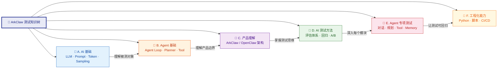
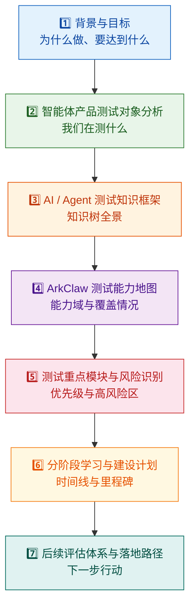

本文是知识库**学习路径与能力建设**的最后一篇，也是整座知识体系的"总收束"。它的作用有两重：第一，将前面 30 篇文章中散布的知识点压缩为一棵**可检索、可追溯的测试知识树**——你不必逐篇翻阅，只需要对照树节点定位到对应的 Wiki 章节即可；第二，提供一套可直接复制到团队内部的**汇报框架模板**，帮助你在团队内完成从"我在学 AI 测试"到"这是我们的测试体系蓝图"的叙事升级。如果你已经按照 [三个月学习路线图：基础→设计→评估](29-san-ge-yue-xue-xi-lu-xian-tu-ji-chu-she-ji-ping-gu) 完成了阶段性学习，这篇文档就是你用来"收口"和"对齐"的工具。

Sources: [readme.md](readme.md#L374-L431), [readme.md](readme.md#L493-L504)

## 知识树全景：六大分支与递进关系

ArkClaw 测试知识树由 **六大分支** 组成，每一条分支对应一个能力域，从 AI 基础认知一路延伸到工程化落地。下图展示了这棵树的全局结构——每个叶子节点都可以直接跳转到对应的 Wiki 章节深入学习：

**使用方式**：你可以把这棵树当作"目录索引"——当你在测试实践中遇到某个具体问题（例如"Agent 多轮对话后信息漂移"），先在树上定位到对应的分支（E 分支 → 对话理解测试），然后跳转到对应的 Wiki 章节查看详细方法论。

Sources: [readme.md](readme.md#L374-L431)

## 知识树逐节点详解与章节映射

下面这张大表是整棵知识树的**完整节点清单**。每个节点包含：该节点对应的核心知识域、你需要达到的认知目标、可以直接跳转的 Wiki 章节链接，以及该节点在整个知识体系中所属的层次。当你需要快速查阅或向他人解释某个知识点时，直接定位到表格中的对应行即可。

| 分支 | 知识节点 | 认知目标 | 对应 Wiki 章节 | 层次 |
|:---:|:---|:---|:---|:---:|
| **A. AI 基础** | LLM 基本原理与 Token / Context | 理解 Token 计费、上下文窗口对长对话的影响 | [LLM 核心概念](3-llm-he-xin-gai-nian-token-shang-xia-wen-chuang-kou-cai-yang-can-shu) | 第一层 |
| **A. AI 基础** | Sampling 参数（Temperature、Top_P） | 理解为什么相同输入可能产生不同输出 | [LLM 核心概念](3-llm-he-xin-gai-nian-token-shang-xia-wen-chuang-kou-cai-yang-can-shu) | 第一层 |
| **A. AI 基础** | Prompt 基础与作用边界 | 能区分"Prompt 问题"与"模型问题" | [Prompt 工程与边界认知](4-prompt-gong-cheng-yu-bian-jie-ren-zhi) | 第一层 |
| **A. AI 基础** | Hallucination（幻觉） | 看到缺陷时能判断是否为幻觉 | [模型常见缺陷](8-mo-xing-chang-jian-que-xian-huan-jue-bu-zhi-xing-yu-lu-bang-xing-wen-ti) | 第一层 |
| **A. AI 基础** | Function Calling 机制 | 理解工具调用的底层原理 | [工具调用机制](5-gong-ju-diao-yong-tool-calling-function-calling-ji-zhi) | 第一层 |
| **A. AI 基础** | RAG 基础与 Embedding / Retrieval | 理解知识库问答的工作原理 | [RAG 检索增强](6-rag-jian-suo-zeng-qiang-yu-zhi-shi-ku-wen-da-yuan-li) | 第一层 |
| **A. AI 基础** | Memory 基础认知 | 理解短期/长期记忆的区别与影响 | [记忆机制](7-ji-yi-ji-zhi-duan-qi-ji-yi-chang-qi-ji-yi-yu-shang-xia-wen-guan-li) | 第一层 |
| **B. Agent 基础** | Agent 是什么 & Agent Loop | 能画出 Agent Loop 的六阶段流程 | [Agent Loop 核心工作流](9-agent-loop-he-xin-gong-zuo-liu-cong-yong-hu-qing-qiu-dao-zui-zhong-xiang-ying) | 第二层 |
| **B. Agent 基础** | Planner / Executor | 理解任务规划的拆解逻辑 | [任务规划与调度](11-hui-hua-guan-li-ren-wu-gui-hua-yu-diao-du-ji-zhi) | 第二层 |
| **B. Agent 基础** | Tool / Skill 机制 | 理解工具注册、选择与执行链路 | [Skills / 插件体系](12-skills-cha-jian-ti-xi-yu-wai-bu-xi-tong-jie-ru) | 第二层 |
| **B. Agent 基础** | Session 管理 & Multi-step task | 理解会话生命周期和多步骤任务 | [会话管理](11-hui-hua-guan-li-ren-wu-gui-hua-yu-diao-du-ji-zhi) | 第二层 |
| **B. Agent 基础** | Human-in-the-loop | 理解人机协作中的审批与确认机制 | [产品架构](10-arkclaw-openclaw-chan-pin-jia-gou-yu-mo-kuai-chai-jie) | 第二层 |
| **C. 产品理解** | ArkClaw / OpenClaw 定位与核心能力 | 说清楚产品"不是聊天机器人" | [产品架构](10-arkclaw-openclaw-chan-pin-jia-gou-yu-mo-kuai-chai-jie) | 第二层 |
| **C. 产品理解** | 系统架构与模块拆解 | 能画出产品模块图并标注测试边界 | [产品架构](10-arkclaw-openclaw-chan-pin-jia-gou-yu-mo-kuai-chai-jie) | 第二层 |
| **C. 产品理解** | 云端 vs 本地部署差异 | 理解不同部署模式对测试策略的影响 | [产品架构](10-arkclaw-openclaw-chan-pin-jia-gou-yu-mo-kuai-chai-jie) | 第二层 |
| **C. 产品理解** | 技能生态与外部系统接入 | 能列出所有 Skills 和接入方式 | [Skills / 插件体系](12-skills-cha-jian-ti-xi-yu-wai-bu-xi-tong-jie-ru) | 第二层 |
| **D. AI 测试方法** | 非确定性测试思维 | 从"断言"升级到"评估" | [认知升级](2-ren-zhi-sheng-ji-cong-chuan-tong-ce-shi-dao-ai-agent-ce-shi-de-si-wei-zhuan-bian) | 第三层 |
| **D. AI 测试方法** | 评估体系设计（Golden Set、Rubric） | 能设计基准测试集和评分标准 | [评估体系搭建](27-ping-gu-ti-xi-da-jian-golden-set-rubric-ping-fen-yu-llm-as-a-judge) | 第五层 |
| **D. AI 测试方法** | LLM-as-a-Judge | 理解用模型评估模型的方法 | [评估体系搭建](27-ping-gu-ti-xi-da-jian-golden-set-rubric-ping-fen-yu-llm-as-a-judge) | 第五层 |
| **D. AI 测试方法** | 回归评估 & A/B 对比 | 能做版本间的能力对比 | [自动化评测工程](28-zi-dong-hua-ping-ce-gong-cheng-jiao-ben-shu-ju-ji-yu-hui-gui-kan-ban) | 第五层 |
| **E. 专项测试** | 对话理解测试 | 意图识别、多轮上下文、歧义处理 | [对话理解测试](19-dui-hua-li-jie-ce-shi-yi-tu-shi-bie-duo-lun-shang-xia-wen-yu-qi-yi-chu-li) | 第四层 |
| **E. 专项测试** | 任务规划测试 | 拆解、排序、回退与动态调整 | [任务规划测试](20-ren-wu-gui-hua-ce-shi-chai-jie-pai-xu-hui-tui-yu-dong-tai-diao-zheng) | 第四层 |
| **E. 专项测试** | Tool Calling 测试 | 参数提取、多工具编排与异常 | [Tool Calling 测试](21-tool-calling-ce-shi-can-shu-ti-qu-duo-gong-ju-bian-pai-yu-yi-chang-chu-li) | 第四层 |
| **E. 专项测试** | Memory 测试 | 记忆保存、过期失效与跨会话隔离 | [Memory 测试](22-memory-ce-shi-ji-yi-bao-cun-guo-qi-shi-xiao-yu-kua-hui-hua-ge-chi) | 第四层 |
| **E. 专项测试** | RAG 测试 | 检索召回、引用真实性、文档冲突 | [RAG 测试](23-rag-ce-shi-jian-suo-zhao-hui-yin-yong-zhen-shi-xing-yu-wen-dang-chong-tu) | 第四层 |
| **E. 专项测试** | 文件处理 & 浏览器自动化 | 文件读写、浏览器操作 | [文件处理与浏览器测试](24-wen-jian-chu-li-yu-liu-lan-qi-zi-dong-hua-ce-shi) | 第四层 |
| **E. 专项测试** | 错误处理与恢复 | 失败识别、自动重试、替代方案 | [错误处理与恢复测试](25-cuo-wu-chu-li-yu-hui-fu-ce-shi-shi-bai-shi-bie-zi-dong-zhong-shi-yu-ti-dai-fang-an) | 第四层 |
| **E. 专项测试** | 安全与权限控制 | 注入防护、越权、数据泄露、审批流 | [安全性测试](18-an-quan-xing-ce-shi-yue-quan-zhu-ru-yu-shu-ju-xie-lu-fang-hu) | 第三/四层 |
| **E. 专项测试** | 性能与成本 | 延迟、Token 消耗、并发 | [性能与成本测试](26-xing-neng-yu-cheng-ben-ce-shi-yan-chi-token-xiao-hao-yu-bing-fa-ping-gu) | 第四层 |
| **F. 工程化** | Python & API 自动化 | 能编写自动评测脚本 | [自动化评测工程](28-zi-dong-hua-ping-ce-gong-cheng-jiao-ben-shu-ju-ji-yu-hui-gui-kan-ban) | 第五层 |
| **F. 工程化** | 日志分析与数据清洗 | 能从 Trace 中提取关键信息 | [日志、Trace 与可观测性](13-ri-zhi-trace-yu-zhi-xing-gui-ji-ke-guan-ce-xing) | 第二/五层 |
| **F. 工程化** | 评测脚本与可视化报表 | 能产出自动化评测报告 | [自动化评测工程](28-zi-dong-hua-ping-ce-gong-cheng-jiao-ben-shu-ju-ji-yu-hui-gui-kan-ban) | 第五层 |
| **F. 工程化** | CI/CD 中接入 AI 回归评测 | 能将评测集成到持续集成流水线 | [自动化评测工程](28-zi-dong-hua-ping-ce-gong-cheng-jiao-ben-shu-ju-ji-yu-hui-gui-kan-ban) | 第五层 |

Sources: [readme.md](readme.md#L374-L431), [wiki.json](.zread/wiki/drafts/wiki.json#L1-L253)

## 知识树与测试矩阵的交叉映射

知识树解决的是"你需要知道什么"的问题，而**测试矩阵**解决的是"你需要验证什么"的问题。下面这张表将知识树的六大分支与 ArkClaw 的核心测试维度交叉映射，形成一个二维矩阵。矩阵中的每个单元格代表一个具体的测试任务——你可以用它来规划测试用例的覆盖范围，确保没有遗漏：

| 知识分支 → 测试维度 | A. AI 基础 | B. Agent 基础 | C. 产品理解 | D. 测试方法 | E. 专项测试 | F. 工程化 |
|:---|:---|:---|:---|:---|:---|:---|
| **能力测试**"会不会做" | 理解模型能力边界 | Agent Loop 是否能完整运行 | ArkClaw 是否能调用已注册 Skill | 如何定义"会/不会"的判定标准 | 对话理解、规划、Tool Calling 的能力验证 | 自动化能力测试脚本 |
| **结果测试**"做得对不对" | 幻觉识别 | 多步任务最终结果是否正确 | 业务场景的端到端结果验证 | 如何设计 Golden Set 做结果比对 | RAG 引用正确性、文件处理准确性 | 自动评分脚本 |
| **过程测试**"中间步骤是否合理" | Prompt 是否被正确构造 | 规划步骤是否合理、是否冗余 | 模块间协作是否有无效调用 | 如何抓取 Trace 做过程分析 | 工具选择正确性、步骤顺序合理性 | Trace 解析工具 |
| **稳定性测试**"多次执行是否可靠" | Temperature 参数对一致性的影响 | 长会话后 Agent 行为是否退化 | 不同部署模式下的一致性 | 如何定义稳定性指标与通过率 | 20 次重复执行成功率、Memory 一致性 | 回归评测流水线 |
| **安全性测试**"是否做了不该做的事" | Prompt Injection 原理理解 | Tool Injection 与越权调用 | 权限模型与审批流覆盖范围 | 如何设计对抗样本 | 数据泄露、注入攻击、恶意文件 | 安全扫描自动化 |

**实践建议**：在团队内推进测试时，不要试图一次性覆盖所有单元格。先聚焦**第一优先级**（B × 结果测试、E × 过程测试、E × 安全性测试），再逐步扩展到其他维度。优先级排序的详细论证请参考 [测试工程师能力差距分析与优先级排序](30-ce-shi-gong-cheng-shi-neng-li-chai-ju-fen-xi-yu-you-xian-ji-pai-xu)。

Sources: [readme.md](readme.md#L432-L435), [readme.md](readme.md#L66-L106)

## 内部汇报框架：七段式结构

当你需要在团队内部汇报 ArkClaw 测试体系的建设进展时，需要一个**叙事清晰、逻辑递进、可落地**的汇报结构。下面推荐的七段式框架来自源头文档中的建议，经过知识库内容的映射增强后，可以直接作为汇报大纲使用：

这个七段式框架的逻辑线是：**为什么 → 是什么 → 有什么 → 怎么做 → 做什么 → 什么时候做 → 下一步**。它遵循了 AIDA 叙事结构（Attention → Interest → Desire → Action），每一段都有明确的听众预期和核心产出物。

Sources: [readme.md](readme.md#L493-L504)

## 汇报框架逐段详解与素材映射

下面逐段展开七段式汇报框架，说明每段的**核心内容、听众预期、可用的 Wiki 素材以及建议的产出物**。你可以直接按照这个结构组织你的汇报材料：

### 第 1 段：背景与目标

**核心内容**：解释为什么要建设 AI/Agent 测试能力——因为测试对象发生了根本性变化，从"输入固定、输出可断言"的传统系统转变为"由大模型 + Prompt + Tool 调用 + 记忆 + 规划 + 外部系统 + 安全机制组成的复杂系统"。目标是让团队从"功能测试思维"升级为"评估思维"。

**可用素材**：[认知升级：从传统测试到 AI/Agent 测试的思维转变](2-ren-zhi-sheng-ji-cong-chuan-tong-ce-shi-dao-ai-agent-ce-shi-de-si-wei-zhuan-bian)、[概述：AI 智能体测试知识框架总览](1-gai-shu-ai-zhi-neng-ti-ce-shi-zhi-shi-kuang-jia-zong-lan)

**建议产出物**：一段 3 分钟的背景陈述 + 一张"传统测试 vs Agent 测试"对比表

Sources: [readme.md](readme.md#L1-L19), [readme.md](readme.md#L493-L504)

### 第 2 段：智能体产品测试对象分析

**核心内容**：明确 ArkClaw / OpenClaw 不是"聊天机器人"而是"任务执行系统"。展示产品架构图，标注每个模块的测试边界。重点强调 Agent Loop 的六阶段模型，以及每个阶段对应的可测试模块。

**可用素材**：[ArkClaw / OpenClaw 产品架构与模块拆解](10-arkclaw-openclaw-chan-pin-jia-gou-yu-mo-kuai-chai-jie)、[Agent Loop 核心工作流](9-agent-loop-he-xin-gong-zuo-liu-cong-yong-hu-qing-qiu-dao-zui-zhong-xiang-ying)

**建议产出物**：产品架构图（含模块边界标注）+ 模块-风险-测试点映射表

Sources: [readme.md](readme.md#L43-L63), [readme.md](readme.md#L293-L305)

### 第 3 段：AI / Agent 测试知识框架

**核心内容**：展示本文中的知识树全景图和六大分支结构，让团队看清"我们需要掌握哪些知识"。配合逐节点映射表，说明每个知识点对应的学习资料。这一段的目标是让听众理解这不是"零散的学习计划"，而是一棵**有结构、有层次、可追溯**的知识树。

**可用素材**：本文的知识树全景图和逐节点映射表

**建议产出物**：知识树 Mermaid 图 + 31 个章节的阅读清单

Sources: [readme.md](readme.md#L374-L431), [readme.md](readme.md#L493-L504)

### 第 4 段：ArkClaw 测试能力地图

**核心内容**：将知识树与测试矩阵交叉映射，展示"我们目前能覆盖哪些测试维度、哪些还没有覆盖"。这一段需要结合团队现状做"自我评估"——在每个矩阵单元格中标注"已有能力 / 建设中 / 未启动"。

**可用素材**：本文的测试矩阵表 + [测试工程师能力差距分析与优先级排序](30-ce-shi-gong-cheng-shi-neng-li-chai-ju-fen-xi-yu-you-xian-ji-pai-xu)

**建议产出物**：能力覆盖热力图（绿/黄/红标注覆盖程度）

Sources: [readme.md](readme.md#L432-L435), [readme.md](readme.md#L336-L371)

### 第 5 段：测试重点模块与风险识别

**核心内容**：按照优先级排序，明确哪些模块是**第一优先级**（Agent 架构、Tool Calling 测试、任务规划测试、异常恢复测试、安全测试），哪些是第二、第三优先级。对每个高风险模块列出 Top 3 的风险点和对应的测试策略。

**可用素材**：[Tool Calling 测试](21-tool-calling-ce-shi-can-shu-ti-qu-duo-gong-ju-bian-pai-yu-yi-chang-chu-li)、[任务规划测试](20-ren-wu-gui-hua-ce-shi-chai-jie-pai-xu-hui-tui-yu-dong-tai-diao-zheng)、[错误处理与恢复测试](25-cuo-wu-chu-li-yu-hui-fu-ce-shi-shi-bai-shi-bie-zi-dong-zhong-shi-yu-ti-dai-fang-an)、[安全性测试](18-an-quan-xing-ce-shi-yue-quan-zhu-ru-yu-shu-ju-xie-lu-fang-hu)

**建议产出物**：优先级排序表 + 风险清单 + 每个高风险模块的 3 条典型缺陷模式

Sources: [readme.md](readme.md#L473-L491)

### 第 6 段：分阶段学习与建设计划

**核心内容**：按照三个月路线图展示分阶段计划。第 1 个月补 AI 基础，产出知识笔记和架构图；第 2 个月做测试设计，产出测试模块图和 100 条核心用例；第 3 个月搭评估体系，产出评测数据集和回归看板。每阶段标注明确的**里程碑和验收标准**。

**可用素材**：[三个月学习路线图：基础→设计→评估](29-san-ge-yue-xue-xi-lu-xian-tu-ji-chu-she-ji-ping-gu)

**建议产出物**：甘特图或时间线 + 每阶段的交付物清单

Sources: [readme.md](readme.md#L438-L471)

### 第 7 段：后续评估体系与落地路径

**核心内容**：说明测试体系从"人工体验"升级为"可回归、可量化"的具体路径——包括 Golden Set 的构建、自动评测脚本的编写、回归看板的搭建、版本对比报告的模板化。这一段需要给出**可执行的行动项**，而不是停留在概念层面。

**可用素材**：[评估体系搭建](27-ping-gu-ti-xi-da-jian-golden-set-rubric-ping-fen-yu-llm-as-a-judge)、[自动化评测工程](28-zi-dong-hua-ping-ce-gong-cheng-jiao-ben-shu-ju-ji-yu-hui-gui-kan-ban)

**建议产出物**：落地路径图 + 2 周内可完成的 Quick Win 清单

Sources: [readme.md](readme.md#L462-L471), [readme.md](readme.md#L493-L504)

## 汇报文档命名与定位建议

根据源头文档的建议，你可以将这套体系命名为 **《ArkClaw 智能体测试学习与能力建设框架》**，定位为团队内部的技术规范文档。这个命名的优势在于：它同时覆盖了"学习"（知识建设）和"能力建设"（实践落地）两个维度，避免了"只是培训材料"的误解。

当你准备正式的汇报文档时，建议的文档结构如下表所示：

| 章节 | 标题 | 对应七段式 | 核心产出物 | 预计篇幅 |
|:---:|:---|:---:|:---|:---:|
| 1 | 背景与目标 | 第 1 段 | 对比表、目标声明 | 1-2 页 |
| 2 | 智能体产品测试对象分析 | 第 2 段 | 架构图、模块清单 | 2-3 页 |
| 3 | AI/Agent 测试知识框架 | 第 3 段 | 知识树、阅读清单 | 2-3 页 |
| 4 | ArkClaw 测试能力地图 | 第 4 段 | 覆盖热力图 | 1-2 页 |
| 5 | 测试重点模块与风险识别 | 第 5 段 | 优先级表、风险清单 | 2-3 页 |
| 6 | 分阶段学习与建设计划 | 第 6 段 | 时间线、交付物清单 | 1-2 页 |
| 7 | 后续评估体系与落地路径 | 第 7 段 | 落地路径图、行动项 | 1-2 页 |

**整份文档建议控制在 15-20 页以内**，每页聚焦一个核心观点。汇报时间建议 30-45 分钟，其中第 2 段（测试对象分析）和第 5 段（风险识别）是重点展开的部分，各分配 8-10 分钟。

Sources: [readme.md](readme.md#L493-L504)

## 关键指标体系：向管理层汇报的量化抓手

汇报中一个常见的痛点是"说了很多方法论，但管理层想看数字"。以下指标体系可以直接嵌入汇报文档的第 4 段（能力地图）和第 7 段（落地路径），让你用数据说话：

| 指标类别 | 具体指标 | 计算方式 | 目标基线 | 对应知识节点 |
|:---:|:---|:---|:---|:---|
| **任务成功率** | 单步任务成功率 | 正确完成次数 / 总执行次数 | ≥ 85% | E. 专项测试 |
| **工具调用正确率** | Tool Calling 准确率 | 正确调用次数 / 总调用次数 | ≥ 90% | E. Tool Calling |
| **规划合理率** | 任务拆解质量 | 人工评审合理数 / 总评审数 | ≥ 80% | E. 任务规划 |
| **稳定性通过率** | 多次执行一致率 | 20 次执行中成功次数 / 20 | ≥ 80% | D. 稳定性测试 |
| **幻觉率** | 输出中幻觉占比 | 幻觉次数 / 总输出次数 | ≤ 5% | A. AI 基础 |
| **平均完成时长** | 端到端任务耗时 | 从请求到最终响应的秒数 | 按业务场景定 | E. 性能测试 |
| **单任务 Token 成本** | 每任务 Token 消耗 | 总 Token 数 / 任务数 | 按预算定 | E. 性能测试 |
| **安全拦截率** | 对抗样本拦截率 | 被拦截的攻击数 / 总攻击样本数 | ≥ 95% | E. 安全测试 |

**注意**：以上目标基线为建议值，实际基线需要根据业务场景和产品阶段调整。初期建议先建立"当前基线"（跑一轮 Golden Set 拿到真实数据），再设定目标值。

Sources: [readme.md](readme.md#L347-L364), [readme.md](readme.md#L240-L252)

## 你的下一步行动

至此，你已经完成了整座知识库的阅读——从 [概述：AI 智能体测试知识框架总览](1-gai-shu-ai-zhi-neng-ti-ce-shi-zhi-shi-kuang-jia-zong-lan) 中的第一张五层架构图，到本文中最后一张汇报框架时间线。知识的积累到此结束，但**实践才刚刚开始**。建议你按以下顺序推进下一步行动：

1. **本周内**：使用本文的七段式框架，整理一份《ArkClaw 智能体测试学习与能力建设框架》初稿，先完成第 1-2 段
2. **两周内**：完成第 3-5 段，包括知识树截图、能力覆盖热力图和风险清单
3. **一个月内**：完成全部七段，并在团队内部做一次 30 分钟的正式汇报
4. **持续**：按照 [三个月学习路线图](29-san-ge-yue-xue-xi-lu-xian-tu-ji-chu-she-ji-ping-gu) 推进能力建设，每月更新汇报文档中的指标数据

如果你需要回顾某个具体知识点，随时回到本文的知识树映射表，快速定位到对应的 Wiki 章节。**这是你随身携带的测试知识索引。**