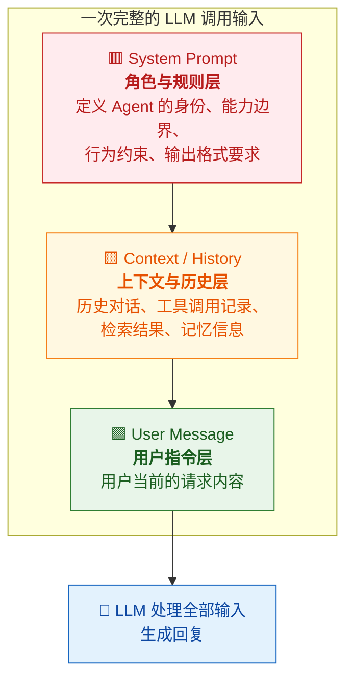
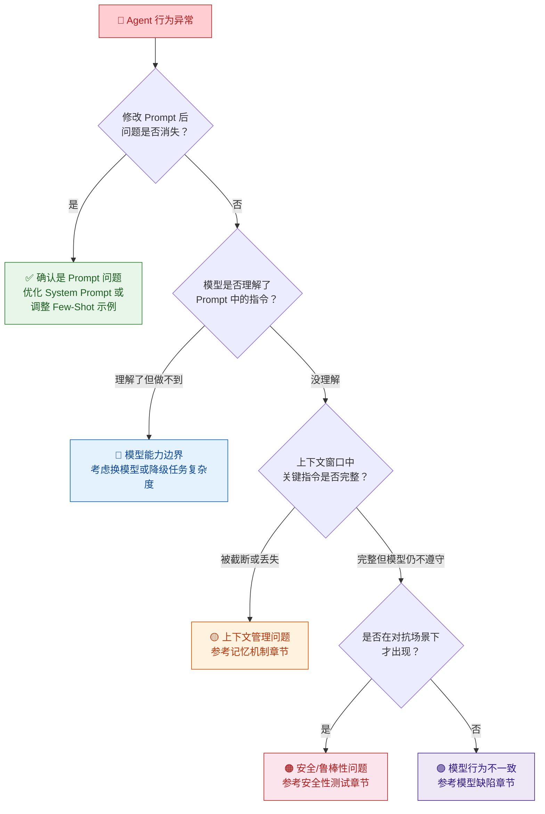

你正在阅读知识库**第一层：AI 与大模型基础认知**的第二篇文章。上一篇 [LLM 核心概念：Token、上下文窗口、采样参数](3-llm-he-xin-gai-nian-token-shang-xia-wen-chuang-kou-cai-yang-can-shu) 帮你理解了大模型处理信息的底层机制——Token 是信息的基本单位，上下文窗口是容量边界，采样参数控制了输出的随机性。本文将回答一个同样关键的问题：**Prompt 到底能做什么、不能做什么？** 作为测试工程师，你学习 Prompt 工程的目的不是"写出更炫的 Prompt"，而是当你在测试中发现缺陷时，能够准确判断：**这个问题到底是 Prompt 写错了，还是模型本身的能力不够，又或者是工具、记忆、知识库等其他模块出了问题？** 这就是"边界认知"的核心——知道能力边界在哪里，才能精准归因。

Sources: [readme.md](readme.md#L24-L37), [readme.md](readme.md#L27-L30)

## Prompt 的本质：你与大模型沟通的"指令语言"

**Prompt 就是你发给大模型的全部输入文本。** 它不是一句简单的"提问"，而是一个结构化的指令包——包含角色设定、任务描述、输出格式要求、约束条件、上下文信息等。大模型本身没有"意图"，它不会主动猜测你想做什么。它唯一做的事情，就是根据你提供的 Prompt，基于训练数据中学到的统计规律，生成一段概率上最合理的续写文本。

你可以用一个比喻来理解：大模型是一台极其强大的"通用计算器"，而 Prompt 就是你输入的"公式"。公式写得越精确，计算结果就越接近你想要的目标；公式写得模糊、矛盾或遗漏关键信息，输出的结果就会偏离预期。**Prompt 工程的核心目标，就是用尽可能清晰、完整、无歧义的"公式"，引导模型产出符合预期的输出。**

在 Agent 系统中，Prompt 的重要性进一步放大——它不仅影响"回答质量"，更直接影响**任务规划是否正确、工具选择是否准确、安全约束是否生效**。一个写得差的 System Prompt，可能导致 Agent 在不该调用工具时调用了工具、在应该拒绝时没有拒绝、在应该执行三步的任务中只执行了两步。

Sources: [readme.md](readme.md#L24-L30), [readme.md](readme.md#L37-L44)

## Prompt 的三层结构：System → Context → User

在深入技术细节之前，你需要先理解一个完整的 Agent 调用中，Prompt 是如何被组织和拼装的。一次典型的 LLM API 调用，其输入由三层结构组成：

这三层在上下文窗口中**共享同一个容量池**——它们加在一起的总 Token 数不能超过模型的上下文窗口上限。理解这三层各自的作用，是理解 Prompt 边界的第一步：

| 层级 | 谁写的 | 包含什么 | 核心作用 | 测试关注点 |
|:---|:---|:---|:---|:---|
| **System Prompt** | 产品/研发团队预设 | 角色定义、能力声明、工具使用规则、安全约束、输出格式规范 | 像一份"员工手册"，定义 Agent 的行为红线和能力边界 | 指令是否被遵守？约束在长对话后是否仍然生效？ |
| **Context / History** | 系统自动拼装 | 历史对话轮次、工具调用记录及返回结果、RAG 检索内容、记忆召回信息 | 像一份"工作台账"，提供当前任务的完整背景 | 关键信息是否被截断？历史是否被正确传递？工具结果是否被准确引用？ |
| **User Message** | 用户输入 | 用户当前的问题、指令、文件、截图等 | 像一次"具体任务下达"，触发 Agent 执行 | 意图是否被正确理解？参数是否被准确提取？ |

**一个关键洞察**：你测试时看到的很多"Agent 行为异常"，根源不在模型能力，而在这三层 Prompt 的某一层出了问题。System Prompt 写得模糊，模型就不知道自己该做什么、不该做什么；Context 层拼装错误，模型就会基于错误的历史做出错误的判断；User Message 理解偏差，模型就会答非所问。这也是为什么你需要建立"边界认知"——你需要知道问题的边界在哪里。

Sources: [readme.md](readme.md#L24-L37), [readme.md](readme.md#L42-L44)

## Prompt 工程的核心技法：从"写清楚"到"写精准"

了解了 Prompt 的三层结构后，下面介绍你在测试工作中最常会遇到的几种 Prompt 工程技法。你不需要成为 Prompt 专家，但你需要知道它们的存在和原理，这样当你看到 Agent 行为异常时，才能判断"是技法没用对，还是模型本身做不到"。

### 技法一：角色设定

通过在 System Prompt 中赋予模型一个明确的角色，可以显著引导其输出风格和专业度。例如：

| 角色设定示例 | 预期效果 |
|:---|:---|
| "你是一个专业的客服助手" | 回答更礼貌、更贴近客服场景 |
| "你是一个严谨的数据分析师，只基于提供的数据回答" | 减少幻觉，拒绝回答数据之外的问题 |
| "你是一个任务执行助手，可以调用以下工具" | 明确能力边界，引导工具使用行为 |

**测试关注点**：角色设定是否真正约束了模型行为？当你用对抗性问题挑战角色边界时（如对"数据分析师"角色提出主观评价类问题），模型是否仍然遵守约束？

### 技法二：Few-Shot 示例（少样本示例）

给模型提供 2-5 个"输入→期望输出"的示例，让模型通过这些示例学习你期望的输出格式和逻辑。这在需要特定输出格式（如 JSON 结构、特定评分模板）的场景中尤其有效。

**测试关注点**：Few-Shot 示例是否真的教会了模型正确的模式？当实际输入与示例差异较大时，模型是否还能正确泛化？示例之间的逻辑是否一致？

### 技法三：结构化输出指令

明确要求模型以特定格式输出，如 JSON、Markdown 表格、分步骤列表等。这在 Agent 系统中非常关键，因为后续模块（如工具调用解析器）往往依赖特定格式来提取信息。

**测试关注点**：模型是否始终按要求的格式输出？在复杂场景下是否会"忘记"格式要求？格式中的字段是否完整且类型正确？

### 技法四：思维链引导

通过在 Prompt 中加入"请一步步思考"或提供一个包含推理过程的示例，引导模型在给出最终答案前先展示中间推理步骤。这能显著提升复杂任务（如数学推理、多步判断）的准确率。

**测试关注点**：模型展示的推理步骤是否逻辑连贯？中间步骤的推理是否正确？是否存在"编造"推理过程来"配合"错误结论的情况？

### 技法五：约束与红线声明

在 System Prompt 中明确声明"不要做"的事情，如"不要访问外部网站""不要回答与任务无关的问题""不要在未经确认的情况下执行危险操作"等。

**测试关注点**：这是**安全测试的核心切入点**。当用户通过各种方式（直接请求、间接暗示、Prompt 注入）试图突破这些约束时，Agent 是否能够坚守红线？这正是 [安全性测试：越权、注入与数据泄露防护](18-an-quan-xing-ce-shi-yue-quan-zhu-ru-yu-shu-ju-xie-lu-fang-hu) 章节将要深入展开的内容。

Sources: [readme.md](readme.md#L27-L30), [readme.md](readme.md#L37-L44)

## 边界认知：Prompt 能做什么、不能做什么

这一节是全文的核心。很多测试工程师在初期会犯一个错误：**把所有问题都归结为"Prompt 没写好"**。事实上，Prompt 只是 Agent 系统中的一个环节，它有自己的能力上限。你需要建立清晰的边界认知，才能在归因时做出正确判断。

### Prompt 能做到的事

| 能力 | 说明 | 示例 |
|:---|:---|:---|
| **引导输出风格和格式** | 通过明确指令，可以让模型按特定格式和语气输出 | 要求以 JSON 格式返回、要求分步骤回答 |
| **定义行为边界** | 通过约束声明，可以限制模型不做什么 | 禁止回答某类问题、禁止执行危险操作 |
| **提供任务上下文** | 通过 Context 层传递历史和背景，让模型理解"当前在做什么" | 传递历史对话、工具返回结果、用户偏好 |
| **提升特定场景的准确率** | 通过 Few-Shot 示例和思维链引导，可以提升特定任务的完成质量 | 给出格式示例、要求逐步推理 |
| **触发工具调用** | 通过 System Prompt 中的工具描述，告知模型可以使用哪些工具 | 定义工具名称、参数格式、适用场景 |

### Prompt 做不到的事（以及为什么）

| 限制 | 说明 | 缺陷归因方向 |
|:---|:---|:---|
| **无法让模型"学会"它训练数据中不存在的能力** | Prompt 是"引导"而非"注入"。你无法通过一段文字让模型突然掌握一门它没学过的编程语言 | 这是**模型能力**问题，不是 Prompt 问题 |
| **无法保证 100% 遵守约束** | 即使 System Prompt 写得再明确，模型仍然可能在高 Temperature、长对话、对抗输入等条件下违反约束 | 需要结合 [模型常见缺陷：幻觉、不一致性与鲁棒性问题](8-mo-xing-chang-jian-que-xian-huan-jue-bu-zhi-xing-yu-lu-bang-xing-wen-ti) 来判断 |
| **无法解决上下文窗口溢出** | Prompt 越长，留给实际对话和工具结果的空间就越少；超过窗口的部分会被直接丢弃 | 这是 [LLM 核心概念](3-llm-he-xin-gai-nian-token-shang-xia-wen-chuang-kou-cai-yang-can-shu) 中上下文窗口的问题，需要在 [记忆机制](7-ji-yi-ji-zhi-duan-qi-ji-yi-chang-qi-ji-yi-yu-shang-xia-wen-guan-li) 层面解决 |
| **无法替代工具的实际执行能力** | Prompt 可以让模型"知道"有哪些工具，但工具的实际执行由后端系统完成；工具返回错误结果不是 Prompt 的责任 | 这是 [工具调用](5-gong-ju-diao-yong-tool-calling-function-calling-ji-zhi) 层面的问题 |
| **无法消除模型的幻觉倾向** | Prompt 可以减少幻觉（如要求"只基于提供的信息回答"），但无法完全消除 | 这是模型固有缺陷，需要在测试中持续监控 |
| **无法自行适应模型版本变更** | 同样的 Prompt 在不同模型版本下可能产生不同行为 | 这是回归测试需要覆盖的场景 |

### 一张图：缺陷归因的快速定位路径

当你发现一个 Agent 行为异常时，可以用下面的决策树快速判断问题是否属于 Prompt 层面：

**归因的关键方法论**：当你怀疑一个问题是 Prompt 导致的，最快的验证方式是**单独修改 Prompt 中的相关部分，保持其他条件不变，看问题是否消失或改变**。如果改了 Prompt 就好了，那确实是 Prompt 问题；如果改了 Prompt 还是不好，那就需要往模型能力、工具链路、记忆管理等方向继续深挖。

Sources: [readme.md](readme.md#L24-L44), [readme.md](readme.md#L93-L106)

## Prompt 变更的回归风险：为什么改一行也要重测

在 Agent 系统中，System Prompt 的变更频率通常比代码更高——产品经理想调整 Agent 的回复风格，运营想增加一条业务规则，安全团队想加一条约束声明。但你需要知道一个事实：**Prompt 是一个高度耦合的系统参数，改一处可能影响全局。**

下表列出了 Prompt 变更后最常见的连锁反应，它们正是你需要建立回归测试意识的原因：

| 变更类型 | 预期效果 | 可能的连锁风险 | 测试建议 |
|:---|:---|:---|:---|
| 新增一条行为约束 | 限制 Agent 不做某事 | 原本能做的事情也可能被"误伤"而不再执行 | 跑全量核心用例，确认已有能力未被削弱 |
| 修改角色描述 | 改变 Agent 的语气或专业度 | 工具调用的决策逻辑可能随之变化 | 重点验证工具选择和参数提取的准确率 |
| 新增 Few-Shot 示例 | 提升特定场景的表现 | 示例之间可能存在矛盾，导致模型行为不稳定 | 验证新旧示例的一致性，跑多次确认稳定性 |
| 增加 Prompt 长度 | 提供更多指令或上下文 | 上下文窗口中的可用空间减少，可能导致长对话截断 | 在长对话场景下验证关键信息是否仍然保留 |
| 调整输出格式要求 | 适配下游解析逻辑 | 格式变化可能导致工具调用参数提取失败 | 验证所有工具调用的参数提取链路 |

这就是为什么在 [稳定性测试：多次执行的可靠性与一致性](17-wen-ding-xing-ce-shi-duo-ci-zhi-xing-de-ke-kao-xing-yu-zhi-xing) 中会专门强调：**每次 Prompt 变更后，都需要跑回归测试来确认没有引入新的退化。** 在实际工作中，你可以把核心场景整理成一个 Golden Set（基准测试集），每次 Prompt 变更后自动跑一遍，对比前后指标变化。

Sources: [readme.md](readme.md#L93-L97), [readme.md](readme.md#L264-L276)

## 测试工程师的 Prompt 检查清单

基于以上所有内容，这里给你一份可以直接用于日常工作的 Prompt 质量检查清单。当你需要评审一个 System Prompt，或者在测试中发现疑似 Prompt 相关的缺陷时，按以下维度逐项排查：

| 检查维度 | 具体检查项 | 通过标准 | 什么时候检查 |
|:---|:---|:---|:---|
| **完整性** | Prompt 是否覆盖了所有必要的指令？ | 无遗漏的任务描述、工具定义、约束条件 | 新版本发布前、新功能上线前 |
| **无歧义性** | 指令是否存在多种理解方式？ | 不同人读到 Prompt 后对预期行为的理解一致 | Prompt 评审阶段 |
| **约束有效性** | 安全约束是否真的能阻止越界行为？ | 对抗性测试下约束仍然生效 | 安全测试阶段 |
| **长度合理性** | System Prompt 的 Token 占比是否过高？ | System Prompt 占上下文窗口的比例不超过 30%-40% | 性能测试阶段、长对话场景 |
| **一致性** | 多条指令之间是否矛盾？ | 所有指令可以同时满足，无逻辑冲突 | Prompt 变更后回归测试 |
| **格式规范性** | 输出格式指令是否足够精确？ | 下游解析模块能稳定提取所需字段 | 工具调用测试阶段 |

**一个实用的工作习惯**：当你发现一个缺陷并怀疑是 Prompt 问题时，记录以下信息——当前 System Prompt 版本、触发缺陷的完整输入、当时的上下文长度、采样参数设置。这些信息能帮助研发团队快速定位和修复问题，也能为后续的回归测试提供精确的复现条件。

Sources: [readme.md](readme.md#L24-L44), [readme.md](readme.md#L253-L276)

## 下一步

现在你已经建立了对 Prompt 工程的边界认知——知道 Prompt 能做什么、不能做什么，以及在发现缺陷时如何判断问题是否属于 Prompt 层面。在"第一层：AI 与大模型基础认知"的学习路径中，你的下一步建议按以下顺序继续：

1. [工具调用（Tool Calling / Function Calling）机制](5-gong-ju-diao-yong-tool-calling-function-calling-ji-zhi) — 理解 Agent 如何通过 Prompt 中定义的工具"动手做事"，这是 Agent 最核心的能力
2. [模型常见缺陷：幻觉、不一致性与鲁棒性问题](8-mo-xing-chang-jian-que-xian-huan-jue-bu-zhi-xing-yu-lu-bang-xing-wen-ti) — 建立对模型固有缺陷的直觉，帮助你在归因时区分"Prompt 问题"和"模型问题"
3. [安全性测试：越权、注入与数据泄露防护](18-an-quan-xing-ce-shi-yue-quan-zhu-ru-yu-shu-ju-xie-lu-fang-hu) — 当你理解了 Prompt 约束的边界后，自然需要知道攻击者如何试图突破这些边界