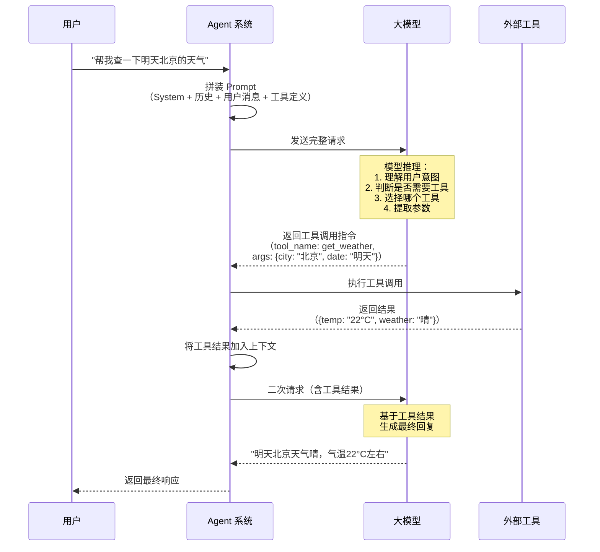
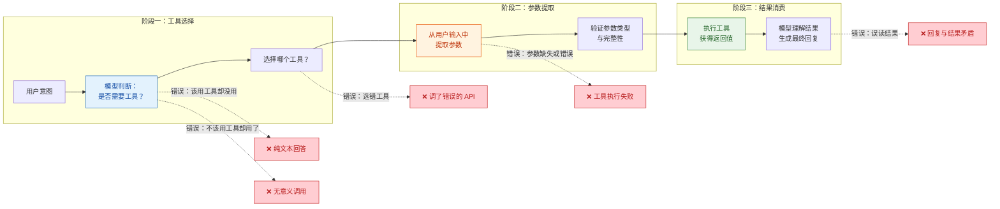
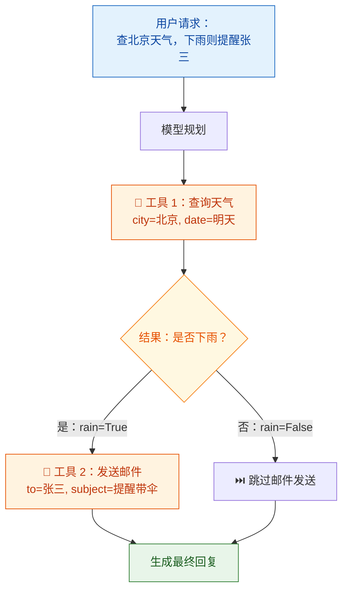
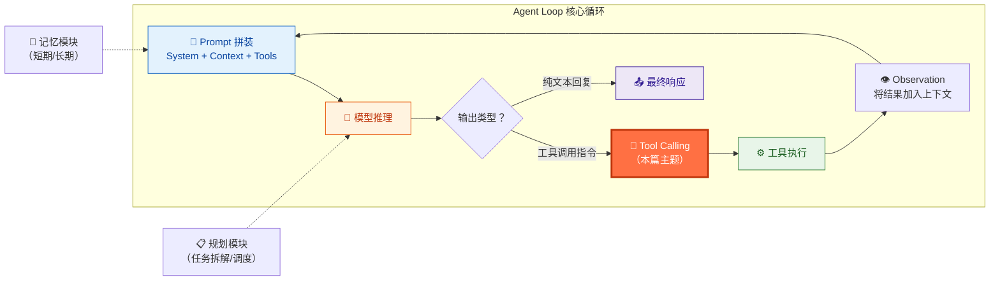

你正在阅读知识库**第一层：AI 与大模型基础认知**的第三篇文章。上一篇 [Prompt 工程与边界认知](4-prompt-gong-cheng-yu-bian-jie-ren-zhi) 帮你理解了 Prompt 是 Agent 与大模型沟通的"指令语言"，也明确了 Prompt 能做什么、不能做什么——其中一条"做不到"是：**Prompt 无法替代工具的实际执行能力**。模型可以"知道"有哪些工具可用，但工具的真正执行由后端系统完成。本文就聚焦在这个关键衔接点上：**大模型如何从"会说"跨越到"会做"**——也就是 **Tool Calling（工具调用）** 机制。你将理解模型怎样决定调用哪个工具、怎样从用户输入中提取参数、怎样处理工具返回的结果，以及整个链路中哪些环节最容易出问题。这些认知是你在后续 [Tool Calling 测试：参数提取、多工具编排与异常处理](21-tool-calling-ce-shi-can-shu-ti-qu-duo-gong-ju-bian-pai-yu-yi-chang-chu-li) 中设计测试用例的理论基础。

Sources: [readme.md](readme.md#L27-L37), [readme.md](readme.md#L140-L158)

## 为什么 Tool Calling 是 Agent 的核心能力

大模型本质上是文本生成器——它接收一段文本输入，输出另一段文本。在纯粹的"聊天"场景下，这足够了：用户问问题，模型回答。但 **Agent 不是聊天机器人，它是任务执行系统**。用户的需求往往不是"告诉我答案"，而是"帮我把事情做了"——比如发一封邮件、查询数据库、创建一个日程、操作浏览器完成下单流程。这些事情模型本身做不到，它没有邮件客户端、没有数据库连接、没有浏览器。**Tool Calling 机制就是连接"模型大脑"和"外部手脚"的桥梁**。

你可以用一个直观的比喻来理解：大模型是一个坐在办公室里的分析师，它拥有极强的理解和规划能力，但不能亲自跑腿。Tool Calling 就像是分析师桌上的电话——当它判断"这件事需要外部帮忙"时，就拿起电话，拨给对应的执行部门（工具），告诉他们需要做什么（参数），然后等待执行结果（返回值），再根据结果决定下一步行动。

Sources: [readme.md](readme.md#L1-L2), [readme.md](readme.md#L44-L50)

## Tool Calling 的完整工作流：从用户请求到工具结果

在深入每个环节之前，先建立全局视角。下面这张图展示了一次完整的 Tool Calling 流程，从用户发出请求到模型消费工具返回结果并生成最终响应：



这个流程揭示了 Tool Calling 的一个核心特征：**它不是一次 API 调用，而是至少两次**。第一次调用让模型"决定做什么"，第二次调用让模型"根据结果说什么"。在一些复杂的 Agent 系统中，这个循环可能反复执行多次——模型调用工具 A 获取信息，根据结果再调用工具 B 执行操作，然后再调用工具 C 确认结果。这正是 [Agent Loop 核心工作流：从用户请求到最终响应](9-agent-loop-he-xin-gong-zuo-liu-cong-yong-hu-qing-qiu-dao-zui-zhong-xiang-ying) 中将要展开的核心机制。

Sources: [readme.md](readme.md#L44-L50), [readme.md](readme.md#L140-L158)

## 三阶段拆解：工具选择 → 参数提取 → 结果消费

把上面的完整流程进一步拆解，你会发现 Tool Calling 的核心逻辑可以分解为三个阶段，每个阶段都有独立的职责和独立的出错可能。理解这三个阶段的边界，是你后续做缺陷归因的基础：



下面对每个阶段的机制和常见问题逐一展开。

Sources: [readme.md](readme.md#L143-L158), [readme.md](readme.md#L44-L50)

### 阶段一：工具选择——模型如何决定"用哪个工具"

工具选择是整个链路的第一步，也是最关键的决策点。模型需要完成两个判断：**第一，当前用户请求是否需要调用工具**（还是纯文本回答就足够了）；**第二，如果需要，应该调用哪个工具**。

这个决策的依据来自于 **System Prompt 中的工具定义**。在典型的 API 调用中（如 OpenAI 的 Chat Completions API），工具以 JSON Schema 的形式被传入 `tools` 参数，每个工具定义包含三个核心信息：**工具名称**（`name`）、**功能描述**（`description`）、**参数规范**（`parameters`）。模型通过阅读这些描述来理解每个工具的用途和适用场景，然后根据用户意图做出选择。

| 工具定义要素 | 作用 | 写得差会怎样 |
|:---|:---|:---|
| **工具名称（name）** | 精确标识工具身份 | 名称模糊（如 `handle_request`）导致模型选错工具 |
| **功能描述（description）** | 告诉模型这个工具"能做什么""什么时候用" | 描述不清晰或不完整，模型不知道何时该用 |
| **参数规范（parameters）** | 定义工具需要哪些参数、每个参数的类型和含义 | 缺少必要参数说明，模型不知道需要提取什么信息 |

**常见问题**：当多个工具的功能描述存在重叠时（比如"查询日历"和"创建日程"都涉及日历操作），模型容易选错。当工具描述过于简略时，模型可能无法区分相似工具。当用户的意图本身模糊时（比如"帮我处理一下那个文件"——哪个文件？什么操作？），模型可能选择错误甚至"瞎猜"。这些问题将在 [Tool Calling 测试](21-tool-calling-ce-shi-can-shu-ti-qu-duo-gong-ju-bian-pai-yu-yi-chang-chu-li) 中作为重点测试场景展开。

Sources: [readme.md](readme.md#L143-L146), [readme.md](readme.md#L27-L31)

### 阶段二：参数提取——模型如何从用户输入中"挖出"参数

一旦模型决定了调用哪个工具，下一步就是从用户的自然语言输入中提取工具所需的参数。这是 Tool Calling 中**最容易出问题的环节之一**，因为它要求模型同时完成两件事：**理解用户的语义意图**和**将其精确映射到工具的参数格式**。

举几个典型的参数提取场景和对应的困难：

| 场景 | 用户输入 | 工具期望的参数 | 模型需要做什么 |
|:---|:---|:---|:---|
| **直接参数** | "查一下北京明天的天气" | `{city: "北京", date: "2026-04-10"}` | 将"明天"解析为具体日期 |
| **隐含参数** | "发邮件告诉他会议改期了" | `{to: ?, subject: ?, body: ?}` | 推断"他"是谁，构造邮件主题和正文 |
| **模糊参数** | "帮我订个饭" | `{restaurant: ?, time: ?, cuisine: ?}` | 需要追问而不是瞎填 |
| **多值参数** | "把这三个文件合并后发给张三和李四" | `{files: [?, ?, ?], recipients: [?, ?]}` | 正确提取数组类型的多个值 |
| **类型转换** | "设个明天早上 9 点的闹钟" | `{time: "2026-04-10T09:00:00"}` | 将自然语言时间转为标准时间格式 |

你需要注意一个关键事实：**模型并不是"编程式"地提取参数，而是"语义式"地生成参数**。模型通过理解用户意图，然后按照工具参数的 JSON Schema 格式"生成"一段 JSON。这意味着参数提取的质量高度依赖于——模型的语义理解能力、工具描述中对参数的说明是否清晰、用户表达中是否包含足够的信息。

**常见问题**：用户提供了模糊信息时，模型可能"自行编造"参数值（如用户说"发给他"，模型不知道"他"是谁，就随机填了一个名字）；参数类型不匹配（如工具期望整数，模型传了字符串）；必填参数被遗漏；复杂嵌套结构被展平或混乱。这些都是你在后续做专项测试时需要覆盖的核心场景。

Sources: [readme.md](readme.md#L143-L158), [readme.md](readme.md#L140-L142)

### 阶段三：结果消费——模型如何理解和利用工具返回值

工具执行完成后，返回结果被拼装回上下文，模型需要**理解这个结果并据此生成最终回复**。这听起来简单，但实际包含两个容易出问题的子步骤。

**第一个问题：模型是否正确理解了工具结果。** 工具返回的数据往往是结构化的（JSON、数据库记录、API 响应），模型需要从中提取关键信息。当返回数据量大、结构复杂、或包含模型不熟悉的领域术语时，模型可能误读结果。例如，工具返回了 `{status: "pending", code: "E2001"}`，模型可能将 "pending" 误解读为"成功"，或忽略错误码。

**第二个问题：模型是否如实传达了工具结果。** 这是 [模型常见缺陷：幻觉、不一致性与鲁棒性问题](8-mo-xing-chang-jian-que-xian-huan-jue-bu-zhi-xing-yu-lu-bang-xing-wen-ti) 中提到的幻觉问题在 Tool Calling 场景下的具体表现——工具明明返回了 A，模型却在回复中说成了 B，甚至在工具返回错误时"编造"一个成功的结果来回复用户。

| 工具返回情况 | 模型应做的 | 模型可能做错的 |
|:---|:---|:---|
| **正常返回** | 准确提取关键信息，自然语言回复 | 误读字段含义、遗漏关键信息、添加不存在的信息 |
| **返回空结果** | 如实告知用户"未找到相关信息" | 编造不存在的数据来"填补空白" |
| **返回错误** | 解释错误原因，给出替代方案 | 隐瞒错误，假装操作成功 |
| **返回部分结果** | 呈现已有结果，说明哪些部分缺失 | 用臆测补全缺失部分 |

Sources: [readme.md](readme.md#L140-L158), [readme.md](readme.md#L216-L224)

## 工具定义长什么样：一个完整示例

为了让你对 Tool Calling 的输入格式建立直观认知，下面展示一个简化的工具定义示例。在实际的 Agent 系统中，System Prompt 或 API 请求中的 `tools` 参数会包含一组这样的定义：

```json
{
  "type": "function",
  "function": {
    "name": "send_email",
    "description": "发送电子邮件给指定收件人。当用户要求发送邮件、通知某人、写信时使用此工具。",
    "parameters": {
      "type": "object",
      "properties": {
        "to": {
          "type": "string",
          "description": "收件人邮箱地址"
        },
        "subject": {
          "type": "string",
          "description": "邮件主题"
        },
        "body": {
          "type": "string",
          "description": "邮件正文内容"
        }
      },
      "required": ["to", "subject", "body"]
    }
  }
}
```

注意看 `description` 字段——它是模型理解工具用途的唯一依据。一个写得好的描述应该明确说明**工具做什么**和**什么时候该用**。如果描述只写"发送邮件"而不写"当用户要求发送邮件、通知某人、写信时使用"，模型可能会在用户说"帮我通知一下张三会议改期"时，因为没看到"邮件"关键词而不调用这个工具。

**对测试工程师的启示**：当你发现 Agent "该调用工具却没调用"时，第一件事就是检查工具定义中的 `description` 是否足够清晰——很多时候不是模型能力不够，而是工具描述写得不好，模型"不知道可以用"。

Sources: [readme.md](readme.md#L27-L31), [readme.md](readme.md#L140-L146)

## 多工具编排：当任务需要调用多个工具时

现实场景中，用户的请求往往需要多个工具协同完成。例如"帮我查一下明天北京的天气，如果会下雨就给张三发邮件提醒他带伞"——这涉及天气查询 + 条件判断 + 邮件发送三个步骤。Agent 系统需要处理三种典型的多工具编排模式：

| 编排模式 | 特征 | 示例 |
|:---|:---|:---|
| **串行调用** | 后一个工具的输入依赖前一个工具的输出 | 先查日历找到会议时间 → 再查天气 → 根据结果发提醒 |
| **并行调用** | 多个工具之间无依赖关系，可同时调用 | 同时查询北京天气和上海天气 |
| **条件调用** | 是否调用下一个工具取决于前一个工具的结果 | 查天气 → 如果下雨才发提醒邮件 |



多工具编排引入了一个新的复杂度：**模型需要具备"规划"能力**——它不仅要决定用哪些工具，还要决定调用顺序、判断是否需要条件分支。这正是 Agent 与单纯聊天机器人的本质区别之一，也是 [任务规划测试：拆解、排序、回退与动态调整](20-ren-wu-gui-hua-ce-shi-chai-jie-pai-xu-hui-tui-yu-dong-tai-diao-zheng) 和 [Agent Loop 核心工作流](9-agent-loop-he-xin-gong-zuo-liu-cong-yong-hu-qing-qiu-dao-zui-zhong-xiang-ying) 将要深入展开的主题。

Sources: [readme.md](readme.md#L44-L50), [readme.md](readme.md#L140-L158)

## Tool Calling 的常见失败模式：测试工程师的核心关注点

基于以上三个阶段的拆解，你可以将 Tool Calling 的常见失败模式系统化地归类。下表按阶段列出了最常见的错误类型，这是你后续设计测试用例时最重要的参考框架：

| 阶段 | 失败模式 | 具体表现 | 严重程度 |
|:---|:---|:---|:---:|
| **工具选择** | 该用工具却没用 | 用户要求发邮件，模型直接用文字"模拟"了一封邮件 | 🔴 高 |
| **工具选择** | 不该用工具却用了 | 用户只是闲聊"今天天气真好"，模型调用了天气查询工具 | 🟡 中 |
| **工具选择** | 选错了工具 | 用户要"查日历"，模型调用了"创建日程" | 🔴 高 |
| **参数提取** | 必填参数缺失 | 用户说"发邮件给他"，模型没有 `to` 参数就直接调用了 | 🔴 高 |
| **参数提取** | 参数类型错误 | 工具期望 `date` 为 ISO 格式，模型传入了"明天" | 🟡 中 |
| **参数提取** | 模糊参数自行编造 | 用户说"订个饭"，模型随机选了一个餐厅和时间 | 🔴 高 |
| **参数提取** | 数组/嵌套参数解析错误 | 多值参数被解析为单个值，或嵌套结构被展平 | 🟡 中 |
| **结果消费** | 误读工具返回值 | 工具返回错误码，模型理解为成功 | 🔴 高 |
| **结果消费** | 工具失败时编造结果 | 工具调用超时，模型自行编造了一个"看起来合理"的回复 | 🔴 高 |
| **结果消费** | 遗漏关键信息 | 工具返回了 5 个字段，模型只提到了 2 个 | 🟡 中 |
| **多工具编排** | 调用顺序错误 | 先发邮件再确认收件人信息 | 🔴 高 |
| **多工具编排** | 条件判断错误 | 天气查询结果显示不下雨，模型仍然发送了提醒邮件 | 🟡 中 |
| **多工具编排** | 过度调用 | 只需查一次就能回答的问题，模型反复调用了多次 | 🟢 低 |

**一个关键的归因原则**：当你发现一个 Tool Calling 错误时，先判断它属于哪个阶段——是选错了工具（阶段一），还是参数不对（阶段二），还是结果处理错误（阶段三）？这个判断直接决定了你应该把问题报告给谁：工具定义的维护者、Prompt 的编写者，还是模型能力的评估者。

Sources: [readme.md](readme.md#L143-L158), [readme.md](readme.md#L216-L224)

## 采样参数对 Tool Calling 的影响：为什么 Temperature 很重要

在 [LLM 核心概念：Token、上下文窗口、采样参数](3-llm-he-xin-gai-nian-token-shang-xia-wen-chuang-kou-cai-yang-can-shu) 中你已经了解了 Temperature 等采样参数对模型输出随机性的影响。在 Tool Calling 场景下，采样参数的影响尤为显著：

| 参数设置 | 对 Tool Calling 的影响 | 建议 |
|:---|:---|:---|
| **Temperature = 0** | 工具选择和参数提取最稳定、最确定，适合需要精确执行的场景 | 生产环境推荐 |
| **Temperature = 0.7+** | 同一请求可能产生不同的工具选择或参数值，增加不确定性 | 创意场景可用，但 Tool Calling 不建议 |
| **Temperature 高 + 复杂参数** | 可能出现参数格式错误、类型不匹配、编造参数值等问题 | 应避免 |

**核心结论**：Tool Calling 本质上是一个"精确提取 + 精确执行"的任务，不需要模型的"创造性"。因此，在涉及工具调用的 Agent 系统中，Temperature 通常应设置在 0-0.1 之间。当你在测试中发现工具调用的成功率不稳定时，首先要检查的就是采样参数的设置。

Sources: [readme.md](readme.md#L27-L28), [readme.md](readme.md#L376-L380)

## Tool Calling 在 Agent 系统中的位置

最后，把 Tool Calling 放回到 Agent 系统的整体架构中来看。Tool Calling 不是孤立的——它是 Agent Loop（智能体循环）中的一个核心环节，与 Prompt、规划、记忆等模块紧密耦合：



在这个循环中，Tool Calling（橙色高亮部分）是"思考"和"行动"之间的转换点。模型通过推理决定调用什么工具（思考），Agent 系统执行工具并返回结果（行动），模型再根据结果继续推理（回到思考）。理解这个循环，是你理解后续 [Agent Loop 核心工作流](9-agent-loop-he-xin-gong-zuo-liu-cong-yong-hu-qing-qiu-dao-zui-zhong-xiang-ying) 和 [Skills / 插件体系与外部系统接入](12-skills-cha-jian-ti-xi-yu-wai-bu-xi-tong-jie-ru) 的基础。

Sources: [readme.md](readme.md#L44-L63), [readme.md](readme.md#L140-L158)

## 下一步

现在你已经建立了对 Tool Calling 机制的完整认知——知道了工具选择、参数提取、结果消费三个阶段各自怎么工作、容易在哪里出错。在"第一层：AI 与大模型基础认知"的学习路径中，建议你按以下顺序继续：

1. [RAG 检索增强与知识库问答原理](6-rag-jian-suo-zeng-qiang-yu-zhi-shi-ku-wen-da-yuan-li) — 理解大模型如何通过外部知识库突破自身训练数据的限制，这是 Agent "获取知识"的另一条路径
2. [记忆机制：短期记忆、长期记忆与上下文管理](7-ji-yi-ji-zhi-duan-qi-ji-yi-chang-qi-ji-yi-yu-shang-xia-wen-guan-li) — 理解 Agent 如何在多轮交互中维持和利用上下文信息
3. [模型常见缺陷：幻觉、不一致性与鲁棒性问题](8-mo-xing-chang-jian-que-xian-huan-jue-bu-zhi-xing-yu-lu-bang-xing-wen-ti) — 建立对模型固有缺陷的直觉，帮助你在归因时区分"机制问题"和"模型问题"

当你完成第一层全部内容后，Tool Calling 的测试实战将在两个地方深入展开：[Agent Loop 核心工作流](9-agent-loop-he-xin-gong-zuo-liu-cong-yong-hu-qing-qiu-dao-zui-zhong-xiang-ying) 帮你理解工具调用在整体循环中的位置，[Tool Calling 测试：参数提取、多工具编排与异常处理](21-tool-calling-ce-shi-can-shu-ti-qu-duo-gong-ju-bian-pai-yu-yi-chang-chu-li) 则是专项测试域的核心章节。