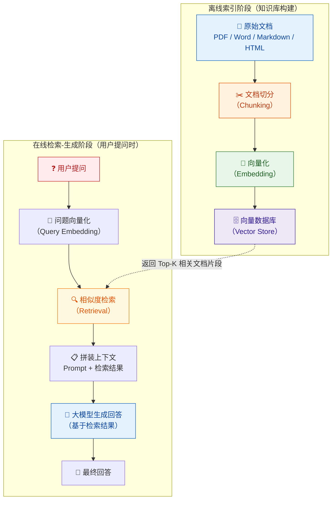
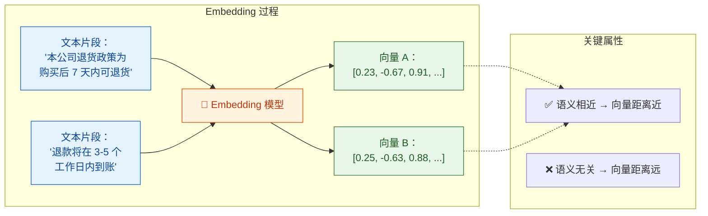
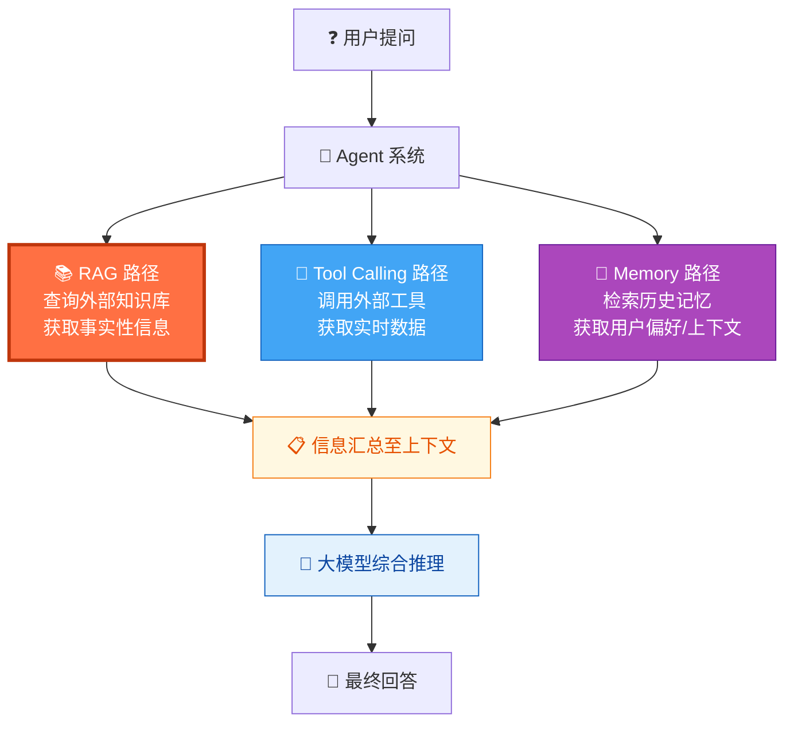

你正在阅读知识库**第一层：AI 与大模型基础认知**的第四篇文章。上一篇 [工具调用（Tool Calling / Function Calling）机制](5-gong-ju-diao-yong-tool-calling-function-calling-ji-zhi) 帮你理解了 Agent 如何通过工具"动手做事"——模型本身不能联网、不能查数据库，但通过 Tool Calling 可以把任务委托给外部系统执行。然而 Agent 还面临另一类核心问题：**知识从哪来？** 大模型的训练数据有截止日期，不可能包含你公司的内部文档、最新的产品手册、或者刚刚更新的政策规章。RAG（Retrieval-Augmented Generation，检索增强生成）就是为了解决这个问题而诞生的——它让模型在回答之前先"查阅资料"，基于真实文档生成回答，而不是凭训练记忆"猜测"。本篇将帮你建立对 RAG 全链路的完整认知，理解每个环节的机制和常见缺陷，为后续 [RAG 测试：检索召回、引用真实性与文档冲突](23-rag-ce-shi-jian-suo-zhao-hui-yin-yong-zhen-shi-xing-yu-wen-dang-chong-tu) 打下基础。

Sources: [readme.md](readme.md#L26-L37), [readme.md](readme.md#L32-L33)

## 为什么需要 RAG：大模型的"知识盲区"

在深入技术原理之前，你需要先理解一个基本事实：**大模型的回答完全依赖于训练数据**。模型在训练阶段"读"过什么，它就只能基于什么来回答。这带来了三个关键限制：

| 限制类型 | 具体表现 | 对 Agent 的影响 |
|:---|:---|:---|
| **时效性盲区** | 模型的训练数据有截止日期，之后发生的事情它不知道 | 用户问"最新的退货政策是什么"，模型只能回答旧政策甚至编造内容 |
| **领域知识盲区** | 模型不可能见过所有私有文档、内部系统文档、行业专有知识 | 用户问"我们公司的报销流程是什么"，模型完全没有相关训练数据 |
| **精确性盲区** | 训练数据中的细节会在模型内部被"模糊化"，无法精确回忆具体段落 | 用户问"合同第 3 条第 2 款怎么写的"，模型无法给出精确原文 |

RAG 的核心思路非常直观——既然模型自己"记不住"或"不知道"，那就**在回答之前先帮它查资料**，把相关的文档片段送到模型的上下文中，让它基于这些真实资料来回答。用一个比喻来理解：大模型是一个博学但信息滞后的顾问，RAG 就像是在顾问回答之前，先递给他一叠"最新参考资料"——他看了资料再回答，比凭记忆瞎说要可靠得多。

Sources: [readme.md](readme.md#L26-L37), [readme.md](readme.md#L176-L191)

## RAG 的完整工作流：从用户提问到知识增强回答

在深入每个环节之前，先建立全局视角。下面这张图展示了 RAG 系统的完整工作流，包含两个大阶段：**离线索引阶段**（把文档变成可检索的知识库）和**在线检索-生成阶段**（用户提问时实时检索并生成回答）。



这个流程揭示了 RAG 的一个核心特征：**最终回答的质量取决于整条链路上每一个环节的质量**。文档切分不好，关键信息可能被割裂；向量化不准确，检索时就找不到正确片段；检索策略不对，找到的内容可能与问题无关；模型生成时如果不忠实地基于检索结果，仍然会产生幻觉。理解每个环节的机制和潜在缺陷，是你后续做 RAG 测试的基础。

Sources: [readme.md](readme.md#L32-L33), [readme.md](readme.md#L376-L384)

## 离线阶段一：文档切分（Chunking）—— 把长文档变成可检索单元

原始文档可能是一篇 50 页的 PDF 或者一整份 Markdown 手册，而向量检索的基本单位是"文本片段"（Chunk）。文档切分就是把长文档拆成一个个合适长度的片段，每个片段独立进行向量化和存储。

### 切分策略及其影响

切分看似简单，实际上是 RAG 系统中**对最终效果影响最大的环节之一**。切得太大，一个片段包含太多信息，检索时"噪声"太多，模型难以聚焦关键内容；切得太小，关键信息可能被割裂到不同片段中，单个片段缺少完整语义。

| 切分策略 | 原理 | 优势 | 风险 |
|:---|:---|:---|:---|
| **固定长度切分** | 按字符数或 Token 数等分（如每 512 Token 一段） | 实现简单，片段大小均匀 | 会在句子中间截断，破坏语义完整性 |
| **按段落/标题切分** | 利用文档的标题层级、段落标记作为切分边界 | 片段语义完整 | 不同段落长度差异大，部分片段可能过长或过短 |
| **语义切分** | 通过 Embedding 相似度检测语义变化点，在语义转折处切分 | 片段语义高度内聚 | 计算成本高，且对 Embedding 模型质量有依赖 |
| **递归切分（带重叠）** | 按固定长度切分，但相邻片段之间保留一定重叠区域 | 兼顾大小均匀和上下文连续性 | 存在冗余存储，且重叠部分在检索时可能造成重复命中 |

**测试关注点**：chunk 切分导致信息丢失是 RAG 系统最常见的缺陷之一。例如，一份合同中"赔偿条款"跨越两个 chunk，检索时只召回了其中一个 chunk，模型就只看到了部分条款内容，回答就可能不完整或片面。当你在测试中发现"明明文档里有这个信息，但系统回答不完整"时，第一件事就是检查切分策略是否把这个信息拆到了不同片段中。

Sources: [readme.md](readme.md#L176-L191), [readme.md](readme.md#L190-L191)

## 离线阶段二：向量化（Embedding）—— 把文本变成数学向量

文档被切分成 chunk 后，每个 chunk 需要被转化为一个**高维数值向量**（Embedding），才能被计算机进行相似度计算。Embedding 模型的核心能力是：**语义相近的文本，其向量在高维空间中的距离也相近**。

用一个简化示例来理解：假设把文本映射到二维空间（实际通常是 768 维或 1536 维），那么"退货政策"和"退款规则"这两个表述虽然字面不同，但因为语义相近，它们的向量在空间中会距离很近；而"退货政策"和"天气预报"语义无关，向量距离会很远。



**测试关注点**：Embedding 模型不是万能的。在特定领域（如法律术语、内部黑话、产品代号）中，通用 Embedding 模型可能无法正确捕捉语义相似性，导致"明明意思相近但检索不到"或"意思完全不同却检索到了"的情况。此外，中英文混合、口语化表述、缩写/全称不一致等场景，都可能影响 Embedding 质量。

Sources: [readme.md](readme.md#L376-L384), [readme.md](readme.md#L32-L33)

## 离线阶段三：向量数据库（Vector Store）—— 存储与索引

所有 chunk 的向量连同原始文本一起被存入**向量数据库**（Vector Store），如 Milvus、Pinecone、Weaviate、Chroma 等。向量数据库的核心能力是**高维相似度检索**——给定一个查询向量，快速找到与它距离最近的 K 个向量（即 Top-K 最相关的文档片段）。

| 向量数据库特点 | 说明 |
|:---|:---|
| **存储内容** | 每条记录包含：向量（高维数组）+ 原始文本 + 元数据（来源文档、页码、标题等） |
| **检索方式** | 余弦相似度、欧氏距离、内积等相似度度量 |
| **索引算法** | HNSW、IVF 等近似最近邻算法，在海量数据中实现毫秒级检索 |
| **元数据过滤** | 支持在向量检索的基础上叠加条件过滤（如"只搜索 2026 年的文档"） |

**测试关注点**：向量数据库的性能和准确性直接影响检索质量。当知识库规模增大时（从几百篇文档扩展到几万篇），检索的准确率和延迟可能发生变化。此外，元数据标记是否正确（如文档是否标记了正确的版本号、生效日期）也会影响带过滤条件的检索结果。

Sources: [readme.md](readme.md#L376-L384), [readme.md](readme.md#L176-L179)

## 在线阶段一：查询向量化与检索（Retrieval）—— 找到最相关的文档片段

当用户提出一个问题时，RAG 系统的第一步是将用户的问题通过同一个 Embedding 模型转化为向量，然后在向量数据库中搜索最相似的文档片段。但实际系统中，检索策略远比"单纯向量搜索"复杂得多。

### 常见检索策略对比

| 检索策略 | 原理 | 适用场景 | 局限性 |
|:---|:---|:---|:---|
| **纯向量检索** | 用用户问题的 Embedding 向量在向量数据库中做相似度搜索 | 语义模糊、表述多样的查询 | 对精确关键词（如产品型号、合同编号）可能检索不准 |
| **关键词检索（BM25）** | 传统信息检索算法，基于词频匹配 | 包含精确关键词、专有名词的查询 | 无法理解语义，用户换一种说法就找不到 |
| **混合检索（Hybrid）** | 同时使用向量检索和关键词检索，合并结果后重排序 | 大多数生产环境推荐 | 需要调优两个检索通道的权重比例 |
| **重排序（Reranking）** | 先粗检索获取较多候选结果，再用 Cross-Encoder 精细排序 | 对检索精度要求高的场景 | 增加一次模型调用，延迟和成本上升 |

**一个关键洞察**：检索策略的选择和调优，是 RAG 系统效果差异的主要来源之一。同样的问题、同样的知识库，纯向量检索可能召回无关片段，而混合检索 + Reranking 可能精准命中。当你测试 RAG 系统时，**检索质量是你最需要关注的指标**——如果检索阶段召回的内容本身就是错的或不完整的，后面模型生成的回答再好也无济于事。

### 检索的核心参数：Top-K

Top-K 决定了每次检索返回多少个文档片段。这是一个需要在"信息充分性"和"噪声控制"之间权衡的参数：

| Top-K 设置 | 效果 | 风险 |
|:---|:---|:---|
| **K=1~3** | 只返回最相关的少数片段，上下文简洁 | 如果最相关的片段不包含完整答案，信息不够 |
| **K=5~10** | 返回较多片段，覆盖面广 | 可能引入大量不相关内容，分散模型注意力，增加 Token 消耗 |
| **K 过大（>15）** | 试图通过"多带信息"来弥补检索精度不足 | 上下文窗口被大量无关内容占满，反而降低回答质量 |

Sources: [readme.md](readme.md#L176-L191), [readme.md](readme.md#L32-L33)

## 在线阶段二：上下文拼装与生成（Generation）—— 让模型基于检索结果回答

检索到相关文档片段后，系统将它们与用户的原始问题一起拼装成完整的 Prompt，发送给大模型。一个典型的 RAG Prompt 结构如下：

```
[System Prompt]
你是一个知识库问答助手。请严格基于以下参考资料回答用户的问题。
如果参考资料中没有相关信息，请明确告知"知识库中没有相关信息"，不要自行编造。

[参考资料]
---文档 1（来源：公司员工手册 v3.2）---
本公司的年假政策为：入职满一年后享有 10 天年假...

---文档 2（来源：HR 通知 2026-03-15）---
自 2026 年 4 月起，年假天数调整为入职满一年 12 天...

[用户问题]
我们公司现在年假有几天？

[回答要求]
1. 基于参考资料回答，引用来源
2. 如果多个文档有冲突，以日期更新的文档为准
3. 不要编造参考资料中没有的内容
```

**测试关注点**：这个环节的核心问题是——**模型是否真的在基于检索结果回答**。即使检索阶段成功召回了正确的文档片段，模型仍然可能：忽略检索结果中的关键信息、添加检索结果中不存在的内容（幻觉）、在多个文档存在冲突信息时选择错误的一方、或者当检索结果确实不包含答案时仍然强行编造回答。这些问题在 [模型常见缺陷：幻觉、不一致性与鲁棒性问题](8-mo-xing-chang-jian-que-xian-huan-jue-bu-zhi-xing-yu-lu-bang-xing-wen-ti) 中有更详细的分析。

Sources: [readme.md](readme.md#L179-L191), [readme.md](readme.md#L26-L33)

## RAG 的典型失败模式：按环节归因

基于以上对全链路的拆解，你可以将 RAG 系统的常见失败模式系统化地归类。下表按环节列出了最常见的错误类型，这是你后续设计测试用例时最重要的参考框架：

| 环节 | 失败模式 | 具体表现 | 严重程度 |
|:---|:---|:---|:---:|
| **文档切分** | 关键信息被截断 | 一个完整的条款被拆到两个 chunk，检索只命中了其中一个 | 🔴 高 |
| **文档切分** | 切分边界不语义化 | chunk 在句子中间断开，导致检索命中的片段读不通 | 🟡 中 |
| **向量化** | 领域语义捕捉不准 | 用户问"退款流程"，但文档中写的是"退货操作指引"，向量距离远 | 🔴 高 |
| **向量化** | 中英文混合失真 | 文档中"Q4"和"第四季度"的向量距离过远 | 🟡 中 |
| **检索** | Top-K 命中无关片段 | 用户问年假政策，检索结果返回了加班制度的相关文档 | 🔴 高 |
| **检索** | 多文档冲突未区分 | 新旧两版文档同时被召回，检索阶段未做时效性排序 | 🔴 高 |
| **检索** | 同名文档混淆 | 知识库中有多个同名但内容不同的文档，检索命中了错误版本 | 🟡 中 |
| **生成** | 模型忽略检索结果 | 检索结果明确写了"10 天年假"，模型回答"15 天" | 🔴 高 |
| **生成** | 检索为空时编造回答 | 检索未找到相关文档，模型自行编造了一个"看起来合理"的答案 | 🔴 高 |
| **生成** | 引用来源不准确 | 模型声称引用了"文档 A"，但实际内容来自"文档 B" | 🔴 高 |
| **端到端** | 文档更新后回答未同步 | 文档已更新但向量索引未重建，系统仍然基于旧文档回答 | 🔴 高 |
| **端到端** | 对抗性文档注入 | 知识库中被植入了包含诱导性指令的文档，模型据此执行了越权操作 | 🔴 高 |

**一个关键的归因原则**：当你发现一个 RAG 回答不正确时，先判断问题出在哪个环节——是**检索没找到**（Retrieval 问题），还是**检索到了但模型没用对**（Generation 问题），还是**根本就没存进去**（Indexing 问题）？这个判断直接决定了你应该把问题报告给谁：检索策略工程师、Prompt 工程师，还是数据运维团队。

Sources: [readme.md](readme.md#L176-L191), [readme.md](readme.md#L179-L191)

## RAG vs 微调（Fine-tuning）：两种知识注入方式的对比

在了解了 RAG 的完整机制后，你可能会有一个疑问：为什么不直接用微调（Fine-tuning）把新知识"教"给模型？下表帮你建立对两种方式的清晰认知：

| 对比维度 | RAG（检索增强） | Fine-tuning（微调） |
|:---|:---|:---|
| **知识更新方式** | 更新知识库文档，无需重新训练模型 | 需要准备训练数据并重新训练模型 |
| **更新速度** | 即时——文档更新后立即生效 | 慢——需要数小时到数天的训练时间 |
| **知识可追溯性** | 高——可以精确追溯到来源文档和段落 | 低——知识被"融化"进模型参数，无法溯源 |
| **适用场景** | 需要频繁更新知识、需要引用来源、知识库规模大 | 需要改变模型的行为模式、输出风格、领域适配 |
| **成本结构** | 主要成本在检索基础设施和 Token 消耗 | 主要成本在训练计算资源和标注数据 |
| **幻觉风险** | 较低——可约束模型只基于检索结果回答 | 仍然存在——模型可能"记错"训练数据中的细节 |
| **测试复杂度** | 需要测试检索准确率、引用真实性、文档冲突处理等 | 需要测试微调后模型在目标任务上的表现 |

**核心结论**：RAG 和 Fine-tuning 不是替代关系，而是互补关系。在 Agent 系统中，RAG 通常用于解决"知识从哪来"的问题（事实性问答），Fine-tuning 用于解决"怎么回答"的问题（风格和格式适配）。你日常接触到的知识库问答功能，几乎都是基于 RAG 实现的。

Sources: [readme.md](readme.md#L32-L33), [readme.md](readme.md#L376-L384)

## RAG 在 Agent 系统中的位置

把 RAG 放回到 Agent 系统的整体架构中来看，RAG 与 [工具调用（Tool Calling / Function Calling）机制](5-gong-ju-diao-yong-tool-calling-function-calling-ji-zhi) 和 [记忆机制：短期记忆、长期记忆与上下文管理](7-ji-yi-ji-zhi-duan-qi-ji-yi-chang-qi-ji-yi-yu-shang-xia-wen-guan-li) 共同构成了 Agent 获取和使用信息的三条路径：



在这个架构中，**RAG（橙色高亮部分）** 负责"知识"的供给——当用户的问题需要查阅文档、政策、手册等结构化知识时，Agent 通过 RAG 路径从知识库中检索相关内容。而 Tool Calling 负责获取"实时数据"（如查天气、查库存），Memory 负责利用"历史上下文"（如用户之前的偏好设定）。理解这三条路径的分工，是你在测试中进行缺陷归因的关键：**如果回答的事实内容有误，先查 RAG 链路；如果是实时数据不准，查 Tool Calling 链路；如果是忽略了用户之前的设定，查 Memory 链路。**

Sources: [readme.md](readme.md#L1-L2), [readme.md](readme.md#L44-L63)

## 测试工程师的 RAG 缺陷归因检查清单

基于以上全链路分析，这里给你一份可以直接用于日常工作的 RAG 缺陷归因检查清单。当你发现知识库问答的回答不正确时，按以下维度逐项排查：

| 检查步骤 | 排查内容 | 判断方法 | 对应修复方向 |
|:---|:---|:---|:---|
| **1. 检查检索结果** | 召回的文档片段是否与问题相关？ | 查看检索日志中的 Top-K 结果 | 如果召回不相关 → 优化检索策略或 Embedding 模型 |
| **2. 检查切分完整性** | 正确答案是否完整地包含在一个 chunk 中？ | 手动查看相关文档的切分结果 | 如果被截断 → 调整切分策略（增大重叠、按语义切分） |
| **3. 检查文档版本** | 知识库中的文档是否是最新版本？ | 对比知识库中的文档与实际最新文档 | 如果过期 → 触发索引重建流程 |
| **4. 检查模型忠实度** | 模型的回答是否忠实于检索结果？ | 对比模型回答与检索结果原文 | 如果偏离 → 优化 Prompt 中的引用约束指令 |
| **5. 检查冲突处理** | 是否存在多个文档给出矛盾信息？ | 搜索知识库中所有包含相关关键词的文档 | 如果冲突 → 增加时效性排序或文档优先级规则 |
| **6. 检查安全性** | 是否有文档被植入了诱导性指令？ | 审查知识库中的可疑内容 | 如果存在 → 清理文档，增加入库审核机制 |

**一个实用的工作习惯**：当你发现一个 RAG 缺陷时，记录以下信息——用户的问题原文、检索召回的文档片段（带来源和排名）、模型的完整回答、以及你判断的正确答案。这四条信息构成了一条完整的 RAG 测试用例，可以直接用于后续的回归评测。

Sources: [readme.md](readme.md#L176-L191), [readme.md](readme.md#L481-L484)

## 下一步

现在你已经建立了对 RAG 检索增强与知识库问答原理的完整认知——知道了文档切分、向量化、检索、生成四个环节各自怎么工作、容易在哪里出错，以及如何按环节进行缺陷归因。在"第一层：AI 与大模型基础认知"的学习路径中，建议你按以下顺序继续：

1. [记忆机制：短期记忆、长期记忆与上下文管理](7-ji-yi-ji-zhi-duan-qi-ji-yi-chang-qi-ji-yi-yu-shang-xia-wen-guan-li) — 理解 Agent 如何在多轮交互中维持和利用上下文信息，这是 Agent 获取信息的第三条路径
2. [模型常见缺陷：幻觉、不一致性与鲁棒性问题](8-mo-xing-chang-jian-que-xian-huan-jue-bu-zhi-xing-yu-lu-bang-xing-wen-ti) — 建立对模型固有缺陷的直觉，理解 RAG 中"模型忽略检索结果"等问题背后的模型层面原因

当你完成第一层全部内容后，RAG 的测试实战将在 [RAG 测试：检索召回、引用真实性与文档冲突](23-rag-ce-shi-jian-suo-zhao-hui-yin-yong-zhen-shi-xing-yu-wen-dang-chong-tu) 中深入展开，那里会提供具体的测试设计方法和用例模板。