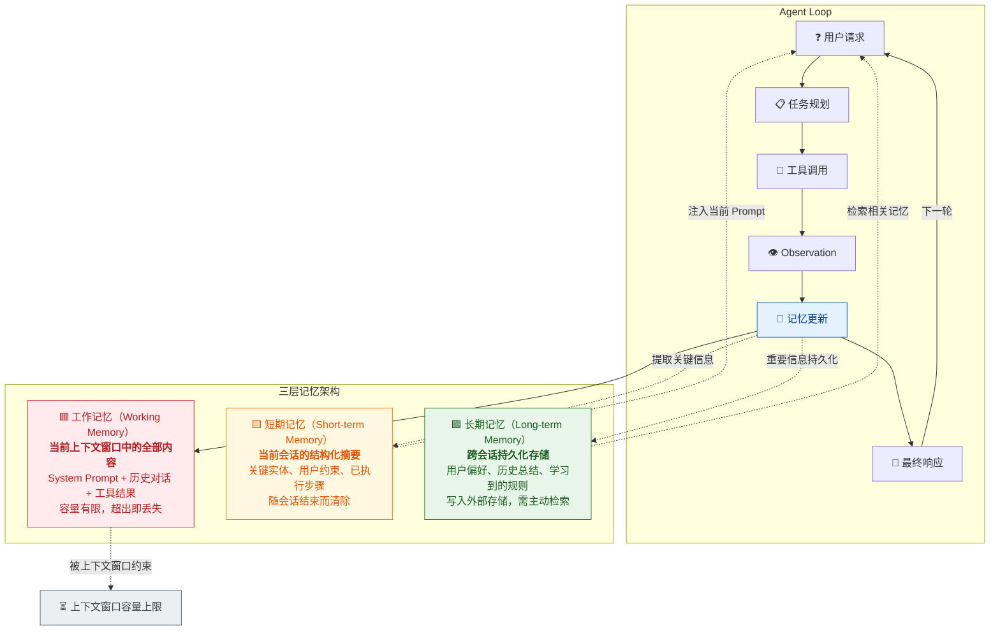
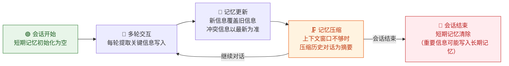
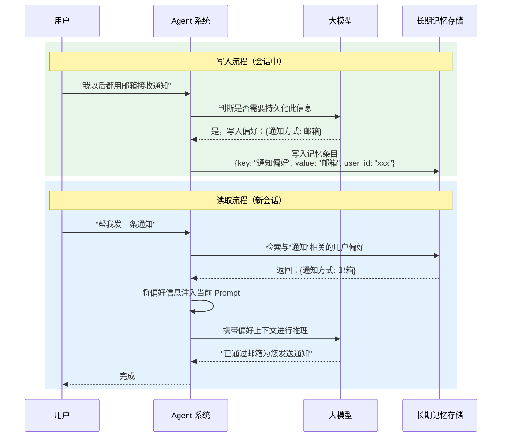
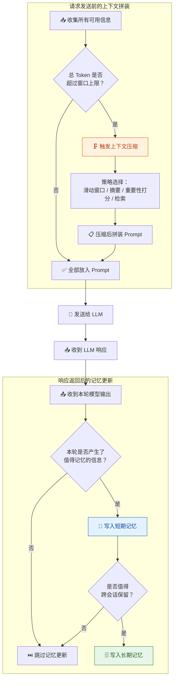
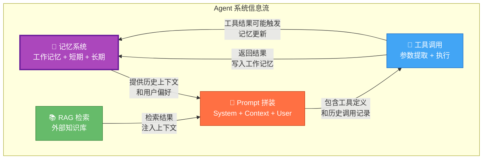

你正在阅读知识库**第一层：AI 与大模型基础认知**的第五篇文章。上一篇 [RAG 检索增强与知识库问答原理](6-rag-jian-suo-zeng-qiang-yu-zhi-shi-ku-wen-da-yuan-li) 帮你理解了 Agent 如何通过"先查资料再回答"来弥补模型的知识盲区——RAG 解决的是"知识从哪来"的问题。但你很快会发现一个新问题：**Agent 和用户之间的对话不是一次性的，它需要"记住"之前说过的话、做过的事、用户的偏好和约束**。这就是本文要讲的核心——Agent 的记忆机制。理解记忆如何存取、如何过期、如何在多轮对话中维持上下文一致性，是你后续设计 [Memory 测试：记忆保存、过期失效与跨会话隔离](22-memory-ce-shi-ji-yi-bao-cun-guo-qi-shi-xiao-yu-kua-hui-hua-ge-chi) 的认知基础。

Sources: [readme.md](readme.md#L26-L37), [readme.md](readme.md#L33-L34)

## 为什么 Agent 需要记忆：一个根本性的问题

在传统的 API 调用场景中，每次请求都是独立的——你发一个请求，系统返回一个结果，请求之间互不影响。但 **Agent 是一个有状态的交互系统**。用户会在多轮对话中逐步补充需求、修改条件、表达偏好，Agent 必须能"记住"这些信息并在后续交互中正确使用。如果 Agent 没有记忆能力，每一轮对话对它来说都是"第一次见面"——它会反复询问已经确认过的信息、忘记用户刚才做的设定、在不同步骤之间丢失上下文连贯性。更严重的是，Agent 系统是一个由大模型 + Prompt + Tool 调用 + 记忆 + 规划 + 外部系统 + 安全机制组成的复杂系统，记忆是这个系统中信息跨步骤、跨轮次流动的核心载体，记忆出问题，整个任务链路都会断裂。

Sources: [readme.md](readme.md#L1-L2), [readme.md](readme.md#L33-L34)

## 三层记忆架构：从"眼前"到"永久"

Agent 的记忆并不是一个单一机制，而是一个分层架构。你可以把它类比为人脑的记忆系统——有"此刻在想什么"的工作记忆，有"最近发生了什么"的短期记忆，也有"长期积累的知识和偏好"的长期记忆。下面这张图展示了 Agent 系统中三层记忆的完整架构及其在 Agent Loop 中的位置：



这三层记忆的协作方式是理解 Agent 行为的关键。**工作记忆**是模型"此刻能看到的一切"，它受限于上下文窗口大小，是真正影响模型推理的直接因素。**短期记忆**是对当前会话的结构化记录，它以摘要或结构化数据的形式保存，在上下文窗口不够用时通过压缩策略间接参与推理。**长期记忆**是跨会话的持久化存储，需要通过检索机制召回，类似于 [RAG 检索增强与知识库问答原理](6-rag-jian-suo-zeng-qiang-yu-zhi-shi-ku-wen-da-yuan-li) 中描述的检索过程——只不过检索的不是外部文档，而是 Agent 与该用户的历史交互记录。三层之间的关系可以概括为：长期记忆是"存档"，短期记忆是"笔记"，工作记忆是"此刻的视野"。

Sources: [readme.md](readme.md#L43-L50), [readme.md](readme.md#L33-L34), [readme.md](readme.md#L59-L63)

## 第一层：工作记忆——上下文窗口中的一切

### 机制原理

**工作记忆就是你发给大模型的全部上下文内容。** 在 [LLM 核心概念：Token、上下文窗口、采样参数](3-llm-he-xin-gai-nian-token-shang-xia-wen-chuang-kou-cai-yang-can-shu) 中你已经了解过上下文窗口——它包含 System Prompt、历史对话轮次、工具调用记录及返回结果、用户当前输入等所有内容。模型在一次推理中"能看到的"就是这些，超出部分完全不可见。

用一个比喻来理解：工作记忆是一张固定大小的桌面。Agent 系统会尽量把所有"当前可能需要的信息"摆在这张桌面上——角色设定、历史对话、工具结果、RAG 检索片段、长期记忆召回的内容……但桌面空间有限，东西放不下就会被挤掉。Agent 系统的上下文管理策略，本质上就是在"什么东西该摆在桌面上"这个问题上做取舍。

### 工作记忆的组成结构

| 组成部分 | 内容 | 竞争空间 | 被丢弃的后果 |
|:---|:---|:---|:---|
| **System Prompt** | Agent 角色定义、行为约束、工具使用规则、安全策略 | 与所有内容共享窗口 | 关键约束失效（如安全策略被遗忘） |
| **历史对话轮次** | 之前每一轮的用户输入和模型回复 | 随对话轮次线性增长 | "忘记"用户之前的设定和要求 |
| **工具调用记录** | 调用了什么工具、传了什么参数、返回了什么结果 | 每次工具调用都会增加大量内容 | 忽略之前的工具结果，重复调用或错误推理 |
| **RAG 检索片段** | 从知识库中检索到的文档片段 | 取决于 Top-K 和文档长度 | 缺少必要的背景知识 |
| **长期记忆召回** | 从外部存储中检索到的用户偏好、历史摘要 | 取决于召回条数和内容长度 | 无法利用用户的长期偏好和历史经验 |

**一个关键认知**：工作记忆中的所有内容是在**共享同一个容量池**。System Prompt 占多了，历史对话就放不下；工具结果太长，System Prompt 中的关键约束就会被挤出窗口。这就是为什么上下文管理成为 Agent 系统设计中最核心的工程挑战之一。

Sources: [readme.md](readme.md#L27-L28), [readme.md](readme.md#L33-L35), [readme.md](readme.md#L243-L250)

## 第二层：短期记忆——当前会话的结构化记录

### 机制原理

短期记忆是 Agent 在**单次会话**中维护的结构化信息记录。它存在的核心原因是：上下文窗口放不下所有历史对话，但 Agent 仍然需要知道"到目前为止发生了什么"。短期记忆的工作方式是——对历史对话进行**压缩、提取和结构化**，保留关键信息，丢弃冗余细节。

### 短期记忆的典型内容

| 信息类型 | 示例 | 保存方式 |
|:---|:---|:---|
| **用户设定的约束** | "不要发邮件，只通知我" | 结构化标签：`{email_allowed: false, notify_only: true}` |
| **关键实体信息** | 用户提到了"项目 X"、"北京团队" | 实体列表：`{projects: ["X"], teams: ["北京"]}` |
| **已完成的步骤** | "已经查了天气，已经订了机票" | 步骤日志：`[{step: "查询天气", status: "done"}, ...]` |
| **用户偏好** | "我喜欢靠窗的座位" | 偏好记录：`{seat_preference: "window"}` |
| **中间结论** | "天气显示明天有雨" | 结论摘要：`{tomorrow_weather: "rainy"}` |

### 短期记忆的生命周期



**测试关注点**：短期记忆的核心风险在于**信息提取和压缩的准确性**。当 Agent 对历史对话进行压缩时，可能丢失关键信息或扭曲原始语义。例如，用户在第 3 轮说"帮我订明天去上海的机票，要最便宜的"，到第 10 轮时，短期记忆摘要可能只保留了"订机票"而丢掉了"最便宜的"这个约束——这就是典型的"多轮设定覆盖"失败。此外，长对话后信息漂移也是常见的失败模式——Agent 逐渐"忘记"了早期对话中的关键设定，导致后续操作偏离用户原始意图。

Sources: [readme.md](readme.md#L33-L34), [readme.md](readme.md#L161-L174), [readme.md](readme.md#L48-L50)

## 第三层：长期记忆——跨会话的持久化存储

### 机制原理

长期记忆是 Agent 在**跨会话**场景中持久保存的信息。它解决的是一个更深层的问题：用户上次对话时告诉 Agent "我是素食主义者"，一周后新开一个会话，Agent 应该不需要用户重新说一遍。长期记忆通常存储在外部数据库中（如向量数据库、关系型数据库或键值存储），通过检索机制在需要时召回。

长期记忆的实现逻辑与 [RAG 检索增强与知识库问答原理](6-rag-jian-suo-zeng-qiang-yu-zhi-shi-ku-wen-da-yuan-li) 中的检索机制高度相似——存储时将信息向量化或结构化，使用时通过语义检索或关键词匹配找到相关记忆，然后注入当前对话的上下文中。区别在于：RAG 检索的是外部文档知识，长期记忆检索的是 Agent 与用户的历史交互记录。

### 长期记忆的内容分类

| 内容类型 | 示例 | 写入触发 | 检索时机 |
|:---|:---|:---|:---|
| **用户偏好** | "我用 24 小时制"、"我的语言偏好是中文" | 用户明确表达偏好时 | 每次新会话开始时、需要做个性化决策时 |
| **用户画像** | "我是产品经理"、"我在上海" | 从对话中持续积累 | 需要做个性化推荐或定制化回答时 |
| **历史任务摘要** | "上次帮用户订了北京到上海的机票" | 会话结束或任务完成时 | 用户提到"上次"、"之前"等时间指代时 |
| **学习到的规则** | "用户不喜欢被追问确认，倾向于直接执行" | 从多次交互中归纳总结 | Agent 需要决定行为模式时 |

### 长期记忆的读写流程



**测试关注点**：长期记忆的核心风险集中在三个维度——**写入准确性**（该记住的是否记对了）、**检索相关性**（需要记住的是否被正确召回）、**跨会话隔离**（不同用户或不同会话的记忆是否发生了"串话"）。此外，长期记忆还存在一个特有的问题：**过期失效**。用户在上次会话中说"我住在上海"，三个月后搬到了北京并在新会话中说"我搬家了"，长期记忆需要能正确更新而非继续使用过期信息。最后，长期记忆中可能包含敏感信息（如用户的个人信息、工作内容等），这些信息的存储和检索需要符合数据安全规范——记忆中的敏感信息污染是一个重要的安全测试维度。

Sources: [readme.md](readme.md#L33-L34), [readme.md](readme.md#L161-L174), [readme.md](readme.md#L233-L237), [readme.md](readme.md#L390-L391)

## 上下文管理策略：在有限的窗口中做取舍

三层记忆架构共同面临一个硬约束——**上下文窗口的大小是有限的**。无论记忆系统多么完善，最终所有信息都必须被压缩进上下文窗口才能影响模型的行为。上下文管理策略就是 Agent 系统用来解决"窗口放不下所有信息"这个问题的工程手段。

### 五种核心上下文管理策略

| 策略 | 原理 | 优势 | 风险 | 对测试的影响 |
|:---|:---|:---|:---|:---|
| **滑动窗口** | 只保留最近 N 轮对话，早期轮次直接丢弃 | 实现简单，Token 消耗可预测 | 早期关键信息可能被直接丢弃 | 需要测试"多轮后是否还记得第 1 轮的关键信息" |
| **摘要压缩** | 对早期对话轮次生成摘要，用摘要替代原文 | 保留语义要点，大幅减少 Token | 摘要过程可能丢失关键细节或扭曲原意 | 需要对比摘要内容与原文，检查关键信息是否保留 |
| **重要性打分** | 为每轮对话计算重要性分数，优先保留高分内容 | 精细化取舍，关键信息不易丢失 | 重要性判断依赖模型能力，可能出错 | 需要设计"低重要性内容遮蔽高重要性内容"的反例 |
| **检索式召回** | 不在上下文中保留所有历史，按需从外部检索 | 不受窗口限制，可支持超长历史 | 检索质量直接影响回答质量 | 类似 RAG 测试，需要验证检索的准确性和完整性 |
| **混合策略** | 结合上述多种方式：最近几轮原文保留 + 早期摘要 + 关键信息持久化 | 兼顾完整性和效率 | 实现复杂，各策略之间的交互可能产生意外行为 | 需要测试各策略切换时的边界条件 |

### 上下文管理在 Agent Loop 中的位置

在 Agent 系统的完整工作流中（用户请求 → Prompt 拼装 → 任务规划 → 工具调用 → Observation → 记忆更新 → 最终响应），上下文管理发生在两个关键节点：**请求发送前**（决定把哪些信息放入当前 Prompt）和**响应返回后**（决定从本轮交互中提取哪些信息写入记忆）。这两个节点的决策质量直接决定了 Agent 在后续交互中能否正确"回忆"和使用历史信息。



Sources: [readme.md](readme.md#L43-L50), [readme.md](readme.md#L243-L250), [readme.md](readme.md#L34-L35)

## 记忆系统的典型失败模式

基于以上三层记忆架构和上下文管理策略的分析，你可以系统化地归类 Agent 记忆系统最常见的失败模式。下表按记忆层级列出了典型缺陷，这是你后续设计测试用例时最重要的参考框架：

| 记忆层级 | 失败模式 | 具体表现 | 典型触发场景 | 严重程度 |
|:---|:---|:---|:---|:---:|
| **工作记忆** | 信息截断 | 早期对话中的关键约束被挤出上下文窗口 | 20+ 轮长对话后，模型不再遵守第 1 轮的设定 | 🔴 高 |
| **工作记忆** | 工具结果淹没 | 工具返回大量数据，占满窗口导致其他上下文被挤出 | 工具返回了完整数据库查询结果（数千 Token） | 🔴 高 |
| **工作记忆** | 指令遗忘 | System Prompt 中的关键约束在长对话后不再生效 | 安全策略"不要执行删除操作"在长对话后被遗忘 | 🔴 高 |
| **短期记忆** | 压缩丢信息 | 摘要过程中关键细节被遗漏 | 用户说"要最便宜的机票"，摘要只保留了"订机票" | 🔴 高 |
| **短期记忆** | 信息漂移 | 长对话后 Agent 对早期信息的理解逐渐偏移 | 10 轮后，Agent 把用户的"下周"理解成了"这周" | 🟡 中 |
| **短期记忆** | 覆盖冲突 | 新信息覆盖了不该覆盖的旧信息 | 用户新说"不用订了"覆盖了"帮我订"的指令，但 Agent 同时取消了已经订好的机票 | 🟡 中 |
| **短期记忆** | 相似实体混淆 | Agent 把两个名字相近的实体搞混 | 用户提到了"项目 Alpha"和"项目 Alpha Pro"，Agent 混淆了两者 | 🟡 中 |
| **长期记忆** | 该记住的没记住 | 用户明确表达的偏好没有被持久化 | 用户说"以后都用邮箱通知"，下次会话 Agent 又问"用什么方式通知？" | 🔴 高 |
| **长期记忆** | 记错了 | 长期记忆中存储的内容与用户原始表述不一致 | 用户说"我住在北京"，长期记忆保存成了"用户在上海" | 🔴 高 |
| **长期记忆** | 过期信息未失效 | 用户的偏好已经改变，但旧记忆没有被更新 | 用户三个月前说"我用微信支付"，已改用支付宝，Agent 仍然用微信支付 | 🔴 高 |
| **长期记忆** | 跨会话串话 | 不同用户或不同会话的记忆发生了混淆 | 用户 A 的偏好被错误地用于用户 B 的会话 | 🔴 高 |
| **长期记忆** | 敏感信息泄漏 | 长期记忆中保存了不该保存的敏感信息 | Agent 在与其他用户的对话中引用了某用户的私人信息 | 🔴 高 |

**一个关键的归因原则**：当你发现 Agent 出现"遗忘"或"记错"的行为时，先判断问题出在哪一层记忆——是**上下文窗口里看不到**（工作记忆问题），是**短期记忆摘要不准确**（压缩策略问题），还是**长期记忆检索/存储出错了**（持久化机制问题）？这个判断直接决定了你报告缺陷时的指向和修复方向。

Sources: [readme.md](readme.md#L16-L17), [readme.md](readme.md#L161-L174), [readme.md](readme.md#L233-L237)

## 记忆与其他模块的交互：系统级视角

记忆不是孤立运作的。在 Agent 系统的完整链路中，记忆与 [Prompt 工程与边界认知](4-prompt-gong-cheng-yu-bian-jie-ren-zhi)、[工具调用（Tool Calling / Function Calling）机制](5-gong-ju-diao-yong-tool-calling-function-calling-ji-zhi)、RAG 等模块紧密耦合。理解这些交互关系，是你在测试中进行系统性归因的关键：



**几个关键的交互风险点**：

**记忆与 Prompt 的冲突**：长期记忆中召回的用户偏好与当前 System Prompt 中的默认规则可能矛盾。例如，System Prompt 要求"每次操作前都确认"，但长期记忆记录了"用户不喜欢被追问"。Agent 应该优先遵循哪个？这种冲突在不同场景下应有不同的处理策略，但如果没有明确的优先级规则，Agent 可能做出不一致的行为。

**工具调用结果污染记忆**：工具返回了错误或过时的信息，Agent 把这些错误信息写入了短期或长期记忆，后续交互基于错误记忆做出错误决策。例如，一个查询库存的工具返回了过期数据，Agent 将"库存为 0"写入了记忆，后续即使用户询问就直接回答"没货了"，而不再重新查询。

**RAG 与长期记忆的混淆**：Agent 可能将 RAG 检索到的外部知识库内容错误地"记住"为用户偏好，或将用户的个人偏好与知识库内容混淆。例如，用户问"公司的年假政策是什么"，Agent 通过 RAG 检索到了答案，同时错误地将这个答案写入了长期记忆的"用户偏好"区域。

Sources: [readme.md](readme.md#L1-L2), [readme.md](readme.md#L43-L50), [readme.md](readme.md#L313-L314)

## 测试工程师的记忆缺陷归因检查清单

基于以上对记忆系统的全面分析，这里给你一份可以直接用于日常工作的记忆缺陷归因检查清单。当你发现 Agent 出现"遗忘"、"记错"或"串话"行为时，按以下维度逐项排查：

```mermaid
flowchart TD
    BUG["🔴 Agent 出现记忆相关缺陷"] --> Q1{"是"忘记"了<br/>还是"记错了"？"}

    Q1 -->|"忘记了"| Q2{"是一次对话内<br/>还是跨会话？"}
    Q1 -->|"记错了"| Q5{"错误内容来自<br/>哪里？"}

    Q2 -->|"一次对话内<br/>长对话后遗忘"| A1["📍 工作记忆问题<br/>检查上下文窗口是否溢出<br/>检查压缩策略是否丢信息"]
    Q2 -->|"新会话中<br/>不记得上次的内容"| A2["📍 长期记忆问题<br/>检查信息是否被持久化<br/>检查检索是否正确召回"]

    Q5 -->|"记成了另一个<br/>用户/会话的内容"| A3["📍 跨会话隔离问题<br/>检查记忆存储的 user_id<br/>和 session_id 隔离逻辑"]
    Q5 -->|"内容被修改<br/>或过度压缩"| A4["📍 压缩/提取问题<br/>检查摘要逻辑<br/>对比原始对话与记忆内容"]
    Q5 -->|"使用了过期的<br/>旧信息"| A5["📍 过期失效问题<br/>检查记忆更新机制<br/>检查 TTL 或版本控制"]

    style BUG fill:#FFCDD2,stroke:#C62828,color:#B71C1C
    style A1 fill:#E3F2FD,stroke:#1565C0,color:#0D47A1
    style A2 fill:#E3F2FD,stroke:#1565C0,color:#0D47A1
    style A3 fill:#FFF3E0,stroke:#E65100,color:#BF360C
    style A4 fill:#FFF3E0,stroke:#E65100,color:#BF360C
    style A5 fill:#FFF3E0,stroke:#E65100,color:#BF360C
```

| 检查步骤 | 排查内容 | 判断方法 | 对应修复方向 |
|:---|:---|:---|:---|
| **1. 检查上下文窗口** | 总 Token 是否接近或超过窗口上限？ | 查看日志中的 Token 计数，检查是否有截断标记 | 如果溢出 → 优化上下文压缩策略 |
| **2. 检查压缩摘要** | 压缩后的摘要是否保留了关键信息？ | 对比原始对话与摘要内容 | 如果遗漏 → 调整摘要策略或增加关键信息保护规则 |
| **3. 检查长期记忆写入** | 用户的关键信息是否被正确持久化？ | 查询长期记忆数据库中的实际存储内容 | 如果未写入 → 检查写入触发条件和提取逻辑 |
| **4. 检查长期记忆检索** | 需要的记忆是否被正确召回？ | 检查检索日志中返回的记忆条目 | 如果未召回 → 优化检索策略或 Embedding 质量 |
| **5. 检查会话隔离** | 不同用户/会话的记忆是否混淆？ | 用不同用户身份查询同一问题，检查是否有串话 | 如果串话 → 检查 user_id / session_id 的隔离逻辑 |
| **6. 检查过期机制** | 旧记忆是否被正确更新或清除？ | 在记忆中注入已知过期信息，检查 Agent 是否仍使用 | 如果未过期 → 增加记忆 TTL 或更新触发机制 |

**一个实用的工作习惯**：当你发现一个记忆相关缺陷时，记录以下信息——缺陷发生时的完整对话历史（含 Token 计数）、Agent 的实际行为与你预期的行为差异、你认为被"遗忘"或"记错"的具体信息原文、以及该信息所在的记忆层级。这四条信息构成了一条完整的记忆测试用例，可以直接转化为回归测试数据集。

Sources: [readme.md](readme.md#L161-L174), [readme.md](readme.md#L33-L34), [readme.md](readme.md#L233-L237)

## 下一步

现在你已经建立了对 Agent 记忆机制的完整认知——理解了工作记忆、短期记忆、长期记忆三层架构各自的职责与局限，掌握了上下文管理策略的核心权衡，也知道了记忆系统最常见的失败模式及归因方法。在"第一层：AI 与大模型基础认知"的学习路径中，建议你接下来阅读：

1. [模型常见缺陷：幻觉、不一致性与鲁棒性问题](8-mo-xing-chang-jian-que-xian-huan-jue-bu-zhi-xing-yu-lu-bang-zing-ti) — 理解大模型本身的固有缺陷，很多"记忆问题"的根因可能不是记忆系统出错了，而是模型产生了幻觉或不一致输出
2. [会话管理、任务规划与调度机制](11-hui-hua-guan-li-ren-wu-gui-hua-yu-diao-du-ji-zhi) — 从系统架构层面理解会话管理和任务规划如何与记忆机制协同工作

当你完成第一层和第二层的学习后，记忆机制的测试实战将在 [Memory 测试：记忆保存、过期失效与跨会话隔离](22-memory-ce-shi-ji-yi-bao-cun-guo-qi-shi-xiao-yu-kua-hui-hua-ge-chi) 中深入展开，那里会提供具体的测试设计方法、用例模板和评估指标。