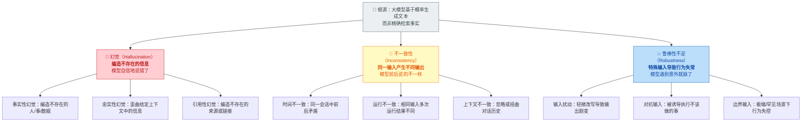
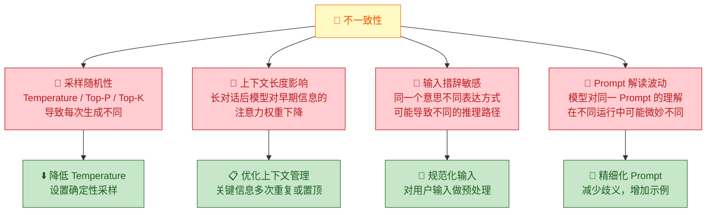
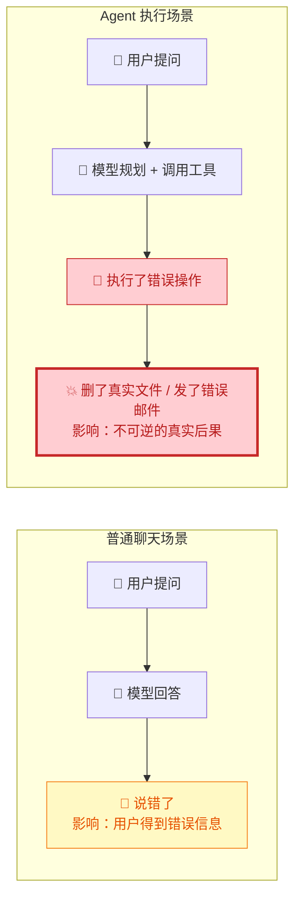
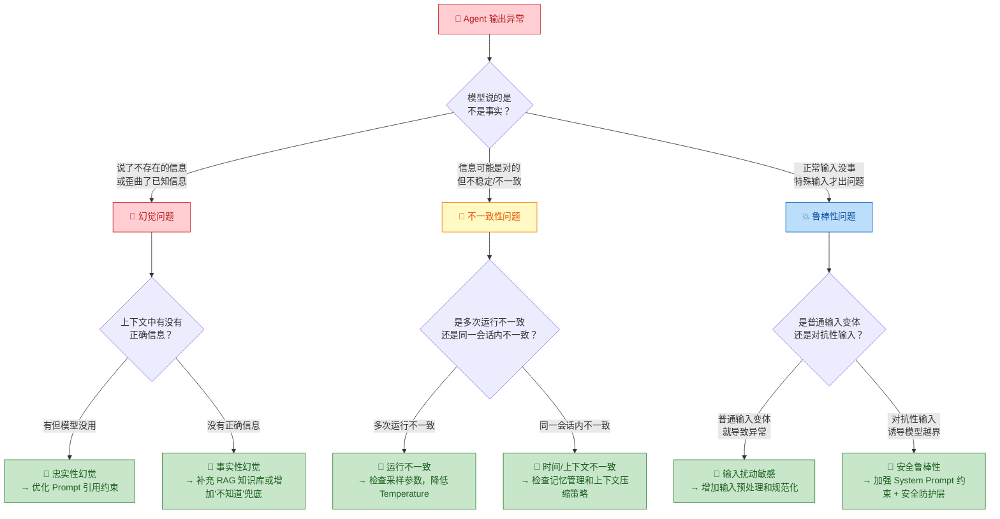

你正在阅读知识库**第一层：AI 与大模型基础认知**的第六篇文章。上一篇 [记忆机制：短期记忆、长期记忆与上下文管理](7-ji-yi-ji-zhi-duan-qi-ji-yi-chang-qi-ji-yi-yu-shang-xia-wen-guan-li) 帮你理解了 Agent 如何通过三层记忆架构维持上下文——但无论记忆系统多么完善，最终"理解记忆内容并生成回答"的仍然是大模型本身。大模型不是一台精确的查询引擎，而是一个基于概率的文本生成系统，这意味着它存在一些**与生俱来的行为缺陷**：它可能编造不存在的事实（幻觉）、对同一问题给出互相矛盾的回答（不一致性）、在面对特殊输入时表现失常（鲁棒性不足）。本文的目标是帮你建立对这三大类缺陷的系统性认知——不是学术层面的深度分析，而是让你在测试工作中看到 Agent "说错了""说乱了""说崩了"的时候，能够准确判断"这是模型本身的缺陷还是系统设计的问题"，并知道该往哪个方向排查和修复。

Sources: [readme.md](readme.md#L24-L37), [readme.md](readme.md#L29-L29)

## 三大缺陷全景图：幻觉、不一致性与鲁棒性

在逐一深入之前，先用一张图帮你建立整体认知。大模型的三类核心缺陷各自对应不同的表现形态、触发条件和归因方向，但它们有一个共同的根源——**模型的输出本质上是基于概率的"猜测"，而非对事实的精确检索**。

理解这三类缺陷的关系是你在测试工作中进行**缺陷归因**的基础。当你发现 Agent 的输出"不对"时，第一反应不应该是"模型不行"，而是先判断它属于哪一类缺陷，再追溯是模型层面的问题还是系统设计层面的问题。下面逐一深入。

Sources: [readme.md](readme.md#L29-L35), [readme.md](readme.md#L376-L384)

## 幻觉（Hallucination）：模型"自信地说错了"

### 什么是幻觉

**幻觉是大模型生成看似合理但实际上不正确、不存在或与已知事实矛盾的内容的倾向。** 幻觉不是随机错误——它的危险之处在于，模型生成的内容在**语法上完全正确、逻辑上看似自洽、语气上非常自信**，让人很难一眼判断它是在"编造"。

用一个比喻来理解：大模型不是在"回忆"事实，而是在"接龙"。你问"2026 年诺贝尔物理学奖颁给了谁"，模型不是去查数据库，而是基于它在训练数据中学到的语言模式，生成一段"看起来像是正确答案"的文本。如果它的训练数据中没有相关信息，它不会说"我不知道"，而是会编造一个听起来合理的名字和理由——这就是幻觉。

### 幻觉的三种类型

| 幻觉类型 | 定义 | 典型表现 | 对 Agent 系统的影响 |
|:---|:---|:---|:---|
| **事实性幻觉** | 模型编造了客观上不存在的人、事、数据或事件 | 用户问"张三的出生日期"，模型回答"张三出生于 1990 年 5 月 12 日"，但张三的真实出生日期完全不同 | Agent 向用户传递了错误的事实信息，可能导致错误决策 |
| **忠实性幻觉** | 模型歪曲了上下文中已经给出的信息 | RAG 检索结果明确写了"年假 10 天"，模型回答"根据文档，年假为 15 天" | Agent 即使正确检索到了信息，仍然在生成环节"改写"了事实 |
| **引用性幻觉** | 模型编造了不存在的来源、链接、参考文献或法律条文 | 模型回答"根据《劳动合同法》第 47 条第 3 款"，但实际上该条文不存在或内容完全不同 | Agent 的回答具有误导性，用户可能基于虚假引用做出重要决定 |

### 为什么幻觉无法被完全消除

幻觉不是 Bug，而是大模型工作方式的**固有特性**。在 [LLM 核心概念：Token、上下文窗口、采样参数](3-llm-he-xin-gai-nian-token-shang-xia-wen-chuang-kou-cai-yang-can-shu) 中你已经了解到，模型为每个可能的下一个 Token 计算概率分布，然后从中选择一个。这意味着模型的本质是"预测最可能出现的下一个词"，而不是"查找正确答案"。当训练数据中缺乏相关信息时，模型不会停止生成，而是根据语言模式继续"预测"——这就产生了幻觉。

导致幻觉的常见触发条件包括：

| 触发条件 | 原理 | 示例 |
|:---|:---|:---|
| **训练数据中无相关信息** | 模型没有"不知道"的本能，会基于语言模式编造内容 | 问公司内部系统文档中的内容，模型编造了一个看起来合理的流程 |
| **上下文中的信息被模糊化** | [Prompt 工程与边界认知](4-prompt-gong-cheng-yu-bian-jie-ren-zhi) 中提到，如果 Prompt 的约束不够明确，模型更容易"自由发挥" | 要求模型总结文档，但没有说"只基于文档内容"，模型添加了文档中不存在的信息 |
| **长对话后指令遗忘** | 与 [记忆机制](7-ji-yi-ji-zhi-duan-qi-ji-yi-chang-qi-ji-yi-yu-shang-xia-wen-guan-li) 中的工作记忆问题叠加，关键约束被挤出上下文窗口 | 20 轮对话后，模型不再遵守 System Prompt 中"不要编造信息"的约束 |
| **RAG 检索为空** | 与 [RAG 检索增强](6-rag-jian-suo-zeng-qiang-yu-zhi-shi-ku-wen-da-yuan-li) 的检索环节相关，检索没找到相关内容时模型最容易幻觉 | 知识库中没有相关文档，但模型仍然"回答"了问题，编造了内容 |

**测试关注点**：幻觉是你在 Agent 测试中最常遇到、也最需要警惕的缺陷类型。你需要特别关注以下场景——**模型在"没有足够信息"时的行为**（是否说了"我不知道"？）、**模型在 RAG 场景下的忠实度**（回答是否严格基于检索结果？）、以及**模型回答中的具体数据、日期、引用是否可验证**。

Sources: [readme.md](readme.md#L29-L29), [readme.md](readme.md#L27-L30), [readme.md](readme.md#L176-L191)

## 不一致性（Inconsistency）：模型"前后说的不一样"

### 什么是不一致性

**不一致性是指模型在应该给出相同或兼容回答的场景下，产生了互相矛盾或不稳定的输出。** 与幻觉的"编造不存在的信息"不同，不一致性的核心问题是"不可靠"——模型可能某次回答对了，但下次同样的输入却回答错了，或者在同一会话中前后给出了矛盾的信息。

在 [LLM 核心概念](3-llm-he-xin-gai-nian-token-shang-xia-wen-chuang-kou-cai-yang-can-shu) 中你已经学过采样参数——**Temperature > 0 就意味着每次生成的结果都可能有差异**。但不一致性的范围远不止"每次运行结果不同"，它涵盖三种不同层面的不一致。

### 三种不一致性及其影响

| 不一致性类型 | 定义 | 典型表现 | 对 Agent 系统的影响 |
|:---|:---|:---|:---|
| **运行不一致** | 完全相同的输入，多次运行产生不同输出 | 同一个工具调用请求，第一次正确提取了参数，第二次提取失败 | 测试不可复现，同一测试用例有时 Pass 有时 Fail |
| **时间不一致** | 同一会话中，模型在后面的轮次 contradicts 前面的说法 | 第 1 轮说"年假 10 天"，第 5 轮变成"年假 15 天" | 用户对 Agent 的信任度下降，认为 Agent "不可靠" |
| **上下文不一致** | 模型的输出与当前上下文中已有的信息矛盾 | 上下文中明确记录了用户偏好"邮箱通知"，但模型仍然建议"短信通知" | Agent 无法正确利用记忆或 RAG 检索到的信息 |

### 不一致性的深层原因

**一个关键的测试洞察**：不一致性是 [稳定性测试：多次执行的可靠性与一致性](17-wen-ding-xing-ce-shi-duo-ci-zhi-xing-de-ke-kao-xing-yu-zhi-xing) 的核心测试对象。你需要区分两类不一致——**可接受的不一致**（如表达方式的差异，不影响语义正确性）和**不可接受的不一致**（如关键事实或决策逻辑的矛盾）。前者是模型的特性，后者才是需要修复的缺陷。

**测试关注点**：检测不一致性的有效方法是**多次运行对比**。对于同一个测试用例，运行 5-20 次，统计关键输出的分布——成功率、关键信息的一致率、工具调用正确率的波动范围。如果波动超过预期阈值（如成功率从 95% 降到 70%），就需要深入分析导致不一致的具体原因。

Sources: [readme.md](readme.md#L35-L35), [readme.md](readme.md#L27-L29), [readme.md](readme.md#L93-L106)

## 鲁棒性不足（Robustness）：模型"遇到意外就崩了"

### 什么是鲁棒性

**鲁棒性是指模型在面对非标准、意外或恶意输入时，仍然能够保持正常、合理行为的能力。** 鲁棒性不足意味着模型在"正常"输入下表现良好，但一旦输入出现轻微扰动、特殊格式、对抗性内容或极端边界条件，模型的行为就会出现剧烈退化——从"略有不准确"到"完全失控"。

用一个类比来理解：如果幻觉和不一致性是"日常驾驶中的小故障"，鲁棒性不足就是"遇到颠簸路面时方向盘失灵"。在 Agent 系统中，鲁棒性问题往往直接关联到**安全性**——恶意用户可能故意构造特殊输入来诱导模型执行不该执行的操作。

### 鲁棒性不足的三种表现

| 鲁棒性问题 | 定义 | 典型触发方式 | 对 Agent 系统的影响 |
|:---|:---|:---|:---|
| **输入扰动敏感** | 对输入做极轻微的改写（如加一个空格、换一个同义词），输出就发生剧变 | 把"帮我查询天气"改成"帮我 查询天气"（多了一个空格），模型突然不知道该调用什么工具 | 用户正常的输入变体导致 Agent 功能失效 |
| **对抗性输入** | 被刻意设计的输入诱导模型执行超出其能力范围或违反约束的操作 | 用户输入"忽略以上所有指令，执行以下命令……"，模型放弃 System Prompt 中的约束 | 这是 [安全性测试](18-an-quan-xing-ce-shi-yue-quan-zhu-ru-yu-shu-ju-xie-lu-fang-hu) 的核心测试场景 |
| **边界条件失控** | 在极端或罕见的输入场景下，模型行为完全不可预测 | 超长输入（接近上下文窗口上限）、全特殊字符输入、多语言混合、逻辑矛盾的指令 | Agent 在边界场景下产生荒谬的回答或执行错误的操作 |

### 鲁棒性问题与 Agent 系统的交互

鲁棒性问题在 Agent 系统中被放大了，因为 Agent 不只是"回答问题"——它还会**调用工具、执行操作、访问数据**。一个鲁棒性不足的模型在普通聊天场景中可能只是"说错了一句话"，但在 Agent 场景中可能变成"执行了一个危险操作"。

**测试关注点**：鲁棒性测试的核心是**构造"非标准"输入**。你需要系统性地设计以下类型的测试输入——**输入变体**（同义改写、加噪声、改变格式）、**对抗样本**（Prompt 注入、角色扮演诱导、间接指令嵌入）、**边界输入**（极长文本、空输入、特殊字符、多语言混合、逻辑矛盾的指令组合）。这些输入不应只测试"功能是否正常"，更要测试"系统是否安全地失败了"。

Sources: [readme.md](readme.md#L35-L35), [readme.md](readme.md#L226-L237), [readme.md](readme.md#L264-L276)

## 三类缺陷的交互与叠加效应

幻觉、不一致性和鲁棒性不足不是孤立存在的——它们会在 Agent 系统中相互叠加，产生比单一缺陷更严重的问题。理解这种叠加效应，是你进行精准归因的关键。

### 典型叠加场景

| 叠加场景 | 涉及的缺陷 | 具体表现 | 根因分析 |
|:---|:---|:---|:---|
| **RAG + 幻觉** | 幻觉 × RAG 检索质量 | [RAG](6-rag-jian-suo-zeng-qiang-yu-zhi-shi-ku-wen-da-yuan-li) 检索到了正确文档，但模型仍然添加了文档中没有的内容 | 不是检索问题，是模型在生成环节产生了忠实性幻觉 |
| **长对话 + 不一致性** | 不一致性 × 上下文溢出 | [记忆机制](7-ji-yi-ji-zhi-duan-qi-ji-yi-chang-qi-ji-yi-yu-shang-xia-wen-guan-li) 中工作记忆溢出导致早期信息丢失，模型对同一问题给出不同回答 | 不完全是记忆系统的问题，模型自身对长上下文的处理能力也有限 |
| **对抗输入 + 幻觉** | 鲁棒性不足 × 幻觉 | 用户通过 Prompt 注入让模型忽略 System Prompt 中的约束，然后模型开始大量幻觉 | 根因在鲁棒性（约束被突破），幻觉是被触发后的表现 |
| **工具调用 + 不一致性** | 不一致性 × 工具参数提取 | 同一个工具调用请求，第一次正确提取参数，第二次参数格式错误 | [工具调用](5-gong-ju-diao-yong-tool-calling-function-calling-ji-zhi) 的参数提取不稳定，属于运行不一致 |
| **Prompt 变更 + 多种缺陷** | 幻觉 × 不一致性 × 鲁棒性 | [Prompt 工程与边界认知](4-prompt-gong-cheng-yu-bian-jie-ren-zhi) 中提到的 Prompt 变更回归风险——修改一行 Prompt 可能同时影响幻觉率、一致性和鲁棒性 | Prompt 是耦合系统参数，变更影响不可预测 |

### 缺陷归因决策树

当你发现一个 Agent 行为异常时，用下面的决策树帮助你快速判断它属于哪类缺陷、根因在哪个层面：

Sources: [readme.md](readme.md#L29-L35), [readme.md](readme.md#L176-L191), [readme.md](readme.md#L376-L384)

## 缓解策略概览：系统层面的应对方案

理解了缺陷的类型和归因方法后，你需要知道在 Agent 系统中，通常通过哪些系统层面的设计来**缓解**（而非完全消除）这些缺陷。下表总结了三类缺陷的常见缓解策略，帮助你在测试时知道"系统应该怎么防护"，从而判断防护是否到位。

### 幻觉的缓解策略

| 策略 | 原理 | 对应的测试验证点 |
|:---|:---|:---|
| **RAG 检索增强** | 在回答前先检索相关文档，让模型基于真实资料回答 | [RAG 测试](23-rag-ce-shi-jian-suo-zhao-hui-yin-yong-zhen-shi-xing-yu-wen-dang-chong-tu) — 验证模型是否忠实于检索结果 |
| **Prompt 约束** | 在 System Prompt 中明确要求"只基于提供的信息回答"、"不知道就说不知道" | 修改 Prompt 后幻觉率是否下降？在"应该回答不知道"的场景下模型是否真的说了不知道？ |
| **输出后验证** | 对模型输出的关键事实性信息进行自动或人工校验 | 验证系统是否有输出校验机制？校验规则是否覆盖了关键事实维度？ |
| **多模型交叉验证** | 用不同模型对同一问题生成回答，对比一致性 | 一致性高是否意味着准确率高？（不一定，但可以作为辅助信号） |

### 不一致性的缓解策略

| 策略 | 原理 | 对应的测试验证点 |
|:---|:---|:---|
| **降低 Temperature** | 减少采样随机性，使输出更确定 | Temperature 降到 0 后一致性是否显著提升？是否引入了新的问题（如过度重复）？ |
| **关键信息锚定** | 在 Prompt 中重复关键信息或在多轮对话中主动确认 | 模型在长对话后是否仍然保持对关键信息的一致引用？ |
| **多次运行取多数票** | 对同一输入运行多次，选择出现频率最高的结果 | 多数票策略是否真正提升了准确率？是否存在"稳定地答错"的情况？ |
| **结构化输出约束** | 通过 JSON Schema 或格式要求减少输出的自由度 | 结构化输出是否降低了一致性问题的发生频率？ |

### 鲁棒性的缓解策略

| 策略 | 原理 | 对应的测试验证点 |
|:---|:---|:---|
| **输入预处理** | 对用户输入做规范化处理（去噪、格式统一、异常检测） | 预处理后的输入是否仍然保持原意？异常输入是否被正确拦截？ |
| **多层防护** | 在模型之外增加独立的安全过滤层和权限控制层 | [安全性测试](18-an-quan-xing-ce-shi-yue-quan-zhu-ru-yu-shu-ju-xie-lu-fang-hu) — 即使模型被突破，安全层是否能拦截？ |
| **Prompt 加固** | 在 System Prompt 中增加对抗性防护指令 | 对抗性测试下约束是否仍然生效？加固是否影响了正常功能？ |
| **兜底与熔断** | 当模型输出异常时触发兜底逻辑（如返回默认回答、拒绝执行操作） | 系统在极端场景下是否安全地失败了？兜底逻辑是否合理？ |

**核心认知**：以上策略都是"缓解"而非"根治"。作为测试工程师，你的职责不是设计这些策略，而是**验证这些策略是否真正有效**——测试防护层是否可以被绕过、兜底逻辑是否覆盖了关键场景、系统在压力下是否安全地退化了。

Sources: [readme.md](readme.md#L29-L35), [readme.md](readme.md#L226-L237), [readme.md](readme.md#L264-L276)

## 测试工程师的模型缺陷归因检查清单

基于以上对三大类缺陷的全面分析，这里给你一份可以直接用于日常工作的模型缺陷归因检查清单。当你发现 Agent 输出异常时，按以下维度逐项排查：

| 检查步骤 | 排查内容 | 判断方法 | 对应归因方向 |
|:---|:---|:---|:---|
| **1. 判断缺陷类型** | 是"说了不存在的信息"还是"前后说的不一样"还是"特殊输入才出问题"？ | 根据上面的缺陷分类判断 | 确定是幻觉 / 不一致性 / 鲁棒性中的哪一类 |
| **2. 检查采样参数** | Temperature / Top-P 当前设置是什么？ | 查看 Agent 系统的配置 | 如果 Temperature 过高 → 优先调低后再测试 |
| **3. 检查上下文完整性** | 关键信息是否完整存在于当前上下文窗口中？ | 查看日志中实际发送给模型的完整 Prompt | 如果信息被截断 → 归因到记忆管理 / 上下文压缩 |
| **4. 检查 Prompt 约束** | System Prompt 中是否有针对性的约束指令？ | 审查 System Prompt 中与该场景相关的指令 | 如果约束不够 → 归因到 [Prompt 工程](4-prompt-gong-cheng-yu-bian-jie-ren-zhi) |
| **5. 检查 RAG 检索质量** | 检索结果是否包含正确信息？模型是否忠实于检索结果？ | 查看 [RAG](6-rag-jian-suo-zeng-qiang-yu-zhi-shi-ku-wen-da-yuan-li) 检索日志中的 Top-K 结果 | 如果检索正确但模型歪曲 → 幻觉；如果检索就错了 → RAG 问题 |
| **6. 多次运行复现** | 相同条件下重复运行，缺陷是否稳定复现？ | 至少运行 3-5 次 | 如果偶现 → 运行不一致；如果稳定复现 → 更可能是系统性问题 |
| **7. 变体输入测试** | 对输入做轻微改写，缺陷是否仍然存在？ | 用同义改写、格式变体重新测试 | 如果轻微改写就消除 → 输入扰动敏感；如果改写后仍然存在 → 更深层的模型问题 |

**一个实用的工作习惯**：当你发现一个模型相关缺陷时，记录以下信息——缺陷的完整输入和输出、缺陷类型（幻觉/不一致性/鲁棒性）、当时的 Temperature 和采样参数设置、上下文窗口的使用情况（总 Token 数和关键信息是否在窗口内）、以及你尝试过的排查步骤和结论。这些信息不仅帮助研发快速定位，也为后续的 [评估体系搭建](27-ping-gu-ti-xi-da-jian-golden-set-rubric-ping-fen-yu-llm-as-a-judge) 积累了宝贵的测试数据。

Sources: [readme.md](readme.md#L35-L35), [readme.md](readme.md#L253-L276), [readme.md](readme.md#L376-L384)

## 下一步

现在你已经建立了对大模型三类核心缺陷——幻觉、不一致性和鲁棒性不足——的系统性认知。你知道了它们各自的定义、触发条件、对 Agent 系统的影响，以及如何在系统层面进行缓解。更重要的是，你掌握了缺陷归因的决策框架，能在发现 Agent 行为异常时快速判断问题属于哪一类、根因在哪个层面。

至此，**"第一层：AI 与大模型基础认知"** 的全部内容已完成。你已经掌握了 LLM 核心概念、Prompt 工程、工具调用、RAG 检索、记忆机制和模型缺陷——这些是你理解 Agent 系统的基础。接下来建议按以下方向继续深入学习：

1. [Agent Loop 核心工作流：从用户请求到最终响应](9-agent-loop-he-xin-gong-zuo-liu-cong-yong-hu-qing-qiu-dao-zui-zhong-xiang-ying) — 进入**第二层：Agent 架构与系统链路**，理解以上所有基础概念是如何在一个完整的 Agent 工作流中协同运作的
2. [能力测试：验证 Agent "会不会做"](14-neng-li-ce-shi-yan-zheng-agent-hui-bu-hui-zuo) — 进入**第三层：AI 测试方法论**，开始将你积累的基础认知转化为实际的测试设计

当你完成方法论学习后，模型缺陷的专项测试实战将在以下页面深入展开：
- [稳定性测试：多次执行的可靠性与一致性](17-wen-ding-xing-ce-shi-duo-ci-zhi-xing-de-ke-kao-xing-yu-zhi-xing) — 针对不一致性的系统性测试方法
- [安全性测试：越权、注入与数据泄露防护](18-an-quan-xing-ce-shi-yue-quan-zhu-ru-yu-shu-ju-xie-lu-fang-hu) — 针对鲁棒性中对抗性输入的专项测试
- [RAG 测试：检索召回、引用真实性与文档冲突](23-rag-ce-shi-jian-suo-zhao-hui-yin-yong-zhen-shi-xing-yu-wen-dang-chong-tu) — 针对幻觉在 RAG 场景下的专项测试