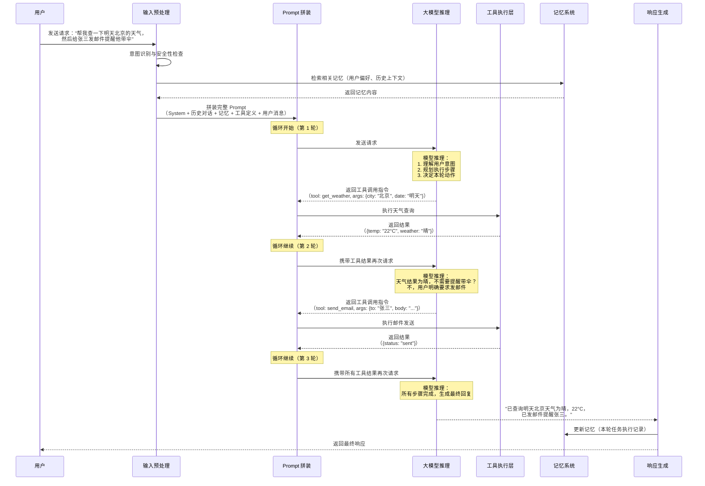
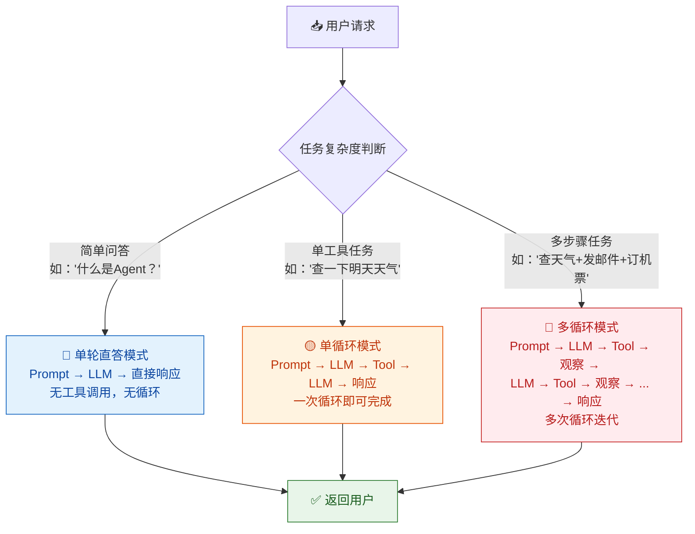
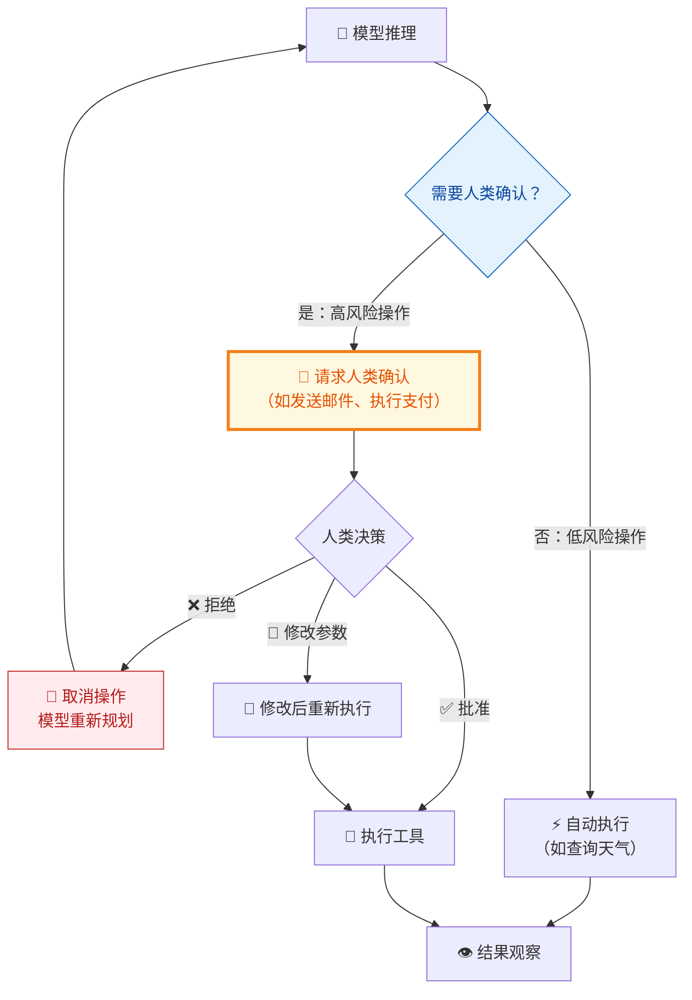
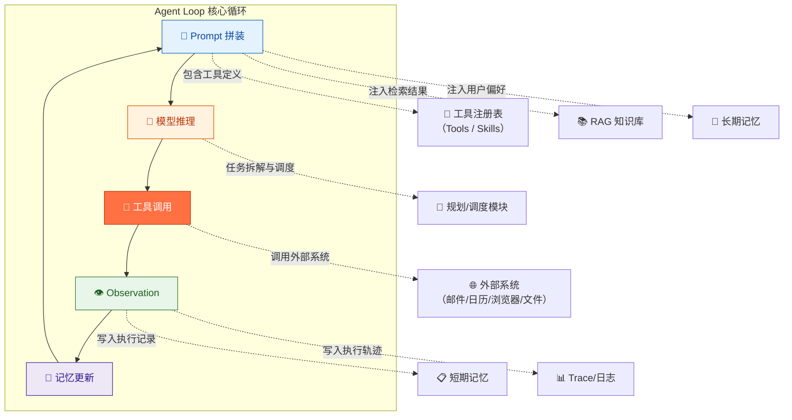
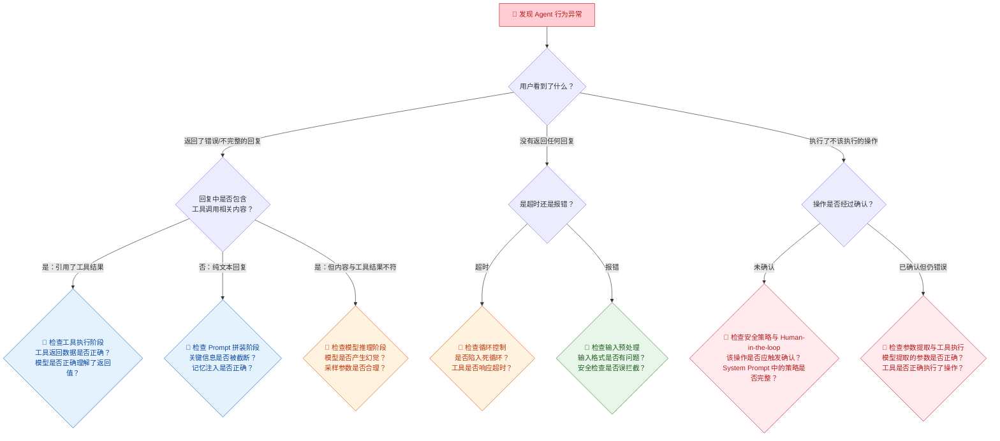

你正在阅读知识库**第二层：Agent 架构与系统链路**的第一篇文章。在第一层的学习中，你已经分别理解了大模型的推理机制（[LLM 核心概念](3-llm-he-xin-gai-nian-token-shang-xia-wen-chuang-kou-cai-yang-can-shu)）、指令语言（[Prompt 工程与边界认知](4-prompt-gong-cheng-yu-bian-jie-ren-zhi)）、行动能力（[工具调用机制](5-gong-ju-diao-yong-tool-calling-function-calling-ji-zhi)）、知识获取路径（[RAG 检索增强](6-rag-jian-suo-zeng-qiang-yu-zhi-shi-ku-wen-da-yuan-li)）、状态维持机制（[记忆机制](7-ji-yi-ji-zhi-duan-qi-ji-yi-chang-qi-ji-yi-yu-shang-xia-wen-guan-li)）以及模型的固有缺陷（[模型常见缺陷](8-mo-xing-chang-jian-que-xian-huan-jue-bu-zhi-xing-yu-lu-bang-xing-wen-ti)）。但以上所有模块是独立运作的吗？显然不是——它们被一条完整的执行链路串联在一起，这条链路就是 **Agent Loop**。本文的目标是帮你建立这条链路的全局认知，让你看到一次用户请求如何经过 Prompt 拼装、模型推理、工具选择、工具执行、结果观察、记忆更新，最终变成一个用户可见的响应。

Sources: [readme.md](readme.md#L40-L63), [readme.md](readme.md#L386-L393)

## Agent Loop 是什么：从一个比喻开始

在深入技术细节之前，先用一个直观的比喻建立直觉。想象你是一个项目经理（Agent），你的工作方式是这样的：收到老板（用户）的任务指令后，你会先思考这个任务要怎么做（**规划**）；如果发现需要其他部门配合，你就发邮件给他们（**工具调用**）；收到回复后，你判断任务是否完成了（**观察**）；如果没完成，你继续思考下一步（**循环**）；如果完成了，你就向老板汇报（**最终响应**）。整个过程中，你会记笔记（**记忆更新**），也会查阅公司文档（**RAG 检索**）。

**Agent Loop 就是这个"思考 → 行动 → 观察 → 再思考"的循环过程。** 它不是一个固定的程序流程，而是一个由大模型驱动的动态决策循环。每一次循环，模型都会根据当前上下文做出判断：是直接回答用户，还是调用某个工具，还是需要多步骤执行——这个判断过程是实时的、上下文相关的，而非预编程的。

Sources: [readme.md](readme.md#L44-L50), [readme.md](readme.md#L386-L388)

## Agent Loop 完整工作流全景图

下面这张图展示了一次完整的 Agent Loop 执行过程，从用户发出请求到 Agent 返回最终响应。这是你在后续测试工作中最核心的参考架构——理解了这张图，你就理解了 Agent 系统中"哪里可能出错"以及"错误属于哪个模块"。

这张图揭示了一个关键事实：**Agent Loop 不是一次 API 调用，而是一个可能多次迭代的循环。** 用户看到的是一个简单的"输入 → 输出"，但系统内部可能经历了多轮"模型推理 → 工具调用 → 结果观察 → 再次推理"的循环。循环的次数取决于任务的复杂度和模型的规划能力——简单问答可能只需一轮，多步骤任务可能需要三到五轮，极端情况下甚至可能陷入死循环（这正是你需要测试的场景之一）。

Sources: [readme.md](readme.md#L44-L50), [readme.md](readme.md#L140-L158)

## 六阶段拆解：从输入到输出的完整链路

将上面的全景图进一步拆解，Agent Loop 的每一次执行可以被分为六个阶段。每个阶段有独立的职责、独立的输入输出，也有独立的失败模式。理解这六个阶段的边界，是你后续做缺陷归因的基础：

```mermaid
flowchart LR
    subgraph "阶段一：输入预处理"
        I1["📥 接收用户请求"] --> I2["🔍 意图识别"]
        I2 --> I3["🛡️ 安全性检查"]
        I3 --> I4["📎 多模态解析"]
    end

    subgraph "阶段二：Prompt 拼装"
        P1["📋 收集上下文组件"] --> P2["🧠 注入记忆"]
        P2 --> P3["📚 注入 RAG 检索结果"]
        P3 --> P4["🔧 注入工具定义"]
        P4 --> P5["🗜️ 上下文压缩与截断"]
    end

    subgraph "阶段三：模型推理"
        L1["🤖 LLM 推理"] --> L2{"输出类型判断"}
        L2 -->|"工具调用"| L3["🔧 返回 Tool Call"]
        L2 -->|"直接回复"| L4["💬 返回文本"]
        L2 -->|"需要追问"| L5["❓ 返回 Clarification"]
    end

    subgraph "阶段四：工具执行"
        T1["⚙️ 工具路由"] --> T2["🏁 参数校验"]
        T2 --> T3["📤 执行调用"]
        T3 --> T4["📥 结果标准化"]
    end

    subgraph "阶段五：结果观察"
        O1["👁️ 解析工具结果"] --> O2["📝 写入上下文"]
        O2 --> O3["💾 触发记忆更新"]
        O3 --> O4["🔄 决定是否继续循环"]
    end

    subgraph "阶段六：响应生成"
        R1["✍️ 生成最终回复"] --> R2["🎨 格式化输出"]
        R2 --> R3["📤 返回给用户"]
    end

    I4 --> P1
    P5 --> L1
    L3 --> T1
    T4 --> O1
    L4 --> R1
    L5 --> R1
    O4 -->|"继续循环"| P1

    style I3 fill:#FFCDD2,stroke:#C62828,color:#B71C1C
    style P5 fill:#FFF3E0,stroke:#E65100,color:#BF360C
    style L2 fill:#E3F2FD,stroke:#1565C0,color:#0D47A1
    style T2 fill:#FFF8E1,stroke:#F57F17,color:#E65100
    style O4 fill:#E8F5E9,stroke:#2E7D32,color:#1B5E20
    style R3 fill:#EDE7F6,stroke:#4527A0,color:#311B92
```

下面逐一展开每个阶段的内部机制和测试关注点。

Sources: [readme.md](readme.md#L44-L50), [readme.md](readme.md#L386-L393)

### 阶段一：输入预处理——用户请求的"第一道关卡"

用户发送的原始请求在进入 Agent Loop 核心循环之前，需要经过预处理。这个阶段的主要职责是**将原始输入转化为系统可以理解和处理的结构化信息**。

**意图识别**：Agent 需要判断用户请求的性质——是闲聊、信息查询、任务执行、还是指令修改。不同的意图会触发不同的处理路径：闲聊可能直接由模型回答而不进入工具调用循环；任务执行则需要进入完整的 Agent Loop；指令修改可能触发记忆更新。意图识别的错误会导致整个后续链路走偏。

**安全性检查**：这是 Agent 系统的第一道防线，负责检测是否包含 [Prompt 注入](18-an-quan-xing-ce-shi-yue-quan-zhu-ru-yu-shu-ju-xie-lu-fang-hu)、恶意指令、越权请求等安全威胁。安全检查可以发生在多个层级——输入层、模型推理层、工具执行层——但输入预处理层是最前置的拦截点。

**多模态解析**：如果用户发送的不只是文本（还包括图片、文件、语音等），Agent 需要将这些内容解析为模型可理解的格式。例如，用户上传了一张截图并说"帮我把这张图里的表格整理成 Excel"，Agent 需要先完成图像识别，提取表格内容，再进入后续的任务规划和工具调用流程。

| 预处理环节 | 职责 | 常见失败 | 影响范围 |
|:---|:---|:---|:---|
| **意图识别** | 判断请求类型（闲聊/查询/任务/指令修改） | 将任务执行请求误判为闲聊，跳过工具调用 | 后续整个链路不会触发 |
| **安全性检查** | 检测 Prompt 注入、恶意指令、越权请求 | 漏过恶意请求或误拦截正常请求 | 安全事故或用户体验受损 |
| **多模态解析** | 将图片/文件/语音转化为文本或结构化数据 | 文件编码错误、图像识别不准确 | 后续所有基于输入的推理都可能出错 |
| **语言/格式标准化** | 统一输入的编码、语言标记、格式 | 错别字未处理、混合语言未识别 | 模型理解偏差 |

Sources: [readme.md](readme.md#L226-L237), [readme.md](readme.md#L44-L50)

### 阶段二：Prompt 拼装——将所有信息组装成模型的"输入材料"

Prompt 拼装是 Agent Loop 中**工程复杂度最高的环节之一**。它需要将来自多个来源的信息整合为一个完整的、符合模型 API 格式要求的请求体。在 [Prompt 工程与边界认知](4-prompt-gong-cheng-yu-bian-jie-ren-zhi) 中你已经了解了 Prompt 的基本结构，在 Agent 系统中，Prompt 的组成部分更加复杂：

| Prompt 组成部分 | 内容来源 | 在 Agent Loop 中的作用 |
|:---|:---|:---|
| **System Prompt** | 固定的角色定义、行为约束、安全策略 | 定义 Agent 的身份和行为边界 |
| **历史对话轮次** | 当前会话中之前的用户输入和模型回复 | 提供多轮上下文，维持对话连贯性 |
| **工具调用记录** | 之前循环中已执行的工具调用及返回结果 | 让模型知道"已经做了什么"、"结果是什么" |
| **工具定义** | 当前 Agent 可用的全部工具的 JSON Schema | 告诉模型"有哪些工具可用"、"每个工具怎么用" |
| **记忆注入** | 从 [记忆机制](7-ji-yi-ji-zhi-duan-qi-ji-yi-chang-qi-ji-yi-yu-shang-xia-wen-guan-li) 中检索到的用户偏好和历史摘要 | 提供个性化上下文 |
| **RAG 检索结果** | 从 [RAG 系统](6-rag-jian-suo-zeng-qiang-yu-zhi-shi-ku-wen-da-yuan-li) 中检索到的外部知识片段 | 补充模型自身的知识盲区 |
| **当前用户消息** | 用户本轮的原始输入 | 触发本轮推理的核心信号 |

**上下文压缩的挑战**：以上所有组成部分共享一个硬约束——**上下文窗口的容量上限**（在 [LLM 核心概念](3-llm-he-xin-gai-nian-token-shang-xia-wen-chuang-kou-cai-yang-can-shu) 中已详细介绍）。当信息总量超过窗口上限时，Agent 必须做出取舍：截断早期对话、压缩工具结果、减少 RAG 检索条数，甚至压缩 System Prompt。**每一次取舍都可能丢失关键信息**，这正是 Agent Loop 中最隐蔽的缺陷来源之一。

**拼装顺序的工程意义**：在典型的实现中，Prompt 的拼装遵循优先级顺序——System Prompt 优先保留（包含核心行为约束），然后是当前用户消息和最近的工具调用记录，历史对话和 RAG 检索结果最先被压缩或截断。这意味着当上下文窗口紧张时，Agent 最可能丢失的是"远期对话内容"和"部分知识库信息"。

Sources: [readme.md](readme.md#L27-L37), [readme.md](readme.md#L43-L50)

### 阶段三：模型推理——Agent 的"大脑决策"

拼装好的 Prompt 被发送给大模型后，模型需要完成一次或多次推理。这是 Agent Loop 的核心决策环节，模型的输出决定了循环的走向。

**模型的三种输出类型**决定了 Agent Loop 的下一步动作：

| 输出类型 | 含义 | Agent Loop 的动作 |
|:---|:---|:---|
| **工具调用指令（Tool Call）** | 模型判断需要调用某个外部工具来完成任务 | 进入阶段四（工具执行），然后回到阶段二继续循环 |
| **直接文本回复（Text Response）** | 模型判断当前信息已经足够，可以直接回答用户 | 跳到阶段六（响应生成），循环结束 |
| **追问/澄清（Clarification）** | 模型判断当前信息不足以完成任务，需要用户补充 | 生成追问消息返回用户，等待用户补充后重新进入循环 |

**规划能力的关键性**：当用户的请求涉及多个步骤时（如"查天气 + 发邮件"），模型需要在本阶段完成**任务规划**——决定第一步做什么、第二步做什么、步骤之间是否有依赖关系。正如在 [工具调用机制](5-gong-ju-diao-yong-tool-calling-function-calling-ji-zhi) 中分析的，多工具编排涉及串行调用、并行调用和条件调用三种模式，模型需要正确判断并执行这些模式。规划能力的强弱直接决定了 Agent 能否完成复杂任务，也决定了它是否会在中间步骤"迷路"。

**采样参数的影响**：在 [LLM 核心概念](3-llm-he-xin-gai-nian-token-shang-xia-wen-chuang-kou-cai-yang-can-shu) 中你已经了解了 Temperature 等参数对输出的影响。在 Agent Loop 的推理阶段，Temperature 的设置尤为关键——过高的 Temperature 可能导致模型在工具选择和参数提取上产生不确定性，同一请求在多次执行中产生不同的工具调用路径，这正是稳定性测试需要关注的核心问题。

Sources: [readme.md](readme.md#L44-L50), [readme.md](readme.md#L386-L393)

### 阶段四：工具执行——从"决策"到"行动"

当模型返回工具调用指令后，Agent 系统需要将这个"决策"转化为实际的"行动"。这个阶段涉及工具路由、参数校验、实际调用和结果标准化四个子步骤。

**工具路由**：Agent 系统根据模型返回的工具名称，将请求分发到对应的工具执行器。在一个拥有数十个工具的 Agent 系统中（如 ArkClaw / OpenClaw 拥有浏览器操作、文件处理、邮件发送、日历管理等多种能力），工具路由的准确性直接影响执行结果。如果模型返回了一个不存在的工具名称，或者工具名称发生了版本更新，路由就会失败。

**参数校验**：在将参数传递给工具之前，Agent 系统通常会对模型提取的参数进行校验——检查必填参数是否齐全、参数类型是否正确、参数值是否在合法范围内。这个环节是**防止模型"编造"参数导致工具执行异常**的重要屏障。例如，模型可能将"明天"作为日期参数直接传递，但工具期望的是 ISO 格式的具体日期，参数校验层可以捕获并修正这类问题。

**执行与超时控制**：工具的实际执行可能涉及外部 API 调用、数据库查询、文件操作等，这些操作都可能因网络延迟、服务不可用等原因而超时或失败。Agent 系统需要为每个工具调用设置超时阈值和重试策略。当工具执行失败时，结果会携带错误信息返回给模型，模型需要据此判断是重试、换一个替代方案、还是告知用户操作失败。

Sources: [readme.md](readme.md#L140-L158), [readme.md](readme.md#L216-L224)

### 阶段五：结果观察——循环的"检查点"

工具执行完成后，返回结果被送回 Agent 系统。这个阶段决定了循环是继续还是终止——它是 Agent Loop 的"检查点"。

**结果写入上下文**：工具返回的结果被格式化后追加到当前对话的上下文中，成为下一轮模型推理的输入。这意味着**每一轮循环，上下文都在增长**——多轮工具调用的结果累积起来可能占用大量 Token 空间，最终触发上下文压缩或截断。

**记忆更新触发**：根据本轮执行的结果，Agent 可能触发 [记忆机制](7-ji-yi-ji-zhi-duan-qi-ji-yi-chang-qi-ji-yi-yu-shang-xia-wen-guan-li) 的更新——将新发现的用户偏好写入长期记忆，更新短期记忆中的任务进度，或者记录执行失败的教训以避免重复犯错。记忆更新的时机和内容准确性，直接影响后续循环中模型的推理质量。

**循环终止条件判断**：Agent 系统需要判断是否继续循环。常见的终止条件包括：模型返回了直接文本回复（不再调用工具）、达到了最大循环次数限制（防止死循环）、累计 Token 消耗超过预算、或者用户主动中断了请求。

| 终止条件 | 触发方式 | 场景 |
|:---|:---|:---|
| **模型主动结束** | 模型判断任务完成，返回文本回复 | 正常完成 |
| **最大循环次数** | 系统设置上限（如 10 轮），达到后强制终止 | 模型陷入无限循环或反复重试 |
| **Token 预算耗尽** | 累计消耗 Token 超过设定阈值 | 复杂任务或工具返回大量数据 |
| **用户中断** | 用户主动取消请求 | 等待时间过长或用户改变主意 |
| **不可恢复错误** | 关键工具连续失败，无法继续 | 外部服务完全不可用 |

Sources: [readme.md](readme.md#L44-L50), [readme.md](readme.md#L216-L224)

### 阶段六：响应生成——用户看到的一切

当循环终止后，Agent 系统进入最后的响应生成阶段。模型的最终输出需要经过格式化、安全过滤和展示适配后才能返回给用户。

**响应格式化**：模型返回的纯文本可能需要被转换为富文本、Markdown、卡片 UI 等展示格式。涉及文件操作的任务可能需要附带文件下载链接；涉及数据查询的任务可能需要以表格形式呈现结果。

**安全过滤**：最终响应在返回用户之前，还需要通过最后一道安全检查——确保响应中不包含敏感信息泄露、不包含未经授权的操作确认、不包含可能被用于 Prompt 注入的文本模式。

**流式输出与用户体验**：在实际的 Agent 产品中，响应通常是流式输出的——用户不需要等待所有工具调用完成后才看到第一个字。Agent 系统可能在工具执行过程中就向用户展示中间状态（如"正在查询天气…"、"正在发送邮件…"），以改善等待体验。这意味着**响应生成不一定是循环结束后才开始的**，它可能与前面的阶段交叉进行。

Sources: [readme.md](readme.md#L44-L63), [readme.md](readme.md#L240-L250)

## 单循环 vs 多循环：不同复杂度的任务模式

理解了六个阶段后，需要进一步认识到：并非所有用户请求都需要经历完整的多轮循环。根据任务复杂度，Agent Loop 可以表现为三种执行模式：

| 执行模式 | 循环次数 | 典型场景 | 主要风险 |
|:---|:---:|:---|:---|
| **单轮直答** | 0 | 知识问答、闲聊、概念解释 | 模型幻觉、安全策略遗漏 |
| **单循环** | 1 | 单一信息查询、单次操作 | 工具选择错误、参数提取失败、结果误读 |
| **多循环** | 2+ | 多步骤任务、条件分支任务、需要中间结果决策的任务 | 规划失败、循环过多、上下文溢出、中间结果丢失、死循环 |

**测试视角的关键认知**：执行模式越复杂，出错的概率越高——这不只是因为步骤多，更因为每一步的输出都成为下一步的输入，**错误会在循环中逐级放大**。第一步工具选择错误导致获取了错误信息，第二步基于错误信息做出错误判断，第三步可能执行了完全不该执行的操作。这就是为什么 [过程测试](16-guo-cheng-ce-shi-yan-zheng-agent-zhong-jian-bu-zou-de-he-li-xing) 在 Agent 测试中如此重要——只看最终结果，你无法发现中间步骤的"连锁错误"。

Sources: [readme.md](readme.md#L44-L50), [readme.md](readme.md#L140-L158)

## Agent Loop 的核心失败模式：按阶段归类

基于以上六个阶段的拆解，下面系统化地归类 Agent Loop 中最常见的失败模式。这张表是你后续设计测试用例时最重要的参考框架之一：

| 阶段 | 失败模式 | 具体表现 | 对用户的影响 | 严重程度 |
|:---|:---|:---|:---|:---:|
| **输入预处理** | 意图误判 | 将任务执行请求判断为闲聊，不触发工具调用 | 任务无法执行，只得到文字回复 | 🔴 高 |
| **输入预处理** | 安全检查遗漏 | 未能拦截包含 Prompt 注入的恶意请求 | 安全漏洞，可能被利用执行越权操作 | 🔴 高 |
| **输入预处理** | 多模态解析错误 | 上传的图片表格识别为乱码 | 后续所有基于输入的推理全部错误 | 🟡 中 |
| **Prompt 拼装** | 关键信息被截断 | 长对话中用户第 1 轮的约束条件被挤出上下文窗口 | Agent 违反用户的初始要求 | 🔴 高 |
| **Prompt 拼装** | 工具定义不完整 | 新上线的工具未在工具定义中注册 | 模型不知道该工具存在，无法调用 | 🔴 高 |
| **Prompt 拼装** | 记忆注入冲突 | 长期记忆中的旧偏好与当前 System Prompt 规则矛盾 | Agent 行为不一致，时而遵守规则时而不遵守 | 🟡 中 |
| **模型推理** | 规划失败 | 复杂任务被拆解为不完整的步骤，遗漏关键环节 | 任务部分完成或完全失败 | 🔴 高 |
| **模型推理** | 过度规划 | 简单任务被拆解为过多无意义步骤 | 执行效率低，Token 消耗高，用户等待时间长 | 🟢 低 |
| **模型推理** | 循环死循环 | 模型反复调用同一工具或在两个工具之间来回切换 | 永远无法完成任务，直到触发最大循环次数限制 | 🔴 高 |
| **工具执行** | 参数校验通过但值错误 | 模型编造的参数通过了格式校验但语义上不正确 | 执行了错误的操作（如发给了错误的人） | 🔴 高 |
| **工具执行** | 工具超时无响应 | 外部 API 响应缓慢或不可用 | 任务卡住，用户体验差 | 🟡 中 |
| **工具执行** | 部分成功未处理 | 批量操作中部分成功部分失败，Agent 未区分 | 用户以为全部完成，实际部分操作未执行 | 🔴 高 |
| **结果观察** | 错误结果被接受 | 工具返回了错误信息，模型未识别就继续使用 | 基于错误数据做出错误决策 | 🔴 高 |
| **结果观察** | 结果未写入记忆 | 工具返回了重要信息但未被记录到记忆中 | 后续交互中重复查询或遗忘已获取的信息 | 🟡 中 |
| **响应生成** | 幻觉式总结 | 工具返回了 A 结果，Agent 在总结时添加了不存在的信息 | 用户收到虚假信息 | 🔴 高 |
| **响应生成** | 隐瞒失败 | 工具执行失败但 Agent 假装成功 | 用户误以为操作已完成 | 🔴 高 |

**核心归因原则**：当你发现一个 Agent 行为异常时，沿着这六个阶段逐层排查——**先定位问题出在哪个阶段，再判断该阶段中的哪个环节，最后区分是机制设计问题、模型能力问题还是外部依赖问题。** 这个三层归因法（阶段 → 环节 → 根因）是你分析 Trace 日志时最有效的工作框架。

Sources: [readme.md](readme.md#L140-L158), [readme.md](readme.md#L216-L237)

## Human-in-the-loop：当循环中需要人类介入

并非所有 Agent Loop 都是全自动的。在涉及敏感操作、高风险决策或信息不足的场景中，Agent 系统可能需要在循环中**暂停并请求人类确认**，这就是 **Human-in-the-loop** 机制。

Human-in-the-loop 的触发条件通常由 System Prompt 中的安全策略定义——例如"涉及邮件发送、支付操作、数据删除时必须获得用户确认"。**测试关注点在于**：Agent 是否在所有应该确认的场景都触发了确认（**该确认没确认 = 安全漏洞**），是否在不必要的场景也频繁要求确认（**不该确认却确认 = 用户体验差**），以及当用户拒绝后 Agent 是否能合理地重新规划而非直接放弃。

Sources: [readme.md](readme.md#L386-L393), [readme.md](readme.md#L226-L237)

## Agent Loop 与其他模块的协同关系

Agent Loop 不是孤立运行的——它是将第一层所有基础模块串联起来的中枢。下面这张图展示了 Agent Loop 与各模块的交互关系：

理解这些协同关系对于测试工程师至关重要——**一个看似"模型回答错误"的缺陷，根因可能不在模型本身，而在于 Prompt 拼装时 RAG 检索结果不准确、长期记忆注入了过期信息、或者工具定义描述不清晰导致模型选错了工具。** Agent Loop 是一个链式系统，任何一个环节的问题都会沿着链路传递并放大。

Sources: [readme.md](readme.md#L43-L63), [readme.md](readme.md#L253-L262)

## 测试工程师的 Agent Loop 缺陷归因路线图

当你面对一个 Agent 行为异常时，可以按照以下路线图快速定位问题所在的阶段和模块：

| 排查步骤 | 排查内容 | 所需工具/信息 | 常见结论 |
|:---|:---|:---|:---|
| **1. 查看 Trace 日志** | 完整的执行轨迹，包含每一轮的 Prompt、模型输出、工具调用和结果 | [日志、Trace 与执行轨迹可观测性](13-ri-zhi-trace-yu-zhi-xing-gui-ji-ke-guan-ce-xing) | 确定异常发生在第几轮循环 |
| **2. 检查 Prompt 组成** | 发送给模型的完整 Prompt，确认各组成部分是否齐全 | Trace 中的 Prompt 快照 | 关键信息是否被截断或遗漏 |
| **3. 检查模型输出** | 模型每一轮的原始输出，确认推理是否正确 | Trace 中的模型响应记录 | 工具选择/参数提取/规划是否正确 |
| **4. 检查工具执行** | 工具的输入参数和返回结果 | 工具调用日志 | 参数是否正确，结果是否如预期 |
| **5. 检查记忆状态** | 循环前后记忆系统的变化 | 记忆存储查询接口 | 是否有错误的记忆写入或检索 |

Sources: [readme.md](readme.md#L253-L262), [readme.md](readme.md#L386-L393)

## 下一步

现在你已经建立了对 Agent Loop 核心工作流的完整认知——理解了从用户请求到最终响应的六个阶段、三种执行模式、各阶段的失败模式，以及与其他模块的协同关系。在"第二层：Agent 架构与系统链路"的学习路径中，建议你按以下顺序继续：

1. [ArkClaw / OpenClaw 产品架构与模块拆解](10-arkclaw-openclaw-chan-pin-jia-gou-yu-mo-kuai-chai-jie) — 将本文的抽象 Agent Loop 模型映射到具体的产品架构，理解 ArkClaw 的每个模块如何对应到 Agent Loop 的各个阶段
2. [会话管理、任务规划与调度机制](11-hui-hua-guan-li-ren-wu-gui-hua-yu-diao-du-ji-zhi) — 深入理解本文中"模型推理"阶段的规划能力和"输入预处理"阶段的会话管理机制
3. [Skills / 插件体系与外部系统接入](12-skills-cha-jian-ti-xi-yu-wai-bu-xi-tong-jie-ru) — 深入理解本文中"工具执行"阶段的工具注册、路由和外部系统集成
4. [日志、Trace 与执行轨迹可观测性](13-ri-zhi-trace-yu-zhi-xing-gui-ji-ke-guan-ce-xing) — 掌握如何通过 Trace 日志观察和分析 Agent Loop 的每一步执行，这是你做缺陷归因的核心工具

当你完成第二层全部内容后，Agent Loop 的测试实战将在以下页面深入展开：[过程测试：验证 Agent 中间步骤的合理性](16-guo-cheng-ce-shi-yan-zheng-agent-zhong-jian-bu-zou-de-he-li-xing) 帮你验证循环中每个阶段的输出是否合理，[任务规划测试：拆解、排序、回退与动态调整](20-ren-wu-gui-hua-ce-shi-chai-jie-pai-xu-hui-tui-yu-dong-tai-diao-zheng) 帮你验证模型的规划能力，[Tool Calling 测试：参数提取、多工具编排与异常处理](21-tool-calling-ce-shi-can-shu-ti-qu-duo-gong-ju-bian-pai-yu-yi-chang-chu-li) 帮你验证工具调用的全链路正确性。